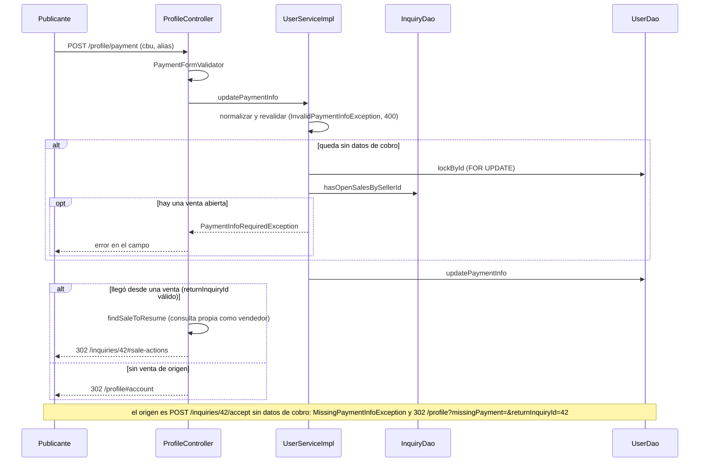

@title: Addresses and payment flow
@categories: Flows, Web, Services, Persistence
@files: webapp/src/main/java/ar/edu/itba/paw/webapp/controller/ProfileController.java, webapp/src/main/java/ar/edu/itba/paw/webapp/form/PaymentForm.java, webapp/src/main/java/ar/edu/itba/paw/webapp/validation/PaymentFormValidator.java, webapp/src/main/java/ar/edu/itba/paw/webapp/form/AddressForm.java, webapp/src/main/java/ar/edu/itba/paw/webapp/security/AddressAccessHandler.java, services/src/main/java/ar/edu/itba/paw/services/UserServiceImpl.java, services/src/main/java/ar/edu/itba/paw/services/AddressServiceImpl.java, services-contracts/src/main/java/ar/edu/itba/paw/services/AddressService.java, models/src/main/java/ar/edu/itba/paw/models/ShippingOptions.java, models/src/main/java/ar/edu/itba/paw/models/PaymentInfo.java, models/src/main/java/ar/edu/itba/paw/models/PaymentInfoRules.java, models/src/main/java/ar/edu/itba/paw/models/Address.java, models/src/main/java/ar/edu/itba/paw/models/Province.java, persistence/src/main/java/ar/edu/itba/paw/persistence/AddressJdbcDao.java, persistence/src/main/resources/db/migration/V5__venta_con_comprobante.sql

> [!summary] En una frase
> Desde el perfil una Cuenta carga cómo cobra (CBU o CVU y alias) y hasta tres direcciones de envío; sin datos de cobro no puede aceptar una consulta, y una dirección nunca se borra: se archiva.

## Qué resuelve

Los dos datos que necesita una venta sin pasarela: a dónde transferir y a dónde enviar. PR #40 (perfil) y #44 (dirección en la consulta). El PR #55 agregó la vuelta a la venta cuando el vendedor llega al perfil desde "Aceptar".

## Herramientas

| Herramienta | Para qué se usa acá |
|---|---|
| Bean Validation con validador de clase | [[PaymentFormValidator]]: los dos campos son opcionales, pero si vienen tienen que ser válidos |
| [[PaymentInfoRules]] (en `models`) | Formato de alias y dígitos verificadores del CBU, compartidos por formulario y service |
| `@PreAuthorize("@addressAccess.isOwner")` | Editar y eliminar solo direcciones propias |
| `SELECT ... FOR UPDATE` sobre la Cuenta | Serializar altas de direcciones y el vaciado de datos de cobro |
| `UPDATE ... WHERE archived = FALSE` | Baja lógica con guarda |
| Enum [[Province]] | Las 24 jurisdicciones; el nombre visible sale de i18n |

## Datos de cobro

### `POST /profile/payment`

1. Binder: recorta y convierte vacíos en `null`.
2. [[PaymentFormValidator]] normaliza igual que el service y valida:
   - CBU o CVU: 22 dígitos; dos bloques (8 y 14) cerrados cada uno por un dígito verificador calculado con pesos fijos.
   - Alias: de 6 a 20 caracteres, letras, números, punto y guion.
3. `UserServiceImpl.updatePaymentInfo`:
   - Normaliza (el CBU sin espacios) y vuelve a validar; si no cumple, `InvalidPaymentInfoException`, que [[ErrorResponseAdvice]] responde con 400 desde el PR #62. Solo pasa si el POST salteó [[PaymentForm]].
   - Si el resultado deja la Cuenta **sin** datos de cobro: bloquea la fila de la Cuenta y pregunta `hasOpenSalesBySellerId`. Con una venta abierta lanza `PaymentInfoRequiredException` y el controller muestra el error en el campo.
   - Actualiza `users.cbu` y `users.alias`.
4. Controller: sin venta a la que volver, aviso `paymentUpdated` y `302 /profile#account`. Con `returnInquiryId` (ver abajo), vuelve a la venta.

### Dónde se exigen

`InquiryServiceImpl.accept` lee los datos de cobro de la fila bloqueada de la Cuenta. Alcanza con uno de los dos (`PaymentInfo.isPresent`). Si no hay, lanza `MissingPaymentInfoException` y [[InquiryController]] la atrapa en el propio endpoint: redirige a `/profile?missingPayment=&returnInquiryId={id}#account`.

### Volver a la venta

1. `GET /profile` recibe `returnInquiryId` como texto. `paymentReturnId` lo convierte y pregunta a `inquiryService.findSaleToResume(id, userId)`, que devuelve el id solo si la consulta existe y quien mira es su vendedor. Un valor mal formado o ajeno se descarta: el perfil abre igual, sin regreso.
2. La vista lo manda de vuelta como campo oculto del formulario de cobro.
3. `POST /profile/payment` repite la misma resolución. Si hay destino:
   - Con errores de validación o `PaymentInfoRequiredException`, vuelve a dibujar el perfil conservando el destino.
   - Si se guardó pero la Cuenta sigue sin datos (los dos campos vacíos), muestra el aviso `paymentMissing` y no redirige.
   - Si quedaron datos, aviso flash `inquiry.sale.payment.updated` y `302 /inquiries/{id}#sale-actions`. La consulta sigue `PENDING`: el vendedor tiene que volver a tocar "Aceptar".

## Direcciones

| Acción | Endpoint | Qué hace |
|---|---|---|
| Alta | `POST /profile/addresses` | Bloquea la Cuenta, cuenta las activas y crea si hay menos de 3 |
| Edición | `POST /profile/addresses/{id}/edit` | Archiva la anterior y crea una nueva (`replace`) |
| Baja | `POST /profile/addresses/{id}/delete` | Archiva (`archived = TRUE`) |
| Elegir al consultar | Formulario de [[Contact flow]] y envío del carrito ([[Cart flow]]) | Dirección guardada o nueva en la misma transacción |
| Leer para una pantalla | `findShippingOptions` | Una sola lectura devuelve las activas, la propuesta por defecto y si entra otra ([[ShippingOptions]]) |

- La pertenencia se chequea dos veces: `@addressAccess.isOwner` en el controller y `archiveOwned` en el service.
- `findActiveOwned` devuelve vacío si no existe, es de otra Cuenta o está archivada.
- Superar el tope lanza `AddressLimitExceededException`; el perfil redirige a `?addressLimit#addresses`.

## Datos

Las columnas `users.cbu`, `users.alias`, la tabla `addresses` y `inquiries.address_id` llegaron en V5 (ver [[Database schema]]).

## Decisiones y por qué

| Decisión | Alternativa | Motivo | Fuente |
|---|---|---|---|
| Editar una dirección archiva y crea otra | `UPDATE` de la fila | Las consultas que ya la usan conservan la original | Comentario en [[AddressService]] |
| Nunca se borra una dirección | `DELETE` | Una consulta puede seguir apuntándola (hay FK) | Migración V5 |
| Tope de 3 activas | Sin tope | Regla de producto; la hace cumplir `create()` | Constante en [[AddressService]] |
| `hasRoom` como única definición del tope, usada por la vista y por el alta | Que cada controller compare contra la constante | Los controllers repetían `addresses.size() < MAX`; el PR #48 lo llevó al service para que lista y cupo no puedan contradecirse | Comentario en [[AddressServiceImpl]]; commits `f918e28b`, `10ac1757` |
| Bloquear la Cuenta al dar de alta | Contar y crear sin bloqueo | Dos altas simultáneas pasarían las dos el conteo | Comentario en [[AddressServiceImpl]] |
| No se pueden vaciar los datos de cobro con una venta abierta | Permitirlo | El comprador se quedaría sin dónde transferir | Comentario en [[UserService]] |
| Vaciar y aceptar bloquean la misma fila | Chequeo sin bloqueo | Uno espera al otro y ve su resultado | Comentario en [[UserServiceImpl]] |
| `returnInquiryId` resuelto por el service | Redirigir a cualquier id recibido | Es contexto de navegación: se valida que la venta sea del vendedor y un valor inválido solo pierde el regreso | Comentarios en [[InquiryService]] y [[ProfileController]]; commits `25f95bc9`, `97f489b3` |
| `InquiryDao` directo en `UserServiceImpl` | Usar `InquiryService` | `InquiryService` ya depende de `UserService`: evitar el ciclo | Comentario en [[UserServiceImpl]] |
| `PaymentInfo` como objeto de valor con `NONE` | Dos `String` sueltos en `User` | `getPaymentInfo()` nunca es `null` | Comentario en [[User]]; commit `801f9aa1` |
| Validar el dígito verificador | Solo el largo | Atajar errores de tipeo antes de que alguien transfiera | Inferencia; la regla está en [[PaymentInfoRules]] |
| El service chequea la pertenencia además del `@PreAuthorize` | Confiar en el controller | "El service no confía en que todo llamador pase por el controller" | Comentario en [[AddressServiceImpl]] |

## Privacidad

- El publicante ve la dirección completa del comprador solo con una venta en curso o concretada; antes, ciudad y provincia (`withCityAndProvinceOnly`).
- El comprador ve los datos de cobro solo con la venta abierta.
- Ninguno de los dos viaja por correo.

## Límites conocidos

- `replace` archiva y crea sin bloquear la Cuenta; como libera un lugar antes de ocupar otro, el tope no se supera por esa vía.
- No se verifica que el CBU exista ni a nombre de quién está: solo su forma.
- [[AddressServiceImplTest]] y [[AddressJdbcDaoTest]] cubren las reglas; no hay test de la capa web.

## Preguntas de defensa

**¿Por qué no se edita la dirección directamente?**
Porque una consulta ya enviada apunta a esa fila. Si se editara, cambiaría el domicilio de una venta en curso.

**¿Qué pasa si acepto una consulta sin tener CBU?**
La aplicación redirige al perfil con la fila de datos de cobro abierta y recuerda la venta en `returnInquiryId`. Al guardar, vuelve a esa venta. La consulta no cambia de estado: hay que aceptar de nuevo.

**¿Se puede usar `returnInquiryId` para saltar a una venta ajena?**
No. `findSaleToResume` solo devuelve el id si quien mira es el vendedor de esa consulta; si no, el parámetro se ignora. Y aunque se redirigiera, la página de la venta tiene su propio `@PreAuthorize`.

**¿Cómo validan un CBU?**
22 dígitos y dos dígitos verificadores, uno por bloque, calculados con pesos fijos.

**¿Qué impide tener cuatro direcciones si mando dos altas a la vez?**
El bloqueo de la fila de la Cuenta: la segunda alta espera y cuenta después.

## Evidencia de código

Datos de cobro en el service:

{{code:services/src/main/java/ar/edu/itba/paw/services/UserServiceImpl.java:330-352}}

Reglas del CBU y del alias:

{{code:models/src/main/java/ar/edu/itba/paw/models/PaymentInfoRules.java:5-56}}

Direcciones en el service:

{{code:services/src/main/java/ar/edu/itba/paw/services/AddressServiceImpl.java:30-105}}

Endpoints de la libreta:

{{code:webapp/src/main/java/ar/edu/itba/paw/webapp/controller/ProfileController.java:180-278}}

Dirección parcial:

{{code:models/src/main/java/ar/edu/itba/paw/models/Address.java:71-79}}
