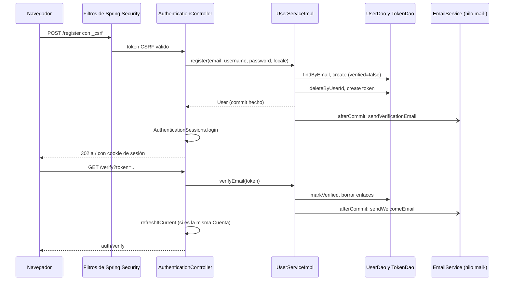

@title: Authentication flow
@categories: Flows, Web, Services
@files: webapp/src/main/java/ar/edu/itba/paw/webapp/controller/AuthenticationController.java, services/src/main/java/ar/edu/itba/paw/services/UserServiceImpl.java, webapp/src/main/java/ar/edu/itba/paw/webapp/config/SecurityConfig.java, webapp/src/main/java/ar/edu/itba/paw/webapp/security/AuthenticationSessions.java, webapp/src/main/java/ar/edu/itba/paw/webapp/security/AuthenticatedUser.java, webapp/src/main/java/ar/edu/itba/paw/webapp/security/AuthenticatedUserDetailsService.java, webapp/src/main/java/ar/edu/itba/paw/webapp/security/VerificationAccessDeniedHandler.java, webapp/src/main/java/ar/edu/itba/paw/webapp/security/SameSiteRedirects.java, webapp/src/main/java/ar/edu/itba/paw/webapp/form/RegisterForm.java, persistence/src/main/java/ar/edu/itba/paw/persistence/UserJdbcDao.java, persistence/src/main/java/ar/edu/itba/paw/persistence/EmailVerificationTokenJdbcDao.java, webapp/src/main/webapp/WEB-INF/web.xml, webapp/src/main/webapp/WEB-INF/tags/site-header.tag

> [!summary] En una frase
> La Cuenta se crea y queda con sesión en el mismo `POST /register`; verificar el correo es un paso posterior que no bloquea el login y solo agrega la authority `VERIFIED`, que es la que exigen las URLs sensibles.

## Qué resuelve

Registro, inicio y cierre de sesión, verificación del correo y reenvío del enlace. Es el flujo que la cátedra observó en el sprint 2 ("primero la creación y luego la verificación", "que no haga falta volver a iniciar sesión") y que el PR #43 reescribió. La recuperación de contraseña está en [[Password recovery flow]]; el detalle de los enlaces, en [[Tokens and email links]]; las reglas de acceso completas, en [[Security and authorization]].

## Herramientas

| Herramienta | Para qué se usa acá | Dónde se configura |
|---|---|---|
| Spring Security 5.8 (`spring-security-web`, `-config`, `-taglibs`) | Cadena de filtros, form login, logout, CSRF, sesiones, `@PreAuthorize`, tags `sec:` en JSP | [[SecurityConfig]], `web.xml` (`DelegatingFilterProxy`) |
| BCrypt (`BCryptPasswordEncoder`, costo 12) | Hash de contraseñas con sal incluida en el propio hash | [[SecurityConfig]] `passwordEncoder()` |
| `PasswordHasher` (interfaz propia) | Que `services` pueda hashear sin depender de Spring Security | Contrato en `services-contracts`, adaptador en [[SecurityConfig]] |
| `UserDetailsService` + `UserDetails` | Cargar la Cuenta por correo y exponerla como principal | [[AuthenticatedUserDetailsService]], [[AuthenticatedUser]] |
| `HttpSession` + cookie `JSESSIONID` | Guardar el `SecurityContext` entre requests | `web.xml` `<session-config>` |
| `SessionRegistry` + `HttpSessionEventPublisher` | Saber qué sesiones tiene abiertas cada Cuenta para poder expirarlas | [[SecurityConfig]], `web.xml` |
| Bean Validation (Hibernate Validator) | Reglas de correo, nombre y contraseña del formulario | [[RegisterForm]], [[ValidPassword]], [[MatchingPasswords]] |
| `SecureRandom` + Base64 URL | Generar el token del enlace de verificación | [[UserServiceImpl]] `generateToken()` |
| Spring JDBC | `users` y `email_verification_tokens` | [[UserJdbcDao]], [[EmailVerificationTokenJdbcDao]] |
| `@Transactional` + `TransactionSynchronization` | Que la Cuenta y su token se guarden juntos y el correo salga solo si hubo commit | [[UserServiceImpl]], [[TransactionCallbacks]] |
| JavaMail + Thymeleaf + `@Async` | Armar y mandar el correo sin frenar el request | [[Mail delivery]] |

## Recorrido paso a paso

### 1. Registro: `POST /register`

1. El navegador envía correo, nombre de usuario, contraseña y confirmación. El formulario es un `form:form`, así que Spring agrega solo el campo oculto `_csrf`.
2. `CsrfFilter` valida el token antes de llegar al controller. `/register` no está en ninguna regla restrictiva: cae en `anyRequest().permitAll()`.
3. `@InitBinder("registerForm")` recorta espacios en `email` y `username`. La contraseña no se recorta: un espacio es parte de la clave.
4. `@Valid` aplica [[RegisterForm]]: correo obligatorio, con formato y hasta 100 caracteres; nombre obligatorio hasta 100; contraseña con [[ValidPassword]] (12 a 72 caracteres, al menos una letra y un número); y `@MatchingPasswords` a nivel de clase compara las dos contraseñas y cuelga el error del campo de confirmación. Con errores se vuelve a mostrar `auth/register`.
5. `UserService.register(email, username, password, locale)` abre una transacción:
   - Normaliza el correo con `EmailRules.normalize` (recorte y minúsculas).
   - Busca la Cuenta por correo. Si existe **y ya tiene contraseña**, verificada o no, lanza `DuplicateUserException`.
   - Hashea la contraseña con `PasswordHasher.hash` (BCrypt costo 12).
   - Si existe una Cuenta *pendiente* del flujo anterior (sin contraseña), la completa con `completePending`, un `UPDATE ... WHERE password_hash IS NULL`. Si devuelve `false`, otro registro llegó antes y lanza `DuplicateUserException`.
   - Si no existe, la inserta con `verified = false`, rol `USER` y el idioma del request normalizado por `SupportedLocales`. Una carrera en el insert choca contra el índice único de `users.email` (`DuplicateKeyException`) y se traduce a `DuplicateUserException`.
   - `issueVerificationToken`: borra los enlaces anteriores de la Cuenta, genera un token nuevo, lo guarda con su fecha y **registra** el envío del correo para después del commit.
6. Al volver del service la transacción ya hizo commit. Recién ahí corre el callback: `EmailService.sendVerificationEmail`, que es `@Async` y entra al pool `mail-`. El request no espera al SMTP.
7. Si hubo `DuplicateUserException`, el controller marca el campo `email` y agrega `duplicateEmail`, con lo que la vista ofrece el enlace a recuperar la contraseña.
8. Si salió bien, `AuthenticationSessions.login` inicia la sesión a mano (ver abajo) y redirige a `/`. La cabecera muestra el banner de "verificá tu correo" porque el principal todavía no tiene `VERIFIED`.

### 2. Login programático después del registro

El form login de Spring no interviene acá, porque la persona no pasó por `/login`. `AuthenticationSessions.login` reproduce lo que haría el filtro:

1. Si ya había sesión HTTP, `request.changeSessionId()` le cambia el id (protección contra fijación de sesión).
2. Crea un `SecurityContext` vacío y le pone un `UsernamePasswordAuthenticationToken` con el principal [[AuthenticatedUser]], sin credenciales y con sus authorities.
3. Lo deja en `SecurityContextHolder` (para el resto de este request) y lo guarda en la sesión con `HttpSessionSecurityContextRepository.saveContext` (para los siguientes).
4. Registra la sesión en el `SessionRegistry`. El form login lo hace solo; esta ruta no pasa por él y sin este paso un cambio de clave no podría expirarla.

### 3. Login normal: `POST /login`

1. `formLogin` define `/login` como página, `email` y `password` como nombres de los parámetros, `/login?error` como destino del fallo y `defaultSuccessUrl("/", false)`: si la persona venía de una URL protegida, vuelve a esa; si no, al inicio.
2. Spring Security llama a `AuthenticatedUserDetailsService.loadUserByUsername(email)`, que usa `UserService.findByEmail` (normaliza el correo). Si no hay Cuenta, o es una pendiente sin contraseña, lanza `UsernameNotFoundException` con el mismo mensaje genérico.
3. El proveedor compara la contraseña enviada con el hash usando el `PasswordEncoder` (BCrypt).
4. `AuthenticatedUser.isEnabled()` devuelve siempre `true`: **una Cuenta sin verificar también inicia sesión**. Lo que no puede hacer lo decide la authority `VERIFIED`, no el login.
5. Authorities: `ROLE_USER` siempre, `ROLE_ADMIN` si el rol es `ADMIN`, `VERIFIED` si `users.verified` es verdadero.
6. Al autenticar, Spring cambia el id de sesión y la registra en el `SessionRegistry` (por `sessionManagement().maximumSessions(-1).sessionRegistry(...)`; `-1` es sin tope).

Lo que arma el proveedor de autenticación a partir de los beans `UserDetailsService` y `PasswordEncoder` es comportamiento del framework: en el repo solo están esos dos beans y el `formLogin`.

### 4. Verificación: `GET /verify?token=...`

1. La ruta es pública. `UserService.verifyEmail(token, locale)`:
   - Sin token o con un token que no está en la tabla, devuelve vacío.
   - `markVerified` es `UPDATE users SET verified = TRUE WHERE id = ? AND verified = FALSE`. Si no afecta filas (ya estaba verificada), devuelve vacío y no se manda una segunda bienvenida.
   - Borra todos los enlaces de verificación de la Cuenta.
   - Registra el correo de bienvenida para después del commit.
2. El controller llama a `AuthenticationSessions.refreshIfCurrent`: **solo si** este navegador ya tiene la sesión de esa misma Cuenta, reemplaza el principal por uno nuevo, que ahora trae `VERIFIED`. Así puede publicar sin volver a iniciar sesión.
3. Si el enlace se abre en otro navegador, la Cuenta queda verificada pero **no se inicia sesión**: la vista muestra "correo verificado" y el botón para entrar.
4. La vista `auth/verify` recibe `verified` verdadero o falso; con falso y sesión sin verificar ofrece reenviar.

### 5. Reenvío: `POST /verify/resend`

1. Exige sesión (`authenticated()`) y token CSRF. El botón vive en el tag `resend-verification`, dentro del banner de la cabecera y de las páginas de aviso.
2. `UserService.resendVerification(userId, locale)`:
   - `lockById` hace `SELECT ... FOR UPDATE` sobre la fila de la Cuenta. Dos pedidos en paralelo se ordenan y no pasan juntos el chequeo.
   - Si ya está verificada, devuelve `false`.
   - Si el último enlace tiene menos de un minuto (`RESEND_COOLDOWN`), devuelve `false` y el anterior sigue sirviendo.
   - Si no, emite uno nuevo: borra los anteriores y manda el correo después del commit.
3. El controller deja un atributo flash (`verificationResent` o `verificationThrottled`) y vuelve a la página de origen. El destino sale del header `Referer` pasado por `SameSiteRedirects.pathOf`, que solo acepta el mismo host y una ruta dentro del context path; cualquier otra cosa vuelve a `/`.

### 6. Página de aviso: `GET /verify/required`

Cuando una Cuenta con sesión y sin `VERIFIED` entra a una ruta de Cuenta verificada, [[VerificationAccessDeniedHandler]] la redirige acá en vez de mostrar un 403. El handler relee la Cuenta: si se verificó en otro navegador, refresca el principal y manda a `/`.

### 7. Logout: `POST /logout`

Es un POST con CSRF (el botón está en el perfil). Invalida la sesión HTTP, borra la cookie `JSESSIONID` y redirige a `/login?logout`.

## Datos

| Tabla | Columnas que toca | Restricciones que importan |
|---|---|---|
| `users` | `email`, `username`, `password_hash`, `role`, `verified`, `preferred_locale` | Índice único `users_email_key` (V2). `verified` se llamaba `enabled` hasta V6 |
| `email_verification_tokens` | `user_id`, `token`, `created_at` | `token` único; FK a `users`; `created_at` agregado en V6 para el tope de reenvío |

El esquema completo está en [[Database schema]].

## Estados de una Cuenta

| Estado | Cómo se llega | Qué puede hacer |
|---|---|---|
| Anónimo | Sin sesión | Catálogo, ficha, perfiles públicos, imágenes, sugerencias, formularios de auth |
| Con sesión, sin verificar | Registro o login de una Cuenta con `verified = false` | Navegar y pedir el reenvío. Las rutas de Cuenta verificada lo mandan a `/verify/required` |
| Verificada | Abrir el enlace o completar una recuperación de contraseña | Perfil, consultas, carrito, publicar, comprar y vender |
| Verificada con rol `ADMIN` | Rol cargado en la base | Además edita y elimina publicaciones disponibles ajenas |
| Pendiente (heredada) | Cuenta del flujo viejo, sin contraseña | No inicia sesión ni recibe recuperación; se completa registrándose de nuevo |

## Decisiones y por qué

| Decisión | Alternativa descartada | Motivo | Dónde está escrito |
|---|---|---|---|
| Crear la Cuenta al registrarse y verificar después | Flujo anterior: dejar solo el correo, abrir el enlace y recién ahí elegir nombre y clave | Observación de la cátedra en el sprint 2: el registro estaba "al revés" y obligaba a loguearse de nuevo | `docs/issues/observaciones-sprint-2/01-...md` |
| Una Cuenta sin verificar inicia sesión | `isEnabled()` ligado a `verified` (Spring rechazaría el login) | Poder navegar antes de verificar; el límite lo pone `VERIFIED` por URL | Comentario en [[AuthenticatedUser]] |
| `VERIFIED` como authority y no como rol | Un rol `ROLE_VERIFIED` o un chequeo en cada controller | Una sola lista de rutas en [[SecurityConfig]], legible por el corrector | Comentario en [[SecurityConfig]] |
| El perfil y las bandejas también exigen `VERIFIED` | Solo exigirlo para publicar y comprar | Cualquiera puede registrar un correo ajeno: esa sesión no tiene que ver los datos que cargue después el dueño real | Comentario en [[SecurityConfig]] |
| Un correo con contraseña no se vuelve a registrar, aunque no esté verificado | Permitir pisar una Cuenta sin verificar | Quien llegara segundo se quedaría con la Cuenta ajena | Comentario en [[UserServiceImpl]] |
| El enlace verifica pero no inicia sesión | Loguear al abrir el enlace | Quien vea un correo reenviado no tiene que entrar a la Cuenta | Comentario en [[AuthenticationController]] |
| Reemplazar el principal al verificar | Pedir un nuevo login | Las authorities quedan fijas en el principal de la sesión; sin refrescarlo el cambio no se vería | Comentario en [[AuthenticationSessions]] |
| Un solo enlace vivo y un minuto entre reenvíos | Reenvío libre | Que nadie llene de correos la casilla de otro | Comentario en [[UserServiceImpl]] y migración V6 |
| `PasswordHasher` propio | Inyectar `PasswordEncoder` en `services` | `services` no tiene Spring Security en su classpath; el módulo web adapta | Comentario en [[SecurityConfig]] |
| BCrypt con costo 12 fijo | Subir el costo | Los hashes guardados ya tienen ese costo | Comentario en [[SecurityConfig]] |
| Correo después del commit y asíncrono | Enviar dentro de la transacción | Un rollback no debe dejar un correo de algo que no se guardó; un SMTP lento no debe frenar el registro | [[TransactionCallbacks]], [[Mail delivery]] |
| Sesión solo por cookie | Dejar que el contenedor reescriba URLs con `;jsessionid` | El firewall de Spring Security rechaza el `;` y se caía el CSS | Comentario en `web.xml` |

## Concurrencia y casos borde

- **Dos registros simultáneos con el mismo correo**: uno inserta, el otro choca contra el índice único y recibe "correo ya registrado".
- **Dos registros que completan la misma Cuenta pendiente**: el `UPDATE` condicional deja pasar a uno solo.
- **Doble clic en el enlace**: el segundo `markVerified` no afecta filas, devuelve vacío y se muestra "enlace inválido"; la Cuenta ya quedó verificada por el primero.
- **Reenvíos en paralelo**: el bloqueo de la fila de la Cuenta los serializa; el segundo ve el enlace recién creado y cae en la espera.
- **SMTP caído**: el registro igual termina bien; el error queda en el log y la persona puede pedir el reenvío.
- **Verificación en otro navegador**: la sesión vieja sigue sin `VERIFIED` hasta que pase por `/verify/required` o vuelva a iniciar sesión.
- **Enlace abierto por otra Cuenta con sesión**: `refreshIfCurrent` compara ids y no toca esa sesión.

## Límites conocidos

- El token de verificación **no vence** (quedó fuera de alcance en el issue del sprint 2). Solo deja de servir cuando se usa o se reemplaza.
- Los tokens se guardan en claro en la base. Ver [[Tokens and email links]].
- El `SessionRegistry` vive en memoria: sirve con una sola instancia de la aplicación.
- No hay límite de intentos de login ni bloqueo de cuenta por fallos repetidos.
- El registro sí revela si un correo ya tiene Cuenta (el mensaje de duplicado); la recuperación de contraseña no.
- La verificación ocurre en un `GET`: quien tenga el enlace verifica. No hay un paso de confirmación.
- Nada de esto tiene test automático: `webapp` no tiene suite. Se probó a mano contra PostgreSQL según el issue; este Vault no lo ejecutó.

## Preguntas de defensa

**¿Cómo se inicia sesión después de registrarse si la persona no pasó por el login?**
El controller arma el `Authentication` a mano con el `User` que devuelve el service, lo guarda en el `SecurityContext`, persiste ese contexto en la sesión HTTP y registra la sesión en el `SessionRegistry`. Antes cambia el id de sesión.

**¿Dónde se guarda la sesión?**
En el servidor, en la `HttpSession` del contenedor. El navegador solo guarda la cookie `JSESSIONID`, marcada `HttpOnly`. No hay JWT.

**¿Por qué una Cuenta sin verificar puede loguearse?**
Porque `isEnabled()` devuelve siempre `true`. La verificación se modela como la authority `VERIFIED` y las rutas sensibles la exigen con `hasAuthority`.

**¿Qué pasa si verifico desde el celular y tenía la sesión en la compu?**
La Cuenta queda verificada en la base, pero el principal de la compu sigue sin `VERIFIED`. Al tocar una ruta protegida va a `/verify/required`, que relee la Cuenta, refresca el principal y la deja pasar.

**¿Qué impide que alguien registre mi correo y se quede con mi Cuenta?**
No puede verificar sin acceso a mi casilla, y sin verificar no entra al perfil ni a las consultas. Yo no puedo registrarme encima, pero recupero la Cuenta con "olvidé mi contraseña": eso cambia la clave, verifica y cierra todas las sesiones abiertas.

**¿Cómo se hashea la contraseña?**
BCrypt con costo 12. La sal va dentro del hash. El máximo de 72 caracteres del formulario es por el tope de BCrypt.

**¿Qué es CSRF y dónde está el token?**
Es un token por sesión que Spring Security exige en todo POST. `form:form` lo agrega solo; los formularios HTML comunes usan `<sec:csrfInput/>`. Para los formularios con archivos, `MultipartFilter` corre antes que la cadena de seguridad para que el token del cuerpo multipart ya esté leído.

## Evidencia de código

Registro en el controller, con el login programático:

{{code:webapp/src/main/java/ar/edu/itba/paw/webapp/controller/AuthenticationController.java:70-88}}

Reglas del registro en el service:

{{code:services/src/main/java/ar/edu/itba/paw/services/UserServiceImpl.java:126-160}}

Verificación y reenvío:

{{code:services/src/main/java/ar/edu/itba/paw/services/UserServiceImpl.java:162-222}}

Login programático, cierre de sesiones y refresco del principal:

{{code:webapp/src/main/java/ar/edu/itba/paw/webapp/security/AuthenticationSessions.java:32-74}}

Authorities del principal:

{{code:webapp/src/main/java/ar/edu/itba/paw/webapp/security/AuthenticatedUser.java:38-49}}

Form login, logout y sesiones:

{{code:webapp/src/main/java/ar/edu/itba/paw/webapp/config/SecurityConfig.java:124-152}}

Los dos `UPDATE` condicionales:

{{code:persistence/src/main/java/ar/edu/itba/paw/persistence/UserJdbcDao.java:118-129}}

Banner de la cabecera:

{{code:webapp/src/main/webapp/WEB-INF/tags/site-header.tag:41-55}}
