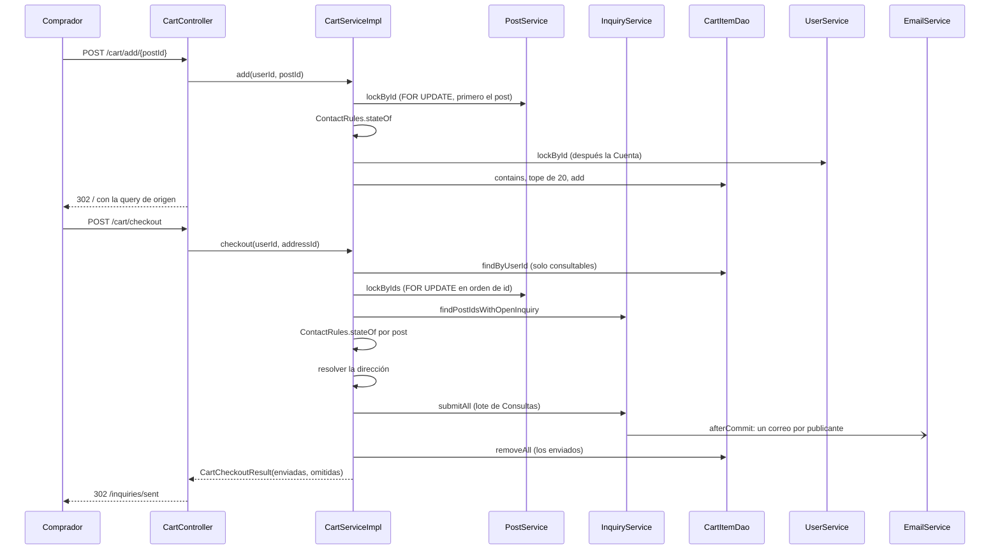

@title: Cart flow
@categories: Flows, Web, Services, Persistence
@files: webapp/src/main/java/ar/edu/itba/paw/webapp/controller/CartController.java, webapp/src/main/java/ar/edu/itba/paw/webapp/controller/CartExceptionAdvice.java, webapp/src/main/java/ar/edu/itba/paw/webapp/controller/CartCountAdvice.java, webapp/src/main/java/ar/edu/itba/paw/webapp/controller/ListingQueries.java, webapp/src/main/java/ar/edu/itba/paw/webapp/form/ShippingAddressForm.java, webapp/src/main/java/ar/edu/itba/paw/webapp/validation/ShippingAddressValidator.java, services-contracts/src/main/java/ar/edu/itba/paw/services/CartService.java, services/src/main/java/ar/edu/itba/paw/services/CartServiceImpl.java, services/src/main/java/ar/edu/itba/paw/services/ContactRules.java, services/src/main/java/ar/edu/itba/paw/services/InquiryServiceImpl.java, services/src/main/java/ar/edu/itba/paw/services/PostServiceImpl.java, services-contracts/src/main/java/ar/edu/itba/paw/services/CartAddRejectedException.java, services-contracts/src/main/java/ar/edu/itba/paw/services/NothingToSendException.java, persistence-contracts/src/main/java/ar/edu/itba/paw/persistence/CartItemDao.java, persistence/src/main/java/ar/edu/itba/paw/persistence/CartItemJdbcDao.java, persistence/src/main/java/ar/edu/itba/paw/persistence/InquiryJdbcDao.java, persistence/src/main/java/ar/edu/itba/paw/persistence/PostJdbcDao.java, persistence/src/main/resources/db/migration/V11__carrito.sql, models/src/main/java/ar/edu/itba/paw/models/Cart.java, models/src/main/java/ar/edu/itba/paw/models/CartItem.java, models/src/main/java/ar/edu/itba/paw/models/CartSellerGroup.java, models/src/main/java/ar/edu/itba/paw/models/CartCheckout.java, models/src/main/java/ar/edu/itba/paw/models/CartCheckoutResult.java, models/src/main/java/ar/edu/itba/paw/models/ContactState.java, webapp/src/main/webapp/WEB-INF/views/cart/index.jsp, webapp/src/main/webapp/WEB-INF/tags/account-nav.tag, docs/plans/carrito-consultas.md

> [!summary] En una frase
> El carrito junta hasta 20 vinilos para consultarlos de una vez: al enviarlo se crea una Consulta por vinilo con la misma dirección, sale un solo correo por publicante y cada Consulta sigue después su propio flujo de venta.

## Qué resuelve

Consultar varios vinilos sin repetir el formulario (PR #47). **No es una compra ni un pedido**: el glosario lo define como "los Posts que una Cuenta eligió para consultar juntos". No reserva nada, no congela precios y no tiene pago. Después del envío, cada Consulta se acepta, se paga y se confirma por separado en [[Inquiry and sale flow]].

## Herramientas

| Herramienta | Para qué se usa acá |
|---|---|
| Spring MVC | Cuatro endpoints en [[CartController]] |
| `@ControllerAdvice(assignableTypes = ...)` + `@Order` | [[CartExceptionAdvice]]: los rechazos esperables vuelven a la pantalla de origen con un aviso |
| `@ControllerAdvice` + `@ModelAttribute` | [[CartCountAdvice]]: el número del carrito en la cabecera de todas las páginas |
| [[ContactRules]] | La misma definición de "se puede consultar" que usa el contacto |
| [[ShippingAddressForm]] + [[ShippingAddressValidator]] | El mismo formulario y validador de dirección que el contacto |
| Clave primaria compuesta `(user_id, post_id)` | Un vinilo no se repite en el carrito |
| `ON DELETE CASCADE` | Si se elimina la publicación, el ítem se va con ella |
| `SELECT ... ORDER BY id FOR UPDATE` | Bloquear varios posts en un orden fijo para no trabarse con otra transacción |
| `SimpleJdbcInsert.executeBatch` | Crear todas las Consultas en un lote |
| `Propagation.MANDATORY` | `submitAll` y `lockByIds` solo corren dentro de la transacción del carrito |
| [[TransactionCallbacks]] + `@Async` | Un correo por publicante, después del commit |

## Rutas

Todas exigen Cuenta verificada (`/cart` y `/cart/**` están en `VERIFIED_PATHS`).

| Ruta | Qué hace |
|---|---|
| `POST /cart/add/{postId}` | Agrega y vuelve al catálogo, con la búsqueda de origen |
| `POST /cart/remove/{postId}` | Quita y vuelve al carrito |
| `GET /cart` | Muestra el carrito agrupado por publicante y las direcciones |
| `POST /cart/checkout` | Envía una Consulta por vinilo y va a la bandeja de enviadas |

## Recorrido paso a paso

### Agregar

1. El botón está en la ficha, al lado de "Consultar", y solo aparece si [[PostContactOptions]] dice que el post se puede consultar y todavía no está en el carrito ([[Post detail flow]]). Es un formulario POST con `sec:csrfInput` y un campo oculto `from` con el listado de origen.
2. `CartServiceImpl.add`, en una transacción:
   - `postService.lockById` bloquea el post (404 si no existe) y busca una Consulta abierta de esa Cuenta sobre ese post. Hasta `8929aea` solo lo leía; desde el PR #52 lo bloquea para tomar los bloqueos en el mismo orden que el contacto y el envío (post primero, Cuenta después) y para que el estado validado siga vigente al insertar.
   - `ContactRules.stateOf` decide: Consulta abierta → `OpenInquiryExistsException`; post propio o no disponible → `CartAddRejectedException` con su motivo.
   - `userService.lockById` bloquea después la fila de la Cuenta: dos agregados simultáneos se ordenan.
   - Si ya estaba en el carrito, rechazo `ALREADY_IN_CART`. Si ya hay 20 consultables, `CART_FULL`. "Repetido" gana sobre "lleno": el aviso es más preciso.
   - `cartItemDao.add`; si igual chocara contra la clave primaria, devuelve `false` y se trata como repetido.
3. Éxito: aviso `cart.added` y redirección a `/` con la query de origen, pasada por `ListingQueries.sanitize`.
4. Rechazo: [[CartExceptionAdvice]] redirige a la ficha del post con el motivo, o a la conversación si ya lo había consultado.

### Ver

`CartServiceImpl.findCheckout` trae **solo lo que todavía se puede consultar**: el DAO filtra en SQL por estado del post (`AVAILABLE`) y por ausencia de una Consulta abierta de la misma Cuenta. Los demás ítems quedan guardados y ocultos: un post reservado vuelve a aparecer si su venta se cancela. El DAO ordena por publicante y el service arma los grupos con un `LinkedHashMap`, suma el total con los precios actuales y agrega las [[ShippingOptions]].

La cantidad que muestra la cabecera sale de [[CartCountAdvice]]: deja en el request un `LazyCount` que consulta la base la primera vez que la vista lo lee. Un POST que termina en redirección no consulta nada.

### Enviar

1. [[ShippingAddressForm]]: dirección guardada o una nueva, con el validador condicional.
2. `CartServiceImpl.checkout` o `checkoutWithNewAddress` → `send`:
   - Relee los ítems consultables. Si no hay ninguno, `NothingToSendException`.
   - `postService.lockByIds`: bloquea esos posts **en orden de id** y devuelve sus resúmenes.
   - Con los posts bloqueados vuelve a decidir, uno por uno, con `ContactRules.stateOf`: lo que la persona vio pudo cambiar mientras tenía el carrito abierto.
   - Si no queda nada enviable, `NothingToSendException` y no se escribe nada.
   - **Recién ahora** resuelve la dirección: valida la guardada o crea la nueva. Así un envío sin nada que mandar no deja una dirección nueva en la libreta.
   - `inquiryService.submitAll`: crea todas las Consultas en un lote, con el precio de cada post, y arma un aviso por publicante.
   - Saca del carrito lo enviado. Lo omitido queda.
3. Devuelve [[CartCheckoutResult]] con cuántas se enviaron y cuántas se omitieron. La bandeja de enviadas muestra los dos avisos.

## Datos

{{file:persistence/src/main/resources/db/migration/V11__carrito.sql}}

La tabla guarda solo el par Cuenta–Post y cuándo se agregó. No guarda precio: el carrito muestra el actual, y la Consulta sigue mostrando el del post hasta que el publicante acepta y lo fija ([[Inquiry and sale flow]]).

## Decisiones y por qué

| Decisión | Alternativa | Motivo | Fuente |
|---|---|---|---|
| El carrito no es una entidad de venta | Un pedido con varios ítems | Cada vinilo es de un publicante distinto y se negocia aparte; el carrito solo evita repetir el formulario | `CONTEXT.md`; comentario en [[Cart]] |
| Una sola regla de contactabilidad en [[ContactRules]] | Repetirla en contacto, carrito y ficha | Las tres decisiones tienen que coincidir siempre | Comentario en [[ContactRules]] |
| El filtro de "consultable" se aplica en SQL con constantes que pasa el service | Traer todo y filtrar en Java | Menos filas, y la regla sigue definida en el service | Comentario en [[CartItemDao]]; commit `412f61ab` |
| Lo no consultable queda guardado y oculto | Borrarlo del carrito | Un post reservado vuelve a verse si su venta se cancela | Comentario en [[CartService]] |
| Tope de 20 sobre lo visible, no absoluto | Tope sobre filas guardadas | Un post oculto no debería impedir agregar; a cambio, el carrito puede mostrar más de 20 si reaparecen | Comentario en [[CartService]] |
| Bloquear la Cuenta al agregar | Confiar en la clave primaria | Para que el conteo del tope sea correcto con dos agregados simultáneos | Comentario en [[CartServiceImpl]] |
| Bloquear los posts en orden de id | Bloquear en el orden del carrito | Dos transacciones que comparten posts no se traban entre sí | Comentario en [[PostDao]] |
| Agregar bloquea el post antes que la Cuenta | Bloquear solo la Cuenta | Contacto y envío ya toman post y después Cuenta; invertir ese orden en otra transacción puede trabar a las dos. Además el post no puede venderse entre la validación y el insert | Comentario en [[CartServiceImpl]]; commit `e12c0e39` |
| Volver a decidir con los posts bloqueados | Confiar en lo que mostró la pantalla | El carrito pudo quedar desactualizado mientras estaba abierto | Comentario en [[CartServiceImpl]] |
| Envío parcial: se manda lo que se puede y se informa lo omitido | Todo o nada | Que un vinilo que se reservó no frene las demás consultas | Comentario en [[CartCheckoutResult]] |
| La dirección se resuelve después de saber que hay algo para enviar | Crearla primero | Un envío vacío no deja una dirección nueva en la libreta | Comentario en [[CartServiceImpl]] |
| Consultas creadas en lote, dos sentencias fijas | Un `INSERT` por post | Sin N+1 sea cual sea la cantidad | Comentario en [[InquiryDao]]; commit `93058b58` |
| Un correo por publicante | Un correo por vinilo | Menos ruido para quien recibe varias consultas del mismo comprador | Comentario en [[CartSellerGroup]] |
| Rechazos como redirección con aviso | Páginas 403 o 409 | "Son casos esperables (otra pestaña, una reserva justo en ese momento), no páginas de error" | Comentario en [[CartExceptionAdvice]] |
| El conteo de la cabecera va como atributo del request y es perezoso | Atributo de modelo | Un atributo de modelo se sumaría como query param a cada `redirect:`; y un POST que redirige no tiene por qué contar | Comentario en [[CartCountAdvice]] |
| `from` pasa por una lista blanca de caracteres | Reusarlo tal cual | No armar una redirección con texto arbitrario | Comentario en [[ListingQueries]] |
| Ítem con `ON DELETE CASCADE` | Desenganchar como las consultas | "Un ítem es descartable" | Comentario en la migración V11 |
| Sin mensaje en las consultas del carrito | Un mensaje común | El carrito nunca lo trae; se escribe después en cada conversación | Comentario en [[PostInterestNotification]] |

## Concurrencia y casos borde

- **Dos agregados a la vez**: el bloqueo de la Cuenta los ordena; el segundo cuenta después del primero.
- **Agregar mientras el vendedor acepta otra consulta del mismo post**: los dos bloquean el post; si gana la aceptación, el agregado ve el post `RESERVED` y lo rechaza como `UNAVAILABLE` (lo cubre `testAddWhenPostIsSoldAtLockReturnsUnavailableRejection`).
- **Un post del carrito se reserva mientras el carrito está abierto**: al enviar se omite y queda guardado; el resultado lo informa.
- **Dos envíos del mismo carrito** (doble clic, dos pestañas): el segundo espera los bloqueos de los posts, ve las Consultas abiertas que creó el primero y termina en "nada para enviar".
- **Dos compradores envían carritos con posts en común**: los dos bloquean en orden de id, así que uno espera al otro sin interbloqueo; los dos pueden consultar el mismo post.
- **La dirección se archivó en otra pestaña**: vuelve al carrito con un aviso.
- **Publicación eliminada**: el ítem desaparece por la cascada.

## Límites conocidos

- El carrito puede mostrar más de 20 ítems si reaparecen posts que estaban ocultos.
- No se puede escribir un mensaje al enviar desde el carrito.
- Cada vista de página con sesión verificada hace un `COUNT` para la cabecera.
- [[CartServiceImplTest]], [[ContactRulesTest]] y [[CartItemJdbcDaoTest]] cubren reglas y SQL; el bloqueo en orden contra PostgreSQL no tiene test automático.

## Preguntas de defensa

**¿El carrito es una compra?**
No. Es una lista de vinilos para consultar. Al enviarlo se crean Consultas comunes; ninguna reserva nada hasta que el publicante acepte.

**¿Qué pasa si uno de los vinilos se vendió mientras tenía el carrito abierto?**
Se omite. Las demás consultas salen igual y la pantalla avisa cuántas no se enviaron.

**¿Cómo evitan un interbloqueo al bloquear varios posts?**
Todos los bloqueos se piden en una sola sentencia ordenada por id. Dos transacciones que comparten posts los toman en el mismo orden.

**¿Cuántas consultas SQL hace el envío de 20 vinilos?**
Una cantidad fija: la lectura del carrito, el bloqueo y los resúmenes de los posts, las Consultas abiertas, la dirección, un lote de inserts, una lectura de ids y un borrado. No crece con la cantidad.

**¿Dónde está definido qué se puede consultar?**
En [[ContactRules]]: disponible, ajeno y sin una Consulta abierta. La usan el contacto, el carrito y la ficha, y el carrito le pasa esas mismas constantes a su DAO.

**¿Por qué el contador de la cabecera no es un atributo de modelo?**
Porque Spring agrega los atributos de modelo como parámetros a cada `redirect:`. Va en el request, y se calcula solo si la vista lo usa.

**¿Cuántos correos recibe un publicante si le consultan cinco vinilos desde un carrito?**
Uno, con los cinco y un enlace a cada Consulta.

## Evidencia de código

Agregar:

{{code:services/src/main/java/ar/edu/itba/paw/services/CartServiceImpl.java:51-85}}

Enviar:

{{code:services/src/main/java/ar/edu/itba/paw/services/CartServiceImpl.java:145-200}}

Regla compartida:

{{code:services/src/main/java/ar/edu/itba/paw/services/ContactRules.java:9-44}}

Consultas en lote y un aviso por publicante:

{{code:services/src/main/java/ar/edu/itba/paw/services/InquiryServiceImpl.java:137-166}}

{{code:persistence/src/main/java/ar/edu/itba/paw/persistence/InquiryJdbcDao.java:174-208}}

Bloqueo de varios posts en orden:

{{code:persistence/src/main/java/ar/edu/itba/paw/persistence/PostJdbcDao.java:305-318}}

Filtro del carrito en SQL:

{{code:persistence/src/main/java/ar/edu/itba/paw/persistence/CartItemJdbcDao.java:36-48}}

{{code:persistence/src/main/java/ar/edu/itba/paw/persistence/CartItemJdbcDao.java:105-137}}

Controller:

{{code:webapp/src/main/java/ar/edu/itba/paw/webapp/controller/CartController.java:44-90}}

Rechazos como avisos:

{{code:webapp/src/main/java/ar/edu/itba/paw/webapp/controller/CartExceptionAdvice.java:18-74}}

Contador perezoso:

{{code:webapp/src/main/java/ar/edu/itba/paw/webapp/controller/CartCountAdvice.java:13-57}}

Ruta de portada que usa la vista:

{{code:webapp/src/main/webapp/WEB-INF/views/cart/index.jsp:52-55}}
