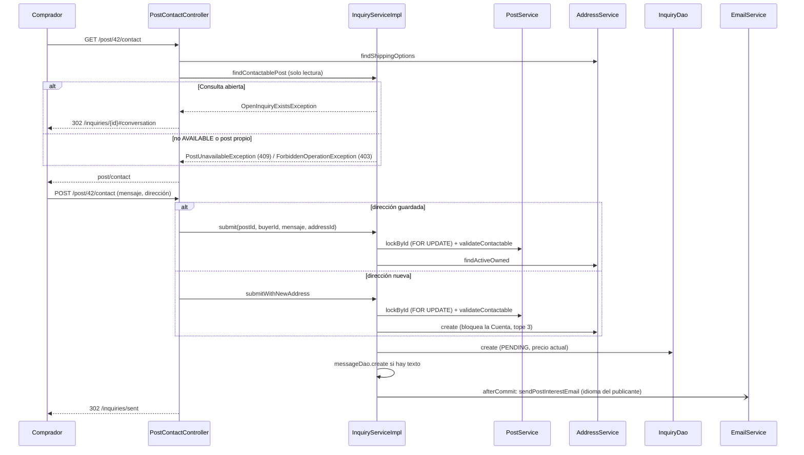

@title: Contact flow
@categories: Flows, Web, Services
@files: webapp/src/main/java/ar/edu/itba/paw/webapp/controller/PostContactController.java, webapp/src/main/java/ar/edu/itba/paw/webapp/form/ContactForm.java, webapp/src/main/java/ar/edu/itba/paw/webapp/form/ShippingAddressForm.java, webapp/src/main/java/ar/edu/itba/paw/webapp/validation/ShippingAddressValidator.java, services/src/main/java/ar/edu/itba/paw/services/ContactRules.java, models/src/main/java/ar/edu/itba/paw/models/ContactState.java, models/src/main/java/ar/edu/itba/paw/models/ShippingOptions.java, webapp/src/main/java/ar/edu/itba/paw/webapp/form/LineBreakNormalizingEditor.java, services/src/main/java/ar/edu/itba/paw/services/InquiryServiceImpl.java, services/src/main/java/ar/edu/itba/paw/services/AddressServiceImpl.java, persistence/src/main/java/ar/edu/itba/paw/persistence/InquiryJdbcDao.java, services-contracts/src/main/java/ar/edu/itba/paw/services/PostInterestNotification.java, services-contracts/src/main/java/ar/edu/itba/paw/services/OpenInquiryExistsException.java, webapp/src/main/webapp/WEB-INF/views/post/contact.jsp

> [!summary] En una frase
> Una Cuenta verificada elige o carga una dirección de envío, opcionalmente escribe un mensaje, y eso crea la Consulta en `PENDING` y avisa por correo al publicante; el precio de la venta se fija recién cuando el publicante acepta.

## Qué resuelve

El primer paso de una compra: `GET` y `POST /post/{id}/contact`. Lo que sigue está en [[Inquiry and sale flow]].

## Herramientas

| Herramienta | Para qué se usa acá |
|---|---|
| Spring MVC + Bean Validation | [[ContactForm]], que hereda la dirección de [[ShippingAddressForm]] y su validador de clase condicional |
| [[ContactRules]] | La regla "se puede consultar", en un solo lugar para contacto, carrito y ficha |
| `@InitBinder` con `StringTrimmerEditor(true)` y [[LineBreakNormalizingEditor]] | Recortar, convertir vacíos en `null` y normalizar saltos de línea antes de validar |
| `SELECT ... FOR UPDATE` sobre el post | Que la consulta no entre mientras se vende el ejemplar, y serializar dos envíos del mismo comprador |
| `@Transactional` | Dirección nueva y consulta en la misma transacción |
| `submit-once.js` | Deshabilitar el botón al enviar |
| [[TransactionCallbacks]] + correo asíncrono | Aviso al publicante en su idioma |

## Recorrido paso a paso

### `GET /post/{id}/contact`

1. Exige `VERIFIED` (está en `VERIFIED_PATHS`). Un anónimo va al login y vuelve; una Cuenta sin verificar va a `/verify/required`.
2. `addressService.findShippingOptions` trae, en una lectura, las direcciones activas, la propuesta (la más reciente) y si se puede sumar otra. La propuesta se preselecciona solo en el `GET` inicial: al volver a mostrar un error se respeta lo que la persona eligió.
3. `buildContactView` llama a `inquiryService.findContactablePost`, que le pregunta a `ContactRules.stateOf` y traduce el resultado, en este orden:
   - Si el comprador ya tiene una Consulta abierta sobre ese post, `OpenInquiryExistsException`: redirige a esa conversación con un aviso.
   - Si el post no está `AVAILABLE`, `PostUnavailableException`: 409.
   - Si el post es propio, `ForbiddenOperationException`: 403.
4. La vista recibe las direcciones y `canAddAddress`, los dos de [[ShippingOptions]].

### `POST /post/{id}/contact`

1. Binder: recorta todos los `String`, deja vacíos como `null` y normaliza CRLF a LF en el mensaje, para que `@Size(max = 500)` cuente lo mismo que el `maxlength` del textarea.
2. Validación: mensaje hasta 500. Si no se eligió una dirección guardada (`addressId` nulo), [[ShippingAddressValidator]] exige calle, altura, ciudad, código postal y provincia. El mismo formulario base y el mismo validador sirven al envío del carrito.
3. Service, en una transacción:
   - `lockContactablePost`: bloquea el post y repite las tres validaciones del `GET`.
   - Con dirección guardada: tiene que ser del comprador y no estar archivada (`findActiveOwned`); si no, `AddressNotFoundException`.
   - Con dirección nueva: `addressService.create`, que bloquea la Cuenta y respeta el tope de 3. Se valida el post **antes** de guardar la dirección: si la consulta no puede entrar, no se escribe nada.
   - `create`: normaliza el mensaje, inserta la consulta con `status = PENDING`, la dirección y **el precio actual del post** como respaldo (si el post se elimina, es el que queda; el de la venta lo fija `accept`, ver [[Inquiry and sale flow]]); si hay texto, lo inserta como primer Mensaje.
   - Registra el correo de "consulta nueva" para después del commit, con el idioma guardado del publicante.
4. Controller: aviso flash `inquirySubmitted` y redirección a `/inquiries/sent`, la bandeja del comprador.

## Datos

| Tabla | Qué se escribe |
|---|---|
| `inquiries` | `post_id`, `buyer_id`, `status = 'PENDING'`, `address_id`, `price` |
| `inquiry_messages` | El texto opcional, como primer Mensaje |
| `addresses` | Solo si cargó una dirección nueva |

## Decisiones y por qué

| Decisión | Motivo | Fuente |
|---|---|---|
| A lo sumo una Consulta abierta por comprador y post | Aceptar o rechazar es decidir sobre ese comprador, no sobre un mensaje | Glosario de `CONTEXT.md`; ADR 0003 |
| La Consulta abierta se chequea antes que el estado del post | Si el post está reservado para él, igual tiene que llegar a su conversación | Comentario en [[InquiryServiceImpl]] |
| Bloquear el post al consultar | Que no entre justo mientras se vende, y que dos envíos del mismo comprador no dupliquen | Comentario en [[InquiryServiceImpl]] |
| Dirección nueva y consulta en una transacción | Si la consulta no entra, la dirección no ocupa un lugar del tope | Comentario en [[InquiryService]] |
| El precio se copia a la consulta solo como respaldo | Mientras está pendiente se muestra el precio actual del post; el monto pactado se fija al aceptar | ADR 0004, commit `7e073053` (antes: migración V5, que lo congelaba al consultar) |
| El correo usa el idioma del publicante | Quien lo lee no es quien dispara el request | Comentario en [[InquiryServiceImpl]] |
| El resumen del post ya trae correo e idioma del publicante | Evitar otra consulta para armar el aviso | Comentario en [[InquiryServiceImpl]] |
| Los campos de dirección del formulario no llevan `@NotBlank` | Solo son obligatorios cuando no se eligió una guardada | Comentario en [[ShippingAddressForm]] |
| La regla de contactabilidad vive en [[ContactRules]] | Contacto, carrito y ficha la decidían por separado; el PR #47 la unificó | Comentario en [[ContactRules]]; commit `0f9218f1` |
| Redirigir a enviadas | El aviso es para el comprador | Comentario en [[PostContactController]] |

## Concurrencia y casos borde

- Doble envío: el segundo espera el bloqueo del post, ve la Consulta abierta y redirige a la conversación.
- La dirección elegida se archivó en otra pestaña: error en el campo, sin perder el mensaje.
- Llegó al tope de direcciones desde otra pestaña: se vuelve a mostrar el formulario con el aviso.
- El post se vendió o se reservó entre el `GET` y el `POST`: 409.

## Límites conocidos

- El primer mensaje viaja dentro del correo de "consulta nueva"; no hay correo aparte.
- Sin tests de la capa web. Las reglas están en [[InquiryServiceImplTest]].

## Preguntas de defensa

**¿Puedo consultar dos veces por el mismo disco?**
No mientras tenga una abierta: el formulario redirige a esa conversación.

**¿Qué pasa si consulto mi propia publicación?**
403. El botón no se muestra, y el service lo impide igual.

**¿Por qué hay un validador propio en vez de `@NotBlank`?**
Porque la obligatoriedad depende de otro campo: con dirección guardada, los campos de dirección ni se completan.

**¿Por qué normalizan los saltos de línea?**
El navegador cuenta un salto como un carácter en `maxlength` pero lo envía como dos (CRLF). Sin normalizar, un mensaje válido en pantalla fallaría la validación.

## Evidencia de código

Controller:

{{code:webapp/src/main/java/ar/edu/itba/paw/webapp/controller/PostContactController.java:46-125}}

Service:

{{code:services/src/main/java/ar/edu/itba/paw/services/InquiryServiceImpl.java:68-135}}

La única definición de "se puede consultar", compartida con el carrito y la ficha:

{{code:services/src/main/java/ar/edu/itba/paw/services/ContactRules.java:9-44}}

Cómo la traduce el contacto a excepciones:

{{code:services/src/main/java/ar/edu/itba/paw/services/InquiryServiceImpl.java:551-561}}

Validador condicional:

{{code:webapp/src/main/java/ar/edu/itba/paw/webapp/validation/ShippingAddressValidator.java:9-48}}
