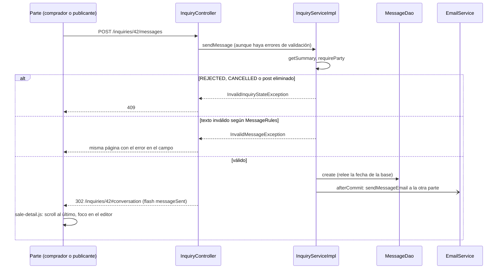

@title: Conversation flow
@categories: Flows, Web, Services, Persistence
@files: webapp/src/main/java/ar/edu/itba/paw/webapp/controller/InquiryController.java, services/src/main/java/ar/edu/itba/paw/services/InquiryServiceImpl.java, models/src/main/java/ar/edu/itba/paw/models/Message.java, models/src/main/java/ar/edu/itba/paw/models/MessageRules.java, webapp/src/main/java/ar/edu/itba/paw/webapp/form/MessageForm.java, persistence-contracts/src/main/java/ar/edu/itba/paw/persistence/MessageDao.java, persistence/src/main/java/ar/edu/itba/paw/persistence/MessageJdbcDao.java, persistence/src/main/java/ar/edu/itba/paw/persistence/InquiryJdbcDao.java, services-contracts/src/main/java/ar/edu/itba/paw/services/MessageNotification.java, persistence/src/main/resources/db/migration/V7__mensajes_de_consulta.sql, docs/adr/0003-conversation-inside-the-inquiry.md, webapp/src/main/webapp/WEB-INF/tags/inbox-last-message.tag, webapp/src/main/webapp/js/sale-detail.js, webapp/src/main/webapp/WEB-INF/views/inquiry/detail.jsp

> [!summary] En una frase
> Cada Consulta tiene un hilo de Mensajes entre comprador y publicante, visible al pie de su página; escribir guarda el Mensaje y avisa por correo a la otra parte, y el hilo se cierra cuando la Consulta se rechaza o se cancela.

## Qué resuelve

Que las dos partes puedan hablar dentro de la aplicación (PR #45). Antes la consulta llevaba un único texto y la respuesta ocurría por correo. El PR #54 rearmó la página de la venta: conversación y datos de la venta en una sola vista, sin tarjetas separadas, con el editor fijo al pie del hilo.

## Herramientas

| Herramienta | Para qué se usa acá |
|---|---|
| Spring MVC + Bean Validation | [[MessageForm]]: texto obligatorio hasta 500 |
| [[MessageRules]] (en `models`) | Normalización y tope, compartidos por formulario y service |
| `@PreAuthorize("@inquiryAccess.isParty")` | Solo las dos partes escriben y leen |
| Spring JDBC | Tabla `inquiry_messages` |
| Subconsulta agregada con `LEFT JOIN` | Traer el último Mensaje de cada Consulta en la bandeja sin N+1 |
| [[TransactionCallbacks]] + `@Async` | Correo de "mensaje nuevo" |
| Flyway V7 | Crear la tabla y migrar el texto viejo |
| `sale-detail.js` | Mejora progresiva de la página: alto del hilo, scroll al último Mensaje, foco en el editor y Enter para enviar |
| `RedirectAttributes.addFlashAttribute` | El flag `messageSent` le avisa a la página siguiente que tiene que devolver el foco al editor |

## Recorrido paso a paso

### Leer: `GET /inquiries/{id}`

`findDetail` exige que quien mira sea una de las partes, arma [[InquiryDetail]] con `messageDao.findByInquiryId` (ordenado por id, del más viejo al más nuevo) y la vista marca los Mensajes propios comparando `senderId` con `viewerId`.

### Escribir: `POST /inquiries/{id}/messages`

1. `VERIFIED` por URL, `isParty` por recurso, token CSRF.
2. Binder: recorte y normalización de saltos, igual que en el formulario de contacto.
3. El controller llama al service **aunque haya errores de validación**. Motivo: el service decide primero si la conversación está cerrada, y eso tiene que ganar sobre un texto inválido.
4. `InquiryServiceImpl.sendMessage`:
   - Exige ser una de las partes.
   - Si la conversación está cerrada (`REJECTED` o `CANCELLED`) o el post fue eliminado, `InvalidInquiryStateException`: 409.
   - Normaliza y valida con [[MessageRules]]; si no cumple, `InvalidMessageException`.
   - Inserta el Mensaje. El DAO relee la fila para devolver la fecha que puso la base.
   - Arma el aviso para la otra parte con su correo e idioma, y lo registra para después del commit.
5. Controller: con `InvalidMessageException` vuelve a dibujar la página con el error en el campo; si salió bien, deja el flash `messageSent` y redirige a `/inquiries/{id}#conversation`.
6. Página siguiente: el formulario sale con `data-focus-message="true"` y `sale-detail.js`:
   - Lleva el scroll del hilo (`data-conversation-history`) al último Mensaje.
   - En pantallas de más de 900 px ajusta el alto del hilo (`--conversation-height`) al espacio que queda en la ventana.
   - Devuelve el foco al editor en `pageshow` si se acaba de enviar o si el campo tiene error.
   - Enter envía con `requestSubmit` y Shift+Enter hace un salto de línea. Se ignora mientras hay una composición de IME activa (`isComposing`, `keyCode 229`), para no cortar una palabra a medio escribir.
   Sin JavaScript todo funciona igual con el botón "Enviar".

## Datos

{{code:persistence/src/main/resources/db/migration/V7__mensajes_de_consulta.sql:1-18}}

La migración convierte el texto que tenía cada consulta en su primer Mensaje, con la misma fecha, y elimina la columna `inquiries.message`.

## Decisiones y por qué

| Decisión | Alternativa | Motivo | Fuente |
|---|---|---|---|
| Enter envía, con guarda de IME | Enviar solo con el botón | Es lo esperable en un chat; la guarda evita enviar mientras se compone un carácter con acentos o en idiomas asiáticos | Commit `a88e7e20` (inferencia sobre el motivo de la guarda) |
| El foco vuelve al editor después de enviar | Dejar el foco donde lo pone el navegador tras la redirección | Seguir escribiendo sin volver a hacer clic; se usa `pageshow` para que funcione también al volver con el historial | Commits `bda29dcf`, `c1a3dacf` |
| La conversación vive dentro de la Consulta, una por Consulta, con Mensajes inmutables | Un hilo previo a la compra por Post | Sería un segundo agregado con sus propias reglas de acceso y su bandeja | ADR 0003 |
| Se actualiza recargando la página | Entrega en tiempo real | WebSocket o polling no se justifican en esta etapa | ADR 0003 |
| Se quitó el `Reply-To` de los correos | Que el publicante responda por correo (flujo anterior) | Ninguna parte conoce el correo de la otra, y la Conversación es el único registro de lo acordado | ADR 0003 |
| Escribir no bloquea el post | Bloquear como en las transiciones | No es un cambio de estado. Si la consulta se rechaza en el mismo instante, el Mensaje puede entrar igual: riesgo aceptado | Comentario en [[InquiryServiceImpl]] |
| Conversación cerrada gana sobre texto inválido | Validar el texto primero | Mostrar "texto muy largo" en una conversación cerrada sería engañoso | Comentario en [[InquiryController]] |
| Ordenar por id y no por fecha | `ORDER BY created_at` | El id es serial: ordena por llegada aunque dos Mensajes compartan fecha | Comentario en [[MessageJdbcDao]] |
| El último Mensaje se trae con `MAX(id)` agrupado | Una consulta por fila de la bandeja | Evitar N+1 | Comentario en [[InquiryJdbcDao]] |
| El `RowMapper` de Mensaje es package-private y lo reutiliza [[InquiryJdbcDao]] | Duplicar el mapeo | Una columna nueva se agrega en un solo lugar | Comentario en [[MessageJdbcDao]] |
| El cuerpo del Mensaje no se loguea | Loguearlo | Es contenido privado | Comentario en [[EmailServiceImpl]] |
| El primer texto no dispara "mensaje nuevo" | Mandar dos correos | Ya viaja en el de "consulta nueva" | Comentario en [[InquiryServiceImpl]] |

## Concurrencia y casos borde

- Un Mensaje enviado justo cuando la Consulta se rechaza puede guardarse. Está documentado como riesgo aceptado.
- Post eliminado: la conversación queda de solo lectura (no hay publicante "vivo" de donde sacar correo e idioma).
- Doble envío: `submit-once.js` deshabilita el botón; si igual llegan dos, se guardan dos Mensajes.

## Límites conocidos

- No hay tiempo real: hay que recargar la página para ver un Mensaje nuevo.
- Enter envía solo con JavaScript y si el navegador tiene `requestSubmit`; si no, Enter hace un salto de línea y se envía con el botón.
- No hay marca de leído ni contador de no leídos.
- Cada Mensaje dispara un correo; no se agrupan.
- Sin paginación del hilo.

## Preguntas de defensa

**¿Por qué el controller llama al service aunque el formulario tenga errores?**
Para que el cierre de la conversación (409) se decida antes que la validación del texto. El service aplica las mismas reglas, así que un texto inválido nunca se guarda.

**¿Cómo traen el último mensaje de cada consulta sin N+1?**
Una subconsulta `SELECT inquiry_id, MAX(id) ... GROUP BY inquiry_id` unida por `LEFT JOIN`. Se resuelve una vez por sentencia.

**¿Cuándo se cierra una conversación?**
Cuando la Consulta queda `REJECTED` o `CANCELLED`, o cuando se elimina la publicación. Una venta confirmada la deja abierta.

**¿Quién recibe el correo?**
La otra parte, en el idioma guardado en su Cuenta, con un enlace que baja directo a la conversación.

## Evidencia de código

Service:

{{code:services/src/main/java/ar/edu/itba/paw/services/InquiryServiceImpl.java:446-476}}

Controller:

{{code:webapp/src/main/java/ar/edu/itba/paw/webapp/controller/InquiryController.java:167-189}}

Reglas del texto:

{{code:models/src/main/java/ar/edu/itba/paw/models/MessageRules.java:3-24}}

DAO:

{{code:persistence/src/main/java/ar/edu/itba/paw/persistence/MessageJdbcDao.java:18-66}}

Último Mensaje en la bandeja:

{{code:persistence/src/main/java/ar/edu/itba/paw/persistence/InquiryJdbcDao.java:86-109}}
