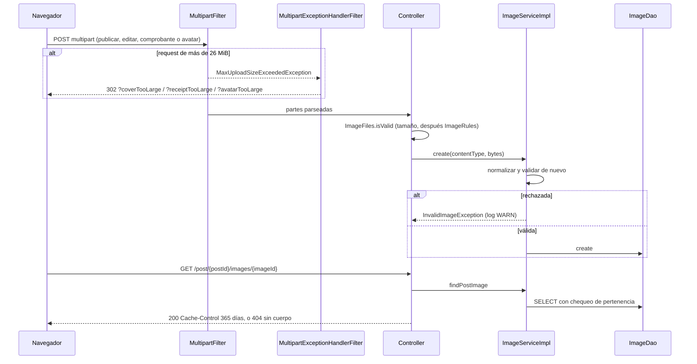

@title: Cover image flow
@categories: Flows, Web, Services, Persistence
@files: webapp/src/main/java/ar/edu/itba/paw/webapp/controller/ImageController.java, webapp/src/main/java/ar/edu/itba/paw/webapp/form/ImageFiles.java, webapp/src/main/java/ar/edu/itba/paw/webapp/security/MultipartExceptionHandlerFilter.java, webapp/src/main/java/ar/edu/itba/paw/webapp/config/WebConfig.java, models/src/main/java/ar/edu/itba/paw/models/ImageRules.java, models/src/main/java/ar/edu/itba/paw/models/Image.java, services/src/main/java/ar/edu/itba/paw/services/ImageServiceImpl.java, services-contracts/src/main/java/ar/edu/itba/paw/services/ImageService.java, persistence-contracts/src/main/java/ar/edu/itba/paw/persistence/ImageDao.java, persistence/src/main/java/ar/edu/itba/paw/persistence/ImageJdbcDao.java, webapp/src/main/webapp/WEB-INF/web.xml

> [!summary] En una frase
> Las imágenes se guardan como bytes en la tabla `images`, se validan por firma al subir y se sirven siempre a través del recurso al que pertenecen, con caché de un año.

## Qué resuelve

El transversal de "manejo de imágenes": subida, validación, almacenamiento y entrega de fotos de publicaciones, portadas heredadas y fotos de perfil.

## Herramientas

| Herramienta | Para qué se usa acá |
|---|---|
| Commons FileUpload (`CommonsMultipartResolver`) | Parsear `multipart/form-data` |
| `MultipartFilter` | Parsear antes de Spring Security para leer el token CSRF |
| [[MultipartExceptionHandlerFilter]] | Convertir "archivo demasiado grande" en una redirección con aviso |
| [[ImageRules]] | Tipos, tamaño y firma |
| PostgreSQL `BYTEA` | Almacenamiento |
| `ResponseEntity<byte[]>` + `Cache-Control` | Entrega |

## Subida

1. El formulario declara `enctype="multipart/form-data"`.
2. `MultipartFilter` usa el bean `multipartResolver`: tope del request `MAX_MULTIPART_BYTES` (26 MiB), UTF-8 y resolución perezosa.
3. Si el request excede el tope, la excepción salta al leer las partes y [[MultipartExceptionHandlerFilter]] la atrapa (mirando también la causa, porque puede venir envuelta) y redirige: al formulario de publicar o editar con `?coverTooLarge`, a la venta con `?receiptTooLarge`, o al perfil con `?avatarTooLarge`.
4. El validador del formulario llama a `ImageFiles.isValid`: mira el tamaño antes de leer los bytes y después aplica [[ImageRules]].
5. El controller convierte a [[ImageUpload]] y el service llama a `ImageService.create`, que normaliza el tipo, valida **de nuevo** y guarda. Un rechazo se loguea como `WARN` con tipo y tamaño.

Reglas: PNG, JPEG o WEBP; el tipo que declara el navegador tiene que coincidir con los primeros bytes del archivo; entre 1 byte y 5 MiB.

## Entrega

| URL | Qué exige el SQL |
|---|---|
| `/post/{postId}/images/{imageId}` | Que la imagen sea la principal del post, la portada de su álbum o una de su galería |
| `/users/{userId}/avatar/{imageId}` | Que sea el avatar vigente de esa Cuenta y que esté verificada |
| `/albums/{albumId}/cover/{imageId}` | Que sea la portada de ese álbum |

Respuesta: el `Content-Type` guardado y `Cache-Control: max-age` de 365 días, público. Si no hay coincidencia, 404 sin cuerpo.

Las tres rutas son públicas. Lo que protege no es la sesión sino la pertenencia: no existe una URL `/images/{id}` que permita recorrer ids.

## Borrado

`ImageDao.delete` es un `DELETE` con cuatro `NOT EXISTS`: solo borra si ningún álbum, post, galería ni Cuenta referencia la imagen. Por eso el orden importa: primero se quita la referencia, después se pide el borrado.

## Decisiones y por qué

| Decisión | Alternativa | Motivo | Fuente |
|---|---|---|---|
| Imágenes en la base | Sistema de archivos del servidor | El servidor de la cátedra solo recibe un WAR; la base es el único almacenamiento persistente | Inferencia; ADR 0002 habla de mantener catálogo y arte dentro del proyecto |
| Validar la firma y no solo el tipo declarado | Confiar en `Content-Type` | "El tipo declarado tiene que coincidir con la firma del contenido: no alcanza la extensión" | Comentario en [[ImageRules]]; commit `2d2603a7` |
| Servir desde el recurso asociado | `/images/{id}` | Que no se puedan enumerar imágenes ajenas ni huérfanas | Commit `b30c8745` |
| Caché de un año | Sin caché | "Una imagen nunca cambia una vez guardada": cambiar la foto crea otro id | Comentario en [[ImageController]] |
| Resolución multipart perezosa | Parseo inmediato | Que el exceso de tamaño se pueda traducir en un filtro externo | Comentario en [[WebConfig]] |
| Commons FileUpload y no el multipart de Servlet 3 | `StandardServletMultipartResolver` | "Se conserva como resolver multipart de esta entrega" | Comentario en [[WebConfig]] |
| Validar en formulario y en service | Un solo lugar | Error junto al campo, y garantía aunque se saltee el formulario | Comentario en [[ImageFiles]] |
| Borrado condicional | Borrado directo | La tabla es compartida por posts, álbumes y avatares | SQL de [[ImageJdbcDao]] |
| Portada del álbum heredada, sin escritura nueva | Seguir escribiéndola | Las fotos son del ejemplar; `cover_image_id` queda como dato viejo que el `COALESCE` todavía lee | Comentario en [[AlbumJdbcDao]] |

## Límites conocidos

- Cada imagen se lee entera en memoria para servirla; no hay `ETag` ni respuestas parciales.
- No se redimensiona ni se quitan metadatos.
- La validación mira la firma, no decodifica la imagen: un archivo con cabecera válida y contenido corrupto se acepta.
- Con caché pública de un año, una imagen que deja de ser accesible puede seguir en cachés intermedios.

## Preguntas de defensa

**¿Dónde guardan las imágenes?**
En PostgreSQL, columna `BYTEA` de la tabla `images`, con su tipo.

**¿Cómo validan que sea una imagen?**
Comparando los primeros bytes con la firma del formato declarado: `89 50 4E 47...` para PNG, `FF D8 FF` para JPEG, `RIFF....WEBP` para WEBP.

**¿Qué pasa si subo algo de 100 MB?**
El resolver corta el request; un filtro propio atrapa la excepción y redirige al formulario con un aviso, en lugar de un error 500.

**¿Por qué el filtro multipart va antes que el de seguridad?**
Porque en un formulario multipart el token CSRF viaja dentro del cuerpo. Si no se parsea antes, el filtro CSRF no lo encuentra.

**¿Puedo ver cualquier imagen cambiando el id?**
No: la consulta exige que esa imagen pertenezca al post, usuario o álbum de la misma URL.

## Evidencia de código

Reglas:

{{code:models/src/main/java/ar/edu/itba/paw/models/ImageRules.java:9-77}}

Guardado:

{{code:services/src/main/java/ar/edu/itba/paw/services/ImageServiceImpl.java:48-65}}

Entrega:

{{code:webapp/src/main/java/ar/edu/itba/paw/webapp/controller/ImageController.java:20-62}}

Pertenencia y borrado condicional:

{{code:persistence/src/main/java/ar/edu/itba/paw/persistence/ImageJdbcDao.java:47-87}}

Resolver:

{{code:webapp/src/main/java/ar/edu/itba/paw/webapp/config/WebConfig.java:115-127}}
