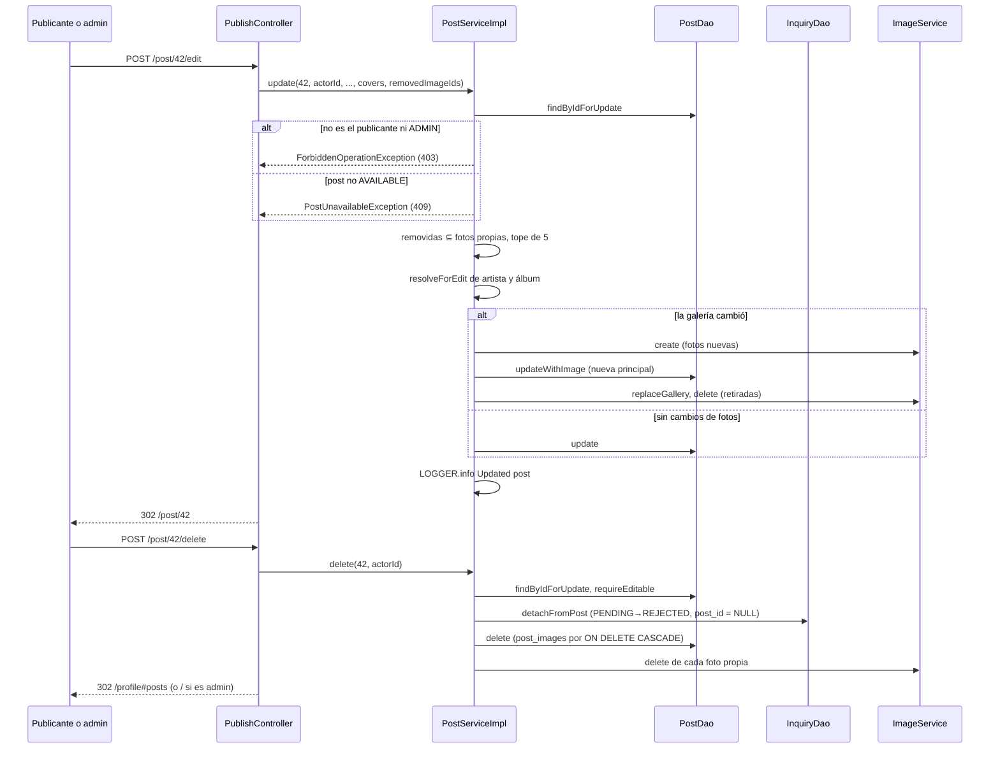

@title: Edit and delete flow
@categories: Flows, Web, Services, Persistence
@files: webapp/src/main/java/ar/edu/itba/paw/webapp/controller/PublishController.java, webapp/src/main/java/ar/edu/itba/paw/webapp/security/PostAccessHandler.java, services/src/main/java/ar/edu/itba/paw/services/PostServiceImpl.java, services/src/main/java/ar/edu/itba/paw/services/ArtistServiceImpl.java, services/src/main/java/ar/edu/itba/paw/services/AlbumServiceImpl.java, services/src/main/java/ar/edu/itba/paw/services/ImageServiceImpl.java, persistence/src/main/java/ar/edu/itba/paw/persistence/PostJdbcDao.java, persistence/src/main/java/ar/edu/itba/paw/persistence/InquiryJdbcDao.java, persistence/src/main/java/ar/edu/itba/paw/persistence/ImageJdbcDao.java, models/src/main/java/ar/edu/itba/paw/models/PostDetail.java, webapp/src/main/webapp/js/confirm-action.js

> [!summary] En una frase
> El publicante, o un administrador, edita o elimina una publicación mientras siga disponible; eliminar no borra las consultas: las desengancha del post y rechaza las pendientes.

## Qué resuelve

`GET` y `POST /post/{id}/edit` y `POST /post/{id}/delete`. Con el PR #46 un administrador también modera publicaciones ajenas, en reemplazo del panel `/admin` eliminado. Desde el PR #51 el service vuelve a chequear quién actúa: ya no depende solo del `@PreAuthorize`.

## Herramientas

| Herramienta | Para qué se usa acá |
|---|---|
| `@PreAuthorize` con `hasRole('ADMIN') or @postAccess.isPublisher(...)` | Quién puede editar o eliminar, en la capa web |
| `requireEditable(post, actorId)` en [[PostServiceImpl]] | La misma regla en el service: publicante o rol `ADMIN`, si no `ForbiddenOperationException` (403) |
| `SELECT ... FOR UPDATE` | Que la edición o el borrado no se crucen con una consulta o una venta |
| `ON DELETE CASCADE` en `post_images` | Las filas de la galería se van con el post |
| `UPDATE` de desenganche | Conservar las consultas de un post eliminado |
| `confirm-action.js` + `ui:confirm-dialog` | Confirmación antes de eliminar |
| Mismo formulario y validador que publicar | [[PublishForm]], [[PublishFormValidator]] |

## Recorrido paso a paso

### Editar

1. `GET /post/{id}/edit`: `VERIFIED` por URL y `CAN_MODERATE_POST` por recurso. `findEditableById(postId, actorId)` pasa por `requireEditable`: si quien actúa no es el publicante, busca la Cuenta y exige rol `ADMIN` (si no, 403); después exige `AVAILABLE` (si no, 409). El formulario se precarga con los datos actuales; la vista recibe las fotos propias y la portada de respaldo del álbum.
2. `POST /post/{id}/edit` → `PostServiceImpl.update(postId, actorId, ...)`:
   - `findByIdForUpdate` bloquea el post y `requireEditable` exige publicante o `ADMIN` y post `AVAILABLE`. La autorización va **antes** que las reglas numéricas: alguien sin permiso recibe 403 aunque mande datos inválidos.
   - Reglas numéricas de [[VinylInputRules]]. Si un POST armado a mano las saltea, `InvalidPostDataException`, que desde el PR #62 [[ErrorResponseAdvice]] responde con 400.
   - Las fotos a quitar (`removedImageIds`, las que se marcaron con la X de cada foto: [[Gallery flow]]) tienen que ser fotos propias de ese post; si no, `InvalidImageException`.
   - El tope de 5 cuenta las que se conservan más las nuevas. El validador del formulario no puede saberlo; por eso lo informa el service y el controller lo muestra en el campo.
   - `resolveForEdit` de artista y álbum: busca o crea por identidad y, si el nombre visible o el género difieren, **actualiza el registro compartido**.
   - Crea las fotos nuevas, actualiza el post (con `image_id` si cambió la galería), reemplaza `post_images` y borra las imágenes retiradas.
   - Loguea `Updated post postId=... actorId=... galleryChanged=...` (PR #62), todavía dentro de la transacción ([[Logging]]).
3. Éxito: aviso `postUpdated` y redirección a la ficha.

### Eliminar

`POST /post/{id}/delete` → `PostServiceImpl.delete`:

1. Bloquea el post y pasa por `requireEditable` (publicante o `ADMIN`, y `AVAILABLE`).
2. Lee los ids de sus fotos propias.
3. `inquiryDao.detachFromPost`: en un `UPDATE`, cada consulta copia `album_id` y `seller_id` del post, pone `post_id = NULL` y, si estaba `PENDING`, pasa a `REJECTED`.
4. Borra el post. Las filas de `post_images` se van por `ON DELETE CASCADE`.
5. Borra las imágenes (cada borrado solo procede si nada más la referencia).
6. Loguea cuántas consultas desenganchó y cuántas imágenes borró.

El controller redirige a `/profile#posts`, o a `/` si quien eliminó es administrador.

## Decisiones y por qué

| Decisión | Alternativa | Motivo | Fuente |
|---|---|---|---|
| Solo se edita o elimina lo `AVAILABLE` | Permitirlo siempre | "Un ejemplar vendido es el registro de la compra"; uno reservado tiene una venta en curso | Comentario en [[PostServiceImpl]] |
| Las consultas sobreviven desenganchadas | Borrarlas en cascada | El comprador sigue viendo qué preguntó y que la publicación ya no existe | Comentario en [[PostServiceImpl]]; migración V1 |
| Desenganchar antes de borrar | Borrar primero | Hay FK de `inquiries.post_id` a `posts` | Orden en `delete` |
| Borrar imágenes después del post | Antes | Las referencias tienen que desaparecer primero | Comentario en [[PostServiceImpl]] |
| La portada del álbum no se borra | Borrarla con el post | "Es del álbum y queda" | Comentario en [[PostServiceImpl]] |
| Pertenencia en `@PreAuthorize` **y** en el service | Solo en el controller, como hasta `8929aea` | El service no confía en que todo llamador pase por el controller; es el mismo criterio que ya seguían la venta y la libreta | Comentarios en [[PostService]] y [[SecurityConfig]]; commit `563f7020` |
| El administrador modera desde la ficha | Panel `/admin` | El panel estaba vacío; se quitó | Commits `60480b55`, `e462c468` |
| Un post inexistente pasa el handler | Devolver `false` | Que el service responda 404 y no un 403 engañoso | Comentario en [[PostAccessHandler]] |

## Concurrencia y casos borde

- Editar mientras alguien consulta: los dos bloquean el post y se ordenan.
- Eliminar mientras el publicante acepta una consulta desde otra pestaña: quien llegue segundo ve el post reservado (409) o inexistente (404 o 409).
- Quitar todas las fotos: el post queda sin imagen propia y se muestra la portada heredada o el placeholder.
- `removedImageIds` con un id que no es una foto propia del post: `InvalidImageException`, que el controller muestra como error del campo de fotos.

## Límites conocidos

- **Editar reescribe datos compartidos.** `resolveForEdit` cambia el nombre visible del artista y el título o género del álbum, que también usan publicaciones de otras Cuentas.
- El rol `ADMIN` se lee de la base en cada edición ajena (`userService.findById`), no del principal de la sesión. Es una lectura extra; a cambio, si se le quita el rol, el service deja de aceptarlo aunque su sesión todavía lo tenga (inferencia a partir del código).
- Eliminar rechaza las consultas pendientes **sin correo** a esos compradores.
- No hay historial de cambios de una publicación.

## Preguntas de defensa

**¿Qué pasa con las consultas si borro la publicación?**
Quedan en la bandeja del comprador con el álbum y el vendedor copiados; las pendientes pasan a rechazadas.

**¿Por qué no puedo editar una publicación reservada?**
Porque hay una venta en curso con un precio y un ejemplar pactados. Solo se toca lo que sigue disponible.

**¿Cómo modera un administrador?**
La misma expresión de `@PreAuthorize` lo deja pasar por rol; la ficha le muestra los botones (`PostDetail.isEditable`).

**Si el controller ya tiene `@PreAuthorize`, ¿para qué chequea el service?**
Para que la regla no dependa de cómo se llegue al service. `update`, `delete` y `findEditableById` reciben el id de quien actúa y lo comparan con el publicante, o buscan si es `ADMIN`. Lo cubren ocho tests nuevos de [[PostServiceImplTest]].

**¿Qué diferencia hay entre 403, 404 y 409 acá?**
403 si no es tuya ni sos administrador; 404 si no existe; 409 si existe y es tuya pero ya no está disponible.

## Evidencia de código

Expresión de moderación y endpoint de borrado:

{{code:webapp/src/main/java/ar/edu/itba/paw/webapp/controller/PublishController.java:38-40}}

{{code:webapp/src/main/java/ar/edu/itba/paw/webapp/controller/PublishController.java:116-156}}

Edición:

{{code:services/src/main/java/ar/edu/itba/paw/services/PostServiceImpl.java:283-330}}

Borrado:

{{code:services/src/main/java/ar/edu/itba/paw/services/PostServiceImpl.java:332-352}}

Desenganche de consultas:

{{code:persistence/src/main/java/ar/edu/itba/paw/persistence/InquiryJdbcDao.java:415-425}}

Handler de pertenencia:

{{code:webapp/src/main/java/ar/edu/itba/paw/webapp/security/PostAccessHandler.java:6-23}}

Reescritura de datos compartidos:

{{code:services/src/main/java/ar/edu/itba/paw/services/AlbumServiceImpl.java:31-42}}
