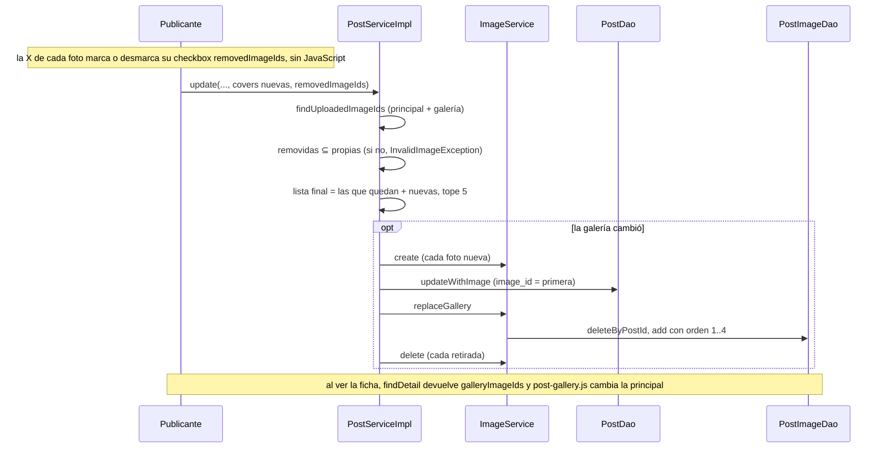

@title: Gallery flow
@categories: Flows, Web, Services, Persistence
@files: webapp/src/main/java/ar/edu/itba/paw/webapp/form/PublishForm.java, webapp/src/main/java/ar/edu/itba/paw/webapp/form/ImageFiles.java, webapp/src/main/java/ar/edu/itba/paw/webapp/validation/PublishFormValidator.java, models/src/main/java/ar/edu/itba/paw/models/ImageRules.java, models/src/main/java/ar/edu/itba/paw/models/ImageUpload.java, services/src/main/java/ar/edu/itba/paw/services/PostServiceImpl.java, services/src/main/java/ar/edu/itba/paw/services/ImageServiceImpl.java, persistence-contracts/src/main/java/ar/edu/itba/paw/persistence/PostImageDao.java, persistence/src/main/java/ar/edu/itba/paw/persistence/PostImageJdbcDao.java, persistence/src/main/resources/db/migration/V8__post_gallery.sql, webapp/src/main/webapp/WEB-INF/views/post/detail.jsp, webapp/src/main/webapp/js/post-gallery.js, webapp/src/main/webapp/WEB-INF/views/publish/index.jsp

> [!summary] En una frase
> Una publicación tiene hasta cinco fotos: la primera es la principal y vive en el post; las otras cuatro, ordenadas, viven en `post_images`.

## Qué resuelve

Varias fotos por ejemplar (PR #46). Cómo se sube y se sirve una imagen está en [[Cover image flow]].

## Herramientas

| Herramienta | Para qué se usa acá |
|---|---|
| `<input type="file" multiple>` + `MultipartFile[]` | Elegir varias fotos en un campo |
| [[ImageFiles]] | Convertir `MultipartFile` en [[ImageUpload]]: los services no conocen el tipo web |
| [[ImageRules]] | Tope de 5 fotos, 5 MiB cada una, firma del formato |
| Tabla `post_images` con `UNIQUE`, `CHECK` y `ON DELETE CASCADE` | Orden, tope y limpieza garantizados por la base |
| `post-gallery.js` | Cambiar la foto grande al tocar una miniatura |

## Modelo de datos

{{file:persistence/src/main/resources/db/migration/V8__post_gallery.sql}}

| Posición | Dónde está | Cómo se sabe el orden |
|---|---|---|
| Foto principal | `posts.image_id` | Es la primera elegida |
| Fotos 2 a 5 | `post_images` | `display_order` de 1 a 4 |
| Respaldo | `albums.cover_image_id` | Solo si el post no tiene foto propia (`COALESCE` en el SQL del resumen) |

## Recorrido paso a paso

**Publicar.** El formulario manda `covers[]`. El validador rechaza más de 5 archivos o alguno inválido. El service crea una fila en `images` por foto, pone la primera en el post y pasa el resto a `replaceGallery`, que inserta con orden 1, 2, 3...

**Editar.** La vista muestra las fotos propias (`findUploadedImageIds`: la principal y luego la galería), cada una con una X en la esquina (PR #59). La X es la `label` de un checkbox `removedImageIds` que el CSS vuelve invisible pero deja en el formulario: tocarla marca la foto, que queda atenuada (`:has(...:checked)`), y la X pasa a mostrar un ícono de restaurar que la desmarca. No hay JavaScript: lo que viaja es el checkbox. El formulario envía `removedImageIds` y, opcionalmente, fotos nuevas. El service:

1. Verifica que cada id a retirar sea una foto propia del post.
2. Arma la lista final: las que quedan, en su orden, más las nuevas al final.
3. Verifica el tope de 5 sobre esa lista.
4. Si la galería cambió: actualiza `posts.image_id` con la primera, borra y vuelve a insertar `post_images`, y elimina las imágenes retiradas.

**Ver.** `PostService.findDetail` devuelve `galleryImageIds`: la imagen que muestra la tarjeta (la propia o la portada heredada) seguida de las adicionales. La ficha dibuja miniaturas solo si hay más de una. Cada miniatura es un enlace real a la imagen: sin JavaScript abre la foto; con `post-gallery.js` reemplaza la principal y marca `aria-current`.

**Eliminar el post.** Las filas de `post_images` desaparecen por la cascada y después se borran las imágenes.

## Decisiones y por qué

| Decisión | Alternativa | Motivo | Fuente |
|---|---|---|---|
| La principal sigue en `posts.image_id` | Mover todas a `post_images` | No tocar el resumen ni las tarjetas existentes: "`posts.image_id` remains the primary photo" | Comentario en la migración V8 |
| `display_order` de 1 a 4 con `CHECK` | Sin límite en la base | El tope queda en el dato, además de en [[ImageRules]] | Migración V8 |
| `UNIQUE (image_id)` | Permitir compartir | Una imagen pertenece a una sola galería | Migración V8 |
| Reemplazar la galería entera al editar | Actualizar filas una por una | Con cuatro filas como máximo es más simple y no deja huecos en el orden | Código de [[ImageServiceImpl]] |
| El tope al editar lo chequea el service | Solo el validador | El validador ve las fotos nuevas, no las que se conservan | Comentario en [[PublishController]] |
| `ImageUpload` en `models` | Pasar `MultipartFile` al service | `services` no depende de Spring MVC | Comentario en [[ImageFiles]] |
| Miniaturas como enlaces | Botones con JavaScript | Funciona sin JavaScript | Marcado de `detail.jsp` |
| Quitar con una X que es la `label` de un checkbox oculto | Casilla visible con texto, como hasta el PR #59 | Se ve como un control de quitar y sigue mandando el mismo campo sin JavaScript; marcar es reversible hasta guardar | Commits `1cc8230e`, `b017d3dd`; comentarios en `style.css` |

## Límites conocidos

- No se puede reordenar: para cambiar la principal hay que retirar y volver a subir.
- Atenuar la foto marcada usa el selector `:has()` de CSS; en un navegador que no lo soporte la foto no se atenúa, aunque la X igual cambia de ícono y el campo se envía.
- Las fotos no se redimensionan ni se generan miniaturas: la miniatura descarga la imagen completa.
- El límite del request es 26 MiB; cinco fotos de 5 MiB entran justo.

## Preguntas de defensa

**¿Por qué dos lugares para las fotos?**
La principal ya existía en el post y todas las consultas de listado la usan. La galería agregó solo las adicionales, sin migrar lo anterior.

**¿Qué garantiza que no haya más de cinco?**
[[ImageRules]] en formulario y service, y en la base el `CHECK` de orden entre 1 y 4 más la unicidad por post y orden.

**¿Qué pasa con las fotos al borrar la publicación?**
Las filas de la galería se van en cascada y el service borra después las imágenes.

## Evidencia de código

{{code:services/src/main/java/ar/edu/itba/paw/services/ImageServiceImpl.java:67-81}}

{{code:services/src/main/java/ar/edu/itba/paw/services/PostServiceImpl.java:136-149}}

{{code:persistence/src/main/java/ar/edu/itba/paw/persistence/PostImageJdbcDao.java:31-50}}

{{code:webapp/src/main/webapp/js/post-gallery.js:1-21}}

La X de quitar al editar:

{{code:webapp/src/main/webapp/WEB-INF/views/publish/index.jsp:116-127}}

{{code:webapp/src/main/webapp/css/style.css:431-473}}
