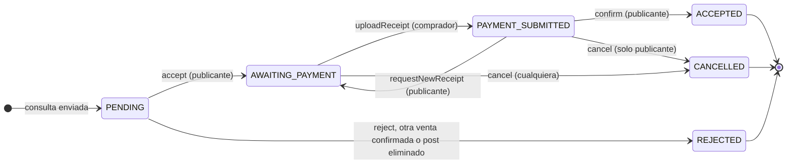
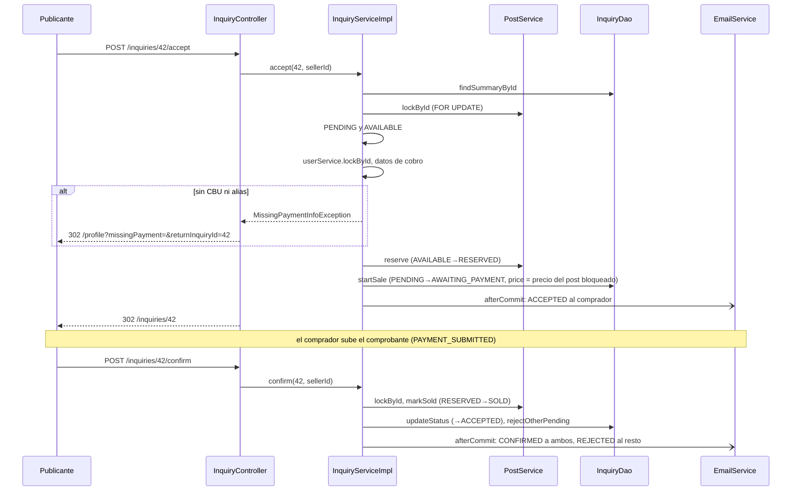

@title: Inquiry and sale flow
@categories: Flows, Web, Services, Persistence
@files: webapp/src/main/java/ar/edu/itba/paw/webapp/controller/InquiryController.java, services/src/main/java/ar/edu/itba/paw/services/InquiryServiceImpl.java, services-contracts/src/main/java/ar/edu/itba/paw/services/InquiryService.java, services/src/main/java/ar/edu/itba/paw/services/PostServiceImpl.java, persistence/src/main/java/ar/edu/itba/paw/persistence/InquiryJdbcDao.java, persistence/src/main/java/ar/edu/itba/paw/persistence/PostJdbcDao.java, models/src/main/java/ar/edu/itba/paw/models/InquirySummary.java, models/src/main/java/ar/edu/itba/paw/models/InquiryDetail.java, models/src/main/java/ar/edu/itba/paw/models/InquiryStatus.java, models/src/main/java/ar/edu/itba/paw/models/PostStatus.java, models/src/main/java/ar/edu/itba/paw/models/ReceiptRules.java, webapp/src/main/java/ar/edu/itba/paw/webapp/security/InquiryAccessHandler.java, webapp/src/main/java/ar/edu/itba/paw/webapp/validation/ReceiptValidator.java, persistence/src/main/resources/db/migration/V5__venta_con_comprobante.sql, docs/adr/0004-freeze-sale-price-at-acceptance.md, webapp/src/main/webapp/WEB-INF/views/inquiry/detail.jsp, webapp/src/main/webapp/WEB-INF/views/inquiry/received.jsp, webapp/src/main/webapp/WEB-INF/views/inquiry/sent.jsp

> [!summary] En una frase
> Aceptar una consulta reserva el vinilo y fija el precio de la venta; el comprador transfiere por fuera y sube el comprobante; el publicante lo revisa y confirma, y recién ahí el vinilo queda vendido y las demás consultas se rechazan.

## Qué resuelve

La venta de un ejemplar único entre dos Cuentas, sin pasarela de pago. Reemplaza al flujo de septiembre, donde "aceptar" vendía en el acto. Entró con los PR #40, #44 y #42 (perfil con datos de cobro, dirección de envío, comprobante); el PR #56 movió el momento en que se fija el precio y el #55 agregó la vuelta a la venta después de cargar los datos de cobro. Cómo nace la consulta está en [[Contact flow]] (de a una) y en [[Cart flow]] (varias juntas); la conversación, en [[Conversation flow]]; las reseñas, en [[Reviews flow]].

## Herramientas

| Herramienta | Para qué se usa acá |
|---|---|
| Spring MVC | Un endpoint POST por transición, con `RedirectAttributes` para el aviso |
| `@PreAuthorize` + [[InquiryAccessHandler]] | Quién puede disparar cada transición |
| `@Transactional` | Cada transición es una transacción |
| `SELECT ... FOR UPDATE` | Bloquear la fila del post: todas las consultas de un ejemplar compiten por ella |
| `UPDATE ... WHERE status = ?` | Guarda de estado: si el estado ya cambió, no afecta filas |
| `CHECK` en la base | Solo estados válidos en `posts.status` e `inquiries.status` |
| Commons FileUpload + `MultipartFilter` | Subida del comprobante |
| [[ReceiptRules]] | Tipo, tamaño y firma del comprobante, compartidas por formulario y service |
| `ResponseEntity<byte[]>` | Descarga del comprobante con headers de seguridad |
| [[TransactionCallbacks]] + `@Async` | Aviso por correo a la otra parte después del commit |

## Máquina de estados

`ACCEPTED` significa **venta confirmada**. El nombre se conservó para no migrar las consultas aceptadas con el flujo anterior.

El post acompaña con su propio estado:

| Operación | Consulta | Post |
|---|---|---|
| `accept` | `PENDING` → `AWAITING_PAYMENT` | `AVAILABLE` → `RESERVED` |
| `uploadReceipt` | `AWAITING_PAYMENT` → `PAYMENT_SUBMITTED` | Sigue `RESERVED` |
| `requestNewReceipt` | `PAYMENT_SUBMITTED` → `AWAITING_PAYMENT` | Sigue `RESERVED` |
| `confirm` | `PAYMENT_SUBMITTED` → `ACCEPTED`; las otras `PENDING` → `REJECTED` | `RESERVED` → `SOLD` |
| `cancel` | → `CANCELLED` | `RESERVED` → `AVAILABLE` |
| `reject` | `PENDING` → `REJECTED` | No cambia |

Mientras el post está reservado, las demás consultas pendientes quedan esperando: si la venta se cancela, el publicante puede aceptar otra; si se confirma, se rechazan todas juntas.

## Recorrido paso a paso

### Bandejas: `GET /inquiries` y `GET /inquiries/sent`

Recibidas y enviadas. Las dos agrupan por publicación y paginan **por grupo** (5 por página): varias consultas sobre el mismo ejemplar son una entrada y nunca quedan partidas entre páginas. El DAO lo resuelve en dos sentencias, sin N+1: primero las claves de grupo de la página, después todas las consultas de esas claves. Cada fila trae el último Mensaje por `LEFT JOIN` contra una subconsulta agregada. Ver [[Paginated listings]].

Desde el PR #60 cada bandeja se puede filtrar con `?status=` por cuatro grupos de estados ([[InquiryStatusFilter]]): pendientes, en curso (espera de pago y pago informado), confirmadas y cerradas (rechazadas o canceladas). Las dos sentencias filtran por estado, así un grupo sin consultas que coincidan no ocupa lugar en la página y un grupo mixto muestra solo las que coinciden. Los chips muestran cuántas consultas hay en cada filtro. Ver [[Status filters flow]].

### Aceptar: `POST /inquiries/{id}/accept`

1. `VERIFIED` por URL y `@inquiryAccess.isSeller` por recurso.
2. `InquiryServiceImpl.accept`:
   - Lee el resumen y vuelve a exigir que quien opera sea el publicante.
   - `lockPost`: `SELECT id FROM posts WHERE id = ? FOR UPDATE`. Si el post fue eliminado, 409.
   - Exige consulta `PENDING` y post `AVAILABLE`. El estado se mira **antes** que los datos de cobro: una consulta que ya no se puede aceptar es un conflicto, no un motivo para mandar a cargar el CBU.
   - `userService.lockById(sellerId)` bloquea la fila de la Cuenta y lee de ahí los datos de cobro. Sin ellos, `MissingPaymentInfoException`.
   - `postService.reserve` (`AVAILABLE → RESERVED`) y `inquiryDao.startSale(inquiryId, post.getPrice())`: un solo `UPDATE` que pasa la consulta de `PENDING` a `AWAITING_PAYMENT` **y** guarda en `inquiries.price` el precio del post bloqueado. Los dos tienen guarda de estado; si cualquiera no afecta filas, `InvalidInquiryStateException` y el rollback deshace la reserva.
   - Registra el correo `ACCEPTED` para el comprador.
3. El controller redirige a la página de la venta con un aviso. Si faltaban datos de cobro, atrapa `MissingPaymentInfoException` y redirige a `/profile?missingPayment=&returnInquiryId={id}#account`: el perfil abre la fila de cobro y, al guardarla, vuelve a la venta ([[Addresses and payment flow]]).

### Subir el comprobante: `POST /inquiries/{id}/receipt`

1. Solo el comprador (`isBuyer`). Formulario multipart con [[ReceiptValidator]].
2. `uploadReceipt` valida de nuevo con [[ReceiptRules]], exige comprador, bloquea el post y llama a `saveReceipt`: una sola sentencia que guarda tipo, bytes y fecha **y** pasa a `PAYMENT_SUBMITTED`, con `WHERE status = 'AWAITING_PAYMENT'`. Un segundo envío, o uno después de cancelar, no encuentra la fila.
3. Correo `RECEIPT_UPLOADED` al publicante.
4. Un archivo que excede el límite del multipart no llega al controller: [[MultipartExceptionHandlerFilter]] redirige a la venta con `?receiptTooLarge`.

### Revisar: confirmar o pedir otro

- `GET /inquiries/{id}/receipt` sirve el archivo a las dos partes con `nosniff`, sin caché y, si es imagen, `Content-Security-Policy: sandbox`.
- `POST .../request-receipt` (publicante): vuelve a `AWAITING_PAYMENT` y avisa al comprador. El comprobante anterior queda guardado hasta que suba otro.
- `POST .../confirm` (publicante): `PAYMENT_SUBMITTED → ACCEPTED`, `markSold`, lee las consultas que seguían pendientes, las rechaza en un solo `UPDATE` y manda `CONFIRMED` a las dos partes y `REJECTED` a cada comprador que esperaba.

### Cancelar: `POST /inquiries/{id}/cancel`

Cualquiera de las dos partes mientras espera el pago; solo el publicante una vez subido el comprobante (`isCancellableBy`). Libera el post (`RESERVED → AVAILABLE`) y avisa a la otra parte.

### Rechazar: `POST /inquiries/{id}/reject`

Publicante, solo sobre una `PENDING`. Avisa al comprador con un correo que lleva a su bandeja de enviadas.

## Datos

Migración V5:

{{code:persistence/src/main/resources/db/migration/V5__venta_con_comprobante.sql:1-50}}

- El comprobante vive **en la fila de la consulta** (`receipt_content_type`, `receipt_data`, `receipt_uploaded_at`): uno por consulta, se reemplaza entero.
- `inquiries.price` se escribe dos veces. Al consultar guarda el precio publicado, que solo sirve de respaldo si el post desaparece. Al aceptar, `startSale` lo reemplaza por el precio del post bloqueado: desde ahí es el monto a transferir aunque el publicante edite el post. Mientras la consulta está `PENDING`, el resumen muestra el precio **actual** del post (`CASE WHEN i.status = 'PENDING' AND p.id IS NOT NULL THEN p.price ELSE COALESCE(i.price, p.price) END`). No hubo cambio de esquema (ADR 0004).
- `inquiries.address_id` apunta a la dirección elegida; una dirección nunca se borra, se archiva.

## Qué ve cada parte

[[InquiryDetail]] decide qué acciones muestra la vista, con las mismas reglas que el service aplica antes de escribir.

| Dato o acción | Comprador | Publicante |
|---|---|---|
| Datos de cobro del publicante | Solo con la venta abierta (`AWAITING_PAYMENT` o `PAYMENT_SUBMITTED`) | Los suyos, en el perfil |
| Dirección de envío | La suya | Completa solo con venta en curso o concretada; si no, ciudad y provincia |
| Aceptar / rechazar | No | Con la consulta `PENDING` (aceptar además exige post `AVAILABLE`) |
| Subir comprobante | En `AWAITING_PAYMENT` | No |
| Confirmar / pedir otro | No | En `PAYMENT_SUBMITTED` |
| Cancelar | En `AWAITING_PAYMENT` | En `AWAITING_PAYMENT` o `PAYMENT_SUBMITTED` |
| Calificar | En `ACCEPTED` | En `ACCEPTED` |

## Decisiones y por qué

| Decisión | Alternativa descartada | Motivo | Fuente |
|---|---|---|---|
| Reservar al aceptar y vender al confirmar | Vender al aceptar (flujo anterior) | El pago ocurre fuera de la aplicación; hace falta un estado intermedio | Spec `feature_venta-con-comprobante_20260924.md` |
| Bloquear el **post** en cada transición | Bloquear la consulta | Todas las consultas de un ejemplar compiten por una única fila: el bloqueo las ordena | Comentario en [[InquiryServiceImpl]] |
| Guarda de estado en cada `UPDATE` además del bloqueo | Confiar en lo leído | El resumen se lee antes de bloquear; el `UPDATE` condicional es la guarda final | Comentario en [[InquiryDetail]] |
| Datos de cobro leídos de la fila bloqueada | Usar los del resumen | No cruzarse con un `updatePaymentInfo` que los esté borrando | Comentario en [[InquiryServiceImpl]] |
| Guardar el comprobante y cambiar el estado en una sentencia | Dos sentencias | Evita un comprobante guardado sin transición | Comentario en [[InquiryJdbcDao]] |
| Comprobante en la tabla de consultas | Reusar la tabla `images` | Es un dato privado de la venta, con sus propias reglas de acceso y de tipo | Inferencia a partir del esquema |
| Precio fijado al aceptar | Congelarlo al consultar, como hasta `8929aea` | Una consulta pendiente todavía no es un acuerdo: sigue el precio publicado. Se fija con el post bloqueado y en la misma sentencia que la transición, así una falla deshace también la reserva | ADR 0004, commit `7e073053` |
| Aceptar sin datos de cobro vuelve a la venta | Redirigir al perfil y que el vendedor vuelva solo | El vendedor carga el CBU y sigue donde estaba. `findSaleToResume` solo confirma que la consulta es suya: es contexto de navegación, no autoriza a aceptar | Comentario en [[InquiryService]], commits `25f95bc9` y `97f489b3` |
| Dirección parcial hasta aceptar | Mostrar siempre la completa | "Publicar un vinilo no puede servir para juntar domicilios" | Comentario en [[InquiryServiceImpl]] |
| `ACCEPTED` conserva su nombre | Renombrar a `CONFIRMED` | No migrar consultas existentes | Comentario en [[InquiryStatus]] |
| `CHECK` sobre `inquiries.status` | Solo el enum de Java | Un valor fuera del enum rompería `valueOf` al leer | Comentario en la migración V5 |
| El comprador no cancela después de subir el comprobante | Dejarlo cancelar siempre | Ya declaró que pagó; decide el publicante | Comentario en [[InquirySummary]] |
| 409 para una transición inválida | 400 o 403 | El recurso existe y es tuyo, pero ya no está en ese estado | Handler en [[InquiryController]] |

## Concurrencia y casos borde

- **Dos aceptaciones simultáneas de consultas distintas del mismo post**: la segunda espera el bloqueo, ve el post `RESERVED` y recibe 409.
- **Aceptar mientras otro comprador consulta**: la consulta nueva también bloquea el post; entra antes como `PENDING` o después recibe "no disponible".
- **Doble clic en "subir"**: el segundo `saveReceipt` no encuentra `AWAITING_PAYMENT` y da 409.
- **Aceptar y vaciar datos de cobro a la vez**: los dos bloquean la fila de la Cuenta; uno ve el resultado del otro.
- **Post eliminado**: `lockPost` lanza 409. Solo se elimina un post `AVAILABLE`, así que nunca hay una venta abierta sobre un post eliminado.
- **Fallo a mitad de una transición**: la excepción deshace todo; por ejemplo, si `reserve` anduvo y `startSale` no, el post vuelve a `AVAILABLE` y no sale ningún correo (lo cubre `testAcceptWhenTransitionFailsReturnsConflictWithoutNotification`).
- **El publicante edita el precio mientras hay consultas pendientes**: las bandejas muestran el precio nuevo. Editar también bloquea el post (`findByIdForUpdate`), así que una aceptación simultánea lee el precio de antes o el de después, nunca uno a medias.
- **Consultas aceptadas antes del PR #56**: conservan el precio que ya tenían; no se reescriben.
- **Orden de bloqueos**: siempre post primero y Cuenta después.

## Límites conocidos

- No hay pasarela: la aplicación no sabe si la transferencia existió. Confirmar es una decisión manual del publicante.
- No hay plazo: una venta puede quedar en `AWAITING_PAYMENT` indefinidamente y el post sigue reservado hasta que alguien cancele.
- El comprobante de tipo imagen no valida firma (el PDF sí).
- La unicidad `(user_id, album_id)` de `posts` incluye los vendidos: quien vendió un álbum no puede volver a publicar otro ejemplar del mismo.
- [[InquiryServiceImplTest]] cubre las reglas con mocks; el bloqueo real contra PostgreSQL no tiene test automático.

## Preguntas de defensa

**¿Qué pasa si dos personas quieren comprar el mismo disco?**
Las dos consultas quedan `PENDING`. El publicante acepta una; el post pasa a `RESERVED` y la otra queda esperando. Si la venta se confirma, la otra se rechaza con aviso; si se cancela, puede aceptarla.

**¿Cómo evitan vender dos veces el mismo ejemplar?**
Bloqueo de fila sobre el post más `UPDATE ... WHERE status = 'AVAILABLE'`. La segunda transacción espera, y cuando sigue ve el estado nuevo.

**¿Por qué `FOR UPDATE` si ya tienen el `UPDATE` condicional?**
El `UPDATE` condicional evita la escritura incorrecta. El bloqueo además ordena las lecturas previas (datos de cobro, otras consultas) dentro de la misma transacción.

**¿Dónde se guarda el comprobante y quién lo ve?**
En columnas de la consulta. Lo ven solo las dos partes; se sirve con `nosniff`, sin caché y con sandbox si es imagen.

**¿Qué precio paga el comprador si el vendedor cambia el precio después de la consulta?**
El vigente al aceptar. Mientras la consulta está pendiente se muestra el precio actual del post; `accept` bloquea el post y `startSale` copia ese precio a la consulta en el mismo `UPDATE` que la pasa a espera de pago. Desde ahí no cambia (ADR 0004).

**¿Qué estado HTTP devuelve una transición inválida?**
409, con la vista `error/409`.

**¿Qué pasa si el mail no sale?**
La transición quedó guardada. El aviso se pierde y la otra parte lo ve al entrar a su bandeja.

## Evidencia de código

Aceptar:

{{code:services/src/main/java/ar/edu/itba/paw/services/InquiryServiceImpl.java:281-313}}

Fijar el precio junto con la transición:

{{code:persistence/src/main/java/ar/edu/itba/paw/persistence/InquiryJdbcDao.java:362-366}}

Precio del resumen según el estado:

{{code:persistence/src/main/java/ar/edu/itba/paw/persistence/InquiryJdbcDao.java:94-97}}

La decisión registrada:

{{file:docs/adr/0004-freeze-sale-price-at-acceptance.md}}

Comprobante, pedir otro, confirmar y cancelar:

{{code:services/src/main/java/ar/edu/itba/paw/services/InquiryServiceImpl.java:327-397}}

Auxiliares de pertenencia, bloqueo y transición:

{{code:services/src/main/java/ar/edu/itba/paw/services/InquiryServiceImpl.java:501-549}}

Transiciones del post, con propagación `MANDATORY`:

{{code:services/src/main/java/ar/edu/itba/paw/services/PostServiceImpl.java:81-112}}

Guardas de estado en SQL:

{{code:persistence/src/main/java/ar/edu/itba/paw/persistence/InquiryJdbcDao.java:340-354}}

{{code:persistence/src/main/java/ar/edu/itba/paw/persistence/PostJdbcDao.java:297-303}}

Bandeja paginada por grupo en dos sentencias, filtradas por estado:

{{code:persistence/src/main/java/ar/edu/itba/paw/persistence/InquiryJdbcDao.java:308-338}}

Reglas de la vista:

{{code:models/src/main/java/ar/edu/itba/paw/models/InquiryDetail.java:55-85}}

Endpoints y handlers de 409:

{{code:webapp/src/main/java/ar/edu/itba/paw/webapp/controller/InquiryController.java:109-133}}

{{code:webapp/src/main/java/ar/edu/itba/paw/webapp/controller/InquiryController.java:293-297}}
