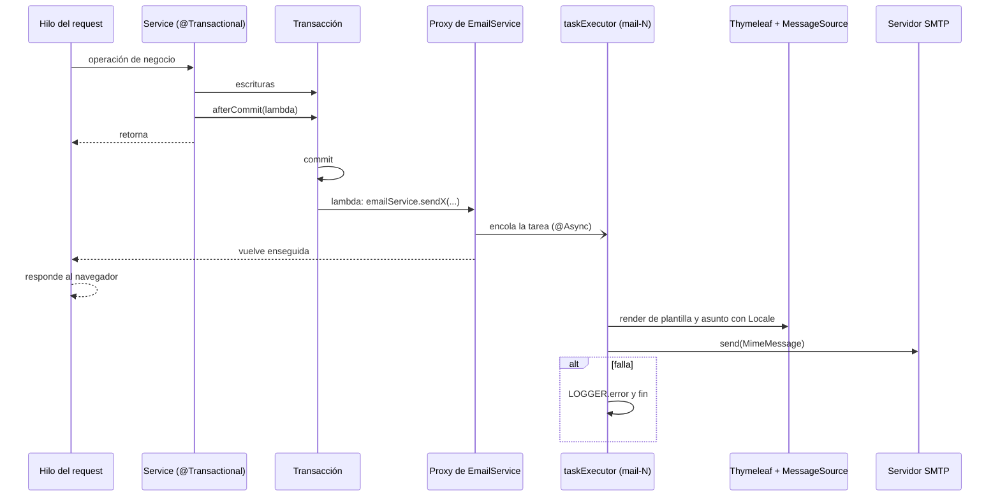

@title: Mail delivery
@categories: Services, Flows
@files: services/src/main/java/ar/edu/itba/paw/services/EmailServiceImpl.java, services-contracts/src/main/java/ar/edu/itba/paw/services/EmailService.java, services/src/main/java/ar/edu/itba/paw/services/TransactionCallbacks.java, services/src/main/java/ar/edu/itba/paw/services/SupportedLocales.java, webapp/src/main/java/ar/edu/itba/paw/webapp/config/WebConfig.java, services-contracts/src/main/java/ar/edu/itba/paw/services/PostInterestNotification.java, services-contracts/src/main/java/ar/edu/itba/paw/services/InquiryUpdateNotification.java, services-contracts/src/main/java/ar/edu/itba/paw/services/MessageNotification.java, services-contracts/src/main/java/ar/edu/itba/paw/services/InquiryEvent.java, webapp/src/main/resources/mail.properties.example, services/src/main/resources/mail/welcome.html, services/src/main/resources/mail/email-verification.html, services/src/main/resources/mail/post-interest.html, services/src/main/resources/mail/inquiry-update.html, services/src/main/resources/mail/inquiry-message.html, services/src/main/resources/mail/password-changed.html, services/src/main/resources/mail/password-reset.html, services/src/test/java/ar/edu/itba/paw/services/EmailServiceImplTest.java

> [!summary] En una frase
> Un service guarda sus datos, registra "cuando haya commit, mandá este correo" y sigue; el envío corre después del commit, en otro hilo, con el idioma ya resuelto, y si falla solo se loguea.

En la defensa del sprint 2 se preguntó cómo funciona el flujo del mail. Esta nota lo recorre de punta a punta: qué pieza hace cada cosa, en qué hilo y por qué.

## Herramientas

| Herramienta | Qué es | Para qué se usa acá | Dónde se configura |
|---|---|---|---|
| JavaMail (`com.sun.mail:javax.mail` 1.6.2) | La API de Java para hablar SMTP | Transporte del mensaje | Dependencia del POM |
| `JavaMailSender` / `JavaMailSenderImpl` (Spring) | Envoltorio de Spring sobre JavaMail | `createMimeMessage()` y `send()` | Bean `mailSender` en [[WebConfig]] |
| `MimeMessageHelper` | Ayudante para armar el mensaje MIME | Remitente, destinatario, asunto, cuerpo HTML en UTF-8 | `createMessage` en [[EmailServiceImpl]] |
| Thymeleaf 3 (`thymeleaf-spring5`) | Motor de plantillas | Renderizar el HTML de cada correo a un `String` | Bean `mailTemplateEngine` en [[WebConfig]] |
| `MessageSource` | Bundles de i18n | Asuntos y textos en el idioma del destinatario | Bean `messageSource` en [[WebConfig]] |
| `@Async` + `@EnableAsync` | Ejecución en otro hilo mediante un proxy de Spring | Que el request no espere al SMTP | Métodos de [[EmailServiceImpl]]; `@EnableAsync` en [[WebConfig]] |
| `ThreadPoolTaskExecutor` | Pool de hilos | Limitar y reusar los hilos que mandan correo | Bean `taskExecutor` en [[WebConfig]] |
| `TransactionSynchronizationManager` | Ganchos del ciclo de la transacción | Disparar el envío recién después del commit | [[TransactionCallbacks]] |
| SMTP con STARTTLS | Protocolo de entrega | Servidor externo (el ejemplo usa Gmail, puerto 587) | `mail.properties` (no versionado) |

El correo **no** usa JSP. Las vistas web son JSP y pasan por el `DispatcherServlet`; un correo se arma fuera de un request, así que necesita un motor que renderice a texto sin servlet. Por eso hay Thymeleaf solo para los correos.

## Recorrido paso a paso

Ejemplo: el correo de verificación del registro. Los demás siguen el mismo camino.

1. **Hilo del request, dentro de la transacción.** `UserServiceImpl.register` guarda la Cuenta y el token. Al final llama a `TransactionCallbacks.afterCommit(...)` con un lambda que contiene el log de éxito y la llamada a `emailService.sendVerificationEmail(user, token, locale)`. Todavía no se manda nada.
2. `afterCommit` pregunta si hay una sincronización de transacción activa. Si la hay, registra un `TransactionSynchronization` cuyo `afterCommit()` ejecuta el lambda. Si no la hay (por ejemplo en un test que construye el service a mano), lo ejecuta en el momento.
3. **Commit.** El método del service termina, el proxy de `@Transactional` hace commit y Spring invoca las sincronizaciones registradas. Si hubo excepción y rollback, el lambda nunca corre: no sale correo por datos que no se guardaron.
4. **Todavía en el hilo del request**, el lambda llama a `emailService.sendVerificationEmail`. `emailService` es el proxy de Spring, y como el método es `@Async` el proxy no lo ejecuta: lo encola en el `taskExecutor` y vuelve enseguida. El controller sigue y responde.
5. **Hilo `mail-N` del pool.** Ahora sí corre el cuerpo del método:
   - Crea un `Context` de Thymeleaf con el `Locale` recibido y las variables (acá, `verificationUrl = baseUrl + "/verify?token=" + token`).
   - `templateEngine.process("email-verification", context)` devuelve el HTML. Las expresiones `#{...}` de la plantilla se resuelven contra los mismos bundles de la web.
   - `messageSource.getMessage("email.verification.subject", null, locale)` da el asunto.
   - `createMessage` arma el `MimeMessage`: `from` de `app.mail.from`, destinatario, asunto y cuerpo marcado como HTML.
   - `mailSender.send(message)` abre la conexión SMTP y entrega.
6. **Si algo falla** (plantilla, bundle, conexión, timeout), el `catch (MessagingException | RuntimeException)` loguea el error con el `userId` y termina. La excepción no vuelve a ningún lado: el request ya respondió hace rato.

## Los siete correos

| Correo | Lo dispara | Destinatario | Idioma | Plantilla | Enlace |
|---|---|---|---|---|---|
| Verificación | `register`, `resendVerification` | La Cuenta | Del request | `email-verification` | `/verify?token=` |
| Bienvenida | `verifyEmail` exitoso | La Cuenta | Del request que verifica | `welcome` | Inicio |
| Consulta nueva | `InquiryServiceImpl.create` (contacto) y `submitAll` (carrito) | Publicante | `preferred_locale` del publicante | `post-interest` | `/inquiries/{id}`, uno por vinilo |
| Cambio de una consulta | `accept`, `reject`, `uploadReceipt`, `requestNewReceipt`, `confirm`, `cancel` | Ver tabla siguiente | `preferred_locale` del destinatario | `inquiry-update` | `/inquiries/{id}`; rechazo: `/inquiries/sent` |
| Mensaje nuevo | `sendMessage` | La otra parte | `preferred_locale` del destinatario | `inquiry-message` | `/inquiries/{id}#conversation` |
| Contraseña cambiada | `changePassword`, `resetPassword` | La Cuenta | Del request | `password-changed` | Ninguno |
| Recuperación | `requestPasswordReset` | La Cuenta | Del request | `password-reset` | `/reset-password?token=` |

Eventos de `inquiry-update` ([[InquiryEvent]]) y a quién le llega cada uno:

| Operación | Evento | Destinatario |
|---|---|---|
| `accept` | `ACCEPTED` | Comprador |
| `reject` | `REJECTED` | Comprador |
| `uploadReceipt` | `RECEIPT_UPLOADED` | Publicante |
| `requestNewReceipt` | `RECEIPT_REQUESTED` | Comprador |
| `confirm` | `CONFIRMED` | Comprador y publicante; además `REJECTED` a cada comprador que seguía pendiente |
| `cancel` | `CANCELLED` | La parte que no canceló |

Un solo template sirve para los seis eventos: el evento elige las keys `email.inquiryUpdate.<EVENTO>.subject`, `.heading` y `.body`. Los datos de cobro y la dirección **no viajan por correo**: se ven en la página de la venta, a la que lleva el enlace.

El primer texto de una Consulta no dispara el correo de "mensaje nuevo": ya viaja dentro del de "consulta nueva".

Desde el PR #47 el aviso de consulta nueva lleva una **lista** de vinilos ([[PostInterestNotification]] con `InterestedPost`). El contacto manda uno; el carrito manda **un correo por publicante** con todos los vinilos que le consultaron, cada uno con el enlace a su Consulta. Con un vinilo el asunto lo nombra (`email.postInterest.subject`); con varios dice cuántos son (`email.postInterest.subject.many`). El carrito nunca lleva mensaje.

## De dónde sale el idioma

Hay dos orígenes y los dos se resuelven **antes** de entrar al hilo asíncrono:

- **Correos a quien está haciendo el request** (verificación, bienvenida, recuperación, clave cambiada): el `Locale` del request, que sale del `AcceptHeaderLocaleResolver` (cabecera `Accept-Language`, español por defecto).
- **Correos a otra persona** (consulta nueva, cambios de la consulta, mensajes): `users.preferred_locale` del destinatario, guardado al registrarse. `SupportedLocales.localeOf` lo convierte y lo limita a `es`, `en` o `fr`.

El motivo está escrito en la interfaz: dentro del hilo `mail-N` no hay request, y `LocaleContextHolder` no trae nada útil. Por eso el `Locale` es un parámetro de cada método.

## Configuración

Pool de hilos:

{{code:webapp/src/main/java/ar/edu/itba/paw/webapp/config/WebConfig.java:59-80}}

- 2 hilos fijos, hasta 5, con una cola de 50 tareas.
- Si el pool y la cola están llenos, el handler de rechazo **descarta ese correo** y deja un `WARN`. No usa `CallerRunsPolicy`, que haría que el hilo del request mandara el correo.
- Al apagar la aplicación espera hasta 30 segundos a que terminen los envíos encolados.
- El bean se llama `taskExecutor` porque es el nombre que busca `@EnableAsync` por defecto. Sin él, Spring usaría `SimpleAsyncTaskExecutor`, que crea un hilo por envío.

Remitente SMTP y motor de plantillas:

{{code:webapp/src/main/java/ar/edu/itba/paw/webapp/config/WebConfig.java:145-184}}

Propiedades esperadas (ejemplo versionado; el archivo real no se commitea):

{{file:webapp/src/main/resources/mail.properties.example}}

Los tres timeouts (conexión, lectura, escritura) evitan que un SMTP colgado retenga un hilo del pool para siempre. `environment.getRequiredProperty` hace que la aplicación no arranque si falta una key.

`app.base-url` es obligatoria y absoluta: los enlaces se arman en un hilo sin request, así que no hay de dónde deducir host ni context path. En el servidor de la cátedra incluye `/paw-2026b-14`.

## Decisiones y por qué

| Decisión | Alternativa descartada | Motivo | Fuente |
|---|---|---|---|
| Envío después del commit | Enviar dentro de la transacción | Un rollback posterior dejaría un correo por algo que no existe | [[TransactionCallbacks]]; cierra un hueco registrado en el Vault de septiembre |
| Envío asíncrono | Envío síncrono con respuesta 503 si falla (lo pedían el spec de contacto y un issue viejo) | Entre timeouts una entrega lenta puede tardar unos 15 segundos; el request no debe esperar | Comentario en [[EmailServiceImpl]] |
| `try/catch` que loguea y corta | Propagar la excepción | Corre en otro hilo: no hay controller que la reciba. Un SMTP caído no puede romper el flujo que lo dispara | Regla de `CLAUDE.md`; comentario en [[EmailServiceImpl]] |
| Pool acotado que descarta al saturarse | Hilo por envío, o `CallerRunsPolicy` | Un hilo por envío agota la máquina bajo carga; `CallerRunsPolicy` traslada la lentitud al request | Comentario en [[WebConfig]] |
| `Locale` como parámetro | `LocaleContextHolder` dentro del método | En el hilo asíncrono no hay request | Comentario en [[EmailService]] |
| Idioma del destinatario guardado en la Cuenta | Idioma de quien dispara | Quien recibe el aviso no es quien hace el request | Comentario en [[InquiryServiceImpl]] |
| Thymeleaf para el correo | JSP | El correo se renderiza fuera del servlet | Inferencia a partir del diseño |
| Un template para todos los cambios de la consulta | Un template por evento | El evento solo cambia asunto, título y texto | Comentario en [[EmailServiceImpl]] |
| Un correo por publicante al enviar el carrito | Un correo por vinilo | Quien recibe diez consultas del mismo comprador lee un solo aviso | Comentario en [[PostInterestNotification]] y en [[InquiryServiceImpl]] |
| Ni CBU ni dirección en el correo | Incluirlos | Datos sensibles: se ven solo con sesión, en la página de la venta | Comentario en [[EmailServiceImpl]] |
| Objetos `*Notification` como carga del correo | Pasar los modelos de dominio | El hilo asíncrono recibe solo lo que necesita, ya leído dentro de la transacción | Estructura de `services-contracts` |
| Logs con ids, sin correo ni cuerpo del mensaje | Loguear el destinatario | Regla del proyecto; el texto de un Mensaje no se registra | Comentario en [[EmailServiceImpl]] |

## Seguridad del contenido

- Thymeleaf escapa todo `th:text`. Un nombre o un mensaje con `<script>` llega como texto. Lo cubre el test `testSendMessageEmailWhenBodyHasMarkupReturnsEscapedBodyWithLineBreaks`.
- El texto libre se muestra con `white-space: pre-line` para conservar los saltos sin insertar HTML.
- `createMessage` acepta un `replyTo`, pero hoy todos los llamadores pasan `null`. El ADR 0003 quitó el `Reply-To` a propósito: ninguna parte conoce el correo de la otra y se responde dentro de la aplicación ([[Conversation flow]]).

## Límites conocidos

- **Sin reintentos ni cola durable.** Si el SMTP falla, o el pool descarta la tarea, ese correo se pierde. Los datos sí quedaron guardados. No hay tabla outbox.
- **El aviso en pantalla no confirma la entrega.** "Te enviamos un enlace" significa que la operación terminó, no que el correo llegó.
- **Apagado.** Pasados 30 segundos, los envíos encolados se pierden.
- **Eliminar una publicación** rechaza sus consultas pendientes sin avisar por correo a esos compradores.
- **Auto-invocación.** `@Async` funciona porque la llamada entra por el proxy inyectado. Una llamada interna (`this.sendX()`) dentro de `EmailServiceImpl` sería síncrona; hoy no hay ninguna.
- **Verificado solo con tests de unidad.** [[EmailServiceImplTest]] usa las plantillas reales y un remitente falso, y construye el service a mano, así que no ejercita `@Async` ni la transacción real. Este Vault no envió correos.

## Preguntas de defensa

**¿En qué hilo se manda el correo?**
En uno del pool `mail-`. El hilo del request solo encola la tarea, después del commit.

**¿Qué pasa si el servidor de correo está caído?**
La operación de negocio ya terminó bien. El envío falla en el hilo del pool, queda un `ERROR` en el log y no se reintenta.

**¿Por qué no mandan el correo dentro de la transacción?**
Porque si después hay rollback, salió un correo por algo que no se guardó. Y porque mantener la transacción abierta mientras se habla con un SMTP retiene una conexión a la base.

**¿Cómo sabe el correo en qué idioma escribirse?**
Recibe el `Locale` como parámetro. Para la propia persona es el del request; para otra, el `preferred_locale` guardado en su Cuenta.

**¿Por qué Thymeleaf si las vistas son JSP?**
Porque un JSP necesita el contenedor de servlets y un request. El correo se arma en un hilo aparte y tiene que salir como `String`.

**¿Qué pasa si se registran mil personas a la vez?**
Hasta 5 hilos mandan y 50 tareas esperan. Lo que exceda se descarta con un `WARN`. Esas personas pueden pedir el reenvío.

**¿De dónde sale la URL del enlace?**
De `app.base-url`, configurada con el context path. No se puede deducir del request porque no hay request.

**¿Cómo funciona `@Async`?**
`@EnableAsync` hace que Spring envuelva el bean en un proxy. Al llamar un método `@Async` a través del proxy, este lo entrega al `taskExecutor` en vez de ejecutarlo.

## Evidencia de código

El gancho de commit:

{{code:services/src/main/java/ar/edu/itba/paw/services/TransactionCallbacks.java:1-24}}

Contrato, con el motivo del `Locale` explícito:

{{code:services-contracts/src/main/java/ar/edu/itba/paw/services/EmailService.java:7-26}}

Constructor (URL base) y un envío simple:

{{code:services/src/main/java/ar/edu/itba/paw/services/EmailServiceImpl.java:43-89}}

Un template para todos los eventos de la consulta:

{{code:services/src/main/java/ar/edu/itba/paw/services/EmailServiceImpl.java:126-156}}

Armado del mensaje MIME:

{{code:services/src/main/java/ar/edu/itba/paw/services/EmailServiceImpl.java:214-234}}

Cómo lo registra un service (consulta nueva, con el idioma del publicante):

{{code:services/src/main/java/ar/edu/itba/paw/services/InquiryServiceImpl.java:110-133}}

El mismo aviso desde el carrito, agrupado por publicante:

{{code:services/src/main/java/ar/edu/itba/paw/services/InquiryServiceImpl.java:135-164}}

Un vinilo o varios en el mismo correo:

{{code:services/src/main/java/ar/edu/itba/paw/services/EmailServiceImpl.java:91-124}}

Normalización de idiomas:

{{code:services/src/main/java/ar/edu/itba/paw/services/SupportedLocales.java:11-35}}

## Plantillas

### email-verification

{{file:services/src/main/resources/mail/email-verification.html}}

### inquiry-update

{{file:services/src/main/resources/mail/inquiry-update.html}}

### inquiry-message

{{file:services/src/main/resources/mail/inquiry-message.html}}

### post-interest

{{file:services/src/main/resources/mail/post-interest.html}}

### password-reset

{{file:services/src/main/resources/mail/password-reset.html}}

### password-changed

{{file:services/src/main/resources/mail/password-changed.html}}

### welcome

{{file:services/src/main/resources/mail/welcome.html}}
