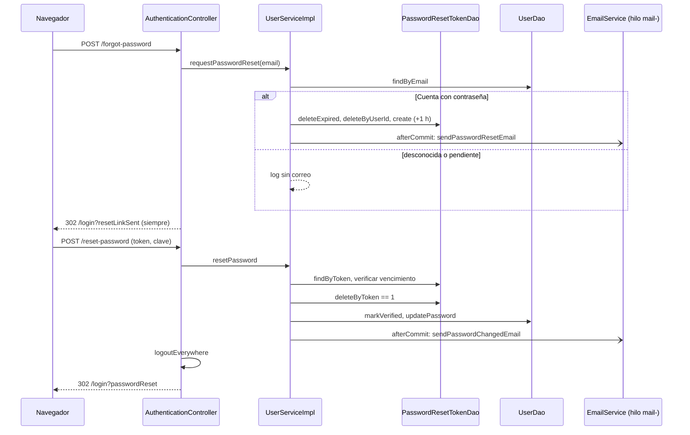

@title: Password recovery flow
@categories: Flows, Web, Services
@files: webapp/src/main/java/ar/edu/itba/paw/webapp/controller/AuthenticationController.java, services/src/main/java/ar/edu/itba/paw/services/UserServiceImpl.java, webapp/src/main/java/ar/edu/itba/paw/webapp/form/ForgotPasswordForm.java, webapp/src/main/java/ar/edu/itba/paw/webapp/form/ResetPasswordForm.java, webapp/src/main/java/ar/edu/itba/paw/webapp/validation/ValidPassword.java, webapp/src/main/java/ar/edu/itba/paw/webapp/security/AuthenticationSessions.java, persistence/src/main/java/ar/edu/itba/paw/persistence/PasswordResetTokenJdbcDao.java, persistence/src/main/java/ar/edu/itba/paw/persistence/UserJdbcDao.java, webapp/src/main/webapp/WEB-INF/views/auth/forgot-password.jsp, webapp/src/main/webapp/WEB-INF/views/auth/reset-password.jsp, services/src/main/resources/mail/password-reset.html, services/src/main/resources/mail/password-changed.html

> [!summary] En una frase
> Quien no puede entrar pide un enlace por correo, de un solo uso y válido una hora; al usarlo elige una clave nueva, la Cuenta queda verificada y se cierran todas sus sesiones.

## Qué resuelve

La Recuperación de contraseña del glosario: una Cuenta que no puede iniciar sesión elige una clave nueva a partir de un enlace. Es distinta del Cambio de contraseña, que se hace con sesión iniciada y conociendo la clave actual (ver [[Profile flow]]). La mecánica del token está en [[Tokens and email links]].

## Herramientas

| Herramienta | Para qué se usa acá |
|---|---|
| Spring MVC + Bean Validation | Los dos formularios: [[ForgotPasswordForm]] y [[ResetPasswordForm]] |
| [[ValidPassword]] y [[MatchingPasswords]] | Las mismas reglas de clave que el registro y el cambio |
| `SecureRandom` + Base64 URL | El token del enlace |
| `PasswordHasher` (BCrypt 12) | Comparar con la clave actual y hashear la nueva |
| Spring JDBC | `password_reset_tokens`, `users`, `email_verification_tokens` |
| `UNIQUE (user_id)` | Un solo enlace vivo por Cuenta, aun con pedidos simultáneos |
| `@Transactional` + [[TransactionCallbacks]] | Clave, verificación y consumo del enlace en una sola transacción; correo después del commit |
| `SessionRegistry` | Cerrar las sesiones abiertas de la Cuenta |
| JavaMail + Thymeleaf + `@Async` | Correo con el enlace y aviso de clave cambiada |

## Recorrido paso a paso

### 1. Pedir el enlace: `POST /forgot-password`

1. El formulario tiene un solo campo. `@InitBinder` recorta el correo y `@Valid` exige que no esté vacío, tenga formato de correo y hasta 100 caracteres.
2. `UserService.requestPasswordReset(email, locale)`:
   - Normaliza y busca la Cuenta.
   - Si no existe, o es una pendiente sin contraseña, loguea `Ignored password reset request...` **sin el correo** y termina.
   - `deleteExpired(now)`: aprovecha el pedido para borrar los enlaces vencidos de cualquier Cuenta.
   - `deleteByUserId`: deja sin efecto el enlace anterior de esta Cuenta.
   - Genera el token y lo inserta con `expires_at = ahora + 1 hora`.
   - Si el insert viola `UNIQUE (user_id)`, otro pedido simultáneo ganó: termina sin mandar nada.
   - Registra el correo para después del commit.
3. El controller redirige **siempre** a `/login?resetLinkSent`, exista o no la Cuenta. El login muestra un aviso genérico.

Una Cuenta sin verificar que ya tiene contraseña sí recibe el enlace. Es el camino para recuperar un correo que otro registró antes.

### 2. Abrir el enlace: `GET /reset-password?token=...`

El controller copia el token del query string al formulario y muestra `auth/reset-password`. No valida nada todavía. La vista emite el token como campo oculto pasándolo por `c:out`.

### 3. Elegir la clave: `POST /reset-password`

1. `@Valid` sobre [[ResetPasswordForm]]: token no vacío, clave con [[ValidPassword]], confirmación igual.
2. `UserService.resetPassword(token, newPassword, locale)`:
   - Busca el token. Si no está o venció, devuelve vacío.
   - Lee la Cuenta. Si la clave nueva es igual a la actual (`PasswordHasher.matches`), lanza `UnchangedPasswordException` **antes** de consumir el enlace.
   - `deleteByToken` tiene que afectar una fila. Si no, otro request lo usó: devuelve vacío.
   - `markVerified` y borra los enlaces de verificación pendientes.
   - `updatePassword` con el hash nuevo. No compara el hash anterior: quien recupera justamente no lo conoce.
   - Registra el correo de "tu contraseña cambió" para después del commit.
3. Controller:
   - Con resultado, `AuthenticationSessions.logoutEverywhere` expira las demás sesiones de la Cuenta y cierra la de este navegador si era de ella. Redirige a `/login?passwordReset`.
   - Con `UnchangedPasswordException`, error en el campo de clave y el enlace sigue vivo.
   - Sin resultado, error global `auth.resetPassword.invalid` y enlace para pedir otro.

## Datos

| Tabla | Operación |
|---|---|
| `password_reset_tokens` | `DELETE` de vencidos, `DELETE` por Cuenta, `INSERT`, `SELECT` por token, `DELETE` por token |
| `users` | `UPDATE verified`, `UPDATE password_hash` |
| `email_verification_tokens` | `DELETE` por Cuenta |

## Decisiones y por qué

| Decisión | Motivo | Fuente |
|---|---|---|
| Misma respuesta exista o no la Cuenta | Que el formulario no sirva para averiguar qué correos están registrados | Comentario en [[AuthenticationController]] |
| El log del pedido ignorado no incluye el correo | Regla del proyecto: se loguea con `userId`, nunca con el correo | Issue del sprint 2 |
| Enlace válido una hora | Acotar la ventana si el correo queda expuesto | Comentario en [[UserServiceImpl]] |
| Un solo enlace por Cuenta | Pedir otro deja sin efecto al anterior | Comentario en [[UserServiceImpl]] |
| "Misma clave" se rechaza antes de consumir | Poder reintentar con el mismo enlace | Comentario en [[UserServiceImpl]] |
| Recuperar verifica la Cuenta | El enlace llegó al correo | Comentario en [[UserServiceImpl]]; glosario de `CONTEXT.md` |
| Cerrar todas las sesiones al terminar | Una sesión abierta por quien registró el correo antes que su dueño no tiene que seguir adentro | Comentario en [[AuthenticationSessions]] |
| No iniciar sesión al terminar | El flujo termina en el login con la clave nueva | Código de [[AuthenticationController]] |
| Las pendientes sin clave no reciben enlace | No hay clave que recuperar: su camino es registrarse de nuevo | Comentario en [[UserServiceImpl]] |

## Concurrencia y casos borde

- Dos pedidos a la vez: uno pierde contra `UNIQUE (user_id)` y no manda correo.
- Dos envíos del formulario con el mismo token: el segundo no encuentra la fila y ve "enlace inválido".
- Enlace vencido: mismo mensaje que uno inexistente, con el enlace para pedir otro.
- Token ausente en la URL: `@NotBlank` sobre el campo oculto lo informa como error del formulario.
- SMTP caído: el pedido no falla; el enlace quedó guardado pero la persona no lo recibe y tiene que pedir otro.
- El aviso de "tu contraseña cambió" usa el idioma del request, no el guardado en la Cuenta.

## Límites conocidos

- No hay tope de pedidos por Cuenta ni por IP: cada pedido manda un correo.
- El tiempo de respuesta no es idéntico en las dos ramas (una escribe en la base y la otra no). La respuesta visible sí lo es.
- El token viaja en la URL y se guarda en claro. Ver [[Tokens and email links]].
- Sin tests de la capa web. El service está cubierto por [[UserServiceImplTest]] y el DAO por [[PasswordResetTokenJdbcDaoTest]]; este Vault no los ejecutó.

## Preguntas de defensa

**¿Qué diferencia hay entre cambiar y recuperar la contraseña?**
Cambiar exige sesión y la clave actual, y actualiza con `WHERE password_hash = <el que leí>`. Recuperar no exige nada de eso: lo que autoriza es el token que llegó al correo.

**¿Por qué `updatePassword` no compara el hash anterior?**
Porque quien recupera no lo conoce. La carrera se resuelve antes, al reclamar el token con un `DELETE` que tiene que afectar una fila.

**¿Qué pasa si el correo no existe?**
Nada visible. Misma redirección y mismo aviso. Solo queda una línea de log sin datos personales.

**¿Por qué recuperar la contraseña verifica la Cuenta?**
Porque demuestra lo mismo que el enlace de verificación: que la persona lee esa casilla.

**¿Y las sesiones que ya estaban abiertas?**
Se expiran con `SessionRegistry.getAllSessions(...).expireNow()`. En su siguiente request van a `/login?sessionExpired`.

## Evidencia de código

Controller:

{{code:webapp/src/main/java/ar/edu/itba/paw/webapp/controller/AuthenticationController.java:125-171}}

Pedido del enlace:

{{code:services/src/main/java/ar/edu/itba/paw/services/UserServiceImpl.java:253-292}}

Uso del enlace:

{{code:services/src/main/java/ar/edu/itba/paw/services/UserServiceImpl.java:294-328}}

Cierre de sesiones:

{{code:webapp/src/main/java/ar/edu/itba/paw/webapp/security/AuthenticationSessions.java:50-65}}

Las dos formas de actualizar la clave en el DAO:

{{code:persistence/src/main/java/ar/edu/itba/paw/persistence/UserJdbcDao.java:139-160}}

Token oculto del formulario:

{{code:webapp/src/main/webapp/WEB-INF/views/auth/reset-password.jsp:24-34}}
