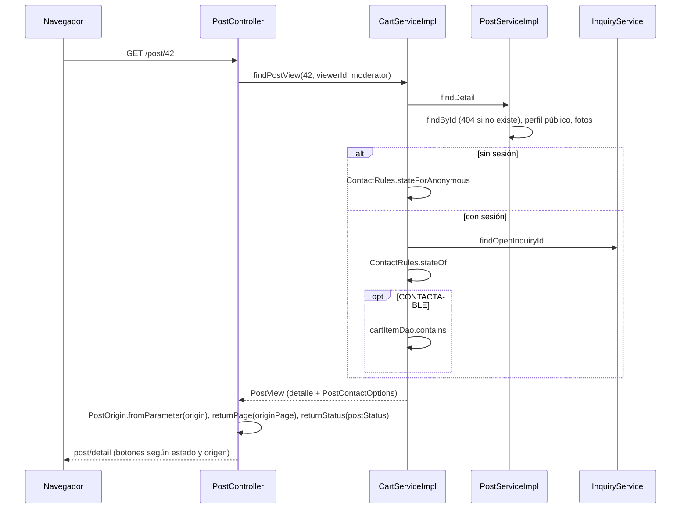

@title: Post detail flow
@categories: Flows, Web, Services
@files: webapp/src/main/java/ar/edu/itba/paw/webapp/controller/PostController.java, webapp/src/main/java/ar/edu/itba/paw/webapp/controller/PostOrigin.java, services/src/main/java/ar/edu/itba/paw/services/PostServiceImpl.java, models/src/main/java/ar/edu/itba/paw/models/PostDetail.java, models/src/main/java/ar/edu/itba/paw/models/PostView.java, models/src/main/java/ar/edu/itba/paw/models/PostContactOptions.java, models/src/main/java/ar/edu/itba/paw/models/ContactState.java, services/src/main/java/ar/edu/itba/paw/services/CartServiceImpl.java, services/src/main/java/ar/edu/itba/paw/services/ContactRules.java, models/src/main/java/ar/edu/itba/paw/models/PostSummary.java, models/src/main/java/ar/edu/itba/paw/models/PublicUserProfile.java, persistence/src/main/java/ar/edu/itba/paw/persistence/PostJdbcDao.java, webapp/src/main/webapp/WEB-INF/views/post/detail.jsp, webapp/src/main/webapp/WEB-INF/tags/back-link.tag

> [!summary] En una frase
> `/post/{id}` es la ficha pública de una publicación: datos, fotos, vendedor y las acciones que le corresponden a quien mira: editar, consultar, sumar al carrito o seguir su consulta abierta.

## Herramientas

| Herramienta | Para qué se usa acá |
|---|---|
| `@AuthenticationPrincipal` opcional | La ruta es pública: el principal puede ser `null` |
| [[PostDetail]] | La ficha y si quien mira puede editarla |
| [[PostView]] + [[PostContactOptions]] | La ficha más lo que se le ofrece para consultarla, ya resuelto por `CartService` |
| [[ContactRules]] | La misma regla de contactabilidad que usan el contacto y el carrito |
| `PostOrigin.fromParameter` | `origin` llega como texto y se traduce a [[PostOrigin]]; un valor desconocido da `null` en vez de un error |
| `user-byline.tag` | Foto y nombre del publicante con enlace a su perfil público |
| `URLEncoder` en el listado | Pasar la búsqueda de origen como un parámetro |

## Recorrido paso a paso

1. `GET /post/{id}` no exige sesión.
2. El controller llama a `CartService.findPostView(postId, viewerId, moderator)`, que primero pide `PostService.findDetail`:
   - `findById` trae el resumen por `JOIN` (post, publicante, álbum, artista). Si no existe, 404. No filtra por estado: una publicación reservada o vendida también tiene ficha.
   - Busca el perfil público del publicante; es `null` si no está verificado.
   - Arma la lista de fotos.
   - `ownedByViewer` y `moderator` (este último lo calcula el controller a partir del rol).
3. Después calcula [[PostContactOptions]]:
   - Sin sesión: solo cuenta el estado del post (`ContactRules.stateForAnonymous`); nunca está en un carrito.
   - Con sesión: busca la Consulta abierta de quien mira y pregunta a `ContactRules.stateOf`. Si se puede consultar, además mira si ya está en su carrito.
4. La vista decide con eso:
   - `detail.editable` (disponible y, además, propio o moderador): botones de editar y eliminar.
   - Anónimo y contactable: botón de consultar (lo lleva al login).
   - Post propio: un texto que lo dice.
   - Consulta abierta: botón que lleva a esa conversación.
   - Contactable: "Consultar" y, al lado, "Agregar al carrito" (un POST con CSRF) o "En el carrito".
5. **Volver.** Tres orígenes posibles:
   - Desde el catálogo: `from` trae la query string del listado, codificada. La ficha arma el enlace solo detrás de `/?`.
   - Desde un perfil público: `origin=PUBLIC_PROFILE` (o `public-profile`) y `originPage`.
   - Desde el perfil propio: `origin=PRIVATE_PROFILE` (o `private-profile`), aceptado solo si quien mira es el publicante. Si "Mis publicaciones" estaba filtrada, llega también `postStatus` y el enlace de volver (`back-link.tag`) lo repite, así se vuelve a la misma página del mismo filtro (PR #61, [[Status filters flow]]).
   - `origin`, `originPage` y `postStatus` llegan como `String`. `PostOrigin.fromParameter` devuelve `null` ante un valor desconocido, `returnPage` convierte la página con `Math.max(1, ...)`, o 1 si no es un número, y `returnStatus` devuelve `null` si el estado no existe. Son contexto de navegación: un valor viejo o mal formado solo pierde el enlace de regreso, nunca impide abrir la ficha (PR #50).

## Decisiones y por qué

| Decisión | Motivo | Fuente |
|---|---|---|
| La ficha es pública y el contacto no | Mirar no requiere Cuenta; comprar sí | Comentario en [[PostController]] |
| Las reglas de botones viven en el modelo | La vista no repite lógica y el service usa la misma regla de estado | Comentario en [[PostDetail]] |
| Lo que se ofrece para consultar lo resuelve `CartService`, con o sin sesión | "La vista solo lo muestra"; el contacto anónimo se resolvía en la vista hasta el commit `412f61ab`. Alternativa descartada: que la JSP combine estado, dueño y carrito | Comentario en `detail.jsp` y en [[CartService]] |
| El rol de moderador lo resuelve la capa web | `services` no conoce Spring Security | Comentario en [[PostDetail]] |
| `origin` se traduce a un enum | Un texto libre abriría una redirección a cualquier ruta | Comentario en [[PostController]] |
| Parámetros de regreso tolerantes | Hasta `8929aea` Spring los convertía y un valor inválido daba 400: se perdía una ficha válida por un dato opcional | Comentario en [[PostController]]; commit `ca06676c` |
| `from` solo se usa detrás de `/?` | No puede sacar al usuario de la aplicación | Comentario en [[PostController]] |
| El perfil del vendedor puede faltar | Una Cuenta sin verificar no tiene perfil público | Comentario en [[PostDetail]] |

## Casos borde

- `origin` con un valor desconocido u `originPage` no numérico: la ficha abre igual, sin enlace de regreso o con página 1. Hasta `8929aea` daban 400 por [[ErrorResponseAdvice]].
- `postStatus` desconocido: la ficha abre y el regreso va al perfil sin filtro. En cambio, el mismo valor en `/profile?postStatus=` da 400, porque ahí es el filtro del listado y no contexto de regreso.
- Publicación vendida: se ve, con su marca de estado y sin acciones.
- Cuenta sin verificar: ve el botón de consultar; al tocarlo llega a `/verify/required`.

## Preguntas de defensa

**¿Por qué los botones se deciden en el modelo y no en la JSP?**
Para que la regla esté en un solo lugar testeable. La JSP solo pregunta `detail.editable` y `contact.contactable`, `contact.ownPost`, `contact.inCart`.

**¿Por qué la ficha pasa por `CartService`?**
Porque lo que se ofrece depende del carrito y de las consultas de quien mira. `CartService` compone la ficha de `PostService` con esas opciones y usa [[ContactRules]], la misma regla del contacto.

**¿Cómo vuelve la ficha al listado con los mismos filtros?**
El catálogo le pasa su query string codificada en `from` y la ficha la reusa en el enlace de volver.

**¿Qué pasa si esconden el botón pero llamo a la URL de editar?**
`@PreAuthorize` y el service lo impiden igual. Ocultar el botón es comodidad, no seguridad.

## Evidencia de código

{{code:webapp/src/main/java/ar/edu/itba/paw/webapp/controller/PostController.java:17-82}}

{{code:services/src/main/java/ar/edu/itba/paw/services/PostServiceImpl.java:114-122}}

{{code:models/src/main/java/ar/edu/itba/paw/models/PostDetail.java:5-41}}

Qué se le ofrece a quien mira:

{{code:services/src/main/java/ar/edu/itba/paw/services/CartServiceImpl.java:118-132}}

{{code:models/src/main/java/ar/edu/itba/paw/models/PostContactOptions.java:5-23}}
