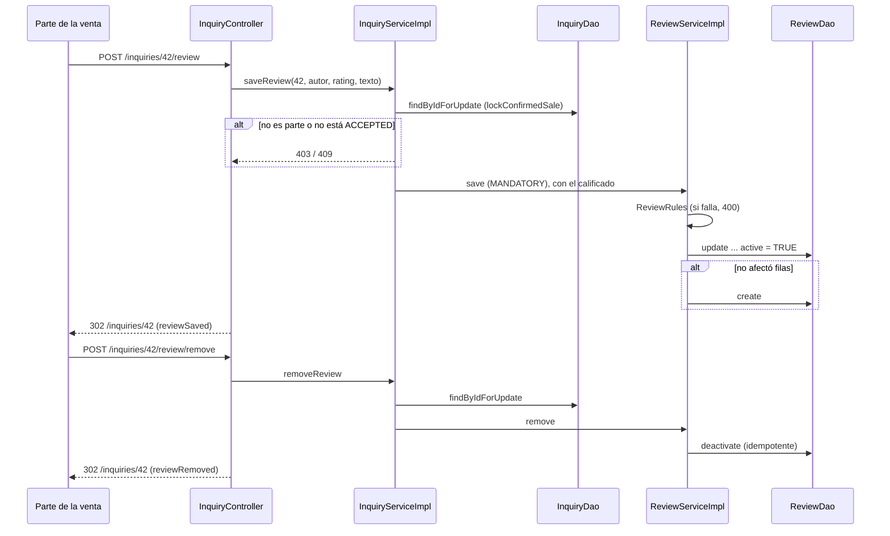

@title: Reviews flow
@categories: Flows, Web, Services, Persistence
@files: webapp/src/main/java/ar/edu/itba/paw/webapp/controller/InquiryController.java, models/src/main/java/ar/edu/itba/paw/models/ReviewPage.java, models/src/main/java/ar/edu/itba/paw/models/ReviewSubjectRole.java, webapp/src/main/webapp/WEB-INF/tags/review-content.tag, webapp/src/main/webapp/WEB-INF/tags/rating.tag, webapp/src/main/webapp/js/sale-detail.js, webapp/src/main/java/ar/edu/itba/paw/webapp/form/ReviewForm.java, services/src/main/java/ar/edu/itba/paw/services/InquiryServiceImpl.java, services/src/main/java/ar/edu/itba/paw/services/ReviewServiceImpl.java, services-contracts/src/main/java/ar/edu/itba/paw/services/ReviewService.java, models/src/main/java/ar/edu/itba/paw/models/Review.java, models/src/main/java/ar/edu/itba/paw/models/ReviewRules.java, models/src/main/java/ar/edu/itba/paw/models/ReviewStats.java, persistence-contracts/src/main/java/ar/edu/itba/paw/persistence/ReviewDao.java, persistence/src/main/java/ar/edu/itba/paw/persistence/ReviewJdbcDao.java, persistence/src/main/resources/db/migration/V10__sale_reviews.sql, webapp/src/main/webapp/WEB-INF/tags/star-rating-input.tag

> [!summary] En una frase
> Después de una venta confirmada, comprador y publicante se califican entre sí de 1 a 5 con un comentario opcional; hay una reseña por persona y por venta, editable y removible, y el perfil público muestra el promedio y las reseñas separadas según si la persona era vendedora o compradora.

## Qué resuelve

Reputación entre Cuentas (PR #46). Se escribe desde la página de la venta y se lee en [[Public profile flow]]. El PR #57 separó la lectura por rol y la paginó; el #54 compactó el formulario en la página de la venta.

## Herramientas

| Herramienta | Para qué se usa acá |
|---|---|
| Bean Validation | [[ReviewForm]]: calificación obligatoria entre 1 y 5, comentario hasta 500 |
| [[ReviewRules]] (en `models`) | Las mismas reglas para formulario, vista y service |
| `@PreAuthorize("@inquiryAccess.isParty")` | Solo las partes de la consulta |
| `SELECT ... FOR UPDATE` sobre la consulta | Ordenar dos guardados o quitados de la misma parte |
| `Propagation.MANDATORY` | Que `ReviewService` no se pueda llamar fuera de la transacción de `InquiryService` |
| `UNIQUE (inquiry_id, author_id)` y dos `CHECK` | Una reseña por autor y venta, calificación válida, nadie se califica a sí mismo |
| Borrado lógico (`active`) | Quitar sin perder la fila |
| `AVG` y `COUNT` en SQL | Estadísticas del perfil público, por rol |
| `LIMIT ? OFFSET ?` y `Pagination` | Páginas de 10 reseñas |
| `
` de HTML | El formulario de la reseña se despliega sin JavaScript |

## Recorrido paso a paso

### Guardar: `POST /inquiries/{id}/review`

1. `VERIFIED`, `isParty` y CSRF.
2. El formulario vive dentro de un `
` que se abre con "Calificar" o "Editar". Con errores, la página se vuelve a dibujar con el `
` abierto y lo que se envió. "Cancelar" es un enlace a la propia venta: sin JavaScript recarga la página; con `sale-detail.js` resetea el formulario, cierra el `
` y devuelve el foco al botón.
3. `InquiryServiceImpl.saveReview` → `lockConfirmedSale`:
   - `findByIdForUpdate` bloquea la fila de la consulta.
   - Exige ser una de las partes (403) y que el estado sea `ACCEPTED`, es decir venta confirmada (409).
   - Devuelve a quién se califica: si el autor es el comprador, al publicante; si no, al comprador.
4. `ReviewServiceImpl.save` (propagación `MANDATORY`):
   - Normaliza el comentario y valida con [[ReviewRules]]; si no cumple, `InvalidReviewException` (400).
   - Primero intenta `UPDATE reviews SET rating, body, active = TRUE WHERE inquiry_id AND author_id`. Si afectó una fila, era una edición o una reseña quitada que vuelve.
   - Si no, inserta.
5. Redirección a la venta con el aviso `reviewSaved`.

### Quitar: `POST /inquiries/{id}/review/remove`

Mismo bloqueo y mismas reglas. `deactivate` es `UPDATE ... SET active = FALSE WHERE ... AND active = TRUE`: un segundo POST no encuentra nada y no es un error (idempotente).

### Leer

- En la venta: `findDetail` agrega la reseña vigente de quien mira para precargar el formulario.
- En el perfil público: `ReviewServiceImpl.findPageForUser(userId, role, page)` arma una [[ReviewPage]] para el rol pedido ([[ReviewSubjectRole]]):
  1. `statsBySubjectId(userId, role)`: cantidad y promedio de las activas **de ese rol**.
  2. `Pagination.pagesFor` con páginas de 10 y `offsetFor`, que da 404 si la página no existe.
  3. `findActiveBySubjectId(userId, role, 10, offset)`, las más nuevas primero, con el nombre y la foto del autor.
  4. Si se pidió una página mayor que 1 y volvió vacía (las reseñas cambiaron entre las dos lecturas), `PageNotFoundException`.
- El rol no se guarda en `reviews`: se deduce uniendo con la consulta. La persona calificada fue compradora si `i.buyer_id = r.subject_id`, y vendedora si `COALESCE(p.user_id, i.seller_id) = r.subject_id` (el `COALESCE` cubre ventas cuyo post se eliminó).

## Datos

{{file:persistence/src/main/resources/db/migration/V10__sale_reviews.sql}}

## Decisiones y por qué

| Decisión | Alternativa | Motivo | Fuente |
|---|---|---|---|
| Solo se califica una venta confirmada | Calificar cualquier consulta | La reseña habla de una transacción que ocurrió | Comentario en [[InquiryDetail]] |
| El punto de entrada es `InquiryService` | Exponer `ReviewService` al controller | La pertenencia y el estado son de la venta; `ReviewService` no valida permisos | Comentario en [[ReviewService]] |
| `MANDATORY` en `save` y `remove` | `REQUIRED` | Sin la transacción de afuera, el bloqueo de la consulta no protegería nada | Comentario en [[ReviewServiceImpl]] |
| Borrado lógico | `DELETE` | Una reseña quitada vuelve a ser la misma fila: el autor califica una sola vez por venta | Comentario en [[ReviewServiceImpl]] |
| Quitar es idempotente | Error si no había reseña | Un doble clic no tiene que fallar | Commit `896130f9`; comentario en [[InquiryServiceImpl]] |
| Actualizar primero, insertar después | Insertar y capturar la violación de unicidad | En PostgreSQL una violación deja la transacción inutilizable | Inferencia; mismo criterio que comenta [[ArtistJdbcDao]] |
| `CHECK (author_id <> subject_id)` | Solo validarlo en Java | La regla queda en el dato | Migración V10 |
| Promedio calculado en la consulta | Guardar un acumulado en `users` | Con el volumen actual alcanza, y no hay un dato duplicado que mantener | Inferencia |
| Reputación separada por rol | Un único promedio | Ser buen vendedor y ser buen comprador son cosas distintas. `ReviewSubjectRole` aclara que es el rol en la venta, no un permiso | Comentario en [[ReviewSubjectRole]]; commit `5d439ef4` |
| El rol se deduce con un `JOIN` | Una columna `role` en `reviews` | Sin migración: el dato ya está en la consulta | Inferencia; el PR #57 no agrega migraciones |

## Concurrencia y casos borde

- Dos guardados simultáneos del mismo autor: el bloqueo de la consulta los ordena; el segundo actualiza la fila que creó el primero.
- Guardar y quitar a la vez: quedan en el orden en que tomaron el bloqueo.
- Sin reseñas: `COALESCE(AVG(...), 0)` devuelve 0 y cantidad 0.
- Un `POST` que saltee el formulario con una calificación fuera de rango: 400 por el service, y además el `CHECK` de la base.

## Límites conocidos

- La reseña no dispara correo.
- No hay moderación ni respuesta a una reseña.
- [[ReviewServiceImplTest]] y [[ReviewJdbcDaoTest]] cubren reglas y SQL; el bloqueo real no tiene test.

## Preguntas de defensa

**¿Quién puede calificar a quién?**
Las dos partes de una venta confirmada, cada una a la otra, una vez por venta.

**¿Qué pasa si quito la reseña y vuelvo a calificar?**
Se reactiva la misma fila con los valores nuevos.

**¿Por qué `ReviewService` tiene `MANDATORY`?**
Porque depende del bloqueo que tomó `InquiryService`. Llamarlo sin transacción lanza una excepción en vez de correr sin protección.

**¿Cómo se calcula el promedio?**
`AVG(CAST(r.rating AS DECIMAL(10,2)))` sobre las reseñas activas de esa Cuenta en el rol elegido, en cada visita al perfil.

**¿Cómo saben si una reseña es como vendedor o como comprador si la tabla no lo guarda?**
Por la consulta de la venta: si la persona calificada es `i.buyer_id`, fue compradora; si es el dueño del post (o el `seller_id` copiado si el post se eliminó), vendedora.

## Evidencia de código

Entrada y bloqueo:

{{code:services/src/main/java/ar/edu/itba/paw/services/InquiryServiceImpl.java:413-444}}

Guardar y quitar:

{{code:services/src/main/java/ar/edu/itba/paw/services/ReviewServiceImpl.java:31-60}}

Página por rol:

{{code:services/src/main/java/ar/edu/itba/paw/services/ReviewServiceImpl.java:68-79}}

SQL:

{{code:persistence/src/main/java/ar/edu/itba/paw/persistence/ReviewJdbcDao.java:47-108}}

Endpoints:

{{code:webapp/src/main/java/ar/edu/itba/paw/webapp/controller/InquiryController.java:191-214}}
