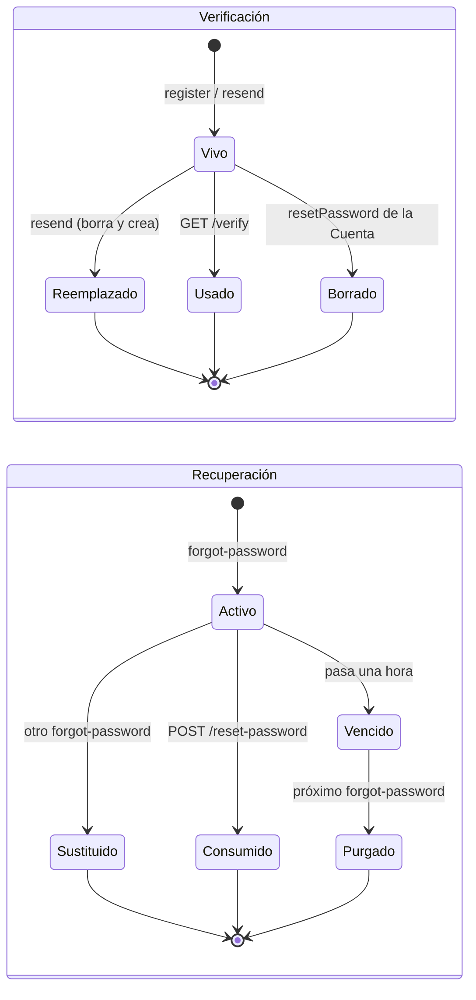

@title: Tokens and email links
@categories: Services, Persistence, Flows
@files: services/src/main/java/ar/edu/itba/paw/services/UserServiceImpl.java, models/src/main/java/ar/edu/itba/paw/models/EmailVerificationToken.java, models/src/main/java/ar/edu/itba/paw/models/PasswordResetToken.java, persistence-contracts/src/main/java/ar/edu/itba/paw/persistence/EmailVerificationTokenDao.java, persistence-contracts/src/main/java/ar/edu/itba/paw/persistence/PasswordResetTokenDao.java, persistence/src/main/java/ar/edu/itba/paw/persistence/EmailVerificationTokenJdbcDao.java, persistence/src/main/java/ar/edu/itba/paw/persistence/PasswordResetTokenJdbcDao.java, persistence/src/main/resources/db/migration/V1__esquema_inicial.sql, persistence/src/main/resources/db/migration/V6__cuenta_verificada.sql, services/src/main/java/ar/edu/itba/paw/services/EmailServiceImpl.java

> [!summary] En una frase
> Un token acá es una cadena aleatoria de 256 bits que el servidor guarda en una tabla y manda dentro de un enlace: quien presenta el enlace demuestra que lee esa casilla. No es un JWT ni lleva datos adentro.

En la defensa del sprint 2 se preguntó por "el token". En el proyecto hay cuatro cosas a las que se les puede decir así, y conviene separarlas antes de contestar.

| Nombre | Qué es | Dónde vive | Quién lo genera |
|---|---|---|---|
| Token de verificación | Cadena aleatoria que va en `/verify?token=` | Tabla `email_verification_tokens` | [[UserServiceImpl]] |
| Token de recuperación | Cadena aleatoria que va en `/reset-password?token=` | Tabla `password_reset_tokens` | [[UserServiceImpl]] |
| Id de sesión | Valor de la cookie `JSESSIONID` | Memoria del contenedor (la `HttpSession`) | El contenedor de servlets |
| Token CSRF | Campo oculto `_csrf` de cada formulario POST | Atributo de la sesión HTTP | Spring Security |

Los dos primeros son código del equipo y son el tema de esta nota. Los otros dos son del framework y están en [[Security and authorization]].

## Herramientas

| Herramienta | Para qué |
|---|---|
| `java.security.SecureRandom` | Fuente de aleatoriedad criptográfica para los 32 bytes |
| `Base64.getUrlEncoder().withoutPadding()` | Pasar los bytes a texto que entra en una URL sin escapar (`A-Z a-z 0-9 - _`) |
| Spring JDBC (`SimpleJdbcInsert`, `JdbcTemplate`) | Guardar, buscar y borrar tokens |
| Restricciones `UNIQUE` de PostgreSQL | Garantizar un token por valor y, en recuperación, uno por Cuenta |
| `@Transactional` | Que emitir o consumir un token sea atómico con el cambio de la Cuenta |
| `java.time.Duration` / `LocalDateTime` | Vencimiento del enlace de recuperación y tope de reenvío |

## Cómo se genera

`generateToken()` pide 32 bytes a `SecureRandom` y los codifica en Base64 para URL sin relleno. Son 256 bits de entropía y 43 caracteres de texto. La columna `token` es `VARCHAR(64)`, así que sobra lugar. No lleva el id de la Cuenta, ni fecha, ni firma: es opaco. Toda la información asociada (de quién es, cuándo se creó, cuándo vence) está en la fila de la tabla.

{{code:services/src/main/java/ar/edu/itba/paw/services/UserServiceImpl.java:36-45}}

{{code:services/src/main/java/ar/edu/itba/paw/services/UserServiceImpl.java:354-358}}

El enlace lo arma [[EmailServiceImpl]] concatenando `app.base-url` con la ruta y el token. La URL base tiene que ser absoluta y viene de configuración porque el envío corre en un hilo sin request (ver [[Mail delivery]]).

## Los dos tokens, lado a lado

| | Verificación | Recuperación |
|---|---|---|
| Tabla | `email_verification_tokens` | `password_reset_tokens` |
| Columnas | `id`, `user_id`, `token`, `created_at` | `id`, `user_id`, `token`, `expires_at` |
| Qué demuestra | Que la persona lee esa casilla | Lo mismo, y además autoriza a cambiar la clave |
| Quién lo dispara | `register`, `resendVerification` | `requestPasswordReset` |
| Vence | No | A la hora (`RESET_TOKEN_TTL`) |
| Cuántos vivos por Cuenta | A lo sumo uno, por borrar antes de crear. El esquema no lo impide | Exactamente uno: `UNIQUE (user_id)` |
| Se consume con | `verifyEmail`: `markVerified` condicional y `deleteByUserId` | `resetPassword`: `deleteByToken` que tiene que afectar una fila |
| Se invalida además cuando | Se pide otro; se completa una recuperación de contraseña | Se pide otro; vence |
| Limpieza de viejos | No hace falta: no se acumulan | `deleteExpired(now)` en cada pedido nuevo, de cualquier Cuenta |
| Freno al abuso | Un minuto entre reenvíos (`RESEND_COOLDOWN`), con la fila de la Cuenta bloqueada | Un enlace por Cuenta; el pedido responde igual exista o no la Cuenta |
| Inicia sesión | No | No: después hay que loguearse con la clave nueva |
| Efecto sobre sesiones | Refresca el principal si es la misma Cuenta | Cierra todas las sesiones de la Cuenta |

## Ciclo de vida

En los dos casos "usado" significa que la fila se borra: no hay columna `used`. Un enlace usado y uno inexistente son indistinguibles, y la pantalla muestra el mismo mensaje.

## Esquema

Tablas originales, de la migración V1:

{{code:persistence/src/main/resources/db/migration/V1__esquema_inicial.sql:21-37}}

La fecha del enlace de verificación llegó en V6, junto con el cambio de nombre de `enabled` a `verified`:

{{code:persistence/src/main/resources/db/migration/V6__cuenta_verificada.sql:1-9}}

## Decisiones y por qué

| Decisión | Alternativa | Motivo | Fuente |
|---|---|---|---|
| Token opaco guardado en la base | JWT firmado sin estado | Se necesita un solo uso y poder invalidarlo al pedir otro; con estado en la base eso es un `DELETE` | Inferencia a partir del diseño; el código no menciona JWT |
| 32 bytes de `SecureRandom` | UUID o un contador | Que adivinar un enlace por fuerza bruta no sea viable | Comentario en [[UserServiceImpl]] |
| El de recuperación vence a la hora y el de verificación no | Vencimiento en los dos | El de recuperación abre una Cuenta que ya está en uso: se acota la ventana si el correo queda expuesto. El vencimiento de verificación quedó explícitamente fuera de alcance | Comentario en [[UserServiceImpl]]; "Out of Scope" del issue del sprint 2 |
| El vencimiento lo calcula el service | `DEFAULT now() + interval` en la tabla | La ventana es una regla de negocio, no del almacenamiento | Comentario en [[PasswordResetTokenJdbcDao]] |
| `UNIQUE (user_id)` en recuperación | Solo borrar antes de insertar | Dos pedidos simultáneos borran cero filas cada uno y llegarían los dos al insert; la restricción hace perder a uno | Comentario en [[UserServiceImpl]] |
| Consumir con `DELETE` y exigir una fila afectada | Leer, usar y borrar al final | Dos requests con el mismo token no pueden pisarse la clave | Comentario en [[UserServiceImpl]] |
| Rechazar "misma clave" antes de consumir el enlace | Consumir primero | Quien elige la clave que ya tenía puede reintentar con el mismo correo | Comentario en [[UserServiceImpl]] |
| La recuperación también verifica la Cuenta | Exigir verificación aparte | El enlace llegó al correo: demuestra lo mismo que el de verificación | Comentario en [[UserServiceImpl]] |
| Guardar el token en claro | Guardar solo su hash | El commit `a8468071` (16/9) quitó el SHA-256 que tenía el token de verificación para simplificar el flujo | Historial de Git |

## Concurrencia

- **Dos `forgot-password` a la vez para la misma Cuenta**: el segundo insert viola `UNIQUE (user_id)`, se captura `DuplicateKeyException` y ese pedido termina sin mandar nada. Queda un enlace y un correo.
- **Dos `reset-password` con el mismo token**: el primero borra la fila; el segundo ve cero filas afectadas y devuelve "enlace inválido".
- **Dos `verify` con el mismo token**: el `UPDATE ... AND verified = FALSE` afecta filas una sola vez; la bienvenida sale una vez.
- **Dos reenvíos a la vez**: `lockById` bloquea la fila de la Cuenta y los ordena.

## Límites conocidos

- **Token en claro en la base.** Quien lea la tabla puede usar un enlace de recuperación vigente (a lo sumo una hora) o verificar una Cuenta ajena. Guardar el hash lo evitaría.
- **El token viaja en la URL.** Queda en el historial del navegador y puede aparecer en logs de proxies. El de recuperación es de un solo uso y vence; el formulario lo reenvía como campo oculto escapado con `c:out`.
- **La verificación es un `GET` que cambia estado.** Un cliente de correo que precargue enlaces podría verificar la Cuenta sin que la persona haga clic. El efecto es acotado: solo marca el correo como verificado.
- **Sin tope a los pedidos de recuperación.** Cada pedido reemplaza el enlace y manda un correo; no hay un minuto de espera como en el reenvío de verificación.
- **`LocalDateTime` sin zona.** El vencimiento se compara contra el reloj del servidor de aplicación.
- La limpieza de vencidos depende de que alguien pida una recuperación; no hay tarea programada.

Los primeros cuatro puntos son análisis sobre el código leído, no fallas observadas en ejecución.

## Preguntas de defensa

**¿El token es un JWT?**
No. Es un valor aleatorio sin contenido. El servidor lo busca en una tabla para saber de quién es.

**¿Qué pasa si pido dos enlaces de verificación?**
El segundo borra al primero: solo sirve el último. Y si pasó menos de un minuto no se manda otro.

**¿Por qué el de recuperación vence y el de verificación no?**
Porque el de recuperación permite cambiar la clave de una Cuenta en uso. El de verificación solo marca el correo como verificado, y su vencimiento se dejó fuera de alcance.

**¿Se puede usar dos veces un enlace de recuperación?**
No. Se borra dentro de la misma transacción que cambia la clave, y el borrado tiene que afectar exactamente una fila.

**¿Cómo evitan que el formulario de "olvidé mi contraseña" revele qué correos existen?**
El controller redirige siempre al mismo lugar. El service decide en silencio si manda algo, y loguea sin el correo.

**¿Qué pasa con las sesiones abiertas cuando se cambia la clave?**
Se expiran todas las de esa Cuenta a través del `SessionRegistry`, y la del navegador actual se cierra.

**¿Dónde se arma la URL del enlace?**
En [[EmailServiceImpl]], con `app.base-url` de `mail.properties`. Tiene que incluir el context path del servidor de la cátedra.

## Evidencia de código

Emisión del token de verificación:

{{code:services/src/main/java/ar/edu/itba/paw/services/UserServiceImpl.java:213-222}}

Emisión del token de recuperación:

{{code:services/src/main/java/ar/edu/itba/paw/services/UserServiceImpl.java:260-292}}

Consumo del token de recuperación:

{{code:services/src/main/java/ar/edu/itba/paw/services/UserServiceImpl.java:294-328}}

DAO de recuperación:

{{code:persistence/src/main/java/ar/edu/itba/paw/persistence/PasswordResetTokenJdbcDao.java:46-85}}

DAO de verificación:

{{code:persistence/src/main/java/ar/edu/itba/paw/persistence/EmailVerificationTokenJdbcDao.java:43-74}}

Armado de los enlaces:

{{code:services/src/main/java/ar/edu/itba/paw/services/EmailServiceImpl.java:74-89}}
