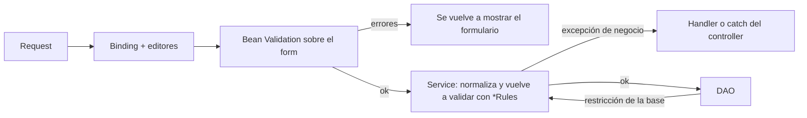

@title: Validation and errors
@categories: Web, Services
@files: webapp/src/main/java/ar/edu/itba/paw/webapp/controller/ErrorResponseAdvice.java, webapp/src/main/java/ar/edu/itba/paw/webapp/controller/CartExceptionAdvice.java, webapp/src/main/java/ar/edu/itba/paw/webapp/controller/ErrorController.java, webapp/src/main/java/ar/edu/itba/paw/webapp/security/MultipartExceptionHandlerFilter.java, webapp/src/main/java/ar/edu/itba/paw/webapp/security/VerificationAccessDeniedHandler.java, webapp/src/main/java/ar/edu/itba/paw/webapp/validation/MatchingPasswordsValidator.java, webapp/src/main/java/ar/edu/itba/paw/webapp/validation/PublishFormValidator.java, webapp/src/main/java/ar/edu/itba/paw/webapp/form/RegisterForm.java, webapp/src/main/webapp/WEB-INF/web.xml

> [!summary] En una frase
> La entrada se valida dos veces con las mismas reglas (en el formulario para mostrar el error junto al campo, en el service como garantía) y cada rechazo de negocio es una excepción que la capa web traduce a un error de campo, una redirección con aviso o una página 400, 403, 404 o 409.

## Herramientas

| Herramienta | Para qué |
|---|---|
| Bean Validation 2.0 + Hibernate Validator 6.2 | Anotaciones sobre los formularios (`@NotBlank`, `@Size`, `@Email`, ...) |
| `@Valid` + `BindingResult` | Ejecutar la validación al ligar el formulario y recibir los errores sin excepción |
| `ConstraintValidator` propios | Reglas que cruzan campos o dependen de archivos |
| Clases `*Rules` en `models` | La regla en un solo lugar, usada por el formulario y por el service |
| `@InitBinder` + editores | Normalizar el texto antes de validar (recortar, unificar saltos de línea, ignorar enums inválidos) |
| `@ControllerAdvice` + `@ExceptionHandler` | Traducir excepciones de negocio a respuestas HTTP |
| `<error-page>` en `web.xml` | El 404 de rutas que ningún controller atiende |
| `<form:errors>` y `MessageSource` | Mostrar cada error en el idioma del request |

## Validación en tres capas

1. **Formulario.** Las anotaciones cubren lo que se ve en un campo: obligatorio, largo, formato. Los validadores de clase cubren lo que cruza campos.
2. **Service.** Vuelve a aplicar la regla con la misma clase `*Rules`. El formulario es una cortesía con quien usa el sitio; el service no confía en que la llamada haya pasado por él. Además aplica lo que el formulario no puede saber: estado actual, pertenencia, topes.
3. **Base.** Las restricciones (`UNIQUE`, `CHECK`, FK) son la última barrera para lo que dos pedidos simultáneos podrían romper ([[Database schema]]).

## Validadores propios

| Anotación | Validador | Qué controla |
|---|---|---|
| `@ValidPassword` | Compuesta, sin validador propio: `@NotBlank` + `@Size(min = 12, max = 72)` + dos `@Pattern` | Contraseña de 12 a 72 caracteres con al menos una letra y un número, definida una sola vez. 72 es el tope de BCrypt |
| `@MatchingPasswords` | [[MatchingPasswordsValidator]] | Que contraseña y repetición coincidan; el formulario implementa [[PasswordsMatching]] |
| `@ValidPublishForm` | [[PublishFormValidator]] | Años, precio, fotos: usa [[VinylInputRules]] e [[ImageRules]] |
| `@ValidCatalogFilters` | [[CatalogFilterValidator]] | Rango de precios y de años coherentes |
| `@ValidShippingAddress` | [[ShippingAddressValidator]] | O se elige una dirección guardada, o se completa una nueva entera. Compartido por contacto y carrito |
| `@ValidPaymentForm` | [[PaymentFormValidator]] | CBU y alias, con [[PaymentInfoRules]] |
| `@ValidReceipt` | [[ReceiptValidator]] | Que haya archivo y sea de un tipo y tamaño aceptados, con [[ReceiptRules]] |
| `@ValidAvatarForm` | [[AvatarFormValidator]] | Foto de perfil, con [[ImageRules]] |

Los validadores de clase agregan el error **al campo** que corresponde (`addPropertyNode`), no a la clase, para que `<form:errors path="...">` lo muestre al lado.

## Editores de binding

| Editor | Dónde | Efecto |
|---|---|---|
| `StringTrimmerEditor(true)` | Perfil, contacto, carrito, mensajes, reseñas | Recorta y convierte el texto vacío en `null` |
| `StringTrimmerEditor(false)` | Correo y nombre al registrarse o recuperar | Recorta, sin convertir en `null` |
| [[LineBreakNormalizingEditor]] | Mensaje de contacto y cuerpo de mensajes y reseñas | Unifica `\r\n` en `\n`, para que el largo que cuenta el servidor coincida con el del navegador |
| Editor que ignora inválidos | Filtros del catálogo | Un valor de enum o número mal formado en la URL se descarta en vez de dar 400 |

## De la excepción a la respuesta

| Excepción | Quién la traduce | Respuesta |
|---|---|---|
| `PostNotFoundException`, `InquiryNotFoundException`, `UserNotFoundException`, `PageNotFoundException`, `AddressNotFoundException`, `ReceiptNotFoundException` | [[ErrorResponseAdvice]] | 404 con `error/404` |
| `ForbiddenOperationException` | [[ErrorResponseAdvice]] | 403 con `error/403` |
| `InvalidImageException`, `InvalidReviewException`, parámetro con tipo inválido | [[ErrorResponseAdvice]] | 400 con `error/400` |
| `InvalidSearchQueryException` | [[LandingController]] | 400 |
| `InvalidInquiryStateException` | [[InquiryController]] | 409 con `error/409` |
| `PostUnavailableException` | [[PostContactController]], [[PublishController]] | 409 |
| `ImageNotFoundException` | [[ImageController]] | 404 sin cuerpo |
| `MissingPaymentInfoException` | [[InquiryController]] | Redirección al perfil, sección de cobro |
| `AddressLimitExceededException` | [[ProfileController]], [[CartExceptionAdvice]], `catch` en contacto | Redirección o formulario con aviso |
| `OpenInquiryExistsException` | [[PostContactController]], [[CartExceptionAdvice]] | Redirección a la consulta ya abierta, con aviso |
| `CartAddRejectedException`, `NothingToSendException` | [[CartExceptionAdvice]] | Redirección con aviso |
| `DuplicateUserException`, `UnchangedPasswordException`, `InvalidCurrentPasswordException`, `PaymentInfoRequiredException`, `DuplicatePostException`, `ConcurrentPublishException`, `InvalidMessageException`, `InvalidReceiptException` | `catch` en el controller | Error de campo o global en el mismo formulario |
| Acceso denegado por Spring Security | [[VerificationAccessDeniedHandler]] | Pantalla de verificación pendiente o 403 ([[Security and authorization]]) |
| Archivo que supera el tope del resolver | [[MultipartExceptionHandlerFilter]] | Redirección a la página de origen con aviso |
| Ruta sin controller | `<error-page>` → [[ErrorController]] | 404 |

Tres criterios ordenan la tabla:

- Si la persona puede **corregir y reintentar**, el error vuelve al formulario con lo que ya escribió.
- Si el recurso **no existe o no es suyo**, la respuesta es una página de error con el código correcto.
- Si **llegó tarde** (otro reservó, la conversación se cerró), es un 409: el pedido era válido pero el estado cambió.

`ErrorResponseAdvice` centraliza los casos comunes; los handlers dentro de un controller existen cuando la respuesta depende del contexto de esa pantalla. Un `@ExceptionHandler` local tiene prioridad sobre uno de un `@ControllerAdvice`.

## Decisiones y por qué

| Decisión | Motivo | Fuente |
|---|---|---|
| Reglas compartidas en `models` | Evitar que el formulario y el service diverjan | Commits `435733bc` y `3bef5983` |
| El service revalida | Un pedido armado a mano saltea el formulario | Inferencia sobre la estructura; regla de capas de `CLAUDE.md` |
| 403 y 404 centralizados | Observación de la cátedra en el sprint 2: un solo criterio | `docs/issues/observaciones-sprint-2/` y commit `0870c81d` |
| 404 (no 403) cuando el recurso no es de quien pregunta | No revelar que existe | Comportamiento de los `*AccessHandler` ([[Security and authorization]]) |
| El tope de archivo se maneja en un filtro | El error ocurre al leer el multipart, antes de llegar a un controller | Comentarios en [[MultipartExceptionHandlerFilter]] |
| Validación del correo solo en el servidor | Evitar dos criterios distintos entre navegador y servidor | Commit `1f3c858c` |

## Límites conocidos

- `InvalidPostDataException` e `InvalidPaymentInfoException` no tienen handler: solo se alcanzan salteando el formulario, y en ese caso la respuesta sería un 500.
- No hay página propia para el 500.
- El comentario de [[ReceiptValidator]] menciona un tope de 6 MB en el resolver; el valor real es 26 MiB ([[Known gaps and document drift]]).

## Preguntas de defensa

**¿Dónde validan?**
En el formulario con Bean Validation y otra vez en el service con las mismas clases de reglas; la base tiene restricciones para lo que puede romperse por concurrencia.

**¿Por qué validar dos veces?**
El formulario da el mensaje junto al campo; el service garantiza la regla aunque el pedido no venga del formulario.

**¿Cómo validan que dos contraseñas coincidan?**
Con una anotación de clase, `@MatchingPasswords`, cuyo validador compara los dos campos y agrega el error en la repetición.

**¿Cómo deciden entre 403 y 404?**
403 cuando la cuenta no tiene permiso para una acción sobre algo que puede ver; 404 cuando el recurso no existe o no le pertenece.

**¿Qué pasa si suben un archivo enorme?**
El resolver lanza la excepción al leer el multipart; un filtro la atrapa y redirige a la página de origen con un aviso.

## Evidencia de código

### Handlers globales

{{file:webapp/src/main/java/ar/edu/itba/paw/webapp/controller/ErrorResponseAdvice.java}}

### Validador de clase

{{file:webapp/src/main/java/ar/edu/itba/paw/webapp/validation/MatchingPasswordsValidator.java}}

### Filtro para archivos demasiado grandes

{{file:webapp/src/main/java/ar/edu/itba/paw/webapp/security/MultipartExceptionHandlerFilter.java}}
