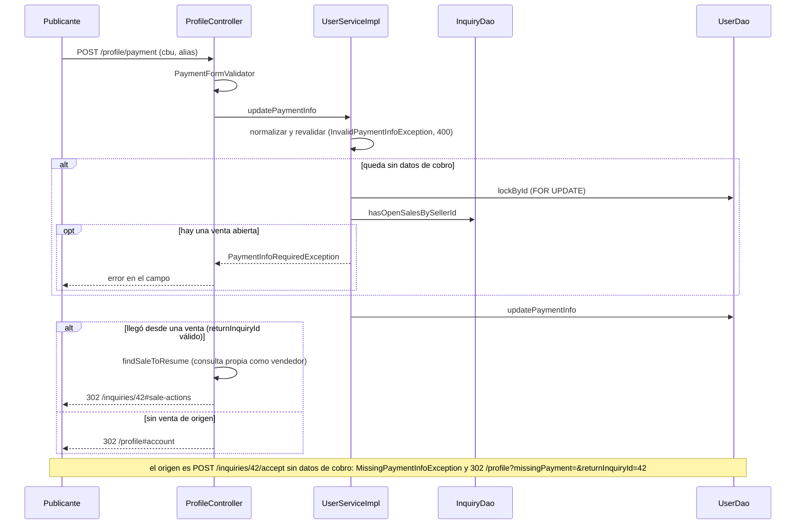

# Addresses and payment flow

> [!summary] En una frase
> Desde el perfil una Cuenta carga cómo cobra (CBU o CVU y alias) y hasta tres direcciones de envío; sin datos de cobro no puede aceptar una consulta, y una dirección nunca se borra: se archiva.

## Qué resuelve

Los dos datos que necesita una venta sin pasarela: a dónde transferir y a dónde enviar. PR #40 (perfil) y #44 (dirección en la consulta). El PR #55 agregó la vuelta a la venta cuando el vendedor llega al perfil desde "Aceptar".

## Herramientas

| Herramienta | Para qué se usa acá |
|---|---|
| Bean Validation con validador de clase | [[PaymentFormValidator]]: los dos campos son opcionales, pero si vienen tienen que ser válidos |
| [[PaymentInfoRules]] (en `models`) | Formato de alias y dígitos verificadores del CBU, compartidos por formulario y service |
| `@PreAuthorize("@addressAccess.isOwner")` | Editar y eliminar solo direcciones propias |
| `SELECT ... FOR UPDATE` sobre la Cuenta | Serializar altas de direcciones y el vaciado de datos de cobro |
| `UPDATE ... WHERE archived = FALSE` | Baja lógica con guarda |
| Enum [[Province]] | Las 24 jurisdicciones; el nombre visible sale de i18n |

## Datos de cobro

### `POST /profile/payment`

1. Binder: recorta y convierte vacíos en `null`.
2. [[PaymentFormValidator]] normaliza igual que el service y valida:
   - CBU o CVU: 22 dígitos; dos bloques (8 y 14) cerrados cada uno por un dígito verificador calculado con pesos fijos.
   - Alias: de 6 a 20 caracteres, letras, números, punto y guion.
3. `UserServiceImpl.updatePaymentInfo`:
   - Normaliza (el CBU sin espacios) y vuelve a validar; si no cumple, `InvalidPaymentInfoException`, que [[ErrorResponseAdvice]] responde con 400 desde el PR #62. Solo pasa si el POST salteó [[PaymentForm]].
   - Si el resultado deja la Cuenta **sin** datos de cobro: bloquea la fila de la Cuenta y pregunta `hasOpenSalesBySellerId`. Con una venta abierta lanza `PaymentInfoRequiredException` y el controller muestra el error en el campo.
   - Actualiza `users.cbu` y `users.alias`.
4. Controller: sin venta a la que volver, aviso `paymentUpdated` y `302 /profile#account`. Con `returnInquiryId` (ver abajo), vuelve a la venta.

### Dónde se exigen

`InquiryServiceImpl.accept` lee los datos de cobro de la fila bloqueada de la Cuenta. Alcanza con uno de los dos (`PaymentInfo.isPresent`). Si no hay, lanza `MissingPaymentInfoException` y [[InquiryController]] la atrapa en el propio endpoint: redirige a `/profile?missingPayment=&returnInquiryId={id}#account`.

### Volver a la venta

1. `GET /profile` recibe `returnInquiryId` como texto. `paymentReturnId` lo convierte y pregunta a `inquiryService.findSaleToResume(id, userId)`, que devuelve el id solo si la consulta existe y quien mira es su vendedor. Un valor mal formado o ajeno se descarta: el perfil abre igual, sin regreso.
2. La vista lo manda de vuelta como campo oculto del formulario de cobro.
3. `POST /profile/payment` repite la misma resolución. Si hay destino:
   - Con errores de validación o `PaymentInfoRequiredException`, vuelve a dibujar el perfil conservando el destino.
   - Si se guardó pero la Cuenta sigue sin datos (los dos campos vacíos), muestra el aviso `paymentMissing` y no redirige.
   - Si quedaron datos, aviso flash `inquiry.sale.payment.updated` y `302 /inquiries/{id}#sale-actions`. La consulta sigue `PENDING`: el vendedor tiene que volver a tocar "Aceptar".



## Direcciones

| Acción | Endpoint | Qué hace |
|---|---|---|
| Alta | `POST /profile/addresses` | Bloquea la Cuenta, cuenta las activas y crea si hay menos de 3 |
| Edición | `POST /profile/addresses/{id}/edit` | Archiva la anterior y crea una nueva (`replace`) |
| Baja | `POST /profile/addresses/{id}/delete` | Archiva (`archived = TRUE`) |
| Elegir al consultar | Formulario de [[Contact flow]] y envío del carrito ([[Cart flow]]) | Dirección guardada o nueva en la misma transacción |
| Leer para una pantalla | `findShippingOptions` | Una sola lectura devuelve las activas, la propuesta por defecto y si entra otra ([[ShippingOptions]]) |

- La pertenencia se chequea dos veces: `@addressAccess.isOwner` en el controller y `archiveOwned` en el service.
- `findActiveOwned` devuelve vacío si no existe, es de otra Cuenta o está archivada.
- Superar el tope lanza `AddressLimitExceededException`; el perfil redirige a `?addressLimit#addresses`.

## Datos

Las columnas `users.cbu`, `users.alias`, la tabla `addresses` y `inquiries.address_id` llegaron en V5 (ver [[Database schema]]).

## Decisiones y por qué

| Decisión | Alternativa | Motivo | Fuente |
|---|---|---|---|
| Editar una dirección archiva y crea otra | `UPDATE` de la fila | Las consultas que ya la usan conservan la original | Comentario en [[AddressService]] |
| Nunca se borra una dirección | `DELETE` | Una consulta puede seguir apuntándola (hay FK) | Migración V5 |
| Tope de 3 activas | Sin tope | Regla de producto; la hace cumplir `create()` | Constante en [[AddressService]] |
| `hasRoom` como única definición del tope, usada por la vista y por el alta | Que cada controller compare contra la constante | Los controllers repetían `addresses.size() < MAX`; el PR #48 lo llevó al service para que lista y cupo no puedan contradecirse | Comentario en [[AddressServiceImpl]]; commits `f918e28b`, `10ac1757` |
| Bloquear la Cuenta al dar de alta | Contar y crear sin bloqueo | Dos altas simultáneas pasarían las dos el conteo | Comentario en [[AddressServiceImpl]] |
| No se pueden vaciar los datos de cobro con una venta abierta | Permitirlo | El comprador se quedaría sin dónde transferir | Comentario en [[UserService]] |
| Vaciar y aceptar bloquean la misma fila | Chequeo sin bloqueo | Uno espera al otro y ve su resultado | Comentario en [[UserServiceImpl]] |
| `returnInquiryId` resuelto por el service | Redirigir a cualquier id recibido | Es contexto de navegación: se valida que la venta sea del vendedor y un valor inválido solo pierde el regreso | Comentarios en [[InquiryService]] y [[ProfileController]]; commits `25f95bc9`, `97f489b3` |
| `InquiryDao` directo en `UserServiceImpl` | Usar `InquiryService` | `InquiryService` ya depende de `UserService`: evitar el ciclo | Comentario en [[UserServiceImpl]] |
| `PaymentInfo` como objeto de valor con `NONE` | Dos `String` sueltos en `User` | `getPaymentInfo()` nunca es `null` | Comentario en [[User]]; commit `801f9aa1` |
| Validar el dígito verificador | Solo el largo | Atajar errores de tipeo antes de que alguien transfiera | Inferencia; la regla está en [[PaymentInfoRules]] |
| El service chequea la pertenencia además del `@PreAuthorize` | Confiar en el controller | "El service no confía en que todo llamador pase por el controller" | Comentario en [[AddressServiceImpl]] |

## Privacidad

- El publicante ve la dirección completa del comprador solo con una venta en curso o concretada; antes, ciudad y provincia (`withCityAndProvinceOnly`).
- El comprador ve los datos de cobro solo con la venta abierta.
- Ninguno de los dos viaja por correo.

## Límites conocidos

- `replace` archiva y crea sin bloquear la Cuenta; como libera un lugar antes de ocupar otro, el tope no se supera por esa vía.
- No se verifica que el CBU exista ni a nombre de quién está: solo su forma.
- [[AddressServiceImplTest]] y [[AddressJdbcDaoTest]] cubren las reglas; no hay test de la capa web.

## Preguntas de defensa

**¿Por qué no se edita la dirección directamente?**
Porque una consulta ya enviada apunta a esa fila. Si se editara, cambiaría el domicilio de una venta en curso.

**¿Qué pasa si acepto una consulta sin tener CBU?**
La aplicación redirige al perfil con la fila de datos de cobro abierta y recuerda la venta en `returnInquiryId`. Al guardar, vuelve a esa venta. La consulta no cambia de estado: hay que aceptar de nuevo.

**¿Se puede usar `returnInquiryId` para saltar a una venta ajena?**
No. `findSaleToResume` solo devuelve el id si quien mira es el vendedor de esa consulta; si no, el parámetro se ignora. Y aunque se redirigiera, la página de la venta tiene su propio `@PreAuthorize`.

**¿Cómo validan un CBU?**
22 dígitos y dos dígitos verificadores, uno por bloque, calculados con pesos fijos.

**¿Qué impide tener cuatro direcciones si mando dos altas a la vez?**
El bloqueo de la fila de la Cuenta: la segunda alta espera y cuenta después.

## Evidencia de código

Datos de cobro en el service:

Fuente exacta en `c3e2a4c`: [services/src/main/java/ar/edu/itba/paw/services/UserServiceImpl.java](</Users/bautistapessagno/Desktop/proyectos_itba/PAW/paw2026b/services/src/main/java/ar/edu/itba/paw/services/UserServiceImpl.java>), líneas 330–352.

```java
    @Override
    @Transactional
    public User updatePaymentInfo(final long id, final String cbu, final String alias) {
        final PaymentInfo paymentInfo = new PaymentInfo(PaymentInfoRules.normalizeCbu(cbu),
                PaymentInfoRules.normalizeAlias(alias));
        if ((paymentInfo.getCbu() != null && !PaymentInfoRules.isValidCbu(paymentInfo.getCbu()))
                || (paymentInfo.getAlias() != null && !PaymentInfoRules.isValidAlias(paymentInfo.getAlias()))) {
            throw new InvalidPaymentInfoException();
        }
        // Vaciar los datos bloquea la cuenta antes de buscar ventas abiertas: accept() lee el
        // CBU de esa misma fila bloqueada, asi que un Aceptar en paralelo espera a que esto
        // termine (y ve los datos vacios) o termina antes (y aca se ve su venta abierta).
        if (!paymentInfo.isPresent()) {
            lockById(id);
            if (inquiryDao.hasOpenSalesBySellerId(id)) {
                throw new PaymentInfoRequiredException();
            }
        }
        final User user = userDao.updatePaymentInfo(id, paymentInfo)
                .orElseThrow(UserNotFoundException::new);
        LOGGER.info("Updated payment info userId={}", id);
        return user;
    }
```

Reglas del CBU y del alias:

Fuente exacta en `c3e2a4c`: [models/src/main/java/ar/edu/itba/paw/models/PaymentInfoRules.java](</Users/bautistapessagno/Desktop/proyectos_itba/PAW/paw2026b/models/src/main/java/ar/edu/itba/paw/models/PaymentInfoRules.java>), líneas 5–56.

```java
// Formato de los datos de cobro, compartido por el formulario del perfil y por UserService.
public final class PaymentInfoRules {

    public static final int CBU_LENGTH = 22;
    public static final int ALIAS_MIN_LENGTH = 6;
    public static final int ALIAS_MAX_LENGTH = 20;

    private static final Pattern ALIAS_PATTERN =
            Pattern.compile("[A-Za-z0-9.-]{" + ALIAS_MIN_LENGTH + "," + ALIAS_MAX_LENGTH + "}");
    // CBU y CVU comparten formato: un bloque de 8 digitos (entidad y sucursal) y otro de 14
    // (cuenta), cada uno cerrado por un digito verificador con estos pesos.
    private static final int FIRST_BLOCK_LENGTH = 8;
    private static final int[] FIRST_BLOCK_WEIGHTS = {7, 1, 3, 9, 7, 1, 3};
    private static final int[] SECOND_BLOCK_WEIGHTS = {3, 9, 7, 1, 3, 9, 7, 1, 3, 9, 7, 1, 3};
    private static final int BASE = 10;

    private PaymentInfoRules() {
    }

    // El CBU se tipea en bloques: se descartan los espacios. Vacio queda en null.
    public static String normalizeCbu(final String cbu) {
        return blankToNull(cbu == null ? null : cbu.replaceAll("\\s", ""));
    }

    public static String normalizeAlias(final String alias) {
        return blankToNull(alias == null ? null : alias.trim());
    }

    public static boolean isValidCbu(final String cbu) {
        if (cbu == null || cbu.length() != CBU_LENGTH || !cbu.chars().allMatch(c -> c >= '0' && c <= '9')) {
            return false;
        }
        return hasValidCheckDigit(cbu.substring(0, FIRST_BLOCK_LENGTH), FIRST_BLOCK_WEIGHTS)
                && hasValidCheckDigit(cbu.substring(FIRST_BLOCK_LENGTH), SECOND_BLOCK_WEIGHTS);
    }

    public static boolean isValidAlias(final String alias) {
        return alias != null && ALIAS_PATTERN.matcher(alias).matches();
    }

    private static String blankToNull(final String value) {
        return value == null || value.isEmpty() ? null : value;
    }

    private static boolean hasValidCheckDigit(final String block, final int[] weights) {
        int sum = 0;
        for (int i = 0; i < weights.length; i++) {
            sum += (block.charAt(i) - '0') * weights[i];
        }
        return block.charAt(weights.length) - '0' == (BASE - sum % BASE) % BASE;
    }
}
```

Direcciones en el service:

Fuente exacta en `c3e2a4c`: [services/src/main/java/ar/edu/itba/paw/services/AddressServiceImpl.java](</Users/bautistapessagno/Desktop/proyectos_itba/PAW/paw2026b/services/src/main/java/ar/edu/itba/paw/services/AddressServiceImpl.java>), líneas 30–105.

```java
    @Override
    @Transactional(readOnly = true)
    public Optional<Address> findActiveOwned(final long addressId, final long userId) {
        return addressDao.findById(addressId)
                .filter(address -> address.getUserId() == userId && !address.isArchived());
    }

    @Override
    @Transactional(readOnly = true)
    public ShippingOptions findShippingOptions(final long userId) {
        final List<Address> addresses = addressDao.findActiveByUserId(userId);
        // findActiveByUserId ya viene de la mas nueva a la mas vieja: la primera es la propuesta. El
        // cupo se deriva de la misma lista, asi la lista y el cupo no pueden contradecirse.
        return new ShippingOptions(addresses, addresses.isEmpty() ? null : addresses.get(0),
                hasRoom(addresses.size()));
    }

    @Override
    @Transactional
    public Address create(final long userId, final String street, final String streetNumber,
                          final String apartment, final String city, final Province province,
                          final String postalCode, final String notes) {
        // Bloquear la cuenta serializa las altas simultaneas: la segunda espera y cuenta despues,
        // ya con la direccion de la primera.
        userService.lockById(userId);
        if (!hasRoom(addressDao.countActiveByUserId(userId))) {
            throw new AddressLimitExceededException();
        }
        final Address address = addressDao.create(userId, street, streetNumber, apartment, city, province,
                postalCode, notes);
        LOGGER.info("Created address addressId={} userId={}", address.getId(), userId);
        return address;
    }

    @Override
    @Transactional
    public Address replace(final long addressId, final long userId, final String street,
                           final String streetNumber, final String apartment, final String city,
                           final Province province, final String postalCode, final String notes) {
        archiveOwned(addressId, userId);
        final Address address = addressDao.create(userId, street, streetNumber, apartment, city, province,
                postalCode, notes);
        LOGGER.info("Replaced address oldId={} newId={} userId={}", addressId, address.getId(), userId);
        return address;
    }

    @Override
    @Transactional
    public void archive(final long addressId, final long userId) {
        archiveOwned(addressId, userId);
        LOGGER.info("Archived address addressId={} userId={}", addressId, userId);
    }

    @Override
    @Transactional(readOnly = true)
    public Optional<Address> findById(final long addressId) {
        return addressDao.findById(addressId);
    }

    // Unica definicion del tope: la usan la vista (findShippingOptions) y el alta (create).
    private static boolean hasRoom(final int activeCount) {
        return activeCount < MAX_ACTIVE_ADDRESSES;
    }

    // La pertenencia se chequea aca y no solo en el @PreAuthorize: el service no confia en
    // que todo llamador pase por el controller. El UPDATE condicional cubre la carrera con
    // otra baja de la misma direccion.
    private void archiveOwned(final long addressId, final long userId) {
        final Address address = addressDao.findById(addressId).orElseThrow(AddressNotFoundException::new);
        if (address.getUserId() != userId) {
            throw new ForbiddenOperationException();
        }
        if (!addressDao.archive(addressId)) {
            throw new AddressNotFoundException();
        }
    }
```

Endpoints de la libreta:

Fuente exacta en `c3e2a4c`: [webapp/src/main/java/ar/edu/itba/paw/webapp/controller/ProfileController.java](</Users/bautistapessagno/Desktop/proyectos_itba/PAW/paw2026b/webapp/src/main/java/ar/edu/itba/paw/webapp/controller/ProfileController.java>), líneas 180–278.

```java
    @RequestMapping(value = "/payment", method = RequestMethod.POST)
    public ModelAndView updatePayment(@AuthenticationPrincipal final AuthenticatedUser currentUser,
                                      @Valid @ModelAttribute("paymentForm") final PaymentForm form,
                                      final BindingResult bindingResult,
                                      @ModelAttribute("profileForm") final ProfileForm profileForm,
                                      @ModelAttribute("changePasswordForm") final ChangePasswordForm changePasswordForm,
                                      final RedirectAttributes redirectAttributes,
                                      @RequestParam(name = "returnInquiryId", required = false) final String returnInquiryId,
                                      @RequestParam(name = "page", defaultValue = "1") final int pageNumber) {
        profileForm.setUsername(currentUser.getDisplayName());
        final Long destination = paymentReturnId(returnInquiryId, currentUser.getId());
        if (bindingResult.hasErrors()) {
            return paymentView(currentUser.getId(), pageNumber, destination);
        }
        final User updatedUser;
        try {
            updatedUser = userService.updatePaymentInfo(currentUser.getId(), form.getCbu(), form.getAlias());
        } catch (final PaymentInfoRequiredException e) {
            bindingResult.rejectValue("cbu", "payment.required.openSale");
            return paymentView(currentUser.getId(), pageNumber, destination);
        }
        if (destination != null) {
            if (!updatedUser.hasPaymentInfo()) {
                final ModelAndView view = paymentView(currentUser.getId(), pageNumber, destination);
                view.addObject("paymentMissing", true);
                return view;
            }
            redirectAttributes.addFlashAttribute("saleNotice", "inquiry.sale.payment.updated");
            return new ModelAndView("redirect:/inquiries/" + destination + "#sale-actions");
        }
        redirectAttributes.addFlashAttribute("paymentUpdated", true);
        return new ModelAndView("redirect:/profile#account");
    }

    @RequestMapping(value = "/addresses", method = RequestMethod.POST)
    public ModelAndView createAddress(@AuthenticationPrincipal final AuthenticatedUser currentUser,
                                      @Valid @ModelAttribute("addressForm") final AddressForm form,
                                      final BindingResult bindingResult,
                                      @ModelAttribute("profileForm") final ProfileForm profileForm,
                                      @ModelAttribute("changePasswordForm") final ChangePasswordForm changePasswordForm,
                                      final RedirectAttributes redirectAttributes,
                                      @RequestParam(name = "page", defaultValue = "1") final int pageNumber) {
        profileForm.setUsername(currentUser.getDisplayName());
        if (bindingResult.hasErrors()) {
            return profileView(currentUser.getId(), OpenSection.ADDRESSES, pageNumber, null);
        }
        addressService.create(currentUser.getId(), form.getStreet(), form.getStreetNumber(), form.getApartment(),
                form.getCity(), form.getProvince(), form.getPostalCode(), form.getNotes());
        redirectAttributes.addFlashAttribute("addressSaved", true);
        return new ModelAndView("redirect:/profile#addresses");
    }

    @PreAuthorize("@addressAccess.isOwner(authentication, #addressId)")
    @RequestMapping(value = "/addresses/{addressId:[0-9]+}/edit", method = RequestMethod.POST)
    public ModelAndView editAddress(@PathVariable("addressId") final long addressId,
                                    @AuthenticationPrincipal final AuthenticatedUser currentUser,
                                    @Valid @ModelAttribute("addressForm") final AddressForm form,
                                    final BindingResult bindingResult,
                                    @ModelAttribute("profileForm") final ProfileForm profileForm,
                                    @ModelAttribute("changePasswordForm") final ChangePasswordForm changePasswordForm,
                                    final RedirectAttributes redirectAttributes,
                                    @RequestParam(name = "page", defaultValue = "1") final int pageNumber) {
        profileForm.setUsername(currentUser.getDisplayName());
        if (bindingResult.hasErrors()) {
            return profileView(currentUser.getId(), OpenSection.ADDRESSES, pageNumber, addressId);
        }
        addressService.replace(addressId, currentUser.getId(), form.getStreet(), form.getStreetNumber(),
                form.getApartment(), form.getCity(), form.getProvince(), form.getPostalCode(), form.getNotes());
        redirectAttributes.addFlashAttribute("addressSaved", true);
        return new ModelAndView("redirect:/profile#addresses");
    }

    @PreAuthorize("@addressAccess.isOwner(authentication, #addressId)")
    @RequestMapping(value = "/addresses/{addressId:[0-9]+}/delete", method = RequestMethod.POST)
    public ModelAndView deleteAddress(@PathVariable("addressId") final long addressId,
                                      @AuthenticationPrincipal final AuthenticatedUser currentUser,
                                      final RedirectAttributes redirectAttributes) {
        addressService.archive(addressId, currentUser.getId());
        redirectAttributes.addFlashAttribute("addressDeleted", true);
        return new ModelAndView("redirect:/profile#addresses");
    }

    private ModelAndView paymentView(final long userId, final int pageNumber, final Long returnInquiryId) {
        final ModelAndView view = profileView(userId, OpenSection.PAYMENT, pageNumber, null);
        view.addObject("returnInquiryId", returnInquiryId);
        return view;
    }

    // Un valor mal formado solo pierde el regreso a la venta: no debe impedir abrir el perfil.
    private Long paymentReturnId(final String value, final long userId) {
        if (value == null) {
            return null;
        }
        try {
            return inquiryService.findSaleToResume(Long.parseLong(value), userId).orElse(null);
        } catch (final NumberFormatException e) {
            return null;
        }
    }
```

Dirección parcial:

Fuente exacta en `c3e2a4c`: [models/src/main/java/ar/edu/itba/paw/models/Address.java](</Users/bautistapessagno/Desktop/proyectos_itba/PAW/paw2026b/models/src/main/java/ar/edu/itba/paw/models/Address.java>), líneas 71–79.

```java
    // Copia sin calle, altura, piso, codigo postal ni notas: lo que ve quien todavia no
    // tiene por que conocer el domicilio.
    public Address withCityAndProvinceOnly() {
        return new Address(id, userId, null, null, null, city, province, null, null, archived);
    }

    public boolean isCityAndProvinceOnly() {
        return street == null;
    }
```

## Archivos para seguir el flujo

- [webapp/src/main/java/ar/edu/itba/paw/webapp/controller/ProfileController.java](</Users/bautistapessagno/Desktop/proyectos_itba/PAW/paw2026b/webapp/src/main/java/ar/edu/itba/paw/webapp/controller/ProfileController.java>) · [[ProfileController]]
- [webapp/src/main/java/ar/edu/itba/paw/webapp/form/PaymentForm.java](</Users/bautistapessagno/Desktop/proyectos_itba/PAW/paw2026b/webapp/src/main/java/ar/edu/itba/paw/webapp/form/PaymentForm.java>) · [[PaymentForm]]
- [webapp/src/main/java/ar/edu/itba/paw/webapp/validation/PaymentFormValidator.java](</Users/bautistapessagno/Desktop/proyectos_itba/PAW/paw2026b/webapp/src/main/java/ar/edu/itba/paw/webapp/validation/PaymentFormValidator.java>) · [[PaymentFormValidator]]
- [webapp/src/main/java/ar/edu/itba/paw/webapp/form/AddressForm.java](</Users/bautistapessagno/Desktop/proyectos_itba/PAW/paw2026b/webapp/src/main/java/ar/edu/itba/paw/webapp/form/AddressForm.java>) · [[AddressForm]]
- [webapp/src/main/java/ar/edu/itba/paw/webapp/security/AddressAccessHandler.java](</Users/bautistapessagno/Desktop/proyectos_itba/PAW/paw2026b/webapp/src/main/java/ar/edu/itba/paw/webapp/security/AddressAccessHandler.java>) · [[AddressAccessHandler]]
- [services/src/main/java/ar/edu/itba/paw/services/UserServiceImpl.java](</Users/bautistapessagno/Desktop/proyectos_itba/PAW/paw2026b/services/src/main/java/ar/edu/itba/paw/services/UserServiceImpl.java>) · [[UserServiceImpl]]
- [services/src/main/java/ar/edu/itba/paw/services/AddressServiceImpl.java](</Users/bautistapessagno/Desktop/proyectos_itba/PAW/paw2026b/services/src/main/java/ar/edu/itba/paw/services/AddressServiceImpl.java>) · [[AddressServiceImpl]]
- [services-contracts/src/main/java/ar/edu/itba/paw/services/AddressService.java](</Users/bautistapessagno/Desktop/proyectos_itba/PAW/paw2026b/services-contracts/src/main/java/ar/edu/itba/paw/services/AddressService.java>) · [[AddressService]]
- [models/src/main/java/ar/edu/itba/paw/models/ShippingOptions.java](</Users/bautistapessagno/Desktop/proyectos_itba/PAW/paw2026b/models/src/main/java/ar/edu/itba/paw/models/ShippingOptions.java>) · [[ShippingOptions]]
- [models/src/main/java/ar/edu/itba/paw/models/PaymentInfo.java](</Users/bautistapessagno/Desktop/proyectos_itba/PAW/paw2026b/models/src/main/java/ar/edu/itba/paw/models/PaymentInfo.java>) · [[PaymentInfo]]
- [models/src/main/java/ar/edu/itba/paw/models/PaymentInfoRules.java](</Users/bautistapessagno/Desktop/proyectos_itba/PAW/paw2026b/models/src/main/java/ar/edu/itba/paw/models/PaymentInfoRules.java>) · [[PaymentInfoRules]]
- [models/src/main/java/ar/edu/itba/paw/models/Address.java](</Users/bautistapessagno/Desktop/proyectos_itba/PAW/paw2026b/models/src/main/java/ar/edu/itba/paw/models/Address.java>) · [[Address]]
- [models/src/main/java/ar/edu/itba/paw/models/Province.java](</Users/bautistapessagno/Desktop/proyectos_itba/PAW/paw2026b/models/src/main/java/ar/edu/itba/paw/models/Province.java>) · [[Province]]
- [persistence/src/main/java/ar/edu/itba/paw/persistence/AddressJdbcDao.java](</Users/bautistapessagno/Desktop/proyectos_itba/PAW/paw2026b/persistence/src/main/java/ar/edu/itba/paw/persistence/AddressJdbcDao.java>) · [[AddressJdbcDao]]
- [persistence/src/main/resources/db/migration/V5__venta_con_comprobante.sql](</Users/bautistapessagno/Desktop/proyectos_itba/PAW/paw2026b/persistence/src/main/resources/db/migration/V5__venta_con_comprobante.sql>)

Fuente inspeccionada: `c3e2a4c`, 2026-10-05. Es evidencia estática; no implica ejecución de la aplicación. [[Source inventory]] · [[Roadmap de lectura]]
