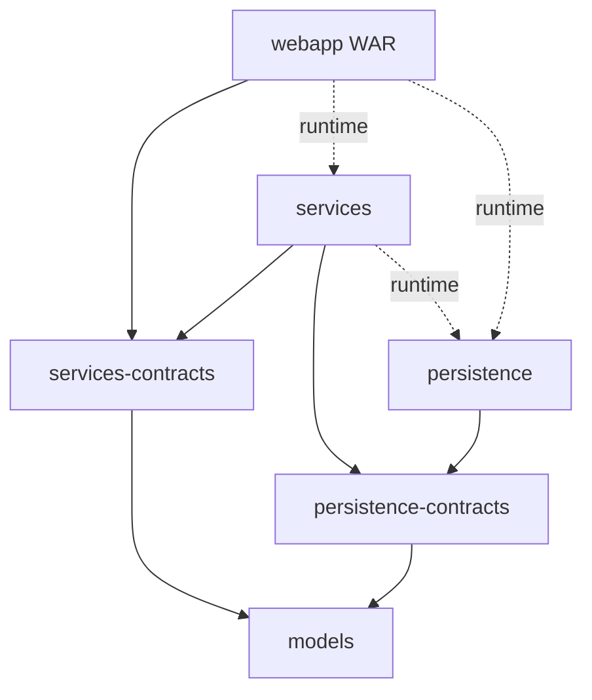

# Architecture

The module boundary separates interfaces from implementations. A controller receives a service interface through constructor injection. A service receives DAO interfaces and other services. JDBC implementations query the database and return immutable Java models. [[WebConfig]] assembles these objects at runtime.

Solid arrows are project compile dependencies; dashed arrows are runtime dependencies. External framework dependencies are listed in [[Build and dependencies]]. `runtime` packages the implementation without making it available to the consuming module's compiler. Shared package names across contract and implementation modules let the implementation implement its corresponding interface; they do not merge the modules.

| Module | Owns | Concrete connection |
|---|---|---|
| models | Domain values and joined read projections | [[Album]], [[Post]], [[PostSummary]] |
| persistence-contracts | DAO interfaces and duplicate-key marker | [[PostDao]] and [[DuplicatePostKeyException]] |
| persistence | JDBC queries, row mappers and startup schema resource | [[PostJdbcDao]] and [[Database schema]] |
| services-contracts | Business APIs, notification payload and business exceptions | [[PostService]], [[EmailService]] |
| services | Normalization, orchestration, transactions and mail rendering | [[PostServiceImpl]], [[EmailServiceImpl]] |
| webapp | HTTP binding, validation, views and composition | [[PublishController]], [[PublishForm]], [[WebConfig]] |

## What crosses each boundary

1. HTTP request fields become mutable form objects through Spring binding.
2. Controllers pass primitive/string form values plus optional cover byte[] and content type to service interfaces. They do not pass HttpServletRequest or BindingResult into business logic.
3. Services resolve identities and call DAO interfaces with normalized values.
4. DAOs bind SQL parameters and turn aliased columns into models using RowMapper.
5. Services return models or raise business exceptions.
6. Controllers add models to ModelAndView or translate errors; JSPs read JavaBean getters through expression language.

[[PostSummary]] avoids loading user, album and artist separately for each landing card. The former [[AlbumSummary]] catalog projection and album-listing APIs are removed. [[Image]] carries image bytes across the DAO/service boundary and [[ImageController]] returns them directly as an HTTP response.

Start the concrete traces at [[Landing flow]], then [[Publish flow]] and [[Contact flow]]. [[Cover image flow]] traces upload and image responses. [[Legacy user flow]] describes routes removed from the current implementation.
