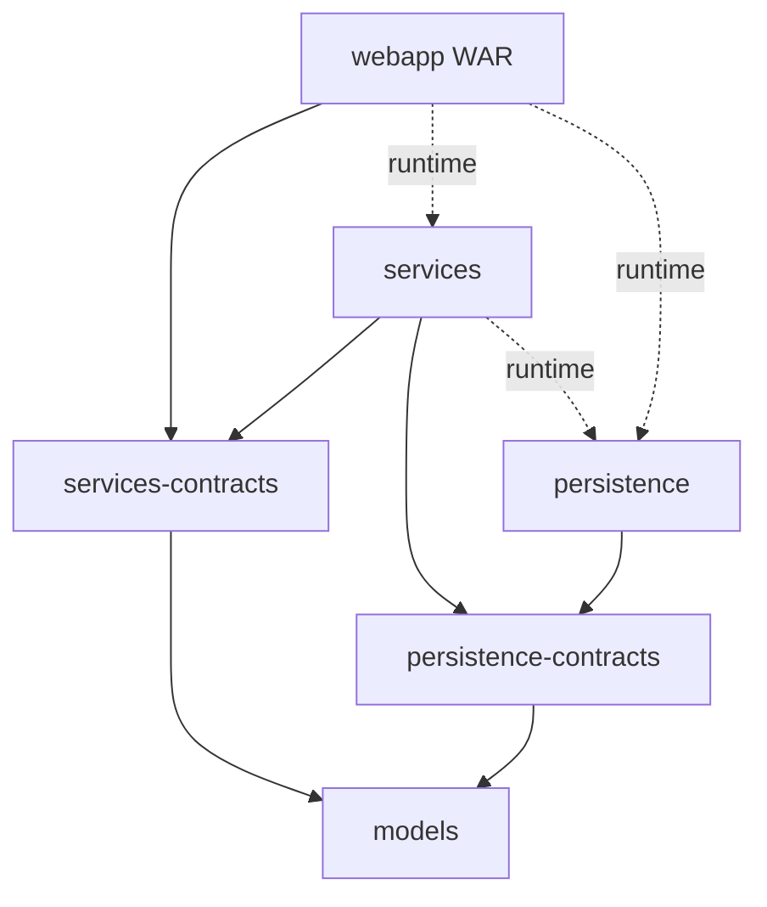

# Architecture

The module boundary separates interfaces from implementations. A controller receives a service interface through constructor injection. A service receives DAO interfaces and other services. JDBC implementations query the database and return Java models. [[WebConfig]] assembles these objects at runtime. The six modules and their dependency directions did not change between `40328f0` and `f12af08`.

Solid arrows are project compile dependencies; dashed arrows are runtime dependencies. External framework dependencies are listed in [[Build and dependencies]]. `runtime` packages the implementation without making it available to the consuming module's compiler. Shared package names across contract and implementation modules let the implementation implement its corresponding interface; they do not merge the modules.

| Module | Owns | Concrete connection |
|---|---|---|
| models | Domain values, joined read projections, page models and the shared search normalizer | [[Album]], [[Post]], [[PostSummary]], [[PostPage]], [[InquiryGroup]], [[SearchText]] |
| persistence-contracts | DAO interfaces and duplicate-key marker | [[PostDao]], [[PasswordResetTokenDao]], [[DuplicatePostKeyException]] |
| persistence | JDBC queries, row mappers and startup schema resource | [[PostJdbcDao]], [[InquiryJdbcDao]] and [[Database schema]] |
| services-contracts | Business APIs, notification payloads and business exceptions | [[PostService]], [[EmailService]], [[InquiryAcceptedNotification]], [[PageNotFoundException]] |
| services | Normalization, orchestration, transactions, paging arithmetic, after-commit callbacks and mail rendering | [[PostServiceImpl]], [[Pagination]], [[TransactionCallbacks]], [[EmailServiceImpl]] |
| webapp | HTTP binding, validation, views and composition | [[PublishController]], [[ProfileController]], [[ValidPassword]], [[SecurityConfig]], [[WebConfig]] |

## What crosses each boundary

1. HTTP request fields become mutable form objects through Spring binding; page numbers arrive as plain int parameters.
2. Controllers pass primitive/string form values, the principal ID and optional cover bytes plus content type to service interfaces. They do not pass HttpServletRequest or BindingResult into business logic. [[ProfileController]] is the one controller that touches the security context directly, to refresh the principal and to log out after a password change.
3. Services resolve identities, compute offsets and call DAO interfaces with normalized values, limits and offsets.
4. DAOs bind SQL parameters and turn aliased columns into models using static RowMappers.
5. Services return models, page objects or raise business exceptions. Side effects that must follow a successful write, mail and success logs, are registered with [[TransactionCallbacks]].
6. Controllers add models to ModelAndView or translate errors; JSPs read JavaBean getters through expression language, and two fragment views answer autocomplete requests.

[[SearchText]] lives in models because both sides need the same rule: persistence stores search_phrase with it, and services normalize incoming queries with it. [[PostSummary]] still avoids loading user, album and artist separately for each card, and [[InquiryJdbcDao]] resolves an inbox page in two statements instead of per-group lookups. [[Image]] carries bytes across the DAO/service boundary and [[ImageController]] returns them directly as an HTTP response.

Start the concrete traces at [[Landing flow]], then [[Post detail flow]], [[Publish flow]], [[Edit and delete flow]] and [[Contact flow]]. [[Inquiry and sale flow]] covers the inbox and the sale; [[Cover image flow]] traces upload and image responses; [[Search suggestions flow]] covers autocomplete. [[Legacy user flow]] describes routes removed from the implementation.

## Account and inquiry boundaries

Security stays in webapp. [[AuthenticatedUser]] adapts the domain User to UserDetails, and [[SecurityConfig]] adapts BCrypt through the [[PasswordHasher]] contract, which now verifies as well as hashes. Services receive account IDs and ordinary values rather than Spring Security objects. [[UserService]] owns registration, profile updates, password change and recovery; [[InquiryService]] owns contact persistence, grouped inboxes, seller authorization and sale transactions; [[PostService]] owns publishing, editing, deletion and paging.

[[Authentication flow]] · [[Profile flow]] · [[Password recovery flow]] · [[Inquiry and sale flow]] · [[Paginated listings]]
