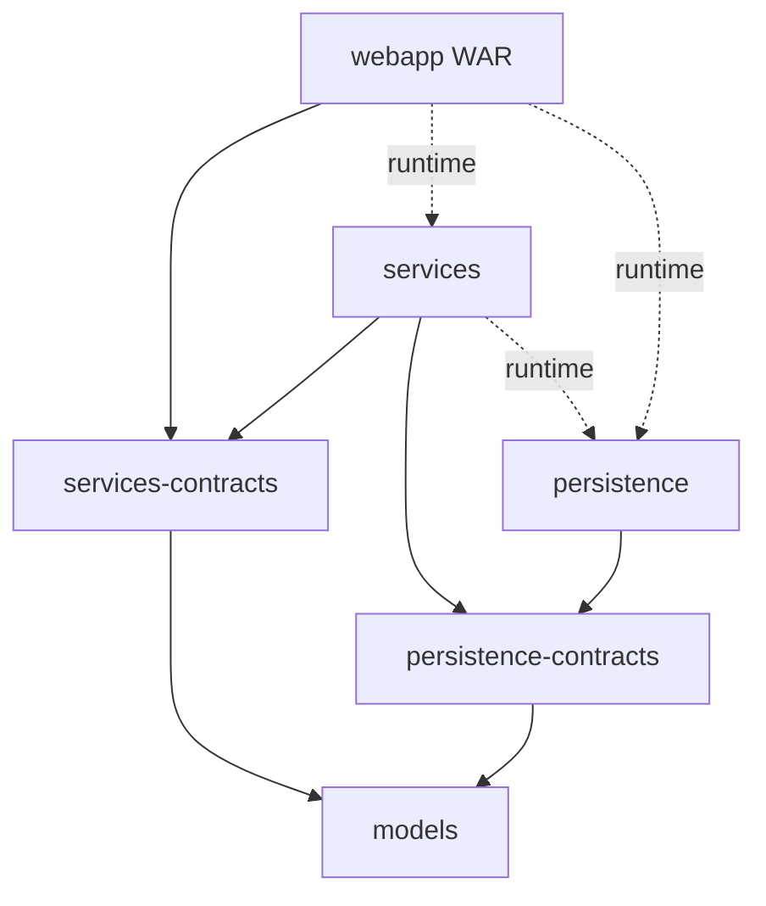
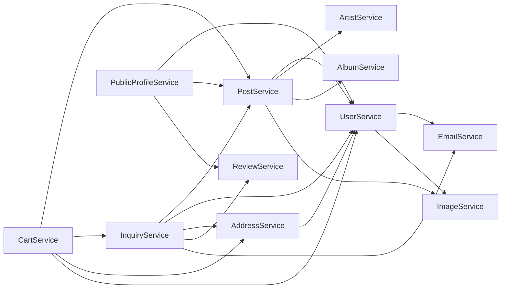

# Architecture

> [!summary] En una frase
> Seis módulos Maven donde las interfaces viven separadas de sus implementaciones, y la dirección de las dependencias hace que el compilador impida saltearse una capa.

## Los módulos


```mermaid
flowchart TD
    W[webapp WAR] --> SC[services-contracts]
    S[services] --> SC
    S --> PC[persistence-contracts]
    P[persistence] --> PC
    SC --> M[models]
    PC --> M
    W -. runtime .-> S
    W -. runtime .-> P
    S -. runtime .-> P
```

Las flechas llenas son dependencias de compilación; las punteadas, de `runtime`. Con `runtime` la implementación se empaqueta en el WAR pero **no** está disponible para el compilador del módulo que la consume. Por eso un controller no puede hacer `new UserServiceImpl()` ni tocar un DAO: no compila.

| Módulo | Qué tiene | Ejemplos |
|---|---|---|
| `models` | Objetos de dominio inmutables, proyecciones de lectura, páginas y reglas compartidas. Sin dependencias | [[User]], [[Post]], [[PostSummary]], [[InquiryDetail]], [[Cart]], [[ImageRules]], [[SearchText]] |
| `persistence-contracts` | Interfaces de los DAO | [[PostDao]], [[InquiryDao]], [[CartItemDao]] |
| `persistence` | Spring JDBC, `RowMapper` y migraciones Flyway | [[PostJdbcDao]], [[InquiryJdbcDao]], `db/migration/V1..V11` |
| `services-contracts` | Interfaces de los services, excepciones de negocio y cargas de correo | [[PostService]], [[CartService]], [[ForbiddenOperationException]], [[PostInterestNotification]] |
| `services` | Lógica de negocio, transacciones, paginado, correo | [[InquiryServiceImpl]], [[CartServiceImpl]], [[ContactRules]], [[EmailServiceImpl]] |
| `webapp` | Controllers, formularios, validadores, seguridad, JSP, configuración | [[InquiryController]], [[SecurityConfig]], [[WebConfig]] |

Las reglas compartidas (`*Rules`) viven en `models` porque las necesitan dos capas: el formulario web para mostrar el error junto al campo, y el service como garantía. [[SearchText]] también: persistence llena `search_phrase` con ella y services normaliza lo que se teclea.

## Qué cruza cada frontera

1. Los parámetros HTTP se ligan a un formulario mutable de `webapp`; los números de página llegan como `int`.
2. El controller pasa al service valores simples: el id de la Cuenta con sesión, textos, números, y archivos ya convertidos a [[ImageUpload]]. Nunca pasa `HttpServletRequest`, `BindingResult` ni `MultipartFile`.
3. El service normaliza, decide y llama a los DAO con valores ya limpios, límites y offsets.
4. El DAO liga parámetros y convierte columnas en modelos con un `RowMapper` estático.
5. El service devuelve modelos o lanza una excepción de negocio. Lo que tiene que pasar después del commit (correo, log de éxito) se registra con [[TransactionCallbacks]].
6. El controller arma el `ModelAndView` o traduce el error; la JSP lee getters con EL. Dos controllers devuelven JSON.

## Reglas de capa

| Regla | Dónde se ve |
|---|---|
| La lógica de negocio va entera en los services | El PR #48 sacó de los controllers el tope de direcciones, el orden por defecto y la validación de página |
| Los controllers no llaman DAO | El módulo `webapp` no compila contra `persistence` |
| `@Transactional` solo en métodos de service, con `readOnly = true` en las lecturas | Ningún DAO ni controller lo lleva |
| Un DAO por tabla | La excepción deliberada: [[InquiryJdbcDao]] reutiliza los `RowMapper` de paquete de [[AddressJdbcDao]] y [[MessageJdbcDao]] para sus `JOIN` |
| `java.sql.*` solo en `persistence` | [[DuplicatePostKeyException]] existe para que `services` no dependa de la excepción de Spring |
| Spring Security solo en `webapp` | [[PasswordHasher]] adapta BCrypt para `services`; el rol de moderador llega al service como un `boolean` |
| Modelos inmutables | Campos `final`, sin setters; las variantes se crean con métodos `with...` |

## Dependencias entre services


```mermaid
flowchart LR
    Cart[CartService] --> Post[PostService]
    Cart --> Inq[InquiryService]
    Cart --> Addr[AddressService]
    Cart --> User[UserService]
    Inq --> Post
    Inq --> User
    Inq --> Addr
    Inq --> Rev[ReviewService]
    Inq --> Mail[EmailService]
    Pub[PublicProfileService] --> User
    Pub --> Post
    Pub --> Rev
    Post --> User
    Post --> Artist[ArtistService]
    Post --> Album[AlbumService]
    Post --> Img[ImageService]
    Addr --> User
    User --> Mail
    User --> Img
```

No hay ciclos entre services. Donde uno habría aparecido, el service usa el DAO de la otra tabla: [[UserServiceImpl]] y [[PostServiceImpl]] usan [[InquiryDao]] directamente porque `InquiryService` ya depende de ellos. [[PublicProfileServiceImpl]] y [[CartServiceImpl]] existen como services de composición por el mismo motivo.

## Dónde seguir

[[Startup and dependency injection]] explica cómo se arma todo al arrancar. [[Security and authorization]] cubre la capa de seguridad. Los recorridos por funcionalidad están en [[Feature map]].

## Preguntas de defensa

**¿Por qué hay módulos de contratos separados?**
Para que cada capa compile solo contra interfaces. `services` no ve las clases JDBC y `webapp` no ve las implementaciones de los services.

**¿Qué impide que un controller use un DAO?**
El scope `runtime` de la dependencia: el DAO está en el WAR pero no en el classpath de compilación de `webapp`.

**¿Por qué las reglas de validación están en `models`?**
Porque las usan el formulario (en `webapp`) y el service (en `services`), y `models` es el único módulo que los dos ven.

**¿Cómo evitan dependencias circulares entre services?**
Usando el DAO de la otra tabla cuando el service correspondiente ya depende del que llama, o con un service de composición.

## Evidencia de código

Dependencias de `services`: compila contra los contratos y recibe `persistence` en `runtime`.

Fuente exacta en `c3e2a4c`: [services/pom.xml](</Users/bautistapessagno/Desktop/proyectos_itba/PAW/paw2026b/services/pom.xml>), líneas 21–45.

```xml
  <dependencies>
    <dependency>
      <groupId>org.springframework</groupId>
      <artifactId>spring-context</artifactId>
    </dependency>
    <dependency>
      <groupId>org.springframework</groupId>
      <artifactId>spring-tx</artifactId>
    </dependency>
    <dependency>
      <groupId>${parent.groupId}</groupId>
      <artifactId>services-contracts</artifactId>
      <version>${parent.version}</version>
    </dependency>
    <dependency>
      <groupId>${parent.groupId}</groupId>
      <artifactId>persistence-contracts</artifactId>
      <version>${parent.version}</version>
    </dependency>
    <dependency>
      <groupId>${parent.groupId}</groupId>
      <artifactId>persistence</artifactId>
      <version>${parent.version}</version>
      <scope>runtime</scope>
    </dependency>
```

Dependencias de `webapp` sobre los módulos hermanos:

Fuente exacta en `c3e2a4c`: [webapp/pom.xml](</Users/bautistapessagno/Desktop/proyectos_itba/PAW/paw2026b/webapp/pom.xml>), líneas 59–76.

```xml
    <dependency>
      <groupId>${parent.groupId}</groupId>
      <artifactId>services</artifactId>
      <version>${parent.version}</version>
      <scope>runtime</scope>
    </dependency>
    <dependency>
      <groupId>${parent.groupId}</groupId>
      <artifactId>persistence</artifactId>
      <version>${parent.version}</version>
      <scope>runtime</scope>
    </dependency>
    <dependency>
      <groupId>${parent.groupId}</groupId>
      <artifactId>services-contracts</artifactId>
      <version>${parent.version}</version>
    </dependency>
    <dependency>
```

Fuente inspeccionada: `c3e2a4c`, 2026-10-05. Es evidencia estática; no implica ejecución de la aplicación. [[Source inventory]] · [[Roadmap de lectura]]
