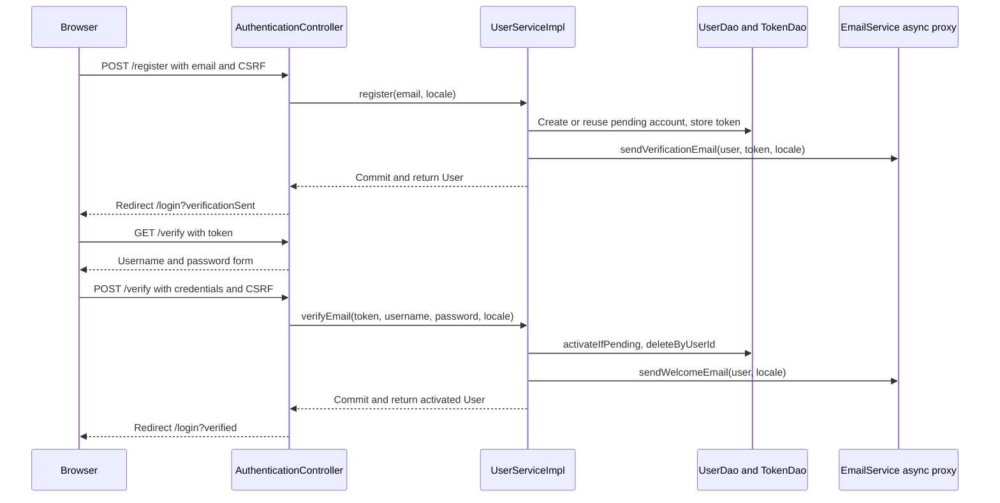

# Authentication flow

Registration starts with email only. POST /register validates and normalizes the address, creates a disabled USER account or reuses a pending one, stores a random token and requests verification mail. An enabled account with that email receives a field error. The success redirect is /login?verificationSent, which does not prove SMTP delivery.

## Flow diagram

The sequence shows successful registration and activation. Invalid tokens and duplicate enabled accounts follow the error handling described below. Mail requests do not establish delivery.



## Behavior and limits

GET /verify?token= displays a form without changing the account. POST /verify requires CSRF, a token, username and confirmed password. [[UserServiceImpl]] looks up the token, hashes the password through [[PasswordHasher]] and conditionally activates the disabled account. It deletes all that user's tokens and requests welcome mail. Invalid/reused tokens leave the form with an error; success redirects to /login?verified.

[[EmailVerificationToken]] has no expiry. Registering a pending account again adds a link without invalidating its earlier links. Activation changes credentials only while enabled=false, so a competing activation cannot overwrite the chosen credentials. An old account with no hash can claim its existing publications through this same email flow.

[[SecurityConfig]] handles POST /login using email/password and BCrypt strength 12. [[AuthenticatedUserDetailsService]] rejects missing accounts and accounts with no hash; UserDetails supplies enabled. A saved protected request can be restored after login. POST /logout invalidates the session and deletes JSESSIONID. The servlet descriptor marks the cookie HttpOnly.

| Route | Access |
|---|---|
| /, /covers/{id}, /register, /verify, /login | Public |
| /publish/**, /post/*/contact, /inquiries/** | Authenticated |
| /admin/** | ADMIN |

ADMIN receives both common and administrative authorities. The current admin page is informational. Anonymous requests to protected pages go to login; authenticated access denial renders 403. CSRF remains enabled for state-changing requests, including anonymous registration and verification.

[[Publish flow]] · [[Contact flow]] · [[Inquiry and sale flow]] · [[Mail delivery]]

## Code snippets

### Account activation

The service validates the token, guards activation and removes all links for the activated user. The annotations place these writes in one transaction. See [[UserServiceImpl]] for the complete class.

[services/src/main/java/ar/edu/itba/paw/services/UserServiceImpl.java, lines 90–114](<file:///Users/bautistapessagno/Desktop/ITBA/PAW/paw2026b/services/src/main/java/ar/edu/itba/paw/services/UserServiceImpl.java>)

```java
    @Override
    @Transactional
    public Optional<User> verifyEmail(final String token, final String username, final String rawPassword,
                                      final Locale locale) {
        if (token == null) {
            return Optional.empty();
        }
        final Optional<EmailVerificationToken> stored = verificationTokenDao.findByToken(token);
        if (stored.isEmpty()) {
            return Optional.empty();
        }
        final long userId = stored.get().getUserId();

        // activateIfPending solo actualiza si la cuenta sigue deshabilitada: si otro request
        // ya la activo devuelve false y este enlace no pisa las credenciales elegidas.
        if (!userDao.activateIfPending(userId, username.trim(), passwordHasher.hash(rawPassword))) {
            return Optional.empty();
        }
        verificationTokenDao.deleteByUserId(userId);

        final User user = userDao.findById(userId).orElseThrow(IllegalStateException::new);
        LOGGER.info("Verified user email userId={}", user.getId());
        emailService.sendWelcomeEmail(user, locale);
        return Optional.of(user);
    }
```

### Conditional account update

The enabled=false predicate prevents a later request from replacing credentials chosen by an earlier activation. See [[UserJdbcDao]] for the complete class.

[persistence/src/main/java/ar/edu/itba/paw/persistence/UserJdbcDao.java, lines 76–82](<file:///Users/bautistapessagno/Desktop/ITBA/PAW/paw2026b/persistence/src/main/java/ar/edu/itba/paw/persistence/UserJdbcDao.java>)

```java
    @Override
    public boolean activateIfPending(final long id, final String username, final String passwordHash) {
        // El UPDATE condicional es lo que hace que la activacion sea de un solo uso:
        // la segunda vez la fila ya esta enabled y no actualiza ninguna.
        return jdbcTemplate.update("UPDATE users SET username = ?, password_hash = ?, enabled = TRUE "
                        + "WHERE id = ? AND enabled = FALSE", username, passwordHash, id) == 1;
    }
```
