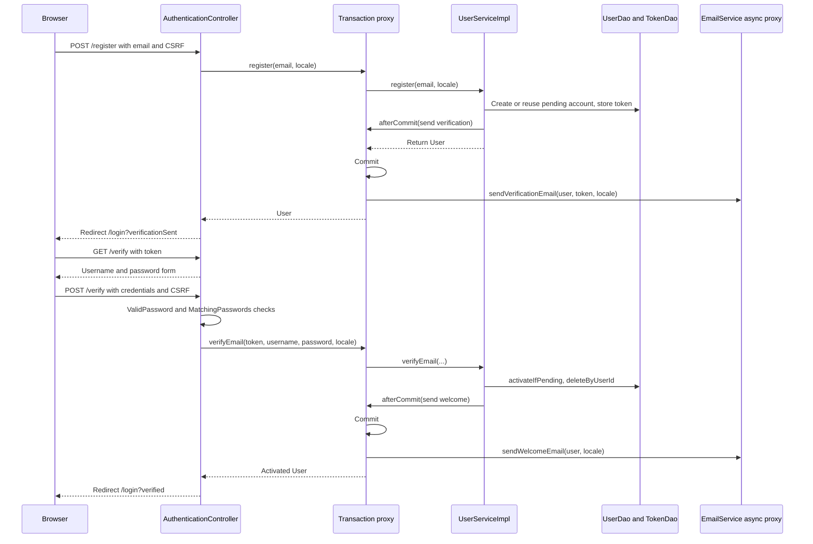

# Authentication flow

Registration starts with email only. POST /register validates and normalizes the address, creates a disabled USER account or reuses a pending one, stores a random token and registers the verification mail to run after the transaction commits. An enabled account with that email receives a field error. The success redirect is /login?verificationSent, which does not prove SMTP delivery.

## Flow diagram

The sequence shows successful registration and activation at `f12af08`. The transaction proxy commits before the registered callbacks hand work to the async mail proxy. Invalid tokens and duplicate enabled accounts follow the error handling described below; mail requests do not establish delivery.



## Behavior and limits

GET /verify?token= displays a form without changing the account. POST /verify requires CSRF, a token, username and confirmed password. Password rules now come from the shared [[ValidPassword]] constraint, and [[MatchingPasswords]] reports a mismatch under the confirmation field. [[UserServiceImpl]] looks up the token, hashes the password through [[PasswordHasher]] and conditionally activates the disabled account. It deletes all of that user's tokens and registers the welcome mail for after commit. Invalid or reused tokens leave the form with an error; success redirects to /login?verified.

[[EmailVerificationToken]] still has no expiry. Registering a pending account again adds a link without invalidating earlier links. Activation changes credentials only while enabled=false, so a competing activation cannot overwrite the chosen credentials. An old account with no hash can claim its existing publications through this same email flow.

[[TransactionCallbacks]] replaced the earlier pre-commit dispatch. If registration or activation rolls back, the callback never runs, so no verification or welcome message is sent for a write that did not persist. The callback only submits the async task; delivery can still fail on the worker, and a saturated mail pool now drops the task with a warning.

[[SecurityConfig]] handles POST /login using email/password and BCrypt strength 12. [[AuthenticatedUserDetailsService]] rejects missing accounts and accounts with no hash; UserDetails supplies enabled. A saved protected request can be restored after login. POST /logout invalidates the session and deletes JSESSIONID. The servlet descriptor marks the cookie HttpOnly and now restricts session tracking to cookies, so URLs are never rewritten with `;jsessionid`.

The login page shows notices for `error`, `logout`, `verificationSent`, `verified`, `passwordChanged`, `resetLinkSent` and `passwordReset`, and links to password recovery and registration. The auth pages use the ui:brand logo instead of the site header.

| Route | Access |
|---|---|
| /, /post/{id}, /covers/{id}, /search/suggestions, /artists/suggestions | Public |
| /register, /verify, /login, /forgot-password, /reset-password | Public |
| /publish/**, /post/*/edit, /post/*/delete, /post/*/contact | Authenticated |
| /profile/**, /inquiries/** | Authenticated |
| /admin/** | ADMIN |

ADMIN receives both common and administrative authorities. The admin page remains informational. Anonymous requests to protected pages go to login; authenticated access denial renders 403. CSRF remains enabled for every state-changing request, including anonymous registration, verification and password recovery.

[[Password recovery flow]] · [[Profile flow]] · [[Publish flow]] · [[Contact flow]] · [[Inquiry and sale flow]] · [[Mail delivery]]

## Code snippets

### Account activation

The service validates the token, guards activation and removes all links for the activated user. The welcome mail and log line are deferred until commit. See [[UserServiceImpl]] for the complete class.

[services/src/main/java/ar/edu/itba/paw/services/UserServiceImpl.java, lines 103–129](<file:///Users/bautistapessagno/Desktop/ITBA/PAW/paw2026b/services/src/main/java/ar/edu/itba/paw/services/UserServiceImpl.java>)

```java
    @Override
    @Transactional
    public Optional<User> verifyEmail(final String token, final String username, final String rawPassword,
                                      final Locale locale) {
        if (token == null) {
            return Optional.empty();
        }
        final Optional<EmailVerificationToken> stored = verificationTokenDao.findByToken(token);
        if (stored.isEmpty()) {
            return Optional.empty();
        }
        final long userId = stored.get().getUserId();

        // activateIfPending solo actualiza si la cuenta sigue deshabilitada: si otro request
        // ya la activo devuelve false y este enlace no pisa las credenciales elegidas.
        if (!userDao.activateIfPending(userId, username.trim(), passwordHasher.hash(rawPassword))) {
            return Optional.empty();
        }
        verificationTokenDao.deleteByUserId(userId);

        final User user = userDao.findById(userId).orElseThrow(IllegalStateException::new);
        TransactionCallbacks.afterCommit(() -> {
            LOGGER.info("Verified user email userId={}", user.getId());
            emailService.sendWelcomeEmail(user, locale);
        });
        return Optional.of(user);
    }
```

### Conditional account update

The enabled=false predicate prevents a later request from replacing credentials chosen by an earlier activation. See [[UserJdbcDao]] for the complete class.

[persistence/src/main/java/ar/edu/itba/paw/persistence/UserJdbcDao.java, lines 76–82](<file:///Users/bautistapessagno/Desktop/ITBA/PAW/paw2026b/persistence/src/main/java/ar/edu/itba/paw/persistence/UserJdbcDao.java>)

```java
    @Override
    public boolean activateIfPending(final long id, final String username, final String passwordHash) {
        // El UPDATE condicional es lo que hace que la activacion sea de un solo uso:
        // la segunda vez la fila ya esta enabled y no actualiza ninguna.
        return jdbcTemplate.update("UPDATE users SET username = ?, password_hash = ?, enabled = TRUE "
                        + "WHERE id = ? AND enabled = FALSE", username, passwordHash, id) == 1;
    }
```

### Deferring side effects until commit

Every service that sends mail uses this helper. Outside a synchronized transaction it runs the action immediately, which is what the directly constructed unit tests exercise unless they initialize synchronization. See [[TransactionCallbacks]] for the complete class.

[services/src/main/java/ar/edu/itba/paw/services/TransactionCallbacks.java, lines 12–23](<file:///Users/bautistapessagno/Desktop/ITBA/PAW/paw2026b/services/src/main/java/ar/edu/itba/paw/services/TransactionCallbacks.java>)

```java
    static void afterCommit(final Runnable action) {
        if (!TransactionSynchronizationManager.isSynchronizationActive()) {
            action.run();
            return;
        }
        TransactionSynchronizationManager.registerSynchronization(new TransactionSynchronization() {
            @Override
            public void afterCommit() {
                action.run();
            }
        });
    }
```

### Route protection

The route table above comes from these matchers. Everything not listed is public. See [[SecurityConfig]] for the complete class.

[webapp/src/main/java/ar/edu/itba/paw/webapp/config/SecurityConfig.java, lines 55–62](<file:///Users/bautistapessagno/Desktop/ITBA/PAW/paw2026b/webapp/src/main/java/ar/edu/itba/paw/webapp/config/SecurityConfig.java>)

```java
                .authorizeHttpRequests(authorize -> authorize
                        .antMatchers("/admin/**").hasRole("ADMIN")
                        .antMatchers("/publish/**").authenticated()
                        .antMatchers("/post/*/edit", "/post/*/delete").authenticated()
                        .antMatchers("/profile/**").authenticated()
                        .antMatchers("/post/*/contact").authenticated()
                        .antMatchers("/inquiries/**").authenticated()
                        .anyRequest().permitAll())
```

## Evidencia local anterior, 2026-09-17

[[Audit local 2026-09-17]] ejecutó la rama `e5e926d`, anterior a `f12af08`. Sus resultados de ejecución no se repitieron para esta revisión; [[Known gaps and document drift]] indica qué hallazgos del audit quedaron resueltos en el código actual y cuáles siguen abiertos.
