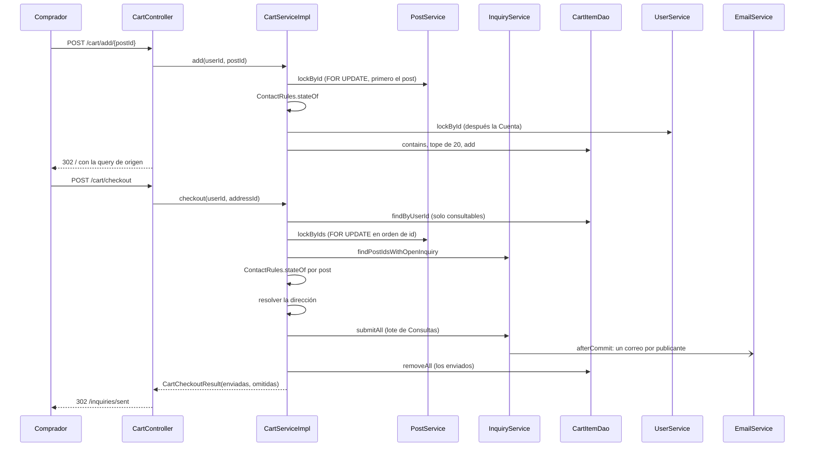

# Cart flow

> [!summary] En una frase
> El carrito junta hasta 20 vinilos para consultarlos de una vez: al enviarlo se crea una Consulta por vinilo con la misma dirección, sale un solo correo por publicante y cada Consulta sigue después su propio flujo de venta.

## Qué resuelve

Consultar varios vinilos sin repetir el formulario (PR #47). **No es una compra ni un pedido**: el glosario lo define como "los Posts que una Cuenta eligió para consultar juntos". No reserva nada, no congela precios y no tiene pago. Después del envío, cada Consulta se acepta, se paga y se confirma por separado en [[Inquiry and sale flow]].

## Herramientas

| Herramienta | Para qué se usa acá |
|---|---|
| Spring MVC | Cuatro endpoints en [[CartController]] |
| `@ControllerAdvice(assignableTypes = ...)` + `@Order` | [[CartExceptionAdvice]]: los rechazos esperables vuelven a la pantalla de origen con un aviso |
| `@ControllerAdvice` + `@ModelAttribute` | [[CartCountAdvice]]: el número del carrito en la cabecera de todas las páginas |
| [[ContactRules]] | La misma definición de "se puede consultar" que usa el contacto |
| [[ShippingAddressForm]] + [[ShippingAddressValidator]] | El mismo formulario y validador de dirección que el contacto |
| Clave primaria compuesta `(user_id, post_id)` | Un vinilo no se repite en el carrito |
| `ON DELETE CASCADE` | Si se elimina la publicación, el ítem se va con ella |
| `SELECT ... ORDER BY id FOR UPDATE` | Bloquear varios posts en un orden fijo para no trabarse con otra transacción |
| `SimpleJdbcInsert.executeBatch` | Crear todas las Consultas en un lote |
| `Propagation.MANDATORY` | `submitAll` y `lockByIds` solo corren dentro de la transacción del carrito |
| [[TransactionCallbacks]] + `@Async` | Un correo por publicante, después del commit |

## Rutas

Todas exigen Cuenta verificada (`/cart` y `/cart/**` están en `VERIFIED_PATHS`).

| Ruta | Qué hace |
|---|---|
| `POST /cart/add/{postId}` | Agrega y vuelve al catálogo, con la búsqueda de origen |
| `POST /cart/remove/{postId}` | Quita y vuelve al carrito |
| `GET /cart` | Muestra el carrito agrupado por publicante y las direcciones |
| `POST /cart/checkout` | Envía una Consulta por vinilo y va a la bandeja de enviadas |

## Recorrido paso a paso

### Agregar

1. El botón está en la ficha, al lado de "Consultar", y solo aparece si [[PostContactOptions]] dice que el post se puede consultar y todavía no está en el carrito ([[Post detail flow]]). Es un formulario POST con `sec:csrfInput` y un campo oculto `from` con el listado de origen.
2. `CartServiceImpl.add`, en una transacción:
   - `postService.lockById` bloquea el post (404 si no existe) y busca una Consulta abierta de esa Cuenta sobre ese post. Hasta `8929aea` solo lo leía; desde el PR #52 lo bloquea para tomar los bloqueos en el mismo orden que el contacto y el envío (post primero, Cuenta después) y para que el estado validado siga vigente al insertar.
   - `ContactRules.stateOf` decide: Consulta abierta → `OpenInquiryExistsException`; post propio o no disponible → `CartAddRejectedException` con su motivo.
   - `userService.lockById` bloquea después la fila de la Cuenta: dos agregados simultáneos se ordenan.
   - Si ya estaba en el carrito, rechazo `ALREADY_IN_CART`. Si ya hay 20 consultables, `CART_FULL`. "Repetido" gana sobre "lleno": el aviso es más preciso.
   - `cartItemDao.add`; si igual chocara contra la clave primaria, devuelve `false` y se trata como repetido.
3. Éxito: aviso `cart.added` y redirección a `/` con la query de origen, pasada por `ListingQueries.sanitize`.
4. Rechazo: [[CartExceptionAdvice]] redirige a la ficha del post con el motivo, o a la conversación si ya lo había consultado.

### Ver

`CartServiceImpl.findCheckout` trae **solo lo que todavía se puede consultar**: el DAO filtra en SQL por estado del post (`AVAILABLE`) y por ausencia de una Consulta abierta de la misma Cuenta. Los demás ítems quedan guardados y ocultos: un post reservado vuelve a aparecer si su venta se cancela. El DAO ordena por publicante y el service arma los grupos con un `LinkedHashMap`, suma el total con los precios actuales y agrega las [[ShippingOptions]].

La cantidad que muestra la cabecera sale de [[CartCountAdvice]]: deja en el request un `LazyCount` que consulta la base la primera vez que la vista lo lee. Un POST que termina en redirección no consulta nada.

### Enviar

1. [[ShippingAddressForm]]: dirección guardada o una nueva, con el validador condicional.
2. `CartServiceImpl.checkout` o `checkoutWithNewAddress` → `send`:
   - Relee los ítems consultables. Si no hay ninguno, `NothingToSendException`.
   - `postService.lockByIds`: bloquea esos posts **en orden de id** y devuelve sus resúmenes.
   - Con los posts bloqueados vuelve a decidir, uno por uno, con `ContactRules.stateOf`: lo que la persona vio pudo cambiar mientras tenía el carrito abierto.
   - Si no queda nada enviable, `NothingToSendException` y no se escribe nada.
   - **Recién ahora** resuelve la dirección: valida la guardada o crea la nueva. Así un envío sin nada que mandar no deja una dirección nueva en la libreta.
   - `inquiryService.submitAll`: crea todas las Consultas en un lote, con el precio de cada post, y arma un aviso por publicante.
   - Saca del carrito lo enviado. Lo omitido queda.
3. Devuelve [[CartCheckoutResult]] con cuántas se enviaron y cuántas se omitieron. La bandeja de enviadas muestra los dos avisos.



## Datos

Fuente exacta en `c3e2a4c`: [persistence/src/main/resources/db/migration/V11__carrito.sql](</Users/bautistapessagno/Desktop/proyectos_itba/PAW/paw2026b/persistence/src/main/resources/db/migration/V11__carrito.sql>), líneas 1–12.

```sql
-- El carrito de cada Cuenta: los Posts que eligio para consultar juntos. La clave compuesta
-- impide repetir un Post. Un item es descartable: si se elimina la publicacion, se va con ella.
CREATE TABLE cart_items (
    user_id INTEGER NOT NULL,
    post_id INTEGER NOT NULL,
    added_at TIMESTAMP DEFAULT NOW() NOT NULL,
    CONSTRAINT cart_items_pkey PRIMARY KEY (user_id, post_id),
    CONSTRAINT cart_items_user_fk FOREIGN KEY (user_id) REFERENCES users(id),
    CONSTRAINT cart_items_post_fk FOREIGN KEY (post_id) REFERENCES posts(id) ON DELETE CASCADE
);

CREATE INDEX cart_items_post_id_idx ON cart_items (post_id);
```

La tabla guarda solo el par Cuenta–Post y cuándo se agregó. No guarda precio: el carrito muestra el actual, y la Consulta sigue mostrando el del post hasta que el publicante acepta y lo fija ([[Inquiry and sale flow]]).

## Decisiones y por qué

| Decisión | Alternativa | Motivo | Fuente |
|---|---|---|---|
| El carrito no es una entidad de venta | Un pedido con varios ítems | Cada vinilo es de un publicante distinto y se negocia aparte; el carrito solo evita repetir el formulario | `CONTEXT.md`; comentario en [[Cart]] |
| Una sola regla de contactabilidad en [[ContactRules]] | Repetirla en contacto, carrito y ficha | Las tres decisiones tienen que coincidir siempre | Comentario en [[ContactRules]] |
| El filtro de "consultable" se aplica en SQL con constantes que pasa el service | Traer todo y filtrar en Java | Menos filas, y la regla sigue definida en el service | Comentario en [[CartItemDao]]; commit `412f61ab` |
| Lo no consultable queda guardado y oculto | Borrarlo del carrito | Un post reservado vuelve a verse si su venta se cancela | Comentario en [[CartService]] |
| Tope de 20 sobre lo visible, no absoluto | Tope sobre filas guardadas | Un post oculto no debería impedir agregar; a cambio, el carrito puede mostrar más de 20 si reaparecen | Comentario en [[CartService]] |
| Bloquear la Cuenta al agregar | Confiar en la clave primaria | Para que el conteo del tope sea correcto con dos agregados simultáneos | Comentario en [[CartServiceImpl]] |
| Bloquear los posts en orden de id | Bloquear en el orden del carrito | Dos transacciones que comparten posts no se traban entre sí | Comentario en [[PostDao]] |
| Agregar bloquea el post antes que la Cuenta | Bloquear solo la Cuenta | Contacto y envío ya toman post y después Cuenta; invertir ese orden en otra transacción puede trabar a las dos. Además el post no puede venderse entre la validación y el insert | Comentario en [[CartServiceImpl]]; commit `e12c0e39` |
| Volver a decidir con los posts bloqueados | Confiar en lo que mostró la pantalla | El carrito pudo quedar desactualizado mientras estaba abierto | Comentario en [[CartServiceImpl]] |
| Envío parcial: se manda lo que se puede y se informa lo omitido | Todo o nada | Que un vinilo que se reservó no frene las demás consultas | Comentario en [[CartCheckoutResult]] |
| La dirección se resuelve después de saber que hay algo para enviar | Crearla primero | Un envío vacío no deja una dirección nueva en la libreta | Comentario en [[CartServiceImpl]] |
| Consultas creadas en lote, dos sentencias fijas | Un `INSERT` por post | Sin N+1 sea cual sea la cantidad | Comentario en [[InquiryDao]]; commit `93058b58` |
| Un correo por publicante | Un correo por vinilo | Menos ruido para quien recibe varias consultas del mismo comprador | Comentario en [[CartSellerGroup]] |
| Rechazos como redirección con aviso | Páginas 403 o 409 | "Son casos esperables (otra pestaña, una reserva justo en ese momento), no páginas de error" | Comentario en [[CartExceptionAdvice]] |
| El conteo de la cabecera va como atributo del request y es perezoso | Atributo de modelo | Un atributo de modelo se sumaría como query param a cada `redirect:`; y un POST que redirige no tiene por qué contar | Comentario en [[CartCountAdvice]] |
| `from` pasa por una lista blanca de caracteres | Reusarlo tal cual | No armar una redirección con texto arbitrario | Comentario en [[ListingQueries]] |
| Ítem con `ON DELETE CASCADE` | Desenganchar como las consultas | "Un ítem es descartable" | Comentario en la migración V11 |
| Sin mensaje en las consultas del carrito | Un mensaje común | El carrito nunca lo trae; se escribe después en cada conversación | Comentario en [[PostInterestNotification]] |

## Concurrencia y casos borde

- **Dos agregados a la vez**: el bloqueo de la Cuenta los ordena; el segundo cuenta después del primero.
- **Agregar mientras el vendedor acepta otra consulta del mismo post**: los dos bloquean el post; si gana la aceptación, el agregado ve el post `RESERVED` y lo rechaza como `UNAVAILABLE` (lo cubre `testAddWhenPostIsSoldAtLockReturnsUnavailableRejection`).
- **Un post del carrito se reserva mientras el carrito está abierto**: al enviar se omite y queda guardado; el resultado lo informa.
- **Dos envíos del mismo carrito** (doble clic, dos pestañas): el segundo espera los bloqueos de los posts, ve las Consultas abiertas que creó el primero y termina en "nada para enviar".
- **Dos compradores envían carritos con posts en común**: los dos bloquean en orden de id, así que uno espera al otro sin interbloqueo; los dos pueden consultar el mismo post.
- **La dirección se archivó en otra pestaña**: vuelve al carrito con un aviso.
- **Publicación eliminada**: el ítem desaparece por la cascada.

## Límites conocidos

- El carrito puede mostrar más de 20 ítems si reaparecen posts que estaban ocultos.
- No se puede escribir un mensaje al enviar desde el carrito.
- Cada vista de página con sesión verificada hace un `COUNT` para la cabecera.
- [[CartServiceImplTest]], [[ContactRulesTest]] y [[CartItemJdbcDaoTest]] cubren reglas y SQL; el bloqueo en orden contra PostgreSQL no tiene test automático.

## Preguntas de defensa

**¿El carrito es una compra?**
No. Es una lista de vinilos para consultar. Al enviarlo se crean Consultas comunes; ninguna reserva nada hasta que el publicante acepte.

**¿Qué pasa si uno de los vinilos se vendió mientras tenía el carrito abierto?**
Se omite. Las demás consultas salen igual y la pantalla avisa cuántas no se enviaron.

**¿Cómo evitan un interbloqueo al bloquear varios posts?**
Todos los bloqueos se piden en una sola sentencia ordenada por id. Dos transacciones que comparten posts los toman en el mismo orden.

**¿Cuántas consultas SQL hace el envío de 20 vinilos?**
Una cantidad fija: la lectura del carrito, el bloqueo y los resúmenes de los posts, las Consultas abiertas, la dirección, un lote de inserts, una lectura de ids y un borrado. No crece con la cantidad.

**¿Dónde está definido qué se puede consultar?**
En [[ContactRules]]: disponible, ajeno y sin una Consulta abierta. La usan el contacto, el carrito y la ficha, y el carrito le pasa esas mismas constantes a su DAO.

**¿Por qué el contador de la cabecera no es un atributo de modelo?**
Porque Spring agrega los atributos de modelo como parámetros a cada `redirect:`. Va en el request, y se calcula solo si la vista lo usa.

**¿Cuántos correos recibe un publicante si le consultan cinco vinilos desde un carrito?**
Uno, con los cinco y un enlace a cada Consulta.

## Evidencia de código

Agregar:

Fuente exacta en `c3e2a4c`: [services/src/main/java/ar/edu/itba/paw/services/CartServiceImpl.java](</Users/bautistapessagno/Desktop/proyectos_itba/PAW/paw2026b/services/src/main/java/ar/edu/itba/paw/services/CartServiceImpl.java>), líneas 51–85.

```java
    // Los mismos chequeos que el contacto, en el mismo orden: los decide ContactRules.
    @Override
    @Transactional
    public PostSummary add(final long userId, final long postId) {
        // Contacto y checkout tambien toman publicacion antes que cuenta. El lock
        // evita invertir ese orden al insertar la FK y mantiene vigente el estado validado.
        final PostSummary post = postService.lockById(postId);
        final Optional<Long> openInquiryId = inquiryService.findOpenInquiryId(postId, userId);
        switch (ContactRules.stateOf(post.getStatus(), post.getUserId(), userId, openInquiryId.isPresent())) {
            case OPEN_INQUIRY -> throw new OpenInquiryExistsException(openInquiryId.orElseThrow());
            case OWN_POST -> throw rejectAdd(userId, postId, CartAddRejectedException.Reason.OWN_POST);
            case UNAVAILABLE -> throw rejectAdd(userId, postId, CartAddRejectedException.Reason.UNAVAILABLE);
            case CONTACTABLE -> { }
        }
        // Bloquear la cuenta serializa dos agregados simultaneos: el segundo cuenta despues del
        // primero y no pasa el tope. Repetido gana sobre lleno: el aviso es mas preciso.
        userService.lockById(userId);
        if (cartItemDao.contains(userId, postId)) {
            throw rejectAdd(userId, postId, CartAddRejectedException.Reason.ALREADY_IN_CART);
        }
        if (countContactable(userId) >= MAX_ITEMS) {
            throw rejectAdd(userId, postId, CartAddRejectedException.Reason.CART_FULL);
        }
        if (!cartItemDao.add(userId, postId)) {
            throw rejectAdd(userId, postId, CartAddRejectedException.Reason.ALREADY_IN_CART);
        }
        LOGGER.info("Added to cart userId={} postId={}", userId, postId);
        return post;
    }

    private static CartAddRejectedException rejectAdd(final long userId, final long postId,
                                                      final CartAddRejectedException.Reason reason) {
        LOGGER.warn("Rejected cart add userId={} postId={} reason={}", userId, postId, reason);
        return new CartAddRejectedException(postId, reason);
    }
```

Enviar:

Fuente exacta en `c3e2a4c`: [services/src/main/java/ar/edu/itba/paw/services/CartServiceImpl.java](</Users/bautistapessagno/Desktop/proyectos_itba/PAW/paw2026b/services/src/main/java/ar/edu/itba/paw/services/CartServiceImpl.java>), líneas 145–200.

```java
    @Override
    @Transactional
    public CartCheckoutResult checkout(final long userId, final long addressId) {
        return send(userId, () -> {
            // La pudo archivar en otra pestania despues de abrir el carrito.
            if (addressService.findActiveOwned(addressId, userId).isEmpty()) {
                LOGGER.warn("Rejected cart checkout with unavailable address userId={} addressId={}", userId,
                        addressId);
                throw new AddressNotFoundException();
            }
            return addressId;
        });
    }

    @Override
    @Transactional
    public CartCheckoutResult checkoutWithNewAddress(final long userId, final String street,
                                                     final String streetNumber, final String apartment,
                                                     final String city, final Province province,
                                                     final String postalCode, final String notes) {
        return send(userId, () -> addressService.create(userId, street, streetNumber, apartment, city, province,
                postalCode, notes).getId());
    }

    /*
     * Lo que el comprador vio pudo cambiar mientras tenia el carrito abierto: se bloquean los
     * posts y se vuelve a decidir que se puede enviar. La direccion se resuelve recien despues,
     * para que un envio sin nada que mandar no deje una direccion nueva en la libreta.
     */
    private CartCheckoutResult send(final long userId, final LongSupplier addressId) {
        final List<Long> postIds = findContactable(userId).stream()
                .map(CartItem::getPostId)
                .toList();
        if (postIds.isEmpty()) {
            LOGGER.warn("Rejected empty cart checkout userId={}", userId);
            throw new NothingToSendException();
        }
        final List<PostSummary> posts = postService.lockByIds(postIds);
        final Set<Long> alreadyOpen = inquiryService.findPostIdsWithOpenInquiry(userId, postIds);
        final List<PostSummary> sendable = posts.stream()
                .filter(post -> ContactRules.stateOf(post.getStatus(), post.getUserId(), userId,
                        alreadyOpen.contains(post.getId())) == ContactState.CONTACTABLE)
                .toList();
        if (sendable.isEmpty()) {
            LOGGER.warn("Rejected cart checkout with nothing sendable userId={} postIds={}", userId, postIds);
            throw new NothingToSendException();
        }

        inquiryService.submitAll(userId, addressId.getAsLong(), sendable);
        final List<Long> sentIds = sendable.stream().map(PostSummary::getId).toList();
        cartItemDao.removeAll(userId, sentIds);

        final int skipped = postIds.size() - sentIds.size();
        LOGGER.info("Checked out cart userId={} sent={} skipped={}", userId, sentIds.size(), skipped);
        return new CartCheckoutResult(sentIds.size(), skipped);
    }
```

Regla compartida:

Fuente exacta en `c3e2a4c`: [services/src/main/java/ar/edu/itba/paw/services/ContactRules.java](</Users/bautistapessagno/Desktop/proyectos_itba/PAW/paw2026b/services/src/main/java/ar/edu/itba/paw/services/ContactRules.java>), líneas 9–44.

```java
/*
 * La unica definicion de "se puede consultar": disponible, ajeno y sin una Consulta abierta
 * del comprador. El contacto, el carrito y la ficha la leen de aca; el carrito le pasa a su DAO
 * estas mismas constantes para filtrar en la base. Lo ajeno no hace falta filtrarlo ahi: add()
 * nunca deja entrar un Post propio.
 */
final class ContactRules {

    static final PostStatus CONTACTABLE_POST_STATUS = PostStatus.AVAILABLE;

    static final List<InquiryStatus> BLOCKING_INQUIRY_STATUSES = InquiryStatus.OPEN_STATUSES;

    private ContactRules() {
    }

    // Una Consulta abierta gana: el comprador tiene que llegar a su Conversacion aunque el
    // post ya este reservado para el.
    static ContactState stateOf(final PostStatus postStatus, final long sellerId, final long buyerId,
                                final boolean hasOpenInquiry) {
        if (hasOpenInquiry) {
            return ContactState.OPEN_INQUIRY;
        }
        if (stateForAnonymous(postStatus) == ContactState.UNAVAILABLE) {
            return ContactState.UNAVAILABLE;
        }
        if (sellerId == buyerId) {
            return ContactState.OWN_POST;
        }
        return ContactState.CONTACTABLE;
    }

    // Sin sesion no hay Consulta abierta ni post propio: solo cuenta el estado del post.
    static ContactState stateForAnonymous(final PostStatus postStatus) {
        return postStatus == CONTACTABLE_POST_STATUS ? ContactState.CONTACTABLE : ContactState.UNAVAILABLE;
    }
}
```

Consultas en lote y un aviso por publicante:

Fuente exacta en `c3e2a4c`: [services/src/main/java/ar/edu/itba/paw/services/InquiryServiceImpl.java](</Users/bautistapessagno/Desktop/proyectos_itba/PAW/paw2026b/services/src/main/java/ar/edu/itba/paw/services/InquiryServiceImpl.java>), líneas 137–166.

```java
    // Los posts llegan bloqueados y validados por CartService; MANDATORY porque sin su
    // transaccion los bloqueos ya se habrian soltado.
    @Override
    @Transactional(propagation = Propagation.MANDATORY)
    public List<PostInterestNotification> submitAll(final long buyerId, final long addressId,
                                                    final List<PostSummary> posts) {
        final User buyer = userService.findById(buyerId).orElseThrow(UserNotFoundException::new);
        final Map<Long, Integer> priceByPostId = new LinkedHashMap<>();
        posts.forEach(post -> priceByPostId.put(post.getId(), post.getPrice()));
        final Map<Long, Inquiry> inquiryByPostId = inquiryDao.createAll(buyerId, addressId, priceByPostId);
        // Un correo por Publicante con todos sus vinilos: el orden de llegada se conserva.
        final Map<Long, List<PostInterestNotification.InterestedPost>> postsBySeller = new LinkedHashMap<>();
        final Map<Long, PostSummary> firstPostBySeller = new LinkedHashMap<>();
        for (final PostSummary post : posts) {
            postsBySeller.computeIfAbsent(post.getUserId(), ignored -> new ArrayList<>())
                    .add(interestedPost(post, inquiryByPostId.get(post.getId())));
            firstPostBySeller.putIfAbsent(post.getUserId(), post);
        }
        final List<PostInterestNotification> notifications = new ArrayList<>();
        firstPostBySeller.forEach((sellerId, post) -> {
            final PostInterestNotification notification = new PostInterestNotification(post.getPublisherEmail(),
                    buyer.getUsername(), null, postsBySeller.get(sellerId));
            notifications.add(notification);
            final Locale publisherLocale = SupportedLocales.localeOf(post.getPublisherLocale());
            TransactionCallbacks.afterCommit(() -> emailService.sendPostInterestEmail(notification, publisherLocale));
        });
        LOGGER.info("Created inquiries from cart buyerId={} count={} sellers={}", buyerId, posts.size(),
                notifications.size());
        return List.copyOf(notifications);
    }
```

Fuente exacta en `c3e2a4c`: [persistence/src/main/java/ar/edu/itba/paw/persistence/InquiryJdbcDao.java](</Users/bautistapessagno/Desktop/proyectos_itba/PAW/paw2026b/persistence/src/main/java/ar/edu/itba/paw/persistence/InquiryJdbcDao.java>), líneas 174–208.

```java
    /*
     * Un batch para los inserts y una consulta para recuperar los ids, que executeBatch no
     * devuelve: la de mayor id por Post es la recien creada, porque los ids crecen y el que llama
     * tiene los Posts bloqueados.
     */
    @Override
    public Map<Long, Inquiry> createAll(final long buyerId, final long addressId,
                                        final Map<Long, Integer> priceByPostId) {
        if (priceByPostId.isEmpty()) {
            return Map.of();
        }
        final List<Map<String, Object>> rows = new ArrayList<>();
        priceByPostId.forEach((postId, price) -> {
            final Map<String, Object> row = new HashMap<>();
            row.put("post_id", postId);
            row.put("buyer_id", buyerId);
            row.put("status", InquiryStatus.PENDING.name());
            row.put("address_id", addressId);
            row.put("price", price);
            rows.add(row);
        });
        jdbcInsert.executeBatch(SqlParameterSourceUtils.createBatch(rows));

        final List<Object> parameters = new ArrayList<>();
        parameters.add(buyerId);
        parameters.addAll(priceByPostId.keySet());
        final Map<Long, Inquiry> created = new HashMap<>();
        jdbcTemplate.query("SELECT post_id, MAX(id) AS id FROM inquiries WHERE buyer_id = ? AND post_id IN ("
                        + placeholders(priceByPostId.size()) + ") GROUP BY post_id",
                (RowCallbackHandler) resultSet -> created.put(resultSet.getLong("post_id"),
                        new Inquiry(resultSet.getLong("id"), resultSet.getLong("post_id"), buyerId,
                                InquiryStatus.PENDING)),
                parameters.toArray());
        return Map.copyOf(created);
    }
```

Bloqueo de varios posts en orden:

Fuente exacta en `c3e2a4c`: [persistence/src/main/java/ar/edu/itba/paw/persistence/PostJdbcDao.java](</Users/bautistapessagno/Desktop/proyectos_itba/PAW/paw2026b/persistence/src/main/java/ar/edu/itba/paw/persistence/PostJdbcDao.java>), líneas 305–318.

```java
    // Dos sentencias fijas para cualquier cantidad de posts: el bloqueo en orden de id y
    // despues los summaries, sin un findById por post.
    @Override
    public List<PostSummary> findByIdsForUpdate(final Collection<Long> ids) {
        if (ids.isEmpty()) {
            return List.of();
        }
        final String placeholders = String.join(", ", Collections.nCopies(ids.size(), "?"));
        final Object[] parameters = ids.toArray();
        jdbcTemplate.queryForList("SELECT id FROM posts WHERE id IN (" + placeholders + ") ORDER BY id FOR UPDATE",
                Long.class, parameters);
        return List.copyOf(jdbcTemplate.query(SUMMARY_SELECT + "WHERE p.id IN (" + placeholders + ") ORDER BY p.id",
                ROW_MAPPER, parameters));
    }
```

Filtro del carrito en SQL:

Fuente exacta en `c3e2a4c`: [persistence/src/main/java/ar/edu/itba/paw/persistence/CartItemJdbcDao.java](</Users/bautistapessagno/Desktop/proyectos_itba/PAW/paw2026b/persistence/src/main/java/ar/edu/itba/paw/persistence/CartItemJdbcDao.java>), líneas 36–48.

```java
    // El filtro llega del service: el estado del Post y los de las Consultas que lo ocultan.
    private static final String FILTERED_FROM = "FROM cart_items ci "
            + "JOIN posts p ON p.id = ci.post_id "
            + "JOIN users s ON s.id = p.user_id "
            + "JOIN albums a ON a.id = p.album_id JOIN artists ar ON ar.id = a.artist_id "
            + "WHERE ci.user_id = ? AND p.status = ? "
            + "AND NOT EXISTS (SELECT 1 FROM inquiries i WHERE i.buyer_id = ci.user_id "
            + "AND i.post_id = ci.post_id AND i.status IN (%s)) ";

    private static final String FILTERED_SELECT = "SELECT p.id AS post_id, s.id AS seller_id, "
            + "s.username AS seller_username, a.title AS album_title, ar.name AS artist_name, "
            + "a.release_year AS album_release_year, COALESCE(p.image_id, a.cover_image_id) AS post_image_id, "
            + "p.price AS post_price " + FILTERED_FROM;
```

Fuente exacta en `c3e2a4c`: [persistence/src/main/java/ar/edu/itba/paw/persistence/CartItemJdbcDao.java](</Users/bautistapessagno/Desktop/proyectos_itba/PAW/paw2026b/persistence/src/main/java/ar/edu/itba/paw/persistence/CartItemJdbcDao.java>), líneas 105–137.

```java
    @Override
    public List<CartItem> findByUserId(final long userId, final PostStatus postStatus,
                                       final Collection<InquiryStatus> excludedInquiryStatuses) {
        return List.copyOf(jdbcTemplate.query(
                filtered(FILTERED_SELECT, excludedInquiryStatuses) + "ORDER BY s.username, ci.added_at, p.id",
                ROW_MAPPER, filterParameters(userId, postStatus, excludedInquiryStatuses)));
    }

    @Override
    public int countByUserId(final long userId, final PostStatus postStatus,
                             final Collection<InquiryStatus> excludedInquiryStatuses) {
        return jdbcTemplate.queryForObject("SELECT COUNT(*) " + filtered(FILTERED_FROM, excludedInquiryStatuses),
                Integer.class, filterParameters(userId, postStatus, excludedInquiryStatuses));
    }

    // Sin estados que excluir, el IN queda con un valor que ninguna Consulta tiene.
    private static String filtered(final String sql, final Collection<InquiryStatus> excludedInquiryStatuses) {
        return String.format(sql, excludedInquiryStatuses.isEmpty() ? "NULL"
                : placeholders(excludedInquiryStatuses.size()));
    }

    private static Object[] filterParameters(final long userId, final PostStatus postStatus,
                                             final Collection<InquiryStatus> excludedInquiryStatuses) {
        final List<Object> parameters = new ArrayList<>();
        parameters.add(userId);
        parameters.add(postStatus.name());
        excludedInquiryStatuses.forEach(status -> parameters.add(status.name()));
        return parameters.toArray();
    }

    private static String placeholders(final int count) {
        return String.join(", ", Collections.nCopies(count, "?"));
    }
```

Controller:

Fuente exacta en `c3e2a4c`: [webapp/src/main/java/ar/edu/itba/paw/webapp/controller/CartController.java](</Users/bautistapessagno/Desktop/proyectos_itba/PAW/paw2026b/webapp/src/main/java/ar/edu/itba/paw/webapp/controller/CartController.java>), líneas 44–90.

```java
    @RequestMapping(value = "/cart", method = RequestMethod.GET)
    public ModelAndView cart(@ModelAttribute("checkoutForm") final ShippingAddressForm form,
                             @AuthenticationPrincipal final AuthenticatedUser currentUser) {
        final CartCheckout checkout = cartService.findCheckout(currentUser.getId());
        // Solo en el GET: al volver a mostrar un error se respeta lo que eligio.
        checkout.getShipping().getDefaultAddress().ifPresent(address -> form.setAddressId(address.getId()));
        return buildCartView(checkout);
    }

    // Agregar vuelve al catalogo, con la busqueda, los filtros y la pagina de donde vino, para
    // seguir eligiendo sin pasos de mas.
    @RequestMapping(value = "/cart/add/{postId:[0-9]+}", method = RequestMethod.POST)
    public ModelAndView add(@PathVariable("postId") final long postId,
                            @RequestParam(value = "from", required = false) final String returnQuery,
                            @AuthenticationPrincipal final AuthenticatedUser currentUser,
                            final RedirectAttributes redirectAttributes) {
        cartService.add(currentUser.getId(), postId);
        redirectAttributes.addFlashAttribute("cartNotice", "cart.added");
        final String listingQuery = ListingQueries.sanitize(returnQuery);
        return new ModelAndView("redirect:/" + (listingQuery.isEmpty() ? "" : "?" + listingQuery));
    }

    @RequestMapping(value = "/cart/remove/{postId:[0-9]+}", method = RequestMethod.POST)
    public ModelAndView remove(@PathVariable("postId") final long postId,
                               @AuthenticationPrincipal final AuthenticatedUser currentUser) {
        cartService.remove(currentUser.getId(), postId);
        return new ModelAndView("redirect:/cart");
    }

    @RequestMapping(value = "/cart/checkout", method = RequestMethod.POST)
    public ModelAndView checkout(@Valid @ModelAttribute("checkoutForm") final ShippingAddressForm form,
                                 final BindingResult errors,
                                 @AuthenticationPrincipal final AuthenticatedUser currentUser,
                                 final RedirectAttributes redirectAttributes) {
        if (errors.hasErrors()) {
            return buildCartView(cartService.findCheckout(currentUser.getId()));
        }
        final CartCheckoutResult result = form.isNewAddress()
                ? cartService.checkoutWithNewAddress(currentUser.getId(), form.getStreet(), form.getStreetNumber(),
                        form.getApartment(), form.getCity(), form.getProvince(), form.getPostalCode(),
                        form.getNotes())
                : cartService.checkout(currentUser.getId(), form.getAddressId());

        // El seguimiento de cada Consulta sigue en la bandeja de enviadas.
        redirectAttributes.addFlashAttribute("cartResult", result);
        return new ModelAndView("redirect:/inquiries/sent");
    }
```

Rechazos como avisos:

Fuente exacta en `c3e2a4c`: [webapp/src/main/java/ar/edu/itba/paw/webapp/controller/CartExceptionAdvice.java](</Users/bautistapessagno/Desktop/proyectos_itba/PAW/paw2026b/webapp/src/main/java/ar/edu/itba/paw/webapp/controller/CartExceptionAdvice.java>), líneas 18–74.

```java
/*
 * Los motivos por los que el carrito no puede agregar o enviar son casos esperables (otra
 * pestania, una reserva justo en ese momento), no paginas de error: cada uno vuelve a la
 * pantalla de donde vino con su aviso. Solo para CartController, y antes que ErrorResponseAdvice,
 * que para el resto de la aplicacion sigue respondiendo 403 y 404.
 */
@Order(Ordered.HIGHEST_PRECEDENCE)
@ControllerAdvice(assignableTypes = CartController.class)
public class CartExceptionAdvice {

    // Si ya lo consulto, va a esa Conversacion, como el contacto.
    @ExceptionHandler(OpenInquiryExistsException.class)
    public ModelAndView openInquiryExists(final OpenInquiryExistsException exception,
                                          final RedirectAttributes redirectAttributes) {
        redirectAttributes.addFlashAttribute("saleNotice", "inquiry.alreadyOpen");
        redirectAttributes.addAttribute("inquiryId", exception.getInquiryId());
        return new ModelAndView("redirect:/inquiries/{inquiryId}#conversation");
    }

    // Vuelve a la ficha del post, con el listado de donde vino, a mostrar por que no se agrego.
    @ExceptionHandler(CartAddRejectedException.class)
    public ModelAndView addRejected(final CartAddRejectedException exception, final HttpServletRequest request,
                                    final RedirectAttributes redirectAttributes) {
        switch (exception.getReason()) {
            case OWN_POST -> redirectAttributes.addFlashAttribute("cartWarning", "cart.error.ownPost");
            case UNAVAILABLE -> redirectAttributes.addFlashAttribute("cartWarning", "cart.error.unavailable");
            case ALREADY_IN_CART -> redirectAttributes.addFlashAttribute("cartWarning", "cart.error.alreadyInCart");
            // Aparte de cartWarning porque lleva el tope como argumento.
            case CART_FULL -> redirectAttributes.addFlashAttribute("cartFullLimit", CartService.MAX_ITEMS);
        }
        redirectAttributes.addAttribute("postId", exception.getPostId());
        final String listingQuery = ListingQueries.sanitize(request.getParameter("from"));
        if (!listingQuery.isEmpty()) {
            redirectAttributes.addAttribute("from", listingQuery);
        }
        return new ModelAndView("redirect:/post/{postId}");
    }

    // La eligio y despues la archivo en otra pestania: vuelve al carrito a elegir otra.
    @ExceptionHandler(AddressNotFoundException.class)
    public ModelAndView addressNotFound(final RedirectAttributes redirectAttributes) {
        redirectAttributes.addFlashAttribute("cartWarning", "post.contact.address.unavailable");
        return new ModelAndView("redirect:/cart");
    }

    @ExceptionHandler(AddressLimitExceededException.class)
    public ModelAndView addressLimitExceeded(final RedirectAttributes redirectAttributes) {
        redirectAttributes.addFlashAttribute("addressLimitReached", true);
        return new ModelAndView("redirect:/cart");
    }

    @ExceptionHandler(NothingToSendException.class)
    public ModelAndView nothingToSend(final RedirectAttributes redirectAttributes) {
        redirectAttributes.addFlashAttribute("cartWarning", "cart.nothingToSend");
        return new ModelAndView("redirect:/cart");
    }
}
```

Contador perezoso:

Fuente exacta en `c3e2a4c`: [webapp/src/main/java/ar/edu/itba/paw/webapp/controller/CartCountAdvice.java](</Users/bautistapessagno/Desktop/proyectos_itba/PAW/paw2026b/webapp/src/main/java/ar/edu/itba/paw/webapp/controller/CartCountAdvice.java>), líneas 13–57.

```java
/*
 * La cantidad del carrito que muestra la cabecera de todas las paginas. Va como atributo del
 * request y no del modelo: un atributo de modelo se sumaria como query param a cada
 * "redirect:" de la aplicacion. Solo para cuentas verificadas, que son las que tienen carrito.
 * Se cuenta recien cuando la cabecera la lee: un POST que termina en redirect no consulta nada.
 */
@ControllerAdvice(basePackageClasses = CartCountAdvice.class)
public class CartCountAdvice {

    private static final String CART_COUNT = "cartCount";

    private final CartService cartService;

    @Autowired
    public CartCountAdvice(final CartService cartService) {
        this.cartService = cartService;
    }

    @ModelAttribute
    public void cartCount(@AuthenticationPrincipal final AuthenticatedUser currentUser,
                          final HttpServletRequest request) {
        if (currentUser != null && currentUser.isVerified()) {
            final long userId = currentUser.getId();
            request.setAttribute(CART_COUNT, new LazyCount(() -> cartService.countByUser(userId)));
        }
    }

    // Consulta la primera vez que la vista pide el valor y lo recuerda para el resto del request.
    public static final class LazyCount {

        private final IntSupplier supplier;
        private Integer value;

        private LazyCount(final IntSupplier supplier) {
            this.supplier = supplier;
        }

        public int getValue() {
            if (value == null) {
                value = supplier.getAsInt();
            }
            return value;
        }
    }
}
```

Ruta de portada que usa la vista:

Fuente exacta en `c3e2a4c`: [webapp/src/main/webapp/WEB-INF/views/cart/index.jsp](</Users/bautistapessagno/Desktop/proyectos_itba/PAW/paw2026b/webapp/src/main/webapp/WEB-INF/views/cart/index.jsp>), líneas 52–55.

```jsp
                                    <c:choose>
                                        <c:when test="${item.coverImageId.present}"><c:url value="/post/${item.postId}/images/${item.coverImageId.get()}" var="coverUrl"/></c:when>
                                        <c:otherwise><c:url value="/images/covers/placeholder.svg" var="coverUrl"/></c:otherwise>
                                    </c:choose>
```

## Archivos para seguir el flujo

- [webapp/src/main/java/ar/edu/itba/paw/webapp/controller/CartController.java](</Users/bautistapessagno/Desktop/proyectos_itba/PAW/paw2026b/webapp/src/main/java/ar/edu/itba/paw/webapp/controller/CartController.java>) · [[CartController]]
- [webapp/src/main/java/ar/edu/itba/paw/webapp/controller/CartExceptionAdvice.java](</Users/bautistapessagno/Desktop/proyectos_itba/PAW/paw2026b/webapp/src/main/java/ar/edu/itba/paw/webapp/controller/CartExceptionAdvice.java>) · [[CartExceptionAdvice]]
- [webapp/src/main/java/ar/edu/itba/paw/webapp/controller/CartCountAdvice.java](</Users/bautistapessagno/Desktop/proyectos_itba/PAW/paw2026b/webapp/src/main/java/ar/edu/itba/paw/webapp/controller/CartCountAdvice.java>) · [[CartCountAdvice]]
- [webapp/src/main/java/ar/edu/itba/paw/webapp/controller/ListingQueries.java](</Users/bautistapessagno/Desktop/proyectos_itba/PAW/paw2026b/webapp/src/main/java/ar/edu/itba/paw/webapp/controller/ListingQueries.java>) · [[ListingQueries]]
- [webapp/src/main/java/ar/edu/itba/paw/webapp/form/ShippingAddressForm.java](</Users/bautistapessagno/Desktop/proyectos_itba/PAW/paw2026b/webapp/src/main/java/ar/edu/itba/paw/webapp/form/ShippingAddressForm.java>) · [[ShippingAddressForm]]
- [webapp/src/main/java/ar/edu/itba/paw/webapp/validation/ShippingAddressValidator.java](</Users/bautistapessagno/Desktop/proyectos_itba/PAW/paw2026b/webapp/src/main/java/ar/edu/itba/paw/webapp/validation/ShippingAddressValidator.java>) · [[ShippingAddressValidator]]
- [services-contracts/src/main/java/ar/edu/itba/paw/services/CartService.java](</Users/bautistapessagno/Desktop/proyectos_itba/PAW/paw2026b/services-contracts/src/main/java/ar/edu/itba/paw/services/CartService.java>) · [[CartService]]
- [services/src/main/java/ar/edu/itba/paw/services/CartServiceImpl.java](</Users/bautistapessagno/Desktop/proyectos_itba/PAW/paw2026b/services/src/main/java/ar/edu/itba/paw/services/CartServiceImpl.java>) · [[CartServiceImpl]]
- [services/src/main/java/ar/edu/itba/paw/services/ContactRules.java](</Users/bautistapessagno/Desktop/proyectos_itba/PAW/paw2026b/services/src/main/java/ar/edu/itba/paw/services/ContactRules.java>) · [[ContactRules]]
- [services/src/main/java/ar/edu/itba/paw/services/InquiryServiceImpl.java](</Users/bautistapessagno/Desktop/proyectos_itba/PAW/paw2026b/services/src/main/java/ar/edu/itba/paw/services/InquiryServiceImpl.java>) · [[InquiryServiceImpl]]
- [services/src/main/java/ar/edu/itba/paw/services/PostServiceImpl.java](</Users/bautistapessagno/Desktop/proyectos_itba/PAW/paw2026b/services/src/main/java/ar/edu/itba/paw/services/PostServiceImpl.java>) · [[PostServiceImpl]]
- [services-contracts/src/main/java/ar/edu/itba/paw/services/CartAddRejectedException.java](</Users/bautistapessagno/Desktop/proyectos_itba/PAW/paw2026b/services-contracts/src/main/java/ar/edu/itba/paw/services/CartAddRejectedException.java>) · [[CartAddRejectedException]]
- [services-contracts/src/main/java/ar/edu/itba/paw/services/NothingToSendException.java](</Users/bautistapessagno/Desktop/proyectos_itba/PAW/paw2026b/services-contracts/src/main/java/ar/edu/itba/paw/services/NothingToSendException.java>) · [[NothingToSendException]]
- [persistence-contracts/src/main/java/ar/edu/itba/paw/persistence/CartItemDao.java](</Users/bautistapessagno/Desktop/proyectos_itba/PAW/paw2026b/persistence-contracts/src/main/java/ar/edu/itba/paw/persistence/CartItemDao.java>) · [[CartItemDao]]
- [persistence/src/main/java/ar/edu/itba/paw/persistence/CartItemJdbcDao.java](</Users/bautistapessagno/Desktop/proyectos_itba/PAW/paw2026b/persistence/src/main/java/ar/edu/itba/paw/persistence/CartItemJdbcDao.java>) · [[CartItemJdbcDao]]
- [persistence/src/main/java/ar/edu/itba/paw/persistence/InquiryJdbcDao.java](</Users/bautistapessagno/Desktop/proyectos_itba/PAW/paw2026b/persistence/src/main/java/ar/edu/itba/paw/persistence/InquiryJdbcDao.java>) · [[InquiryJdbcDao]]
- [persistence/src/main/java/ar/edu/itba/paw/persistence/PostJdbcDao.java](</Users/bautistapessagno/Desktop/proyectos_itba/PAW/paw2026b/persistence/src/main/java/ar/edu/itba/paw/persistence/PostJdbcDao.java>) · [[PostJdbcDao]]
- [persistence/src/main/resources/db/migration/V11__carrito.sql](</Users/bautistapessagno/Desktop/proyectos_itba/PAW/paw2026b/persistence/src/main/resources/db/migration/V11__carrito.sql>)
- [models/src/main/java/ar/edu/itba/paw/models/Cart.java](</Users/bautistapessagno/Desktop/proyectos_itba/PAW/paw2026b/models/src/main/java/ar/edu/itba/paw/models/Cart.java>) · [[Cart]]
- [models/src/main/java/ar/edu/itba/paw/models/CartItem.java](</Users/bautistapessagno/Desktop/proyectos_itba/PAW/paw2026b/models/src/main/java/ar/edu/itba/paw/models/CartItem.java>) · [[CartItem]]
- [models/src/main/java/ar/edu/itba/paw/models/CartSellerGroup.java](</Users/bautistapessagno/Desktop/proyectos_itba/PAW/paw2026b/models/src/main/java/ar/edu/itba/paw/models/CartSellerGroup.java>) · [[CartSellerGroup]]
- [models/src/main/java/ar/edu/itba/paw/models/CartCheckout.java](</Users/bautistapessagno/Desktop/proyectos_itba/PAW/paw2026b/models/src/main/java/ar/edu/itba/paw/models/CartCheckout.java>) · [[CartCheckout]]
- [models/src/main/java/ar/edu/itba/paw/models/CartCheckoutResult.java](</Users/bautistapessagno/Desktop/proyectos_itba/PAW/paw2026b/models/src/main/java/ar/edu/itba/paw/models/CartCheckoutResult.java>) · [[CartCheckoutResult]]
- [models/src/main/java/ar/edu/itba/paw/models/ContactState.java](</Users/bautistapessagno/Desktop/proyectos_itba/PAW/paw2026b/models/src/main/java/ar/edu/itba/paw/models/ContactState.java>) · [[ContactState]]
- [webapp/src/main/webapp/WEB-INF/views/cart/index.jsp](</Users/bautistapessagno/Desktop/proyectos_itba/PAW/paw2026b/webapp/src/main/webapp/WEB-INF/views/cart/index.jsp>)
- [webapp/src/main/webapp/WEB-INF/tags/account-nav.tag](</Users/bautistapessagno/Desktop/proyectos_itba/PAW/paw2026b/webapp/src/main/webapp/WEB-INF/tags/account-nav.tag>)
- [docs/plans/carrito-consultas.md](</Users/bautistapessagno/Desktop/proyectos_itba/PAW/paw2026b/docs/plans/carrito-consultas.md>)

Fuente inspeccionada: `c3e2a4c`, 2026-10-05. Es evidencia estática; no implica ejecución de la aplicación. [[Source inventory]] · [[Roadmap de lectura]]
