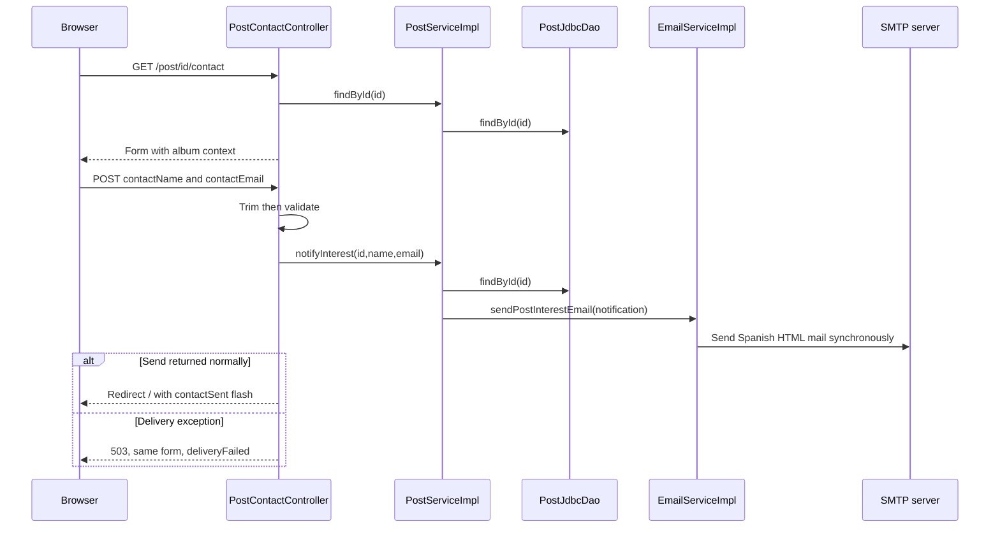

# Contact flow

The visitor opens a contact form from a publication card. The server resolves the publisher address from the Post; it never accepts the destination address from the visitor.

[[PostContactController]].initBinder trims before validation and converts blank strings to null. [[ContactForm]] requires name and email, limits each to 100 characters and checks email format. Invalid input returns the contact view after reloading the Post.

[[PostServiceImpl]].notifyInterest performs a fresh summary lookup to resolve recipient and album details. A missing result raises [[PostNotFoundException]] and the controller's handler returns 404. It trims the contact name and lowercases the trimmed contact email, then constructs [[PostInterestNotification]]. The method has no transaction spanning SMTP.

[[EmailServiceImpl]] sends to the publisher, from the configured application sender, with the contact email in Reply-To. The Spanish template includes contact name/email and album title/artist/year. It sends no copy to the visitor and stores no interest or conversation record.

## Success and failure semantics

Success means the mail sender call returned without an exception, not proof that the recipient read the email or that a downstream server delivered it. The controller adds only `contactSent=true` to flash storage and redirects; no personal details enter the redirect URL.

A rendering, message construction or SMTP failure wrapped as [[EmailDeliveryException]] produces status 503 and `deliveryFailed=true`. The existing form retains valid values for a manual retry. There is no queue, automatic retry, deduplication token or durable delivery history; retry after an ambiguous SMTP outcome can send another message.

Numeric route matching accepts digits only. A nonexistent numeric ID reaches the service and returns 404; malformed IDs do not take the normal contact handler path. No separate public Post-detail route exists.

[[Mail delivery]] · [[Validation and errors]] · [[EmailServiceImplTest]]

## UI integration at the current commit

The JSP shows a compact ui:vinyl-card and retains form:form with modelAttribute=contactForm. Relative contactName/contactEmail paths feed ui:text-input; all field errors are rendered. Submit and back buttons share the form action row. The 503 delivery failure branch remains unchanged. See [[Views and assets]] and [[UI components]].
