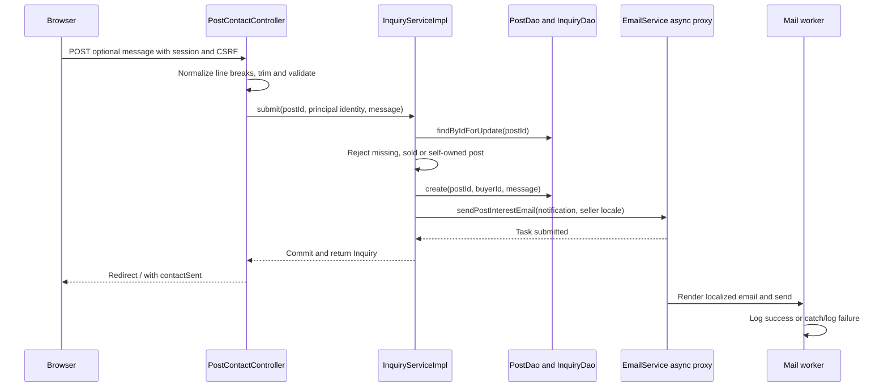

# Contact flow

GET /post/{postId}/contact requires authentication. [[InquiryServiceImpl]] loads the summary and rejects a missing post with 404, a sold post with 409 or self-contact with 403. The page shows a compact card and an optional message of at most 500 characters. Name and reply address come from the account principal.

## Flow diagram

The sequence follows the controller, service and DAO calls at 40328f0. Error handling and transaction limits are explained below; this is a source trace, not a runtime test.



The mail worker is shown separately for clarity. It may start before commit or before the redirect; CallerRunsPolicy can run the task on the caller when the pool is saturated.

## Behavior and limits

On POST the controller normalizes CRLF to LF and trims the message before validation. The service locks the publication row, checks contactability again, inserts a PENDING Inquiry and requests an interest email with authenticated buyer identity. The seller's persisted preferred locale determines the mail language.

Success redirects to / with contactSent. The inquiry transaction is independent of eventual SMTP delivery, so the seller can read the request in /inquiries even if the worker logs a mail failure. Dispatch occurs before commit, however; there is no outbox or after-commit guarantee. The success message establishes normal service completion, not receipt of email.

The submit-once script reduces accidental duplicate clicks on this form. There is no unique buyer/post constraint or server idempotency key, so repeated valid requests may create separate inquiries. They are initial requests with statuses, not a reply thread.

[[Inquiry and sale flow]] · [[Mail delivery]] · [[Transactions and concurrency]]

## Code snippets

### Persist before requesting mail

The locked summary supplies seller identity and language. The insert precedes mail dispatch, but transaction commit follows the method return. See [[InquiryServiceImpl]] for the complete class.

[services/src/main/java/ar/edu/itba/paw/services/InquiryServiceImpl.java, lines 42–62](<file:///Users/bautistapessagno/Desktop/ITBA/PAW/paw2026b/services/src/main/java/ar/edu/itba/paw/services/InquiryServiceImpl.java>)

```java
    @Override
    @Transactional
    public Inquiry submit(final long postId, final long buyerId, final String buyerUsername,
                          final String buyerEmail, final String message) {
        // El summary ya trae el correo y el idioma del publicante del mismo JOIN: no hace
        // falta volver a buscar al vendedor para armar el aviso. Se bloquea la fila para que
        // la consulta no entre justo mientras se vende el ejemplar.
        final PostSummary post = postDao.findByIdForUpdate(postId).orElseThrow(PostNotFoundException::new);
        validateContactable(post, buyerId);
        final String normalizedMessage = normalizeMessage(message);
        final Inquiry inquiry = inquiryDao.create(postId, buyerId, normalizedMessage);
        LOGGER.info("Created inquiry inquiryId={} postId={} buyerId={}", inquiry.getId(), postId, buyerId);

        final PostInterestNotification notification = new PostInterestNotification(
                post.getId(), post.getPublisherEmail(), buyerUsername, buyerEmail, normalizedMessage,
                post.getTitle(), post.getArtistName(), post.getReleaseYear());
        // El idioma sale de la preferencia del publicante y se resuelve aca, antes del envio
        // @Async: del otro lado ya no hay request del que sacarlo.
        emailService.sendPostInterestEmail(notification, SupportedLocales.localeOf(post.getPublisherLocale()));
        return inquiry;
    }
```

### Contactability checks

The order produces 409 for a sold post before the self-contact check can produce 403. See [[InquiryServiceImpl]] for the complete class.

[services/src/main/java/ar/edu/itba/paw/services/InquiryServiceImpl.java, lines 128–135](<file:///Users/bautistapessagno/Desktop/ITBA/PAW/paw2026b/services/src/main/java/ar/edu/itba/paw/services/InquiryServiceImpl.java>)

```java
    private static void validateContactable(final PostSummary post, final long buyerId) {
        if (post.getStatus() != PostStatus.AVAILABLE) {
            throw new PostUnavailableException();
        }
        if (post.getUserId() == buyerId) {
            throw new ForbiddenOperationException();
        }
    }
```
