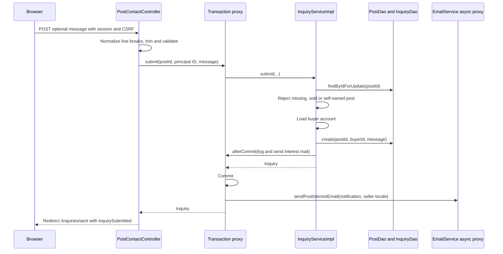

# Contact flow

A buyer now reaches the contact form from the public [[Post detail flow]]. GET /post/{id}/contact requires authentication. [[InquiryServiceImpl]] loads the summary and rejects a missing post with 404, a sold post with 409 or self-contact with 403. The page shows a compact card and an optional message of at most 500 characters; name and reply address come from the stored account.

## Flow diagram

The sequence follows the controller, service and DAO calls at `f12af08`. Error handling and transaction limits are explained below; this is a source trace, not a runtime test.



## Behavior and limits

On POST the controller normalizes CRLF to LF and trims the message before validation. The service locks the publication row, checks contactability again, loads the buyer account, inserts a PENDING Inquiry and registers the interest email for after commit. [[InquiryService]].submit no longer receives the buyer's display name or email from the controller; it reads them from the account. The seller's persisted preferred locale determines the mail language, and the message links the seller to /inquiries.

Success redirects to /inquiries/sent, the buyer's own inbox, with an `inquirySubmitted` notice. The inquiry is readable there and in the seller's received inbox even if the worker later fails to deliver the email. Because dispatch now waits for commit, a rolled-back submission sends nothing. A saturated mail pool drops the task with a warning rather than running it on the request thread.

The submit-once script reduces accidental duplicate clicks on this form. There is no unique buyer/post constraint or server idempotency key, so repeated valid requests may create separate inquiries; the inbox groups them under one publication. They are initial requests with statuses, not a reply thread.

[[Inquiry and sale flow]] · [[Mail delivery]] · [[Transactions and concurrency]]

## Code snippets

### Persist, then notify after commit

The locked summary supplies the seller's address and language. The buyer's identity comes from the account, and both the log line and the email wait for commit. See [[InquiryServiceImpl]] for the complete class.

[services/src/main/java/ar/edu/itba/paw/services/InquiryServiceImpl.java, lines 53–76](<file:///Users/bautistapessagno/Desktop/ITBA/PAW/paw2026b/services/src/main/java/ar/edu/itba/paw/services/InquiryServiceImpl.java>)

```java
    @Override
    @Transactional
    public Inquiry submit(final long postId, final long buyerId, final String message) {
        // El summary ya trae el correo y el idioma del publicante del mismo JOIN: no hace
        // falta volver a buscar al vendedor para armar el aviso. Se bloquea la fila para que
        // la consulta no entre justo mientras se vende el ejemplar.
        final PostSummary post = postDao.findByIdForUpdate(postId).orElseThrow(PostNotFoundException::new);
        validateContactable(post, buyerId);
        final User buyer = userService.findById(buyerId).orElseThrow(UserNotFoundException::new);
        final String normalizedMessage = normalizeMessage(message);
        final Inquiry inquiry = inquiryDao.create(postId, buyerId, normalizedMessage);

        final PostInterestNotification notification = new PostInterestNotification(
                post.getId(), post.getPublisherEmail(), buyer.getUsername(), buyer.getEmail(),
                normalizedMessage, post.getTitle(), post.getArtistName(), post.getReleaseYear());
        // El idioma sale de la preferencia del publicante y se resuelve aca, antes del envio
        // @Async: del otro lado ya no hay request del que sacarlo.
        final Locale publisherLocale = SupportedLocales.localeOf(post.getPublisherLocale());
        TransactionCallbacks.afterCommit(() -> {
            LOGGER.info("Created inquiry inquiryId={} postId={} buyerId={}", inquiry.getId(), postId, buyerId);
            emailService.sendPostInterestEmail(notification, publisherLocale);
        });
        return inquiry;
    }
```

### Contactability checks

The order produces 409 for a sold post before the self-contact check can produce 403. See [[InquiryServiceImpl]] for the complete class.

[services/src/main/java/ar/edu/itba/paw/services/InquiryServiceImpl.java, lines 211–218](<file:///Users/bautistapessagno/Desktop/ITBA/PAW/paw2026b/services/src/main/java/ar/edu/itba/paw/services/InquiryServiceImpl.java>)

```java
    private static void validateContactable(final PostSummary post, final long buyerId) {
        if (post.getStatus() != PostStatus.AVAILABLE) {
            throw new PostUnavailableException();
        }
        if (post.getUserId() == buyerId) {
            throw new ForbiddenOperationException();
        }
    }
```

### Controller redirect

The buyer lands on the sent inbox instead of the catalog. See [[PostContactController]] for the complete class.

[webapp/src/main/java/ar/edu/itba/paw/webapp/controller/PostContactController.java, lines 57–71](<file:///Users/bautistapessagno/Desktop/ITBA/PAW/paw2026b/webapp/src/main/java/ar/edu/itba/paw/webapp/controller/PostContactController.java>)

```java
    @RequestMapping(value = "/post/{postId:[0-9]+}/contact", method = RequestMethod.POST)
    public ModelAndView contact(@PathVariable("postId") final long postId,
                                @Valid @ModelAttribute("contactForm") final ContactForm form,
                                final BindingResult errors,
                                @AuthenticationPrincipal final AuthenticatedUser currentUser,
                                final RedirectAttributes redirectAttributes) {
        if (errors.hasErrors()) {
            return contactForm(postId, form, currentUser);
        }
        inquiryService.submit(postId, currentUser.getId(), form.getContactMessage());

        // El aviso es para el comprador: vuelve a su propia bandeja, la de enviadas.
        redirectAttributes.addFlashAttribute("inquirySubmitted", true);
        return new ModelAndView("redirect:/inquiries/sent");
    }
```

## Evidencia local anterior, 2026-09-17

[[Audit local 2026-09-17]] ejecutó la rama `e5e926d`, anterior a `f12af08`. Sus resultados de ejecución no se repitieron para esta revisión; [[Known gaps and document drift]] indica qué hallazgos del audit quedaron resueltos en el código actual y cuáles siguen abiertos.
