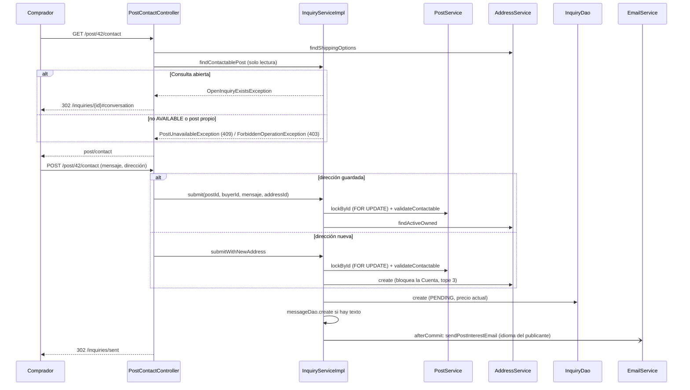

# Contact flow

> [!summary] En una frase
> Una Cuenta verificada elige o carga una dirección de envío, opcionalmente escribe un mensaje, y eso crea la Consulta en `PENDING` y avisa por correo al publicante; el precio de la venta se fija recién cuando el publicante acepta.

## Qué resuelve

El primer paso de una compra: `GET` y `POST /post/{id}/contact`. Lo que sigue está en [[Inquiry and sale flow]].

## Herramientas

| Herramienta | Para qué se usa acá |
|---|---|
| Spring MVC + Bean Validation | [[ContactForm]], que hereda la dirección de [[ShippingAddressForm]] y su validador de clase condicional |
| [[ContactRules]] | La regla "se puede consultar", en un solo lugar para contacto, carrito y ficha |
| `@InitBinder` con `StringTrimmerEditor(true)` y [[LineBreakNormalizingEditor]] | Recortar, convertir vacíos en `null` y normalizar saltos de línea antes de validar |
| `SELECT ... FOR UPDATE` sobre el post | Que la consulta no entre mientras se vende el ejemplar, y serializar dos envíos del mismo comprador |
| `@Transactional` | Dirección nueva y consulta en la misma transacción |
| `submit-once.js` | Deshabilitar el botón al enviar |
| [[TransactionCallbacks]] + correo asíncrono | Aviso al publicante en su idioma |

## Recorrido paso a paso

### `GET /post/{id}/contact`

1. Exige `VERIFIED` (está en `VERIFIED_PATHS`). Un anónimo va al login y vuelve; una Cuenta sin verificar va a `/verify/required`.
2. `addressService.findShippingOptions` trae, en una lectura, las direcciones activas, la propuesta (la más reciente) y si se puede sumar otra. La propuesta se preselecciona solo en el `GET` inicial: al volver a mostrar un error se respeta lo que la persona eligió.
3. `buildContactView` llama a `inquiryService.findContactablePost`, que le pregunta a `ContactRules.stateOf` y traduce el resultado, en este orden:
   - Si el comprador ya tiene una Consulta abierta sobre ese post, `OpenInquiryExistsException`: redirige a esa conversación con un aviso.
   - Si el post no está `AVAILABLE`, `PostUnavailableException`: 409.
   - Si el post es propio, `ForbiddenOperationException`: 403.
4. La vista recibe las direcciones y `canAddAddress`, los dos de [[ShippingOptions]].

### `POST /post/{id}/contact`

1. Binder: recorta todos los `String`, deja vacíos como `null` y normaliza CRLF a LF en el mensaje, para que `@Size(max = 500)` cuente lo mismo que el `maxlength` del textarea.
2. Validación: mensaje hasta 500. Si no se eligió una dirección guardada (`addressId` nulo), [[ShippingAddressValidator]] exige calle, altura, ciudad, código postal y provincia. El mismo formulario base y el mismo validador sirven al envío del carrito.
3. Service, en una transacción:
   - `lockContactablePost`: bloquea el post y repite las tres validaciones del `GET`.
   - Con dirección guardada: tiene que ser del comprador y no estar archivada (`findActiveOwned`); si no, `AddressNotFoundException`.
   - Con dirección nueva: `addressService.create`, que bloquea la Cuenta y respeta el tope de 3. Se valida el post **antes** de guardar la dirección: si la consulta no puede entrar, no se escribe nada.
   - `create`: normaliza el mensaje, inserta la consulta con `status = PENDING`, la dirección y **el precio actual del post** como respaldo (si el post se elimina, es el que queda; el de la venta lo fija `accept`, ver [[Inquiry and sale flow]]); si hay texto, lo inserta como primer Mensaje.
   - Registra el correo de "consulta nueva" para después del commit, con el idioma guardado del publicante.
4. Controller: aviso flash `inquirySubmitted` y redirección a `/inquiries/sent`, la bandeja del comprador.


```mermaid
sequenceDiagram
    participant B as Comprador
    participant C as PostContactController
    participant S as InquiryServiceImpl
    participant P as PostService
    participant A as AddressService
    participant D as InquiryDao
    participant M as EmailService
    B->>C: GET /post/42/contact
    C->>A: findShippingOptions
    C->>S: findContactablePost (solo lectura)
    alt Consulta abierta
        S-->>C: OpenInquiryExistsException
        C-->>B: 302 /inquiries/{id}#35;conversation
    else no AVAILABLE o post propio
        S-->>C: PostUnavailableException (409) / ForbiddenOperationException (403)
    end
    C-->>B: post/contact
    B->>C: POST /post/42/contact (mensaje, dirección)
    alt dirección guardada
        C->>S: submit(postId, buyerId, mensaje, addressId)
        S->>P: lockById (FOR UPDATE) + validateContactable
        S->>A: findActiveOwned
    else dirección nueva
        C->>S: submitWithNewAddress
        S->>P: lockById (FOR UPDATE) + validateContactable
        S->>A: create (bloquea la Cuenta, tope 3)
    end
    S->>D: create (PENDING, precio actual)
    S->>S: messageDao.create si hay texto
    S-)M: afterCommit: sendPostInterestEmail (idioma del publicante)
    C-->>B: 302 /inquiries/sent
```

## Datos

| Tabla | Qué se escribe |
|---|---|
| `inquiries` | `post_id`, `buyer_id`, `status = 'PENDING'`, `address_id`, `price` |
| `inquiry_messages` | El texto opcional, como primer Mensaje |
| `addresses` | Solo si cargó una dirección nueva |

## Decisiones y por qué

| Decisión | Motivo | Fuente |
|---|---|---|
| A lo sumo una Consulta abierta por comprador y post | Aceptar o rechazar es decidir sobre ese comprador, no sobre un mensaje | Glosario de `CONTEXT.md`; ADR 0003 |
| La Consulta abierta se chequea antes que el estado del post | Si el post está reservado para él, igual tiene que llegar a su conversación | Comentario en [[InquiryServiceImpl]] |
| Bloquear el post al consultar | Que no entre justo mientras se vende, y que dos envíos del mismo comprador no dupliquen | Comentario en [[InquiryServiceImpl]] |
| Dirección nueva y consulta en una transacción | Si la consulta no entra, la dirección no ocupa un lugar del tope | Comentario en [[InquiryService]] |
| El precio se copia a la consulta solo como respaldo | Mientras está pendiente se muestra el precio actual del post; el monto pactado se fija al aceptar | ADR 0004, commit `7e073053` (antes: migración V5, que lo congelaba al consultar) |
| El correo usa el idioma del publicante | Quien lo lee no es quien dispara el request | Comentario en [[InquiryServiceImpl]] |
| El resumen del post ya trae correo e idioma del publicante | Evitar otra consulta para armar el aviso | Comentario en [[InquiryServiceImpl]] |
| Los campos de dirección del formulario no llevan `@NotBlank` | Solo son obligatorios cuando no se eligió una guardada | Comentario en [[ShippingAddressForm]] |
| La regla de contactabilidad vive en [[ContactRules]] | Contacto, carrito y ficha la decidían por separado; el PR #47 la unificó | Comentario en [[ContactRules]]; commit `0f9218f1` |
| Redirigir a enviadas | El aviso es para el comprador | Comentario en [[PostContactController]] |

## Concurrencia y casos borde

- Doble envío: el segundo espera el bloqueo del post, ve la Consulta abierta y redirige a la conversación.
- La dirección elegida se archivó en otra pestaña: error en el campo, sin perder el mensaje.
- Llegó al tope de direcciones desde otra pestaña: se vuelve a mostrar el formulario con el aviso.
- El post se vendió o se reservó entre el `GET` y el `POST`: 409.

## Límites conocidos

- El primer mensaje viaja dentro del correo de "consulta nueva"; no hay correo aparte.
- Sin tests de la capa web. Las reglas están en [[InquiryServiceImplTest]].

## Preguntas de defensa

**¿Puedo consultar dos veces por el mismo disco?**
No mientras tenga una abierta: el formulario redirige a esa conversación.

**¿Qué pasa si consulto mi propia publicación?**
403. El botón no se muestra, y el service lo impide igual.

**¿Por qué hay un validador propio en vez de `@NotBlank`?**
Porque la obligatoriedad depende de otro campo: con dirección guardada, los campos de dirección ni se completan.

**¿Por qué normalizan los saltos de línea?**
El navegador cuenta un salto como un carácter en `maxlength` pero lo envía como dos (CRLF). Sin normalizar, un mensaje válido en pantalla fallaría la validación.

## Evidencia de código

Controller:

Fuente exacta en `c3e2a4c`: [webapp/src/main/java/ar/edu/itba/paw/webapp/controller/PostContactController.java](</Users/bautistapessagno/Desktop/proyectos_itba/PAW/paw2026b/webapp/src/main/java/ar/edu/itba/paw/webapp/controller/PostContactController.java>), líneas 46–125.

```java
    // Recorta antes de validar, para que @Size mida el valor real y no los espacios de mas.
    @InitBinder
    public void initBinder(final WebDataBinder binder) {
        binder.registerCustomEditor(String.class, new StringTrimmerEditor(true));
        binder.registerCustomEditor(String.class, "contactMessage", new LineBreakNormalizingEditor());
    }

    @RequestMapping(value = "/post/{postId:[0-9]+}/contact", method = RequestMethod.GET)
    public ModelAndView contactForm(@PathVariable("postId") final long postId,
                                    @ModelAttribute("contactForm") final ContactForm form,
                                    @AuthenticationPrincipal final AuthenticatedUser currentUser) {
        final ShippingOptions shipping = addressService.findShippingOptions(currentUser.getId());
        // Solo en el GET inicial: al volver a mostrar un error se respeta lo que eligio.
        shipping.getDefaultAddress().ifPresent(address -> form.setAddressId(address.getId()));
        return buildContactView(postId, currentUser, shipping);
    }

    @RequestMapping(value = "/post/{postId:[0-9]+}/contact", method = RequestMethod.POST)
    public ModelAndView contact(@PathVariable("postId") final long postId,
                                @Valid @ModelAttribute("contactForm") final ContactForm form,
                                final BindingResult errors,
                                @AuthenticationPrincipal final AuthenticatedUser currentUser,
                                final RedirectAttributes redirectAttributes) {
        if (errors.hasErrors()) {
            return buildContactView(postId, currentUser);
        }
        try {
            if (form.isNewAddress()) {
                inquiryService.submitWithNewAddress(postId, currentUser.getId(), form.getContactMessage(),
                        form.getStreet(), form.getStreetNumber(), form.getApartment(), form.getCity(),
                        form.getProvince(), form.getPostalCode(), form.getNotes());
            } else {
                inquiryService.submit(postId, currentUser.getId(), form.getContactMessage(), form.getAddressId());
            }
        } catch (final AddressNotFoundException e) {
            // La eligio y despues la archivo en otra pestania: se vuelve a elegir sin perder el mensaje.
            errors.rejectValue("addressId", "post.contact.address.unavailable");
            return buildContactView(postId, currentUser);
        } catch (final AddressLimitExceededException e) {
            // Llego al tope desde otra pestania: se vuelve a mostrar el form sin perder el mensaje.
            final ModelAndView modelAndView = buildContactView(postId, currentUser);
            modelAndView.addObject("addressLimitReached", true);
            return modelAndView;
        }

        // El aviso es para el comprador: vuelve a su propia bandeja, la de enviadas.
        redirectAttributes.addFlashAttribute("inquirySubmitted", true);
        return new ModelAndView("redirect:/inquiries/sent");
    }

    private ModelAndView buildContactView(final long postId, final AuthenticatedUser currentUser) {
        return buildContactView(postId, currentUser, addressService.findShippingOptions(currentUser.getId()));
    }

    private ModelAndView buildContactView(final long postId, final AuthenticatedUser currentUser,
                                          final ShippingOptions shipping) {
        final PostSummary post = inquiryService.findContactablePost(postId, currentUser.getId());
        final ModelAndView modelAndView = new ModelAndView("post/contact");
        modelAndView.addObject("post", post);
        modelAndView.addObject("addresses", shipping.getAddresses());
        modelAndView.addObject("provinces", Province.values());
        modelAndView.addObject("canAddAddress", shipping.isNewAddressAllowed());
        modelAndView.addObject("maxAddresses", AddressService.MAX_ACTIVE_ADDRESSES);
        return modelAndView;
    }

    @ExceptionHandler(PostUnavailableException.class)
    @ResponseStatus(HttpStatus.CONFLICT)
    public ModelAndView postUnavailable() {
        return new ModelAndView("error/409");
    }

    // Ya tiene una Consulta abierta por este vinilo: sigue en esa Conversacion, tanto al abrir
    // el formulario como al enviarlo.
    @ExceptionHandler(OpenInquiryExistsException.class)
    public ModelAndView openInquiryExists(final OpenInquiryExistsException exception,
                                          final RedirectAttributes redirectAttributes) {
        redirectAttributes.addFlashAttribute("saleNotice", "inquiry.alreadyOpen");
        return new ModelAndView("redirect:/inquiries/" + exception.getInquiryId() + "#conversation");
    }
```

Service:

Fuente exacta en `c3e2a4c`: [services/src/main/java/ar/edu/itba/paw/services/InquiryServiceImpl.java](</Users/bautistapessagno/Desktop/proyectos_itba/PAW/paw2026b/services/src/main/java/ar/edu/itba/paw/services/InquiryServiceImpl.java>), líneas 68–135.

```java
    @Override
    @Transactional(readOnly = true)
    public PostSummary findContactablePost(final long postId, final long buyerId) {
        final PostSummary post = postService.findById(postId);
        validateContactable(post, buyerId);
        return post;
    }

    @Override
    @Transactional
    public Inquiry submit(final long postId, final long buyerId, final String message, final long addressId) {
        final PostSummary post = lockContactablePost(postId, buyerId);
        // La direccion tiene que ser del comprador y seguir vigente: puede haberla archivado
        // en otra pestania despues de cargar el formulario.
        if (addressService.findActiveOwned(addressId, buyerId).isEmpty()) {
            throw new AddressNotFoundException();
        }
        return create(post, buyerId, message, addressId);
    }

    // El post se valida antes de guardar la direccion: si la consulta no puede entrar, no
    // se escribe nada.
    @Override
    @Transactional
    public Inquiry submitWithNewAddress(final long postId, final long buyerId, final String message,
                                        final String street, final String streetNumber, final String apartment,
                                        final String city, final Province province, final String postalCode,
                                        final String notes) {
        final PostSummary post = lockContactablePost(postId, buyerId);
        final Address address = addressService.create(buyerId, street, streetNumber, apartment, city, province,
                postalCode, notes);
        return create(post, buyerId, message, address.getId());
    }

    // El summary ya trae el correo y el idioma del publicante del mismo JOIN: no hace falta
    // volver a buscar al vendedor para armar el aviso. Se bloquea la fila para que la consulta
    // no entre justo mientras se vende el ejemplar; el mismo bloqueo serializa dos envios del
    // mismo comprador, asi el chequeo de Consulta abierta no deja pasar un duplicado.
    private PostSummary lockContactablePost(final long postId, final long buyerId) {
        final PostSummary post = postService.lockById(postId);
        validateContactable(post, buyerId);
        return post;
    }

    // El texto opcional es el primer Mensaje. No dispara el mail de Mensaje nuevo: ya viaja en
    // el de Consulta nueva.
    private Inquiry create(final PostSummary post, final long buyerId, final String message, final long addressId) {
        final String normalizedMessage = MessageRules.normalize(message);
        if (normalizedMessage != null && !MessageRules.isValid(normalizedMessage)) {
            throw new InvalidMessageException();
        }
        final User buyer = userService.findById(buyerId).orElseThrow(UserNotFoundException::new);
        final Inquiry inquiry = inquiryDao.create(post.getId(), buyerId, addressId, post.getPrice());
        if (normalizedMessage != null) {
            messageDao.create(inquiry.getId(), buyerId, normalizedMessage);
        }

        final PostInterestNotification notification = new PostInterestNotification(post.getPublisherEmail(),
                buyer.getUsername(), normalizedMessage, List.of(interestedPost(post, inquiry)));
        // El idioma sale de la preferencia del publicante y se resuelve aca, antes del envio
        // @Async: del otro lado ya no hay request del que sacarlo.
        final Locale publisherLocale = SupportedLocales.localeOf(post.getPublisherLocale());
        TransactionCallbacks.afterCommit(() -> {
            LOGGER.info("Created inquiry inquiryId={} postId={} buyerId={}", inquiry.getId(), post.getId(), buyerId);
            emailService.sendPostInterestEmail(notification, publisherLocale);
        });
        return inquiry;
    }
```

La única definición de "se puede consultar", compartida con el carrito y la ficha:

Fuente exacta en `c3e2a4c`: [services/src/main/java/ar/edu/itba/paw/services/ContactRules.java](</Users/bautistapessagno/Desktop/proyectos_itba/PAW/paw2026b/services/src/main/java/ar/edu/itba/paw/services/ContactRules.java>), líneas 9–44.

```java
/*
 * La unica definicion de "se puede consultar": disponible, ajeno y sin una Consulta abierta
 * del comprador. El contacto, el carrito y la ficha la leen de aca; el carrito le pasa a su DAO
 * estas mismas constantes para filtrar en la base. Lo ajeno no hace falta filtrarlo ahi: add()
 * nunca deja entrar un Post propio.
 */
final class ContactRules {

    static final PostStatus CONTACTABLE_POST_STATUS = PostStatus.AVAILABLE;

    static final List<InquiryStatus> BLOCKING_INQUIRY_STATUSES = InquiryStatus.OPEN_STATUSES;

    private ContactRules() {
    }

    // Una Consulta abierta gana: el comprador tiene que llegar a su Conversacion aunque el
    // post ya este reservado para el.
    static ContactState stateOf(final PostStatus postStatus, final long sellerId, final long buyerId,
                                final boolean hasOpenInquiry) {
        if (hasOpenInquiry) {
            return ContactState.OPEN_INQUIRY;
        }
        if (stateForAnonymous(postStatus) == ContactState.UNAVAILABLE) {
            return ContactState.UNAVAILABLE;
        }
        if (sellerId == buyerId) {
            return ContactState.OWN_POST;
        }
        return ContactState.CONTACTABLE;
    }

    // Sin sesion no hay Consulta abierta ni post propio: solo cuenta el estado del post.
    static ContactState stateForAnonymous(final PostStatus postStatus) {
        return postStatus == CONTACTABLE_POST_STATUS ? ContactState.CONTACTABLE : ContactState.UNAVAILABLE;
    }
}
```

Cómo la traduce el contacto a excepciones:

Fuente exacta en `c3e2a4c`: [services/src/main/java/ar/edu/itba/paw/services/InquiryServiceImpl.java](</Users/bautistapessagno/Desktop/proyectos_itba/PAW/paw2026b/services/src/main/java/ar/edu/itba/paw/services/InquiryServiceImpl.java>), líneas 551–561.

```java
    // Un comprador tiene a lo sumo una Consulta abierta por post: si ya la tiene, va a esa
    // Conversacion.
    private void validateContactable(final PostSummary post, final long buyerId) {
        final Optional<Long> openId = inquiryDao.findOpenIdByPostAndBuyer(post.getId(), buyerId);
        switch (ContactRules.stateOf(post.getStatus(), post.getUserId(), buyerId, openId.isPresent())) {
            case OPEN_INQUIRY -> throw new OpenInquiryExistsException(openId.orElseThrow());
            case UNAVAILABLE -> throw new PostUnavailableException();
            case OWN_POST -> throw new ForbiddenOperationException();
            case CONTACTABLE -> { }
        }
    }
```

Validador condicional:

Fuente exacta en `c3e2a4c`: [webapp/src/main/java/ar/edu/itba/paw/webapp/validation/ShippingAddressValidator.java](</Users/bautistapessagno/Desktop/proyectos_itba/PAW/paw2026b/webapp/src/main/java/ar/edu/itba/paw/webapp/validation/ShippingAddressValidator.java>), líneas 9–48.

```java
public class ShippingAddressValidator implements ConstraintValidator<ValidShippingAddress, ShippingAddressForm> {

    // Con direccion guardada elegida los campos de direccion no se completan: no hay nada
    // que validar. Sin ella, se esta cargando una nueva y sus campos obligatorios rigen.
    @Override
    public boolean isValid(final ShippingAddressForm form, final ConstraintValidatorContext context) {
        if (form == null || !form.isNewAddress()) {
            return true;
        }

        boolean valid = true;
        context.disableDefaultConstraintViolation();
        if (!StringUtils.hasText(form.getStreet())) {
            reject(context, "street");
            valid = false;
        }
        if (!StringUtils.hasText(form.getStreetNumber())) {
            reject(context, "streetNumber");
            valid = false;
        }
        if (!StringUtils.hasText(form.getCity())) {
            reject(context, "city");
            valid = false;
        }
        if (!StringUtils.hasText(form.getPostalCode())) {
            reject(context, "postalCode");
            valid = false;
        }
        if (form.getProvince() == null) {
            reject(context, "province");
            valid = false;
        }
        return valid;
    }

    private static void reject(final ConstraintValidatorContext context, final String field) {
        context.buildConstraintViolationWithTemplate("{address.required}")
                .addPropertyNode(field).addConstraintViolation();
    }
}
```

## Archivos para seguir el flujo

- [webapp/src/main/java/ar/edu/itba/paw/webapp/controller/PostContactController.java](</Users/bautistapessagno/Desktop/proyectos_itba/PAW/paw2026b/webapp/src/main/java/ar/edu/itba/paw/webapp/controller/PostContactController.java>) · [[PostContactController]]
- [webapp/src/main/java/ar/edu/itba/paw/webapp/form/ContactForm.java](</Users/bautistapessagno/Desktop/proyectos_itba/PAW/paw2026b/webapp/src/main/java/ar/edu/itba/paw/webapp/form/ContactForm.java>) · [[ContactForm]]
- [webapp/src/main/java/ar/edu/itba/paw/webapp/form/ShippingAddressForm.java](</Users/bautistapessagno/Desktop/proyectos_itba/PAW/paw2026b/webapp/src/main/java/ar/edu/itba/paw/webapp/form/ShippingAddressForm.java>) · [[ShippingAddressForm]]
- [webapp/src/main/java/ar/edu/itba/paw/webapp/validation/ShippingAddressValidator.java](</Users/bautistapessagno/Desktop/proyectos_itba/PAW/paw2026b/webapp/src/main/java/ar/edu/itba/paw/webapp/validation/ShippingAddressValidator.java>) · [[ShippingAddressValidator]]
- [services/src/main/java/ar/edu/itba/paw/services/ContactRules.java](</Users/bautistapessagno/Desktop/proyectos_itba/PAW/paw2026b/services/src/main/java/ar/edu/itba/paw/services/ContactRules.java>) · [[ContactRules]]
- [models/src/main/java/ar/edu/itba/paw/models/ContactState.java](</Users/bautistapessagno/Desktop/proyectos_itba/PAW/paw2026b/models/src/main/java/ar/edu/itba/paw/models/ContactState.java>) · [[ContactState]]
- [models/src/main/java/ar/edu/itba/paw/models/ShippingOptions.java](</Users/bautistapessagno/Desktop/proyectos_itba/PAW/paw2026b/models/src/main/java/ar/edu/itba/paw/models/ShippingOptions.java>) · [[ShippingOptions]]
- [webapp/src/main/java/ar/edu/itba/paw/webapp/form/LineBreakNormalizingEditor.java](</Users/bautistapessagno/Desktop/proyectos_itba/PAW/paw2026b/webapp/src/main/java/ar/edu/itba/paw/webapp/form/LineBreakNormalizingEditor.java>) · [[LineBreakNormalizingEditor]]
- [services/src/main/java/ar/edu/itba/paw/services/InquiryServiceImpl.java](</Users/bautistapessagno/Desktop/proyectos_itba/PAW/paw2026b/services/src/main/java/ar/edu/itba/paw/services/InquiryServiceImpl.java>) · [[InquiryServiceImpl]]
- [services/src/main/java/ar/edu/itba/paw/services/AddressServiceImpl.java](</Users/bautistapessagno/Desktop/proyectos_itba/PAW/paw2026b/services/src/main/java/ar/edu/itba/paw/services/AddressServiceImpl.java>) · [[AddressServiceImpl]]
- [persistence/src/main/java/ar/edu/itba/paw/persistence/InquiryJdbcDao.java](</Users/bautistapessagno/Desktop/proyectos_itba/PAW/paw2026b/persistence/src/main/java/ar/edu/itba/paw/persistence/InquiryJdbcDao.java>) · [[InquiryJdbcDao]]
- [services-contracts/src/main/java/ar/edu/itba/paw/services/PostInterestNotification.java](</Users/bautistapessagno/Desktop/proyectos_itba/PAW/paw2026b/services-contracts/src/main/java/ar/edu/itba/paw/services/PostInterestNotification.java>) · [[PostInterestNotification]]
- [services-contracts/src/main/java/ar/edu/itba/paw/services/OpenInquiryExistsException.java](</Users/bautistapessagno/Desktop/proyectos_itba/PAW/paw2026b/services-contracts/src/main/java/ar/edu/itba/paw/services/OpenInquiryExistsException.java>) · [[OpenInquiryExistsException]]
- [webapp/src/main/webapp/WEB-INF/views/post/contact.jsp](</Users/bautistapessagno/Desktop/proyectos_itba/PAW/paw2026b/webapp/src/main/webapp/WEB-INF/views/post/contact.jsp>)

Fuente inspeccionada: `c3e2a4c`, 2026-10-05. Es evidencia estática; no implica ejecución de la aplicación. [[Source inventory]] · [[Roadmap de lectura]]
