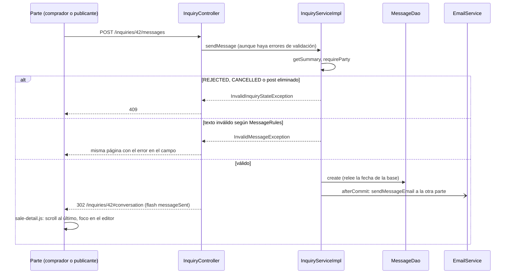

# Conversation flow

> [!summary] En una frase
> Cada Consulta tiene un hilo de Mensajes entre comprador y publicante, visible al pie de su página; escribir guarda el Mensaje y avisa por correo a la otra parte, y el hilo se cierra cuando la Consulta se rechaza o se cancela.

## Qué resuelve

Que las dos partes puedan hablar dentro de la aplicación (PR #45). Antes la consulta llevaba un único texto y la respuesta ocurría por correo. El PR #54 rearmó la página de la venta: conversación y datos de la venta en una sola vista, sin tarjetas separadas, con el editor fijo al pie del hilo.

## Herramientas

| Herramienta | Para qué se usa acá |
|---|---|
| Spring MVC + Bean Validation | [[MessageForm]]: texto obligatorio hasta 500 |
| [[MessageRules]] (en `models`) | Normalización y tope, compartidos por formulario y service |
| `@PreAuthorize("@inquiryAccess.isParty")` | Solo las dos partes escriben y leen |
| Spring JDBC | Tabla `inquiry_messages` |
| Subconsulta agregada con `LEFT JOIN` | Traer el último Mensaje de cada Consulta en la bandeja sin N+1 |
| [[TransactionCallbacks]] + `@Async` | Correo de "mensaje nuevo" |
| Flyway V7 | Crear la tabla y migrar el texto viejo |
| `sale-detail.js` | Mejora progresiva de la página: alto del hilo, scroll al último Mensaje, foco en el editor y Enter para enviar |
| `RedirectAttributes.addFlashAttribute` | El flag `messageSent` le avisa a la página siguiente que tiene que devolver el foco al editor |

## Recorrido paso a paso

### Leer: `GET /inquiries/{id}`

`findDetail` exige que quien mira sea una de las partes, arma [[InquiryDetail]] con `messageDao.findByInquiryId` (ordenado por id, del más viejo al más nuevo) y la vista marca los Mensajes propios comparando `senderId` con `viewerId`.

### Escribir: `POST /inquiries/{id}/messages`

1. `VERIFIED` por URL, `isParty` por recurso, token CSRF.
2. Binder: recorte y normalización de saltos, igual que en el formulario de contacto.
3. El controller llama al service **aunque haya errores de validación**. Motivo: el service decide primero si la conversación está cerrada, y eso tiene que ganar sobre un texto inválido.
4. `InquiryServiceImpl.sendMessage`:
   - Exige ser una de las partes.
   - Si la conversación está cerrada (`REJECTED` o `CANCELLED`) o el post fue eliminado, `InvalidInquiryStateException`: 409.
   - Normaliza y valida con [[MessageRules]]; si no cumple, `InvalidMessageException`.
   - Inserta el Mensaje. El DAO relee la fila para devolver la fecha que puso la base.
   - Arma el aviso para la otra parte con su correo e idioma, y lo registra para después del commit.
5. Controller: con `InvalidMessageException` vuelve a dibujar la página con el error en el campo; si salió bien, deja el flash `messageSent` y redirige a `/inquiries/{id}#conversation`.
6. Página siguiente: el formulario sale con `data-focus-message="true"` y `sale-detail.js`:
   - Lleva el scroll del hilo (`data-conversation-history`) al último Mensaje.
   - En pantallas de más de 900 px ajusta el alto del hilo (`--conversation-height`) al espacio que queda en la ventana.
   - Devuelve el foco al editor en `pageshow` si se acaba de enviar o si el campo tiene error.
   - Enter envía con `requestSubmit` y Shift+Enter hace un salto de línea. Se ignora mientras hay una composición de IME activa (`isComposing`, `keyCode 229`), para no cortar una palabra a medio escribir.
   Sin JavaScript todo funciona igual con el botón "Enviar".



## Datos

Fuente exacta en `c3e2a4c`: [persistence/src/main/resources/db/migration/V7__mensajes_de_consulta.sql](</Users/bautistapessagno/Desktop/proyectos_itba/PAW/paw2026b/persistence/src/main/resources/db/migration/V7__mensajes_de_consulta.sql>), líneas 1–18.

```sql
-- Cada Consulta tiene su Conversacion. El texto con el que se creaba la Consulta pasa a ser
-- su primer Mensaje, con la misma fecha, y la columna deja de existir.
CREATE TABLE inquiry_messages (
    id SERIAL PRIMARY KEY,
    inquiry_id INTEGER NOT NULL,
    sender_id INTEGER NOT NULL,
    body VARCHAR(500) NOT NULL,
    created_at TIMESTAMP DEFAULT NOW() NOT NULL,
    CONSTRAINT inquiry_messages_inquiry_fk FOREIGN KEY (inquiry_id) REFERENCES inquiries(id),
    CONSTRAINT inquiry_messages_sender_fk FOREIGN KEY (sender_id) REFERENCES users(id)
);
CREATE INDEX inquiry_messages_inquiry_id_idx ON inquiry_messages (inquiry_id);

-- inquiries.message ya se guardaba recortado y en NULL si quedaba vacio.
INSERT INTO inquiry_messages (inquiry_id, sender_id, body, created_at)
SELECT id, buyer_id, message, created_at FROM inquiries WHERE message IS NOT NULL;

ALTER TABLE inquiries DROP COLUMN message;
```

La migración convierte el texto que tenía cada consulta en su primer Mensaje, con la misma fecha, y elimina la columna `inquiries.message`.

## Decisiones y por qué

| Decisión | Alternativa | Motivo | Fuente |
|---|---|---|---|
| Enter envía, con guarda de IME | Enviar solo con el botón | Es lo esperable en un chat; la guarda evita enviar mientras se compone un carácter con acentos o en idiomas asiáticos | Commit `a88e7e20` (inferencia sobre el motivo de la guarda) |
| El foco vuelve al editor después de enviar | Dejar el foco donde lo pone el navegador tras la redirección | Seguir escribiendo sin volver a hacer clic; se usa `pageshow` para que funcione también al volver con el historial | Commits `bda29dcf`, `c1a3dacf` |
| La conversación vive dentro de la Consulta, una por Consulta, con Mensajes inmutables | Un hilo previo a la compra por Post | Sería un segundo agregado con sus propias reglas de acceso y su bandeja | ADR 0003 |
| Se actualiza recargando la página | Entrega en tiempo real | WebSocket o polling no se justifican en esta etapa | ADR 0003 |
| Se quitó el `Reply-To` de los correos | Que el publicante responda por correo (flujo anterior) | Ninguna parte conoce el correo de la otra, y la Conversación es el único registro de lo acordado | ADR 0003 |
| Escribir no bloquea el post | Bloquear como en las transiciones | No es un cambio de estado. Si la consulta se rechaza en el mismo instante, el Mensaje puede entrar igual: riesgo aceptado | Comentario en [[InquiryServiceImpl]] |
| Conversación cerrada gana sobre texto inválido | Validar el texto primero | Mostrar "texto muy largo" en una conversación cerrada sería engañoso | Comentario en [[InquiryController]] |
| Ordenar por id y no por fecha | `ORDER BY created_at` | El id es serial: ordena por llegada aunque dos Mensajes compartan fecha | Comentario en [[MessageJdbcDao]] |
| El último Mensaje se trae con `MAX(id)` agrupado | Una consulta por fila de la bandeja | Evitar N+1 | Comentario en [[InquiryJdbcDao]] |
| El `RowMapper` de Mensaje es package-private y lo reutiliza [[InquiryJdbcDao]] | Duplicar el mapeo | Una columna nueva se agrega en un solo lugar | Comentario en [[MessageJdbcDao]] |
| El cuerpo del Mensaje no se loguea | Loguearlo | Es contenido privado | Comentario en [[EmailServiceImpl]] |
| El primer texto no dispara "mensaje nuevo" | Mandar dos correos | Ya viaja en el de "consulta nueva" | Comentario en [[InquiryServiceImpl]] |

## Concurrencia y casos borde

- Un Mensaje enviado justo cuando la Consulta se rechaza puede guardarse. Está documentado como riesgo aceptado.
- Post eliminado: la conversación queda de solo lectura (no hay publicante "vivo" de donde sacar correo e idioma).
- Doble envío: `submit-once.js` deshabilita el botón; si igual llegan dos, se guardan dos Mensajes.

## Límites conocidos

- No hay tiempo real: hay que recargar la página para ver un Mensaje nuevo.
- Enter envía solo con JavaScript y si el navegador tiene `requestSubmit`; si no, Enter hace un salto de línea y se envía con el botón.
- No hay marca de leído ni contador de no leídos.
- Cada Mensaje dispara un correo; no se agrupan.
- Sin paginación del hilo.

## Preguntas de defensa

**¿Por qué el controller llama al service aunque el formulario tenga errores?**
Para que el cierre de la conversación (409) se decida antes que la validación del texto. El service aplica las mismas reglas, así que un texto inválido nunca se guarda.

**¿Cómo traen el último mensaje de cada consulta sin N+1?**
Una subconsulta `SELECT inquiry_id, MAX(id) ... GROUP BY inquiry_id` unida por `LEFT JOIN`. Se resuelve una vez por sentencia.

**¿Cuándo se cierra una conversación?**
Cuando la Consulta queda `REJECTED` o `CANCELLED`, o cuando se elimina la publicación. Una venta confirmada la deja abierta.

**¿Quién recibe el correo?**
La otra parte, en el idioma guardado en su Cuenta, con un enlace que baja directo a la conversación.

## Evidencia de código

Service:

Fuente exacta en `c3e2a4c`: [services/src/main/java/ar/edu/itba/paw/services/InquiryServiceImpl.java](</Users/bautistapessagno/Desktop/proyectos_itba/PAW/paw2026b/services/src/main/java/ar/edu/itba/paw/services/InquiryServiceImpl.java>), líneas 446–476.

```java
    /*
     * Escribir no es una transicion de estado: no bloquea el post. Si la Consulta se rechaza en
     * el mismo instante, el Mensaje puede entrar igual; es un riesgo aceptado. Toda Conversacion
     * abierta tiene un post vivo, de donde salen el correo y el idioma del Publicante.
     */
    @Override
    @Transactional
    public Message sendMessage(final long inquiryId, final long senderId, final String body) {
        final InquirySummary inquiry = getSummary(inquiryId);
        requireParty(inquiry, senderId);
        if (!inquiry.isConversationOpen() || inquiry.isPostDeleted()) {
            throw new InvalidInquiryStateException();
        }
        final String normalizedBody = MessageRules.normalize(body);
        if (!MessageRules.isValid(normalizedBody)) {
            throw new InvalidMessageException();
        }
        final Message message = messageDao.create(inquiryId, senderId, normalizedBody);

        final PostSummary post = postService.findById(inquiry.getPostId());
        final boolean bySeller = inquiry.getSellerId() == senderId;
        final String recipientEmail = bySeller ? inquiry.getBuyerEmail() : post.getPublisherEmail();
        final Locale recipientLocale = SupportedLocales.localeOf(
                bySeller ? inquiry.getBuyerLocale() : post.getPublisherLocale());
        final MessageNotification notification = new MessageNotification(inquiryId, recipientEmail,
                bySeller ? inquiry.getSellerUsername() : inquiry.getBuyerUsername(), normalizedBody,
                post.getTitle(), post.getArtistName(), post.getReleaseYear());
        TransactionCallbacks.afterCommit(() -> emailService.sendMessageEmail(notification, recipientLocale));
        LOGGER.info("Sent message inquiryId={} messageId={} bySeller={}", inquiryId, message.getId(), bySeller);
        return message;
    }
```

Controller:

Fuente exacta en `c3e2a4c`: [webapp/src/main/java/ar/edu/itba/paw/webapp/controller/InquiryController.java](</Users/bautistapessagno/Desktop/proyectos_itba/PAW/paw2026b/webapp/src/main/java/ar/edu/itba/paw/webapp/controller/InquiryController.java>), líneas 167–189.

```java
    /*
     * Una Conversacion cerrada cae en el handler de InvalidInquiryStateException: 409. El service
     * se llama aun con errores de validacion: decide el cierre antes que el texto, y el form
     * aplica las mismas MessageRules, asi que un texto invalido nunca llega a guardarse.
     */
    @PreAuthorize("@inquiryAccess.isParty(authentication, #inquiryId)")
    @RequestMapping(value = "/{inquiryId:[0-9]+}/messages", method = RequestMethod.POST)
    public ModelAndView sendMessage(@PathVariable("inquiryId") final long inquiryId,
                                    @AuthenticationPrincipal final AuthenticatedUser currentUser,
                                    @Valid @ModelAttribute("messageForm") final MessageForm messageForm,
                                    final BindingResult bindingResult,
                                    final RedirectAttributes redirectAttributes) {
        try {
            inquiryService.sendMessage(inquiryId, currentUser.getId(), messageForm.getBody());
        } catch (final InvalidMessageException e) {
            if (!bindingResult.hasErrors()) {
                bindingResult.rejectValue("body", "inquiry.message.body.size");
            }
            return detailView(inquiryId, currentUser.getId(), new ReceiptForm(), messageForm, null);
        }
        redirectAttributes.addFlashAttribute("messageSent", true);
        return new ModelAndView("redirect:/inquiries/" + inquiryId + "#conversation");
    }
```

Reglas del texto:

Fuente exacta en `c3e2a4c`: [models/src/main/java/ar/edu/itba/paw/models/MessageRules.java](</Users/bautistapessagno/Desktop/proyectos_itba/PAW/paw2026b/models/src/main/java/ar/edu/itba/paw/models/MessageRules.java>), líneas 3–24.

```java
// Que texto se acepta como Mensaje, compartido por el formulario y por InquiryService.
public final class MessageRules {

    public static final int MAX_LENGTH = 500;

    private MessageRules() {
    }

    // Unico lugar que normaliza: CRLF a LF y recorte. null si no queda texto.
    public static String normalize(final String body) {
        if (body == null) {
            return null;
        }
        final String normalized = body.replace("\r\n", "\n").trim();
        return normalized.isEmpty() ? null : normalized;
    }

    // Espera el texto ya normalizado.
    public static boolean isValid(final String normalized) {
        return normalized != null && normalized.length() <= MAX_LENGTH;
    }
}
```

DAO:

Fuente exacta en `c3e2a4c`: [persistence/src/main/java/ar/edu/itba/paw/persistence/MessageJdbcDao.java](</Users/bautistapessagno/Desktop/proyectos_itba/PAW/paw2026b/persistence/src/main/java/ar/edu/itba/paw/persistence/MessageJdbcDao.java>), líneas 18–66.

```java
    // Package-private: InquiryJdbcDao trae el ultimo Mensaje de cada Consulta por JOIN con los
    // mismos alias y lo mapea con este mismo mapper, igual que hace con las direcciones.
    static final RowMapper<Message> ROW_MAPPER = (resultSet, rowNum) -> new Message(
            resultSet.getLong("message_id"),
            resultSet.getLong("message_inquiry_id"),
            resultSet.getLong("message_sender_id"),
            resultSet.getString("message_body"),
            resultSet.getTimestamp("message_created_at").toLocalDateTime()
    );

    private static final String SELECT = "SELECT " + columns("m") + " FROM inquiry_messages m ";

    // Las columnas que espera ROW_MAPPER, con el alias de tabla que use cada consulta.
    static String columns(final String alias) {
        return alias + ".id AS message_id, " + alias + ".inquiry_id AS message_inquiry_id, "
                + alias + ".sender_id AS message_sender_id, " + alias + ".body AS message_body, "
                + alias + ".created_at AS message_created_at";
    }

    private final JdbcTemplate jdbcTemplate;
    private final SimpleJdbcInsert jdbcInsert;

    @Autowired
    public MessageJdbcDao(final DataSource dataSource) {
        this.jdbcTemplate = new JdbcTemplate(dataSource);
        this.jdbcInsert = new SimpleJdbcInsert(dataSource)
                .withTableName("inquiry_messages")
                .usingColumns("inquiry_id", "sender_id", "body")
                .usingGeneratedKeyColumns("id");
    }

    // Relee la fila para devolver la fecha que puso la base, que es la que se va a mostrar.
    @Override
    public Message create(final long inquiryId, final long senderId, final String body) {
        final Map<String, Object> parameters = new HashMap<>();
        parameters.put("inquiry_id", inquiryId);
        parameters.put("sender_id", senderId);
        parameters.put("body", body);
        final long id = jdbcInsert.executeAndReturnKey(parameters).longValue();
        return jdbcTemplate.queryForObject(SELECT + "WHERE m.id = ?", ROW_MAPPER, id);
    }

    // El id es serial: ordenar por id es ordenar por llegada aunque dos compartan created_at.
    @Override
    public List<Message> findByInquiryId(final long inquiryId) {
        return List.copyOf(jdbcTemplate.query(SELECT + "WHERE m.inquiry_id = ? ORDER BY m.id", ROW_MAPPER,
                inquiryId));
    }
}
```

Último Mensaje en la bandeja:

Fuente exacta en `c3e2a4c`: [persistence/src/main/java/ar/edu/itba/paw/persistence/InquiryJdbcDao.java](</Users/bautistapessagno/Desktop/proyectos_itba/PAW/paw2026b/persistence/src/main/java/ar/edu/itba/paw/persistence/InquiryJdbcDao.java>), líneas 86–109.

```java
    private static final String SUMMARY_SELECT = "SELECT i.id AS inquiry_id, p.id AS post_id, "
            + "a.id AS album_id, seller.id AS seller_id, "
            + "buyer.username AS buyer_username, seller.username AS seller_username, "
            + "CASE WHEN buyer.verified THEN buyer.avatar_image_id ELSE NULL END AS buyer_avatar_image_id, "
            + "CASE WHEN seller.verified THEN seller.avatar_image_id ELSE NULL END AS seller_avatar_image_id, "
            + "a.title AS album_title, ar.name AS artist_name, "
            + "COALESCE(p.image_id, a.cover_image_id) AS post_image_id, "
            + "i.status AS inquiry_status, p.status AS post_status, "
            + "i.buyer_id AS buyer_id, buyer.email AS buyer_email, buyer.preferred_locale AS buyer_locale, "
            + "seller.cbu AS seller_cbu, seller.alias AS seller_alias, "
            + "CASE WHEN i.status = 'PENDING' AND p.id IS NOT NULL THEN p.price "
            + "ELSE COALESCE(i.price, p.price) END AS inquiry_price, "
            + "CASE WHEN i.receipt_uploaded_at IS NULL THEN FALSE ELSE TRUE END AS has_receipt, "
            + AddressJdbcDao.columns("ad") + ", " + MessageJdbcDao.columns("m") + " "
            + GROUP_FROM
            + "JOIN users buyer ON buyer.id = i.buyer_id "
            + "JOIN users seller ON seller.id = COALESCE(p.user_id, i.seller_id) "
            + "JOIN albums a ON a.id = COALESCE(p.album_id, i.album_id) JOIN artists ar ON ar.id = a.artist_id "
            + "LEFT JOIN addresses ad ON ad.id = i.address_id "
            // El ultimo Mensaje de cada Consulta, sin N+1: la subquery agregada se resuelve una vez
            // por sentencia y cada Consulta matchea a lo sumo una fila, asi el JOIN no duplica.
            + "LEFT JOIN (SELECT inquiry_id, MAX(id) AS last_id FROM inquiry_messages GROUP BY inquiry_id) lm "
            + "ON lm.inquiry_id = i.id "
            + "LEFT JOIN inquiry_messages m ON m.id = lm.last_id ";
```

## Archivos para seguir el flujo

- [webapp/src/main/java/ar/edu/itba/paw/webapp/controller/InquiryController.java](</Users/bautistapessagno/Desktop/proyectos_itba/PAW/paw2026b/webapp/src/main/java/ar/edu/itba/paw/webapp/controller/InquiryController.java>) · [[InquiryController]]
- [services/src/main/java/ar/edu/itba/paw/services/InquiryServiceImpl.java](</Users/bautistapessagno/Desktop/proyectos_itba/PAW/paw2026b/services/src/main/java/ar/edu/itba/paw/services/InquiryServiceImpl.java>) · [[InquiryServiceImpl]]
- [models/src/main/java/ar/edu/itba/paw/models/Message.java](</Users/bautistapessagno/Desktop/proyectos_itba/PAW/paw2026b/models/src/main/java/ar/edu/itba/paw/models/Message.java>) · [[Message]]
- [models/src/main/java/ar/edu/itba/paw/models/MessageRules.java](</Users/bautistapessagno/Desktop/proyectos_itba/PAW/paw2026b/models/src/main/java/ar/edu/itba/paw/models/MessageRules.java>) · [[MessageRules]]
- [webapp/src/main/java/ar/edu/itba/paw/webapp/form/MessageForm.java](</Users/bautistapessagno/Desktop/proyectos_itba/PAW/paw2026b/webapp/src/main/java/ar/edu/itba/paw/webapp/form/MessageForm.java>) · [[MessageForm]]
- [persistence-contracts/src/main/java/ar/edu/itba/paw/persistence/MessageDao.java](</Users/bautistapessagno/Desktop/proyectos_itba/PAW/paw2026b/persistence-contracts/src/main/java/ar/edu/itba/paw/persistence/MessageDao.java>) · [[MessageDao]]
- [persistence/src/main/java/ar/edu/itba/paw/persistence/MessageJdbcDao.java](</Users/bautistapessagno/Desktop/proyectos_itba/PAW/paw2026b/persistence/src/main/java/ar/edu/itba/paw/persistence/MessageJdbcDao.java>) · [[MessageJdbcDao]]
- [persistence/src/main/java/ar/edu/itba/paw/persistence/InquiryJdbcDao.java](</Users/bautistapessagno/Desktop/proyectos_itba/PAW/paw2026b/persistence/src/main/java/ar/edu/itba/paw/persistence/InquiryJdbcDao.java>) · [[InquiryJdbcDao]]
- [services-contracts/src/main/java/ar/edu/itba/paw/services/MessageNotification.java](</Users/bautistapessagno/Desktop/proyectos_itba/PAW/paw2026b/services-contracts/src/main/java/ar/edu/itba/paw/services/MessageNotification.java>) · [[MessageNotification]]
- [persistence/src/main/resources/db/migration/V7__mensajes_de_consulta.sql](</Users/bautistapessagno/Desktop/proyectos_itba/PAW/paw2026b/persistence/src/main/resources/db/migration/V7__mensajes_de_consulta.sql>)
- [docs/adr/0003-conversation-inside-the-inquiry.md](</Users/bautistapessagno/Desktop/proyectos_itba/PAW/paw2026b/docs/adr/0003-conversation-inside-the-inquiry.md>)
- [webapp/src/main/webapp/WEB-INF/tags/inbox-last-message.tag](</Users/bautistapessagno/Desktop/proyectos_itba/PAW/paw2026b/webapp/src/main/webapp/WEB-INF/tags/inbox-last-message.tag>)
- [webapp/src/main/webapp/js/sale-detail.js](</Users/bautistapessagno/Desktop/proyectos_itba/PAW/paw2026b/webapp/src/main/webapp/js/sale-detail.js>)
- [webapp/src/main/webapp/WEB-INF/views/inquiry/detail.jsp](</Users/bautistapessagno/Desktop/proyectos_itba/PAW/paw2026b/webapp/src/main/webapp/WEB-INF/views/inquiry/detail.jsp>)

Fuente inspeccionada: `c3e2a4c`, 2026-10-05. Es evidencia estática; no implica ejecución de la aplicación. [[Source inventory]] · [[Roadmap de lectura]]
