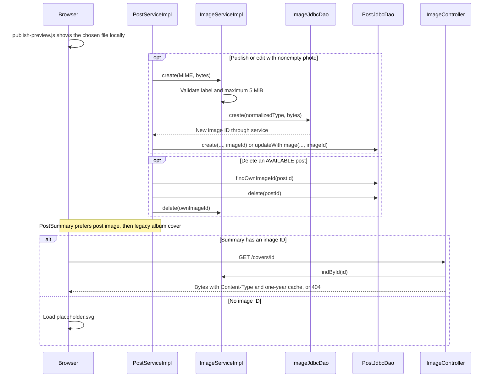

# Cover image flow

Uploaded photos belong to the physical exemplar through posts.image_id. A photo can be supplied when publishing and replaced when the owner edits an AVAILABLE post. Deleting the post also deletes its own photo. AlbumService never handles image creation; the legacy album cover is only a fallback.

## Flow diagram

The sequence follows the controller, service and DAO calls at `f12af08`. Error handling and transaction limits are explained below; this is a source trace, not a runtime test.



## Behavior and limits

1. [[PublishController]] passes the upload's declared MIME and bytes to [[PostServiceImpl]] for both publish and edit.
2. Nonempty bytes go to [[ImageServiceImpl]]. Allowed labels are image/png, image/jpeg and image/webp; size must not exceed 5,242,880 bytes.
3. [[ImageJdbcDao]] stores the bytes. Publishing inserts the post with that image ID; editing calls updateWithImage, while an empty upload keeps the current image through update.
4. [[PostJdbcDao]] reads COALESCE(p.image_id, a.cover_image_id). ui:vinyl-card, the detail page and inbox group headers use /covers/{id}, or the SVG placeholder when both references are null.

The edit form shows the current cover in the preview card. publish-preview.js replaces it with a local object URL when a file is chosen and restores the original when the selection is cleared; nothing is uploaded until submit.

Replacing a photo does not delete the previous image row. Because image IDs are immutable and served with a one-year public cache, the edit produces a new ID instead of overwriting bytes; the old row becomes unreferenced. Only post deletion removes an image, and only the post's own one (findOwnImageId ignores the album fallback).

The whole multipart request limit is 6,291,456 bytes. web.xml now maps the multipart and exception filters to /publish and /post/*. [[MultipartExceptionHandlerFilter]] redirects an overflow on /post/{id}/edit back to that edit path, and anything else to /publish, with coverTooLarge. Multipart parsing precedes Spring Security so CSRF can read the multipart token.

[[ImageController]] returns stored bytes and Content-Type with public max-age=31536000. The route is public; missing images return 404. No ETag, decoder, signature check, resizing or content deduplication is implemented. [[Image]] copies byte arrays on construction and retrieval.

[[Database schema]] · [[Publish flow]] · [[Edit and delete flow]] · [[UI components]]

## Code snippets

### Validate and store the photo

This checks the supplied MIME label and byte count. It does not decode or inspect an image signature. See [[ImageServiceImpl]] for the complete class.

[services/src/main/java/ar/edu/itba/paw/services/ImageServiceImpl.java, lines 40–55](<file:///Users/bautistapessagno/Desktop/ITBA/PAW/paw2026b/services/src/main/java/ar/edu/itba/paw/services/ImageServiceImpl.java>)

```java
    @Override
    @Transactional
    public Image create(final String contentType, final byte[] data) {
        final String normalizedType = contentType == null ? null : contentType.trim().toLowerCase(Locale.ROOT);
        if (normalizedType == null || !ALLOWED_CONTENT_TYPES.contains(normalizedType)) {
            LOGGER.info("Rejected image with content type {}", contentType);
            throw new InvalidImageException();
        }
        if (data == null || data.length == 0 || data.length > MAX_IMAGE_BYTES) {
            LOGGER.info("Rejected image of {} bytes", data == null ? 0 : data.length);
            throw new InvalidImageException();
        }
        final Image image = imageDao.create(normalizedType, data);
        LOGGER.info("Stored image {} ({}, {} bytes)", image.getId(), image.getContentType(), data.length);
        return image;
    }
```

### Serve immutable image bytes

The public retrieval endpoint returns the stored Content-Type and one-year cache policy; its missing-image exception is mapped to 404 in the same controller. See [[ImageController]] for the complete class.

[webapp/src/main/java/ar/edu/itba/paw/webapp/controller/ImageController.java, lines 33–40](<file:///Users/bautistapessagno/Desktop/ITBA/PAW/paw2026b/webapp/src/main/java/ar/edu/itba/paw/webapp/controller/ImageController.java>)

```java
    @RequestMapping(value = "/covers/{id:\\d+}", method = RequestMethod.GET)
    public ResponseEntity<byte[]> cover(@PathVariable("id") final long id) {
        final Image image = imageService.findById(id).orElseThrow(ImageNotFoundException::new);
        return ResponseEntity.ok()
                .contentType(MediaType.parseMediaType(image.getContentType()))
                .cacheControl(CacheControl.maxAge(CACHE_DAYS, TimeUnit.DAYS).cachePublic())
                .body(image.getData());
    }
```

### Oversized upload redirect

The filter keeps the user on the edit page when the oversized request targeted one. See [[MultipartExceptionHandlerFilter]] for the complete class.

[webapp/src/main/java/ar/edu/itba/paw/webapp/security/MultipartExceptionHandlerFilter.java, lines 18–38](<file:///Users/bautistapessagno/Desktop/ITBA/PAW/paw2026b/webapp/src/main/java/ar/edu/itba/paw/webapp/security/MultipartExceptionHandlerFilter.java>)

```java
    @Override
    protected void doFilterInternal(final HttpServletRequest request, final HttpServletResponse response,
                                    final FilterChain filterChain) throws ServletException, IOException {
        try {
            filterChain.doFilter(request, response);
        } catch (final ServletException | RuntimeException exception) {
            /*
             * El resolver multipart parsea de forma lazy, asi que el limite excedido puede
             * saltar dentro del DispatcherServlet y llegar aca envuelto en una
             * NestedServletException. Por eso tambien se mira la causa directa.
             */
            if (!(exception instanceof MaxUploadSizeExceededException)
                    && !(exception.getCause() instanceof MaxUploadSizeExceededException)) {
                throw exception;
            }
            LOGGER.warn("Rejected a multipart request over the size limit uri={}", request.getRequestURI());
            final String servletPath = request.getServletPath();
            final String target = servletPath.matches("/post/[0-9]+/edit") ? servletPath : "/publish";
            response.sendRedirect(request.getContextPath() + target + "?coverTooLarge");
        }
    }
```

## Evidencia local anterior, 2026-09-17

[[Audit local 2026-09-17]] ejecutó la rama `e5e926d`, anterior a `f12af08`. Sus resultados de ejecución no se repitieron para esta revisión; [[Known gaps and document drift]] indica qué hallazgos del audit quedaron resueltos en el código actual y cuáles siguen abiertos.
