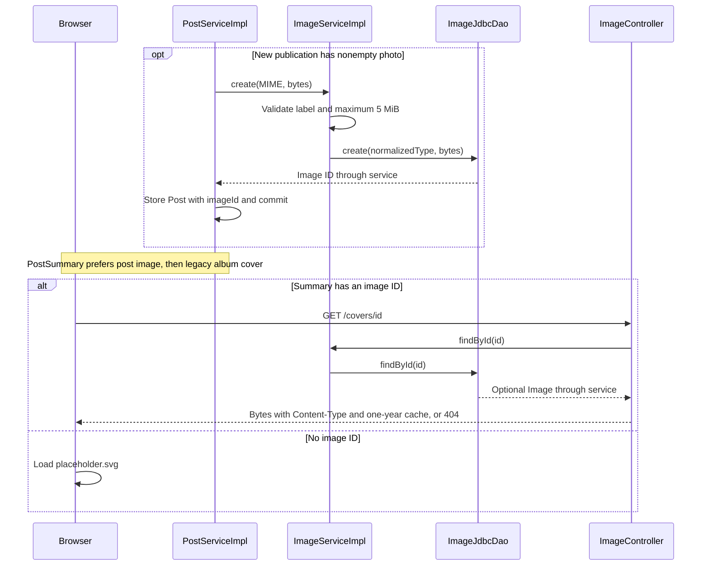

# Cover image flow

New uploaded photos belong to the physical exemplar through posts.image_id. AlbumService no longer handles image creation. Existing catalog identities can be reused with a different publication photo, including when the legacy album cover is null.

## Flow diagram

The sequence follows the controller, service and DAO calls at 40328f0. Error handling and transaction limits are explained below; this is a source trace, not a runtime test.



## Behavior and limits

1. [[PublishController]] passes the upload's declared MIME and bytes to [[PostServiceImpl]].
2. After the duplicate publication check, nonempty bytes go to [[ImageServiceImpl]]. Allowed labels are image/png, image/jpeg and image/webp; size must not exceed 5,242,880 bytes.
3. [[ImageJdbcDao]] stores the bytes; Post.imageId references them in the same publishing transaction. Empty or absent upload gives a null post image.
4. [[PostJdbcDao]] reads COALESCE(p.image_id, a.cover_image_id). ui:vinyl-card uses /covers/{id}, or the SVG placeholder when both references are null.

The whole multipart request limit is 6,291,456 bytes. [[MultipartExceptionHandlerFilter]] redirects overflow to the empty publish form with coverTooLarge. web.xml places multipart parsing before Spring Security so CSRF can read the multipart token.

[[ImageController]] returns stored bytes and Content-Type with public max-age=31536000. The route is public; missing images return 404. No replace/delete route, ETag, decoder, signature check, resizing or content deduplication is implemented. [[Image]] now copies byte arrays on construction and retrieval.

The schema enforces the new posts.image_id foreign key. The retained albums.cover_image_id fallback has no foreign key in the canonical startup schema; a dangling fallback yields 404 without automatic JSP recovery.

[[Database schema]] · [[Publish flow]] · [[UI components]]

## Code snippets

### Validate and store the photo

This checks the supplied MIME label and byte count. It does not decode or inspect an image signature. See [[ImageServiceImpl]] for the complete class.

[services/src/main/java/ar/edu/itba/paw/services/ImageServiceImpl.java, lines 40–55](<file:///Users/bautistapessagno/Desktop/ITBA/PAW/paw2026b/services/src/main/java/ar/edu/itba/paw/services/ImageServiceImpl.java>)

```java
    @Override
    @Transactional
    public Image create(final String contentType, final byte[] data) {
        final String normalizedType = contentType == null ? null : contentType.trim().toLowerCase(Locale.ROOT);
        if (normalizedType == null || !ALLOWED_CONTENT_TYPES.contains(normalizedType)) {
            LOGGER.info("Rejected image with content type {}", contentType);
            throw new InvalidImageException();
        }
        if (data == null || data.length == 0 || data.length > MAX_IMAGE_BYTES) {
            LOGGER.info("Rejected image of {} bytes", data == null ? 0 : data.length);
            throw new InvalidImageException();
        }
        final Image image = imageDao.create(normalizedType, data);
        LOGGER.info("Stored image {} ({}, {} bytes)", image.getId(), image.getContentType(), data.length);
        return image;
    }
```

### Serve immutable image bytes

The public retrieval endpoint returns the stored Content-Type and one-year cache policy; its missing-image exception is mapped to 404 in the same controller. See [[ImageController]] for the complete class.

[webapp/src/main/java/ar/edu/itba/paw/webapp/controller/ImageController.java, lines 33–40](<file:///Users/bautistapessagno/Desktop/ITBA/PAW/paw2026b/webapp/src/main/java/ar/edu/itba/paw/webapp/controller/ImageController.java>)

```java
    @RequestMapping(value = "/covers/{id:\\d+}", method = RequestMethod.GET)
    public ResponseEntity<byte[]> cover(@PathVariable("id") final long id) {
        final Image image = imageService.findById(id).orElseThrow(ImageNotFoundException::new);
        return ResponseEntity.ok()
                .contentType(MediaType.parseMediaType(image.getContentType()))
                .cacheControl(CacheControl.maxAge(CACHE_DAYS, TimeUnit.DAYS).cachePublic())
                .body(image.getData());
    }
```
