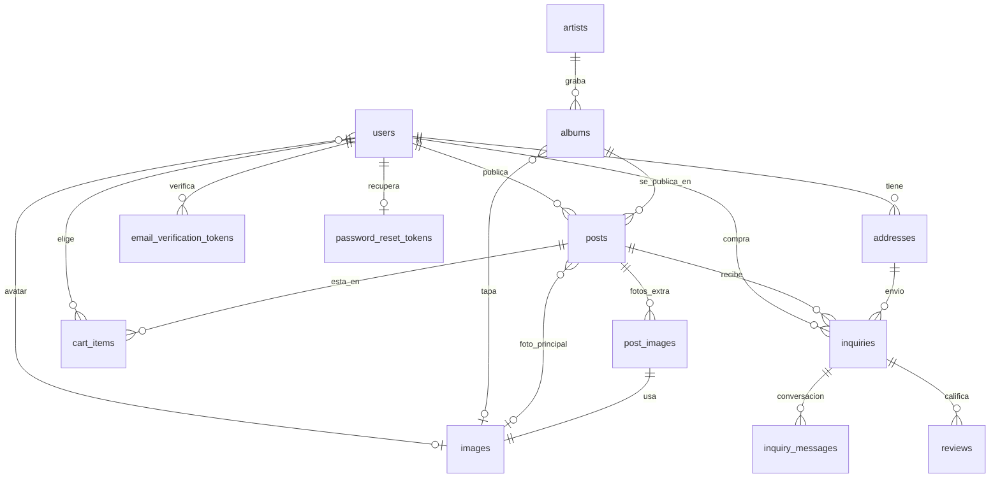

# Database schema

> [!summary] En una frase
> Trece tablas en PostgreSQL, definidas por once migraciones Flyway que se aplican al arrancar; las reglas que no pueden fallar (unicidad, estados válidos, una reseña por parte) están como restricciones de la base, y lo demás lo decide el service.

Esta nota describe el esquema **resultante** de aplicar V1 a V11. El texto de cada migración y la historia de cómo se llegó hasta acá están en [[Schema history and seeds]].

## Herramientas

| Herramienta | Para qué |
|---|---|
| PostgreSQL | Motor de producción y de desarrollo |
| Flyway 9 | Versionar el esquema; corre en el arranque ([[Startup and dependency injection]]) |
| HSQLDB con `sql.syntax_pgs=true` | Motor en memoria de los tests de persistence, con las mismas migraciones |
| `SERIAL` | Ids autogenerados; los DAO los recuperan con `SimpleJdbcInsert.usingGeneratedKeyColumns("id")` |
| `BYTEA` | Imágenes y comprobantes dentro de la base |

## Mapa de tablas



## Tablas

### users

| Columna | Tipo | Notas |
|---|---|---|
| `id` | SERIAL PK | |
| `username` | VARCHAR(100) NOT NULL | Nombre visible, no es único |
| `email` | VARCHAR(100) NOT NULL | Único (`users_email_key`, V2). Es la identidad de login |
| `password_hash` | VARCHAR(100) | BCrypt. `NULL` en cuentas heredadas sin clave |
| `role` | VARCHAR(20) | `USER` o `ADMIN`; por defecto `USER` |
| `verified` | BOOLEAN | Si confirmó el correo. Se llamaba `enabled` hasta V6 |
| `preferred_locale` | VARCHAR(5) | Idioma para los correos; por defecto `es` |
| `cbu`, `alias` | VARCHAR(22), VARCHAR(20) | Datos de cobro, opcionales (V5) |
| `avatar_image_id` | INTEGER FK → images | Foto de perfil (V9) |

### email_verification_tokens y password_reset_tokens

| Tabla | Columnas | Restricciones |
|---|---|---|
| `email_verification_tokens` | `id`, `user_id`, `token` VARCHAR(64), `created_at` (V6) | `token` único; FK a users |
| `password_reset_tokens` | `id`, `user_id`, `token` VARCHAR(64), `expires_at` | `token` único; **`user_id` único**: un solo enlace vivo por cuenta; FK a users |

`created_at` sostiene el freno de un minuto entre reenvíos; `expires_at`, el vencimiento de una hora. Detalle en [[Tokens and email links]].

### artists y albums

| Tabla | Columnas | Restricciones |
|---|---|---|
| `artists` | `id`, `name`, `normalized_name`, `search_phrase` | `normalized_name` único; índice sobre `search_phrase` |
| `albums` | `id`, `title`, `normalized_title` (V4), `artist_id`, `release_year`, `cover_image_id`, `genre`, `search_phrase` | Único `(artist_id, normalized_title, release_year)`; `CHECK` de género con los 15 valores de [[Genre]]; FKs a artists e images (V3); índice sobre `search_phrase` |

`normalized_*` es la identidad (sin mayúsculas ni signos); `search_phrase` es el texto sin tildes que se compara con lo que se busca ([[SearchText]]). El catálogo de álbumes es propio y lo cargan los publicantes (ADR 0002).

### images

`id`, `content_type` VARCHAR(100), `data` BYTEA. Guarda tapas de álbum, fotos de publicaciones y avatares. No tiene dueño: la pertenencia la dan las columnas que la referencian.

### posts

| Columna | Tipo | Notas |
|---|---|---|
| `user_id`, `album_id` | INTEGER NOT NULL | FKs (V3). Único `(user_id, album_id)`: una publicación por álbum por cuenta, incluso vendida |
| `price` | INTEGER | `CHECK (price > 0)`, pesos sin decimales |
| `description` | VARCHAR(1000) | Opcional |
| `item_condition` | VARCHAR(20) | `CHECK` `NEW` / `USED` |
| `pressing_year`, `zone` | INTEGER, VARCHAR(100) | Opcionales |
| `stock` | INTEGER | Siempre 1: cada publicación es un ejemplar único. El DAO lo escribe fijo |
| `image_id` | INTEGER FK → images | Foto principal |
| `status` | VARCHAR(20) | `CHECK` `AVAILABLE` / `RESERVED` / `SOLD` (V5) |
| `created_at` | TIMESTAMP | |

### post_images (V8)

`post_id` (FK con `ON DELETE CASCADE`), `image_id` (único), `display_order` (`CHECK BETWEEN 1 AND 4`, único por post). Solo las fotos **adicionales**: la principal sigue en `posts.image_id`. De ahí sale el tope de cinco fotos ([[Gallery flow]]).

### addresses (V5)

`user_id`, `street`, `street_number`, `apartment`, `city`, `province`, `postal_code`, `notes`, `archived`, `created_at`. Una dirección no se edita ni se borra: se **archiva**, porque una consulta vieja puede seguir apuntándola ([[Addresses and payment flow]]).

### inquiries

| Columna | Notas |
|---|---|
| `post_id` | FK **nullable**: al eliminar la publicación la consulta sobrevive |
| `album_id`, `seller_id` | Copia de a qué álbum y a quién se le consultó, para que la bandeja siga mostrando algo sin el post |
| `buyer_id` | NOT NULL |
| `address_id` | Dirección de envío elegida (V5) |
| `price` | Precio guardado al consultar (V5) y reemplazado al aceptar por el del post bloqueado (`startSale`, ADR 0004, sin cambio de esquema); `NULL` en consultas anteriores a V5 |
| `status` | `CHECK` con los seis estados de [[InquiryStatus]] (V5) |
| `receipt_content_type`, `receipt_data`, `receipt_uploaded_at` | Comprobante: uno por consulta, se reemplaza entero |
| `created_at` | |

La columna `message` desapareció en V7: el texto inicial pasó a ser el primer mensaje de la conversación.

### inquiry_messages (V7)

`inquiry_id`, `sender_id`, `body` VARCHAR(500), `created_at`; índice por `inquiry_id` ([[Conversation flow]]).

### reviews (V10)

`inquiry_id`, `author_id`, `subject_id`, `rating`, `body`, `active`, `created_at`. Único `(inquiry_id, author_id)`: una reseña por parte por venta. `CHECK (rating BETWEEN 1 AND 5)` y `CHECK (author_id <> subject_id)`. Borrar es poner `active = FALSE`. Índice `(subject_id, active, created_at)` para el perfil público ([[Reviews flow]]).

### cart_items (V11)

Clave primaria compuesta `(user_id, post_id)`: no se puede repetir un vinilo en el carrito. `post_id` con `ON DELETE CASCADE`; índice por `post_id` ([[Cart flow]]).

## Qué garantiza la base y qué el service

| Regla | Quién la sostiene |
|---|---|
| Un correo, una cuenta | `users_email_key` |
| Un artista por nombre normalizado; un álbum por artista, título y año | Índice y restricción únicos |
| Una publicación por álbum por cuenta | `posts_user_id_album_id_key` |
| Estados válidos de publicación y consulta | `CHECK` |
| Un enlace de recuperación vivo por cuenta | `UNIQUE (user_id)` |
| Una reseña por parte, de 1 a 5, nunca a uno mismo | `UNIQUE` y `CHECK` |
| Un vinilo una sola vez en el carrito | Clave primaria compuesta |
| Hasta cuatro fotos adicionales, sin repetir posición | `CHECK` y `UNIQUE` |
| Una sola consulta abierta por comprador y publicación | **Service**, bajo el bloqueo de la fila del post |
| Una sola reserva por publicación | **Service**: `UPDATE ... WHERE status = 'AVAILABLE'` |
| Hasta tres direcciones vigentes; hasta veinte vinilos en el carrito | **Service**, bajo el bloqueo de la fila de la cuenta |
| Transiciones de estado permitidas | **Service** ([[Inquiry and sale flow]]) |

Las reglas de la segunda mitad no tienen restricción porque dependen de contar filas o de un estado previo; se resuelven con bloqueos ([[Transactions and concurrency]]).

## Decisiones y por qué

| Decisión | Motivo | Fuente |
|---|---|---|
| Migraciones Flyway en vez de un `schema.sql` | El archivo único no podía evolucionar una base con datos; producción había quedado distinta del archivo | Comentarios de V1 y V2, PR #38 |
| Las migraciones deben correr en PostgreSQL y HSQLDB | Los tests usan las mismas migraciones; por eso no hay índices sobre expresiones ni bloques `DO` | Comentario de V1 y V4, `CLAUDE.md` del repo |
| Columnas normalizadas en vez de índices sobre `LOWER(...)` | HSQLDB no admite índices sobre expresiones | Comentario de V4 |
| Imágenes y comprobantes en `BYTEA` | El despliegue recibe solo un WAR: no hay almacenamiento de archivos fuera de la base | `docs/setup.md` (despliegue); la conclusión es inferencia |
| Comprobante dentro de `inquiries` | Hay uno por consulta y se reemplaza entero | Comentario de V5 |
| La venta es una etapa de la consulta, no otra tabla | Mismos participantes y misma publicación; cambia solo el estado | `CONTEXT.md` |
| `inquiries.post_id` nullable con copia de álbum y vendedor | Que la bandeja del comprador sobreviva a la eliminación del post | Comentario de V1 |
| Precio guardado en la consulta | Es el monto a transferir aunque después se edite el post. Desde el PR #56 se fija al aceptar; al consultar queda solo como respaldo | Comentario de V5; ADR 0004 |
| Direcciones archivadas, no borradas | Una consulta puede seguir apuntándola | Comentario de V5 |
| `ON DELETE CASCADE` solo en `post_images` y `cart_items` | Son datos descartables que no tienen sentido sin el post | Comentario de V11 |

## Límites conocidos

- No hay índices sobre `inquiries(buyer_id)`, `inquiries(seller_id)`, `inquiries(post_id)` ni `posts(status)`. Con el volumen del TP no se nota.
- `posts.stock` existe pero no se usa: siempre vale 1.
- La unicidad `(user_id, album_id)` incluye publicaciones vendidas: quien vendió un álbum no puede volver a publicarlo.
- Los `CHECK` de enums duplican los valores de las clases Java: agregar un valor exige una migración.
- `database/users.sql` es un resto del esqueleto inicial y no participa de nada.

## Preguntas de defensa

**¿Cómo se crea y evoluciona el esquema?**
Con migraciones Flyway numeradas. Cada cambio es un archivo nuevo; una migración aplicada no se edita.

**¿Por qué los tests usan HSQLDB si producción es PostgreSQL?**
Para correr en memoria sin infraestructura. El costo es que las migraciones tienen que ser compatibles con los dos motores, y que pasar los tests no prueba la ruta de PostgreSQL.

**¿Dónde se guardan las imágenes?**
En la tabla `images`, como `BYTEA`, y se sirven por un controller ([[Cover image flow]]).

**¿Qué pasa con las consultas si se borra una publicación?**
Sobreviven: `post_id` queda en `NULL` y la consulta conserva álbum y vendedor.

**¿Cómo evitan dos reservas de la misma publicación?**
No con una restricción, sino con un `UPDATE` condicional sobre el estado dentro de una transacción que bloqueó la fila.

## Evidencia de código

### Tablas base (V1)

Fuente exacta en `c3e2a4c`: [persistence/src/main/resources/db/migration/V1__esquema_inicial.sql](</Users/bautistapessagno/Desktop/proyectos_itba/PAW/paw2026b/persistence/src/main/resources/db/migration/V1__esquema_inicial.sql>), líneas 70–105.

```sql
CREATE TABLE posts (
    id SERIAL PRIMARY KEY,
    user_id INTEGER NOT NULL,
    album_id INTEGER NOT NULL,
    price INTEGER NOT NULL,
    description VARCHAR(1000),
    item_condition VARCHAR(20) NOT NULL,
    pressing_year INTEGER,
    zone VARCHAR(100),
    stock INTEGER DEFAULT 1 NOT NULL,
    image_id INTEGER,
    status VARCHAR(20) DEFAULT 'AVAILABLE' NOT NULL,
    created_at TIMESTAMP DEFAULT NOW() NOT NULL,
    CONSTRAINT posts_user_id_album_id_key UNIQUE (user_id, album_id),
    CONSTRAINT posts_image_fk FOREIGN KEY (image_id) REFERENCES images(id),
    CONSTRAINT posts_price_positive_check CHECK (price > 0),
    CONSTRAINT posts_condition_check CHECK (item_condition IN ('NEW', 'USED')),
    CONSTRAINT posts_status_check CHECK (status IN ('AVAILABLE', 'SOLD'))
);

-- Al eliminar una publicacion sus consultas sobreviven sin post: guardan el album y el
-- vendedor para que la bandeja del comprador siga mostrando que vinilo consulto.
CREATE TABLE inquiries (
    id SERIAL PRIMARY KEY,
    post_id INTEGER,
    album_id INTEGER,
    seller_id INTEGER,
    buyer_id INTEGER NOT NULL,
    message VARCHAR(500),
    created_at TIMESTAMP DEFAULT NOW() NOT NULL,
    status VARCHAR(20) DEFAULT 'PENDING' NOT NULL,
    CONSTRAINT inquiries_post_fk FOREIGN KEY (post_id) REFERENCES posts(id),
    CONSTRAINT inquiries_album_fk FOREIGN KEY (album_id) REFERENCES albums(id),
    CONSTRAINT inquiries_seller_fk FOREIGN KEY (seller_id) REFERENCES users(id),
    CONSTRAINT inquiries_buyer_fk FOREIGN KEY (buyer_id) REFERENCES users(id)
);
```

### Carrito (V11)

Fuente exacta en `c3e2a4c`: [persistence/src/main/resources/db/migration/V11__carrito.sql](</Users/bautistapessagno/Desktop/proyectos_itba/PAW/paw2026b/persistence/src/main/resources/db/migration/V11__carrito.sql>), líneas 1–12.

```sql
-- El carrito de cada Cuenta: los Posts que eligio para consultar juntos. La clave compuesta
-- impide repetir un Post. Un item es descartable: si se elimina la publicacion, se va con ella.
CREATE TABLE cart_items (
    user_id INTEGER NOT NULL,
    post_id INTEGER NOT NULL,
    added_at TIMESTAMP DEFAULT NOW() NOT NULL,
    CONSTRAINT cart_items_pkey PRIMARY KEY (user_id, post_id),
    CONSTRAINT cart_items_user_fk FOREIGN KEY (user_id) REFERENCES users(id),
    CONSTRAINT cart_items_post_fk FOREIGN KEY (post_id) REFERENCES posts(id) ON DELETE CASCADE
);

CREATE INDEX cart_items_post_id_idx ON cart_items (post_id);
```

### Bean de Flyway

Fuente exacta en `c3e2a4c`: [webapp/src/main/java/ar/edu/itba/paw/webapp/config/WebConfig.java](</Users/bautistapessagno/Desktop/proyectos_itba/PAW/paw2026b/webapp/src/main/java/ar/edu/itba/paw/webapp/config/WebConfig.java>), líneas 97–113.

```java
  /*
   * Aplica al levantar el contexto las migraciones de persistence que la base todavia
   * no tiene. Si una falla, la aplicacion no arranca.
   *
   * Las bases anteriores a Flyway ya tienen el esquema inicial pero no la tabla de
   * historial: el baseline las marca en esa version sin ejecutarla y sigue desde la
   * siguiente. Una base vacia no hace baseline y corre todas.
   */
  @Bean(initMethod = "migrate")
  public Flyway flyway(final DataSource dataSource) {
    return Flyway.configure()
        .dataSource(dataSource)
        .locations("classpath:db/migration")
        .baselineOnMigrate(true)
        .baselineVersion("1")
        .load();
  }
```

## Archivos para seguir el flujo

- [persistence/src/main/resources/db/migration/V1__esquema_inicial.sql](</Users/bautistapessagno/Desktop/proyectos_itba/PAW/paw2026b/persistence/src/main/resources/db/migration/V1__esquema_inicial.sql>)
- [persistence/src/main/resources/db/migration/V5__venta_con_comprobante.sql](</Users/bautistapessagno/Desktop/proyectos_itba/PAW/paw2026b/persistence/src/main/resources/db/migration/V5__venta_con_comprobante.sql>)
- [persistence/src/main/resources/db/migration/V7__mensajes_de_consulta.sql](</Users/bautistapessagno/Desktop/proyectos_itba/PAW/paw2026b/persistence/src/main/resources/db/migration/V7__mensajes_de_consulta.sql>)
- [persistence/src/main/resources/db/migration/V8__post_gallery.sql](</Users/bautistapessagno/Desktop/proyectos_itba/PAW/paw2026b/persistence/src/main/resources/db/migration/V8__post_gallery.sql>)
- [persistence/src/main/resources/db/migration/V10__sale_reviews.sql](</Users/bautistapessagno/Desktop/proyectos_itba/PAW/paw2026b/persistence/src/main/resources/db/migration/V10__sale_reviews.sql>)
- [persistence/src/main/resources/db/migration/V11__carrito.sql](</Users/bautistapessagno/Desktop/proyectos_itba/PAW/paw2026b/persistence/src/main/resources/db/migration/V11__carrito.sql>)
- [webapp/src/main/java/ar/edu/itba/paw/webapp/config/WebConfig.java](</Users/bautistapessagno/Desktop/proyectos_itba/PAW/paw2026b/webapp/src/main/java/ar/edu/itba/paw/webapp/config/WebConfig.java>) · [[WebConfig]]

Fuente inspeccionada: `c3e2a4c`, 2026-10-05. Es evidencia estática; no implica ejecución de la aplicación. [[Source inventory]] · [[Roadmap de lectura]]
