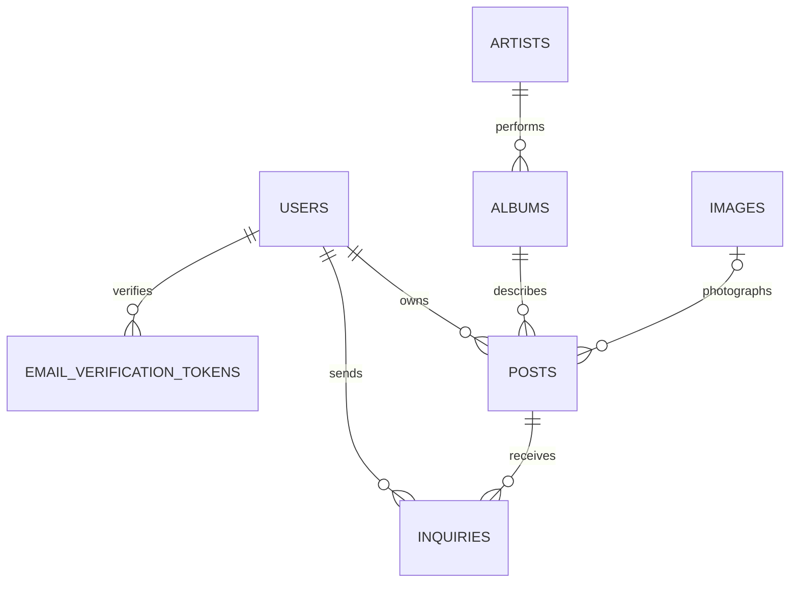

# Domain and identity

An Album is shared catalog metadata. A Post now represents one physical exemplar owned by an account. Its price, condition, pressing year, zone, description, image and sale status belong to the publication. An Inquiry records a buyer request for that exemplar.

| Identity | Rule |
|---|---|
| [[User]] | Trimmed/lowercased unique email; display username is not unique; credentials chosen on verification |
| [[Artist]] | Trimmed/lowercased unique name |
| [[Album]] | Artist ID + normalized title + release year; first stored genre retained |
| [[Post]] | Unique user ID + album ID, including SOLD posts |
| [[Image]] | Generated ID, copied byte arrays, no deduplication |
| [[Inquiry]] | Generated ID; repeated buyer/post submissions are not uniquely constrained |
| [[EmailVerificationToken]] | Unique random token; multiple pending tokens per account are allowed |

These are domain relationships; only some are database foreign keys. [[Database schema]] distinguishes enforced references from logical ones. PostSummary resolves the publication image first and the historical album cover second. The old album reference remains for compatibility.

[[PostSummary]] and [[InquirySummary]] are joined read projections. [[PostSearchCriteria]] and [[SearchResult]] carry search input/output. [[Genre]], [[Condition]], [[PostStatus]], [[InquiryStatus]], [[PostSort]] and [[UserRole]] define fixed choices. [[PostInterestNotification]] is the mail payload, separate from the persisted inquiry.

CONTEXT.md still describes unauthenticated publishers and says a vinyl is not a physical copy. That glossary predates account ownership and exemplar sales. [[Known gaps and document drift]] records the conflict.
