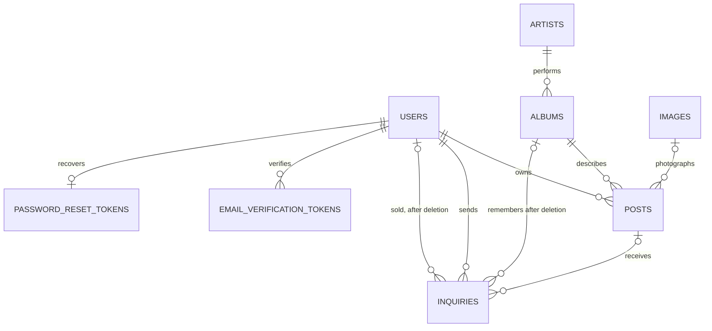

# Domain and identity

An Album is shared catalog metadata. A Post represents one physical exemplar owned by an account. Its price, condition, pressing year, zone, description, image and sale status belong to the publication. An Inquiry records a buyer request for that exemplar and survives the publication's deletion.

| Identity | Rule |
|---|---|
| [[User]] | Trimmed/lowercased unique email; display username is not unique and can be edited; credentials chosen on verification and changeable later |
| [[Artist]] | Unique normalized_name (lowercase letters and digits only); the display name keeps the typed form and can be rewritten by an edit |
| [[Album]] | Artist ID + LOWER(title) + release year; the title keeps the casing of its first publication or latest owner edit; genre required |
| [[Post]] | Unique user ID + album ID, including SOLD posts; only AVAILABLE posts are editable or deletable |
| [[Image]] | Generated ID, copied byte arrays, no deduplication; a new photo gets a new ID |
| [[Inquiry]] | Generated ID; repeated buyer/post submissions are not uniquely constrained; keeps album and seller after post deletion |
| [[EmailVerificationToken]] | Unique random token; multiple pending tokens per account are allowed; no expiry |
| [[PasswordResetToken]] | Unique random token; at most one per account; expires after one hour |

These are domain relationships; only some are database foreign keys. [[Database schema]] distinguishes enforced references from logical ones. PostSummary resolves the publication image first and the historical album cover second. When a post is deleted, its inquiries lose post_id and keep album_id and seller_id so the buyer still sees what was asked.

[[PostSummary]], [[InquirySummary]] and [[InquiryGroup]] are joined read projections; [[PostPage]] and [[InquiryPage]] wrap them for paging. [[PostSearchCriteria]], [[SearchResult]] and [[SearchSuggestion]] carry search input and output, and [[SearchText]] defines the normalization used by suggestions. [[Genre]], [[Condition]], [[PostStatus]], [[InquiryStatus]], [[PostSort]], [[SearchSuggestionType]] and [[UserRole]] define fixed choices. [[PostInterestNotification]] and [[InquiryAcceptedNotification]] are mail payloads, separate from the persisted inquiry.

CONTEXT.md now defines Cuenta, Cambio de contraseña and Recuperación de contraseña. It still says recovery does not exist, still describes the product as a catalog of editorial album data and still says a vinyl is not a physical copy. [[Known gaps and document drift]] records these conflicts.
