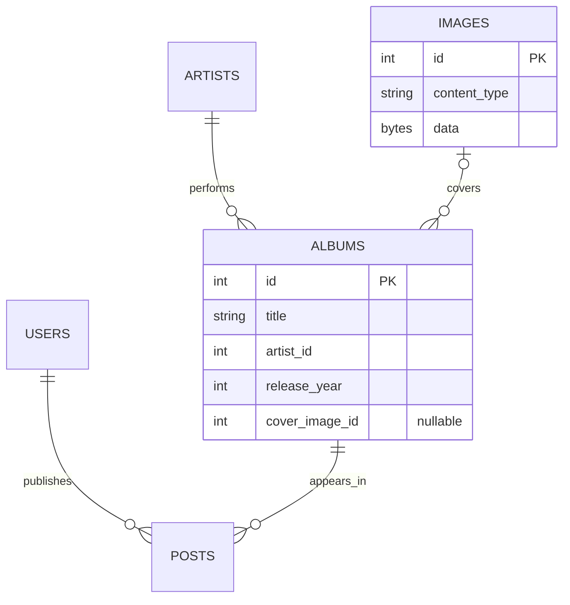

# Domain and identity

The catalog and publications have separate identities. [[Artist]] names a performer, [[Album]] identifies a work by artist/title/year, [[Image]] stores optional cover bytes, and [[Post]] connects a publisher [[User]] to an album. Two publishers can offer the same album without duplicating it.

These are logical links. The startup schema has no foreign keys; the manual bootstrap has stronger constraints. See [[Database schema]].

| Identity | Resolution |
|---|---|
| User | Email trimmed and lowercased with Locale.ROOT; existing username retained |
| Artist | Name trimmed and lowercased |
| Album | Artist ID + normalized title + release year |
| Post | Unique user ID + album ID pair |
| Image | Generated ID; no content deduplication |

Normalization preserves internal spaces and accents. Username is neither normalized nor unique. Cover image ID is nullable and never part of album identity. The first creator fixes the cover; an existing album is returned unchanged even if another publisher submits a cover. An album created without a cover cannot gain one through findOrCreate.

The six current model types are [[User]], [[Artist]], [[Album]], [[Image]], [[Post]] and [[PostSummary]]. PostSummary is a query projection rather than a table. Image has final fields but exposes a mutable byte array. [[PostInterestNotification]] remains a service-contract payload rather than persisted contact history. [[AlbumSummary]] is historical.

CONTEXT.md identifies publishers by email without requiring an account. Current publishing nevertheless stores a User row; that does not imply authentication. The glossary does not yet define Image as a separate stored type. [[Known gaps and document drift]] records the distinction.
