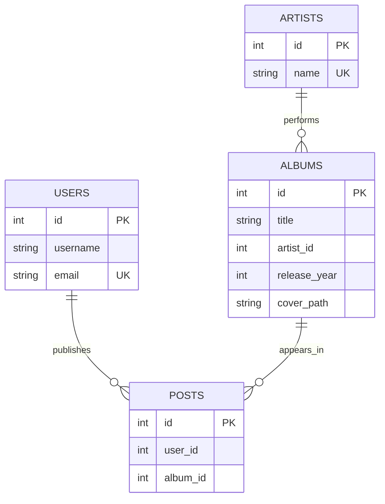

# Domain and identity

The business separates the catalog from publications. [[Artist]] identifies a performer, [[Album]] identifies a catalog work, and [[Post]] records that a publisher offers that album. Two publishers can create two Posts for one Album. A different release year makes a different Album even when title and artist match.

These are logical relationships. The current startup schema does not declare FOREIGN KEY constraints. Read [[Database schema]] before interpreting the diagram as physical enforcement.

| Concept | Current identity rule | Where enforced |
|---|---|---|
| User/publisher | Normalized email | [[UserServiceImpl]], [[UserJdbcDao]], unique users.email |
| Artist | Normalized name | [[ArtistServiceImpl]], unique artists.name |
| Album | Artist ID + normalized title + release year | [[AlbumServiceImpl]], composite unique constraint |
| Post | User ID + Album ID | [[PostServiceImpl]], composite unique constraint |

Normalization is outer trim and Locale.ROOT lowercase. It does not collapse internal spaces or remove accents. Username is not normalized and is not unique. Existing email reuse retains the original username. Cover path never changes an album's identity.

For example, `  VERSUS  ` and `versus` with the same resolved artist and 1997 reuse an album. With 1998 they do not. Different normalized publisher emails can each create a Post for the 1997 album. The same publisher cannot create a second Post for it.

All six model classes have final fields and getters. [[AlbumSummary]] and [[PostSummary]] are query projections, not additional database tables. [[PostInterestNotification]] lives in services-contracts because it is a mail-operation payload, not a stored entity.

The older CONTEXT glossary says a publicante need not be an account; the current implementation nevertheless stores publishers as [[User]] rows. That does not imply authentication. [[History and specifications]] records this evolution.
