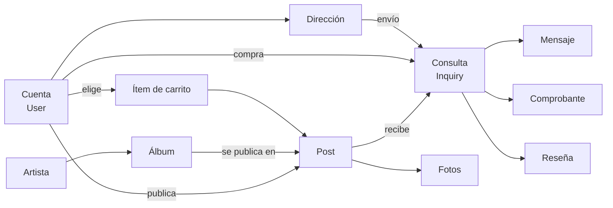
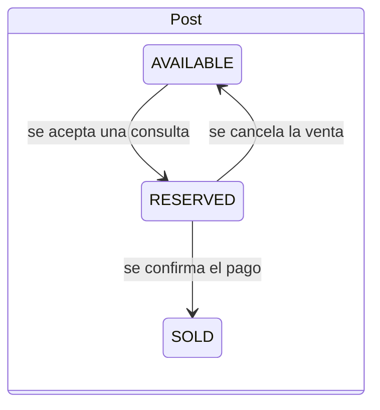
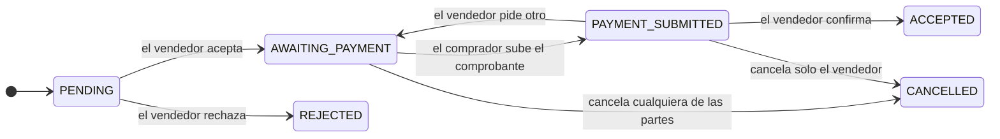

# Domain and identity

> [!summary] En una frase
> Una Cuenta publica ejemplares únicos de álbumes de un catálogo propio; otra Cuenta abre una Consulta sobre una publicación, y esa misma Consulta se convierte en la venta, con su conversación, su comprobante y sus reseñas.

El vocabulario sale de `CONTEXT.md`. Acá se explica qué identifica a cada cosa y cómo se relacionan; las tablas están en [[Database schema]].

## Mapa


```mermaid
flowchart LR
    Cuenta[Cuenta<br>User] -->|publica| Post
    Artista[Artista] --> Album[Álbum]
    Album -->|se publica en| Post
    Post -->|recibe| Consulta[Consulta<br>Inquiry]
    Cuenta -->|compra| Consulta
    Cuenta --> Direccion[Dirección]
    Direccion -->|envío| Consulta
    Consulta --> Mensaje
    Consulta --> Comprobante
    Consulta --> Resena[Reseña]
    Cuenta -->|elige| Carrito[Ítem de carrito]
    Carrito --> Post
    Post --> Fotos[Fotos]
```

## Qué identifica a cada cosa

| Concepto | Clase | Identidad | Notas |
|---|---|---|---|
| Cuenta | [[User]] | El correo, normalizado | Tiene rol ([[UserRole]]) y un indicador de verificación independiente del rol. Sin verificar puede iniciar sesión, pero no operar |
| Artista | [[Artist]] | El nombre normalizado | Se crea la primera vez que alguien publica un álbum suyo |
| Álbum | [[Album]] | Artista, título normalizado y año | La obra, no una edición ni un ejemplar. La tapa no forma parte de la identidad |
| Post | [[Post]] | Su id; además, una Cuenta no puede tener dos Posts del mismo Álbum | El ejemplar que alguien vende: precio, estado, descripción, año de prensado, zona, fotos |
| Consulta | [[Inquiry]] | Su id; un comprador tiene a lo sumo una Consulta abierta por Post | Nace con comprador y dirección; el precio de la venta se fija al aceptar (ADR 0004). La venta es una etapa suya, no otra entidad |
| Mensaje | [[Message]] | Su id | Pertenece a una Consulta |
| Comprobante | [[Receipt]] | La Consulta | Uno por Consulta; subir otro lo reemplaza |
| Dirección | [[Address]] | Su id | No se edita ni se borra: se archiva y se crea otra |
| Reseña | [[Review]] | Consulta y autor | Una por parte por venta confirmada |
| Ítem de carrito | [[CartItem]] | Cuenta y Post | Descartable: desaparece con la publicación |

## Los dos papeles de una Cuenta

No hay tipos de usuario "comprador" y "vendedor". Una misma Cuenta es **Publicante** de sus Posts y **Comprador** en las Consultas que abre. Lo que cambia es su papel frente a cada Consulta, y eso es lo que miran [[InquiryParties]] y [[InquiryAccessHandler]]. Una Cuenta no puede consultar por su propio Post.

`ADMIN` es un rol aparte: puede editar y eliminar publicaciones disponibles de cualquiera. No tiene panel propio.

## Los dos ciclos de vida


```mermaid
stateDiagram-v2
    direction LR
    state "Post" as P {
        AVAILABLE --> RESERVED: se acepta una consulta
        RESERVED --> AVAILABLE: se cancela la venta
        RESERVED --> SOLD: se confirma el pago
    }
```


```mermaid
stateDiagram-v2
    direction LR
    [*] --> PENDING
    PENDING --> AWAITING_PAYMENT: el vendedor acepta
    PENDING --> REJECTED: el vendedor rechaza
    AWAITING_PAYMENT --> PAYMENT_SUBMITTED: el comprador sube el comprobante
    PAYMENT_SUBMITTED --> AWAITING_PAYMENT: el vendedor pide otro
    PAYMENT_SUBMITTED --> ACCEPTED: el vendedor confirma
    AWAITING_PAYMENT --> CANCELLED: cancela cualquiera de las partes
    PAYMENT_SUBMITTED --> CANCELLED: cancela solo el vendedor
```

Los dos ciclos están acoplados: aceptar una Consulta reserva el Post, confirmar el pago lo vende, cancelar lo libera. Una Consulta pendiente no se cancela: la rechaza el vendedor, o queda rechazada cuando el Post se vende a otro comprador o se elimina. `ACCEPTED` significa **venta confirmada**, no "consulta aceptada": el nombre viene de antes de que existiera el comprobante. Las reglas exactas de quién puede hacer cada transición están en [[Inquiry and sale flow]].

## Entidades y proyecciones

Los modelos son inmutables: campos `final`, sin setters. Hay dos clases de modelo:

| Clase de modelo | Ejemplos | Qué es |
|---|---|---|
| Entidad | [[User]], [[Post]], [[Album]], [[Inquiry]], [[Address]], [[Review]] | Una fila de una tabla, con claves foráneas como `Long xId` |
| Proyección de lectura | [[PostSummary]], [[PostDetail]], [[InquirySummary]], [[InquiryDetail]], [[PublicProfile]], [[Cart]] | Datos de varias tablas ya unidos para una pantalla. No tienen tabla propia |
| Página | [[PostPage]], [[InquiryPage]], [[SearchResult]] | Ítems más datos de paginación |
| Valor | [[PaymentInfo]], [[Receipt]], [[ImageUpload]], [[ShippingOptions]] | Agrupan datos que viajan juntos |
| Reglas | [[ImageRules]], [[ReceiptRules]], [[PaymentInfoRules]], [[MessageRules]], [[ReviewRules]], [[VinylInputRules]], [[EmailRules]], [[SearchText]] | Validación y normalización compartidas por el formulario y el service |
| Enum | [[PostStatus]], [[InquiryStatus]], [[Genre]], [[Condition]], [[Province]], [[UserRole]] | Valores cerrados, con su `CHECK` equivalente en la base |

Las proyecciones existen para evitar el N+1: un listado trae en una sola consulta con `JOIN` todo lo que la pantalla muestra, en vez de pedir el álbum y el vendedor de cada publicación por separado.

## Decisiones y por qué

| Decisión | Motivo | Fuente |
|---|---|---|
| Catálogo de álbumes propio | No depender de un servicio externo | ADR 0002 |
| La venta es una etapa de la Consulta | Mismas partes y mismo Post; cambia el estado | `CONTEXT.md` |
| Verificación separada del rol | Una Cuenta sin verificar tiene que poder iniciar sesión | `CONTEXT.md`, comentario de V6 |
| Modelos inmutables con ids en vez de objetos | Regla de la etapa JDBC; las entidades con referencias llegan con JPA | `CLAUDE.md` del repo |
| Un Post es un ejemplar único | No hay stock: reservar o vender afecta a la publicación entera | `docs/issues/selling-flow/02` |
| Precio fijado en la Consulta al aceptar | El monto a transferir no cambia si el vendedor edita el Post después de aceptar; mientras la Consulta está pendiente, sigue el precio publicado | Comentario de V5; ADR 0004 |

## Preguntas de defensa

**¿Qué diferencia hay entre Álbum y Post?**
El Álbum es la obra del catálogo; el Post es el ejemplar que una Cuenta pone en venta. Varias Cuentas pueden publicar el mismo Álbum.

**¿Hay una entidad Venta?**
No. La venta es la misma Consulta en sus estados posteriores a la aceptación.

**¿Por qué los modelos no tienen setters?**
Son inmutables en esta etapa. Un cambio produce un objeto nuevo o se relee de la base.

**¿Qué es una proyección?**
Un modelo de solo lectura armado con un `JOIN` para una pantalla, sin tabla propia.

**¿Cómo distinguen comprador de vendedor?**
No por tipo de cuenta, sino por el papel de la Cuenta en cada Consulta.

## Evidencia de código

### Estados de la consulta

Fuente exacta en `c3e2a4c`: [models/src/main/java/ar/edu/itba/paw/models/InquiryStatus.java](</Users/bautistapessagno/Desktop/proyectos_itba/PAW/paw2026b/models/src/main/java/ar/edu/itba/paw/models/InquiryStatus.java>), líneas 1–18.

```java
package ar.edu.itba.paw.models;

import java.util.List;

public enum InquiryStatus {
    PENDING,
    AWAITING_PAYMENT,
    PAYMENT_SUBMITTED,
    // ACCEPTED es la venta confirmada: el nombre se conserva para no migrar las consultas
    // aceptadas antes de la reserva.
    ACCEPTED,
    REJECTED,
    CANCELLED;

    // Consulta abierta: pendiente o con la Venta en curso. Un comprador tiene a lo sumo una
    // por post.
    public static final List<InquiryStatus> OPEN_STATUSES = List.of(PENDING, AWAITING_PAYMENT, PAYMENT_SUBMITTED);
}
```

### Estados de la publicación

Fuente exacta en `c3e2a4c`: [models/src/main/java/ar/edu/itba/paw/models/PostStatus.java](</Users/bautistapessagno/Desktop/proyectos_itba/PAW/paw2026b/models/src/main/java/ar/edu/itba/paw/models/PostStatus.java>), líneas 1–7.

```java
package ar.edu.itba.paw.models;

public enum PostStatus {
    AVAILABLE,
    RESERVED,
    SOLD
}
```

## Archivos para seguir el flujo

- [CONTEXT.md](</Users/bautistapessagno/Desktop/proyectos_itba/PAW/paw2026b/CONTEXT.md>)
- [models/src/main/java/ar/edu/itba/paw/models/User.java](</Users/bautistapessagno/Desktop/proyectos_itba/PAW/paw2026b/models/src/main/java/ar/edu/itba/paw/models/User.java>) · [[User]]
- [models/src/main/java/ar/edu/itba/paw/models/Album.java](</Users/bautistapessagno/Desktop/proyectos_itba/PAW/paw2026b/models/src/main/java/ar/edu/itba/paw/models/Album.java>) · [[Album]]
- [models/src/main/java/ar/edu/itba/paw/models/Post.java](</Users/bautistapessagno/Desktop/proyectos_itba/PAW/paw2026b/models/src/main/java/ar/edu/itba/paw/models/Post.java>) · [[Post]]
- [models/src/main/java/ar/edu/itba/paw/models/PostStatus.java](</Users/bautistapessagno/Desktop/proyectos_itba/PAW/paw2026b/models/src/main/java/ar/edu/itba/paw/models/PostStatus.java>) · [[PostStatus]]
- [models/src/main/java/ar/edu/itba/paw/models/Inquiry.java](</Users/bautistapessagno/Desktop/proyectos_itba/PAW/paw2026b/models/src/main/java/ar/edu/itba/paw/models/Inquiry.java>) · [[Inquiry]]
- [models/src/main/java/ar/edu/itba/paw/models/InquiryStatus.java](</Users/bautistapessagno/Desktop/proyectos_itba/PAW/paw2026b/models/src/main/java/ar/edu/itba/paw/models/InquiryStatus.java>) · [[InquiryStatus]]
- [models/src/main/java/ar/edu/itba/paw/models/Message.java](</Users/bautistapessagno/Desktop/proyectos_itba/PAW/paw2026b/models/src/main/java/ar/edu/itba/paw/models/Message.java>) · [[Message]]
- [models/src/main/java/ar/edu/itba/paw/models/Address.java](</Users/bautistapessagno/Desktop/proyectos_itba/PAW/paw2026b/models/src/main/java/ar/edu/itba/paw/models/Address.java>) · [[Address]]
- [models/src/main/java/ar/edu/itba/paw/models/Review.java](</Users/bautistapessagno/Desktop/proyectos_itba/PAW/paw2026b/models/src/main/java/ar/edu/itba/paw/models/Review.java>) · [[Review]]
- [models/src/main/java/ar/edu/itba/paw/models/CartItem.java](</Users/bautistapessagno/Desktop/proyectos_itba/PAW/paw2026b/models/src/main/java/ar/edu/itba/paw/models/CartItem.java>) · [[CartItem]]
- [models/src/main/java/ar/edu/itba/paw/models/PostSummary.java](</Users/bautistapessagno/Desktop/proyectos_itba/PAW/paw2026b/models/src/main/java/ar/edu/itba/paw/models/PostSummary.java>) · [[PostSummary]]
- [models/src/main/java/ar/edu/itba/paw/models/InquiryDetail.java](</Users/bautistapessagno/Desktop/proyectos_itba/PAW/paw2026b/models/src/main/java/ar/edu/itba/paw/models/InquiryDetail.java>) · [[InquiryDetail]]

Fuente inspeccionada: `c3e2a4c`, 2026-10-05. Es evidencia estática; no implica ejecución de la aplicación. [[Source inventory]] · [[Roadmap de lectura]]
