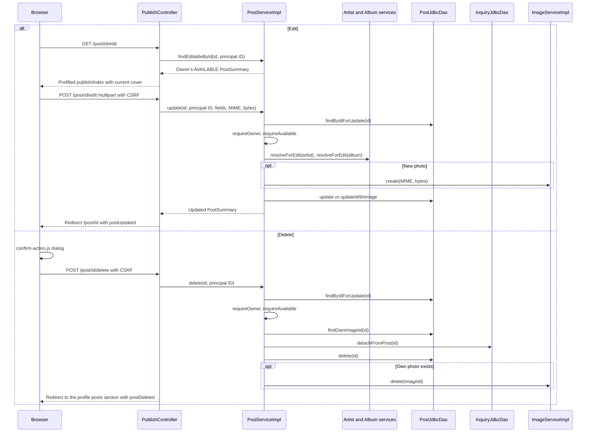

# Edit and delete flow

The owner of an AVAILABLE publication can edit it at /post/{id}/edit or delete it with POST /post/{id}/delete. Both routes require a session. The service locks the post, verifies ownership and requires AVAILABLE status, so a sold exemplar is frozen as the record of its sale.

## Flow diagram

The sequence follows the controller, service and DAO calls at `f12af08`. Error handling and transaction limits are explained below; this is a source trace, not a runtime test.



## Editing

[[PublishController]] reuses publish/index with `editing=true`, the edit action URL and a cancel link back to the detail page. GET prefills [[PublishForm]] from the summary and passes the current cover ID for the preview. A failed validation or business error rebuilds the same edit view after checking ownership again.

[[PostServiceImpl]].update locks the post with FOR UPDATE, requires the owner and AVAILABLE status, and resolves the catalog identity through resolveForEdit. That path differs from publishing: [[ArtistServiceImpl]] rewrites the shared artist display name, and [[AlbumServiceImpl]] rewrites the shared album title casing and genre, whenever the owner's typed values differ from the stored ones. An edit therefore changes how that artist or album appears on every other publication. If the edit points the post at a different album that the same owner already published, the unique key surfaces as DuplicatePostException.

An empty file input keeps the current image through update; a new file is validated and stored as a new image row, and updateWithImage points the post at it. The previous image row is not deleted. An oversized upload redirects back to /post/{id}/edit?coverTooLarge.

## Deleting

The detail page's delete form asks for confirmation through ui:confirm-dialog. [[PostServiceImpl]].delete locks and checks the post, reads its own image ID, and calls [[InquiryJdbcDao]].detachFromPost before deleting the row. Detaching copies album_id and seller_id onto each inquiry, clears post_id and turns PENDING inquiries into REJECTED, because inquiries.post_id has a foreign key to posts. Buyers keep seeing those inquiries under a deleted marker, grouped by album and seller. No email tells them the publication disappeared.

After the post row is gone, the service deletes the post's own photo, never the album fallback cover, and logs the IDs and the number of detached inquiries. The controller redirects to the profile's publication list with a `postDeleted` notice.

Missing posts map to 404, another owner's post to 403, and a SOLD post to 409, for both GET and POST routes. Security requires authentication for /post/*/edit and /post/*/delete; ownership remains a service rule.

[[Post detail flow]] · [[Profile flow]] · [[Cover image flow]] · [[Inquiry and sale flow]] · [[Transactions and concurrency]]

## Code snippets

### Update under lock

Both checks run on the locked row before any catalog or image write. See [[PostServiceImpl]] for the complete class.

[services/src/main/java/ar/edu/itba/paw/services/PostServiceImpl.java, lines 174–200](<file:///Users/bautistapessagno/Desktop/ITBA/PAW/paw2026b/services/src/main/java/ar/edu/itba/paw/services/PostServiceImpl.java>)

```java
    @Override
    @Transactional
    public PostSummary update(final long postId, final long publisherId, final String title,
                              final String artistName, final int releaseYear, final Genre genre, final int price,
                              final String description, final Condition condition, final Integer pressingYear,
                              final String zone, final String coverContentType, final byte[] coverData) {
        requireAvailable(requireOwner(
                postDao.findByIdForUpdate(postId).orElseThrow(PostNotFoundException::new), publisherId));
        try {
            final Artist artist = artistService.resolveForEdit(artistName);
            final Album album = albumService.resolveForEdit(title, artist.getId(), releaseYear, genre);
            final boolean updated = coverData == null || coverData.length == 0
                    ? postDao.update(postId, album.getId(), price, blankToNull(description), condition,
                            pressingYear, blankToNull(zone))
                    : postDao.updateWithImage(postId, album.getId(), price, blankToNull(description), condition,
                            pressingYear, blankToNull(zone),
                            imageService.create(coverContentType, coverData).getId());
            if (!updated) {
                throw new PostNotFoundException();
            }
            return postDao.findById(postId).orElseThrow(PostNotFoundException::new);
        } catch (final DuplicatePostKeyException e) {
            throw new DuplicatePostException();
        } catch (final DataIntegrityViolationException e) {
            throw new ConcurrentPublishException();
        }
    }
```

### Delete with detached inquiries

Detaching must precede deletion because of the inquiry foreign key; the own image goes last. See [[PostServiceImpl]] for the complete class.

[services/src/main/java/ar/edu/itba/paw/services/PostServiceImpl.java, lines 206–221](<file:///Users/bautistapessagno/Desktop/ITBA/PAW/paw2026b/services/src/main/java/ar/edu/itba/paw/services/PostServiceImpl.java>)

```java
    @Override
    @Transactional
    public void delete(final long postId, final long publisherId) {
        requireAvailable(requireOwner(
                postDao.findByIdForUpdate(postId).orElseThrow(PostNotFoundException::new), publisherId));
        final Long ownImageId = postDao.findOwnImageId(postId).orElse(null);
        final int detached = inquiryDao.detachFromPost(postId);
        if (!postDao.delete(postId)) {
            throw new PostNotFoundException();
        }
        if (ownImageId != null) {
            imageService.delete(ownImageId);
        }
        LOGGER.info("Deleted post postId={} publisherId={} detachedInquiries={} ownImageId={}",
                postId, publisherId, detached, ownImageId);
    }
```

### Detach before delete

One UPDATE copies the post's album and seller with correlated subqueries and closes pending inquiries. See [[InquiryJdbcDao]] for the complete class.

[persistence/src/main/java/ar/edu/itba/paw/persistence/InquiryJdbcDao.java, lines 205–213](<file:///Users/bautistapessagno/Desktop/ITBA/PAW/paw2026b/persistence/src/main/java/ar/edu/itba/paw/persistence/InquiryJdbcDao.java>)

```java
    @Override
    public int detachFromPost(final long postId) {
        return jdbcTemplate.update("UPDATE inquiries SET "
                        + "album_id = (SELECT album_id FROM posts WHERE id = inquiries.post_id), "
                        + "seller_id = (SELECT user_id FROM posts WHERE id = inquiries.post_id), "
                        + "post_id = NULL, status = CASE WHEN status = ? THEN ? ELSE status END "
                        + "WHERE post_id = ?",
                InquiryStatus.PENDING.name(), InquiryStatus.REJECTED.name(), postId);
    }
```

### Shared catalog rewrite on edit

When the typed title or genre differs from the stored album, the album itself is updated. See [[AlbumServiceImpl]] for the complete class.

[services/src/main/java/ar/edu/itba/paw/services/AlbumServiceImpl.java, lines 31–42](<file:///Users/bautistapessagno/Desktop/ITBA/PAW/paw2026b/services/src/main/java/ar/edu/itba/paw/services/AlbumServiceImpl.java>)

```java
    @Override
    @Transactional
    public Album resolveForEdit(final String title, final long artistId, final int releaseYear,
                                final Genre genre) {
        final String trimmedTitle = title.trim();
        final Album album = albumDao.findByArtistTitleYear(trimmedTitle, artistId, releaseYear)
                .orElseGet(() -> albumDao.create(trimmedTitle, artistId, releaseYear, genre));
        if (album.getTitle().equals(trimmedTitle) && album.getGenre() == genre) {
            return album;
        }
        return albumDao.updateMetadata(album.getId(), trimmedTitle, genre);
    }
```
