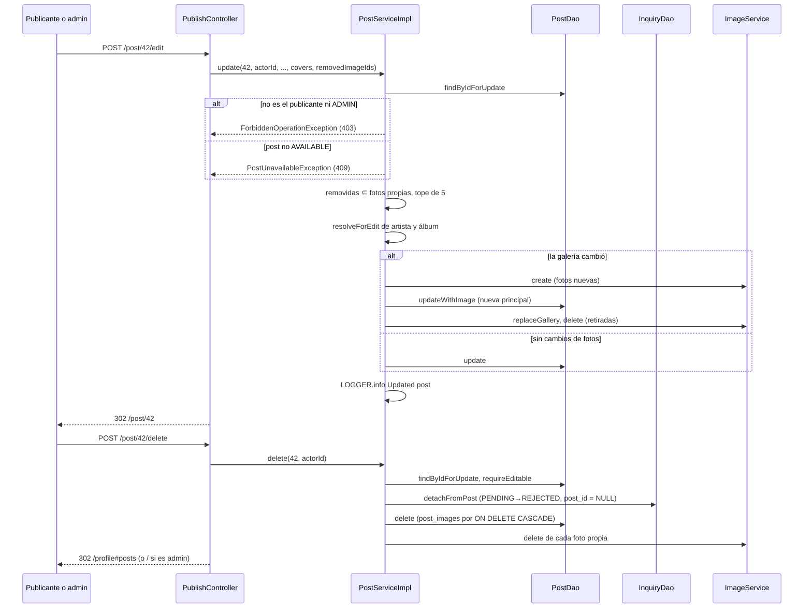

# Edit and delete flow

> [!summary] En una frase
> El publicante, o un administrador, edita o elimina una publicación mientras siga disponible; eliminar no borra las consultas: las desengancha del post y rechaza las pendientes.

## Qué resuelve

`GET` y `POST /post/{id}/edit` y `POST /post/{id}/delete`. Con el PR #46 un administrador también modera publicaciones ajenas, en reemplazo del panel `/admin` eliminado. Desde el PR #51 el service vuelve a chequear quién actúa: ya no depende solo del `@PreAuthorize`.

## Herramientas

| Herramienta | Para qué se usa acá |
|---|---|
| `@PreAuthorize` con `hasRole('ADMIN') or @postAccess.isPublisher(...)` | Quién puede editar o eliminar, en la capa web |
| `requireEditable(post, actorId)` en [[PostServiceImpl]] | La misma regla en el service: publicante o rol `ADMIN`, si no `ForbiddenOperationException` (403) |
| `SELECT ... FOR UPDATE` | Que la edición o el borrado no se crucen con una consulta o una venta |
| `ON DELETE CASCADE` en `post_images` | Las filas de la galería se van con el post |
| `UPDATE` de desenganche | Conservar las consultas de un post eliminado |
| `confirm-action.js` + `ui:confirm-dialog` | Confirmación antes de eliminar |
| Mismo formulario y validador que publicar | [[PublishForm]], [[PublishFormValidator]] |

## Recorrido paso a paso

### Editar

1. `GET /post/{id}/edit`: `VERIFIED` por URL y `CAN_MODERATE_POST` por recurso. `findEditableById(postId, actorId)` pasa por `requireEditable`: si quien actúa no es el publicante, busca la Cuenta y exige rol `ADMIN` (si no, 403); después exige `AVAILABLE` (si no, 409). El formulario se precarga con los datos actuales; la vista recibe las fotos propias y la portada de respaldo del álbum.
2. `POST /post/{id}/edit` → `PostServiceImpl.update(postId, actorId, ...)`:
   - `findByIdForUpdate` bloquea el post y `requireEditable` exige publicante o `ADMIN` y post `AVAILABLE`. La autorización va **antes** que las reglas numéricas: alguien sin permiso recibe 403 aunque mande datos inválidos.
   - Reglas numéricas de [[VinylInputRules]]. Si un POST armado a mano las saltea, `InvalidPostDataException`, que desde el PR #62 [[ErrorResponseAdvice]] responde con 400.
   - Las fotos a quitar (`removedImageIds`, las que se marcaron con la X de cada foto: [[Gallery flow]]) tienen que ser fotos propias de ese post; si no, `InvalidImageException`.
   - El tope de 5 cuenta las que se conservan más las nuevas. El validador del formulario no puede saberlo; por eso lo informa el service y el controller lo muestra en el campo.
   - `resolveForEdit` de artista y álbum: busca o crea por identidad y, si el nombre visible o el género difieren, **actualiza el registro compartido**.
   - Crea las fotos nuevas, actualiza el post (con `image_id` si cambió la galería), reemplaza `post_images` y borra las imágenes retiradas.
   - Loguea `Updated post postId=... actorId=... galleryChanged=...` (PR #62), todavía dentro de la transacción ([[Logging]]).
3. Éxito: aviso `postUpdated` y redirección a la ficha.

### Eliminar

`POST /post/{id}/delete` → `PostServiceImpl.delete`:

1. Bloquea el post y pasa por `requireEditable` (publicante o `ADMIN`, y `AVAILABLE`).
2. Lee los ids de sus fotos propias.
3. `inquiryDao.detachFromPost`: en un `UPDATE`, cada consulta copia `album_id` y `seller_id` del post, pone `post_id = NULL` y, si estaba `PENDING`, pasa a `REJECTED`.
4. Borra el post. Las filas de `post_images` se van por `ON DELETE CASCADE`.
5. Borra las imágenes (cada borrado solo procede si nada más la referencia).
6. Loguea cuántas consultas desenganchó y cuántas imágenes borró.

El controller redirige a `/profile#posts`, o a `/` si quien eliminó es administrador.


```mermaid
sequenceDiagram
    participant V as Publicante o admin
    participant C as PublishController
    participant S as PostServiceImpl
    participant P as PostDao
    participant Q as InquiryDao
    participant I as ImageService
    V->>C: POST /post/42/edit
    C->>S: update(42, actorId, ..., covers, removedImageIds)
    S->>P: findByIdForUpdate
    alt no es el publicante ni ADMIN
        S-->>C: ForbiddenOperationException (403)
    else post no AVAILABLE
        S-->>C: PostUnavailableException (409)
    end
    S->>S: removidas ⊆ fotos propias, tope de 5
    S->>S: resolveForEdit de artista y álbum
    alt la galería cambió
        S->>I: create (fotos nuevas)
        S->>P: updateWithImage (nueva principal)
        S->>I: replaceGallery, delete (retiradas)
    else sin cambios de fotos
        S->>P: update
    end
    S->>S: LOGGER.info Updated post
    C-->>V: 302 /post/42
    V->>C: POST /post/42/delete
    C->>S: delete(42, actorId)
    S->>P: findByIdForUpdate, requireEditable
    S->>Q: detachFromPost (PENDING→REJECTED, post_id = NULL)
    S->>P: delete (post_images por ON DELETE CASCADE)
    S->>I: delete de cada foto propia
    C-->>V: 302 /profile#35;posts (o / si es admin)
```

## Decisiones y por qué

| Decisión | Alternativa | Motivo | Fuente |
|---|---|---|---|
| Solo se edita o elimina lo `AVAILABLE` | Permitirlo siempre | "Un ejemplar vendido es el registro de la compra"; uno reservado tiene una venta en curso | Comentario en [[PostServiceImpl]] |
| Las consultas sobreviven desenganchadas | Borrarlas en cascada | El comprador sigue viendo qué preguntó y que la publicación ya no existe | Comentario en [[PostServiceImpl]]; migración V1 |
| Desenganchar antes de borrar | Borrar primero | Hay FK de `inquiries.post_id` a `posts` | Orden en `delete` |
| Borrar imágenes después del post | Antes | Las referencias tienen que desaparecer primero | Comentario en [[PostServiceImpl]] |
| La portada del álbum no se borra | Borrarla con el post | "Es del álbum y queda" | Comentario en [[PostServiceImpl]] |
| Pertenencia en `@PreAuthorize` **y** en el service | Solo en el controller, como hasta `8929aea` | El service no confía en que todo llamador pase por el controller; es el mismo criterio que ya seguían la venta y la libreta | Comentarios en [[PostService]] y [[SecurityConfig]]; commit `563f7020` |
| El administrador modera desde la ficha | Panel `/admin` | El panel estaba vacío; se quitó | Commits `60480b55`, `e462c468` |
| Un post inexistente pasa el handler | Devolver `false` | Que el service responda 404 y no un 403 engañoso | Comentario en [[PostAccessHandler]] |

## Concurrencia y casos borde

- Editar mientras alguien consulta: los dos bloquean el post y se ordenan.
- Eliminar mientras el publicante acepta una consulta desde otra pestaña: quien llegue segundo ve el post reservado (409) o inexistente (404 o 409).
- Quitar todas las fotos: el post queda sin imagen propia y se muestra la portada heredada o el placeholder.
- `removedImageIds` con un id que no es una foto propia del post: `InvalidImageException`, que el controller muestra como error del campo de fotos.

## Límites conocidos

- **Editar reescribe datos compartidos.** `resolveForEdit` cambia el nombre visible del artista y el título o género del álbum, que también usan publicaciones de otras Cuentas.
- El rol `ADMIN` se lee de la base en cada edición ajena (`userService.findById`), no del principal de la sesión. Es una lectura extra; a cambio, si se le quita el rol, el service deja de aceptarlo aunque su sesión todavía lo tenga (inferencia a partir del código).
- Eliminar rechaza las consultas pendientes **sin correo** a esos compradores.
- No hay historial de cambios de una publicación.

## Preguntas de defensa

**¿Qué pasa con las consultas si borro la publicación?**
Quedan en la bandeja del comprador con el álbum y el vendedor copiados; las pendientes pasan a rechazadas.

**¿Por qué no puedo editar una publicación reservada?**
Porque hay una venta en curso con un precio y un ejemplar pactados. Solo se toca lo que sigue disponible.

**¿Cómo modera un administrador?**
La misma expresión de `@PreAuthorize` lo deja pasar por rol; la ficha le muestra los botones (`PostDetail.isEditable`).

**Si el controller ya tiene `@PreAuthorize`, ¿para qué chequea el service?**
Para que la regla no dependa de cómo se llegue al service. `update`, `delete` y `findEditableById` reciben el id de quien actúa y lo comparan con el publicante, o buscan si es `ADMIN`. Lo cubren ocho tests nuevos de [[PostServiceImplTest]].

**¿Qué diferencia hay entre 403, 404 y 409 acá?**
403 si no es tuya ni sos administrador; 404 si no existe; 409 si existe y es tuya pero ya no está disponible.

## Evidencia de código

Expresión de moderación y endpoint de borrado:

Fuente exacta en `c3e2a4c`: [webapp/src/main/java/ar/edu/itba/paw/webapp/controller/PublishController.java](</Users/bautistapessagno/Desktop/proyectos_itba/PAW/paw2026b/webapp/src/main/java/ar/edu/itba/paw/webapp/controller/PublishController.java>), líneas 38–40.

```java
    // Editar y eliminar: el Publicante o un administrador. Que el post siga a la venta lo exige el service.
    private static final String CAN_MODERATE_POST =
            "hasRole('ADMIN') or @postAccess.isPublisher(authentication, #postId)";
```

Fuente exacta en `c3e2a4c`: [webapp/src/main/java/ar/edu/itba/paw/webapp/controller/PublishController.java](</Users/bautistapessagno/Desktop/proyectos_itba/PAW/paw2026b/webapp/src/main/java/ar/edu/itba/paw/webapp/controller/PublishController.java>), líneas 116–156.

```java
    /*
     * El validador revisa las fotos nuevas una por una; el tope de la galeria cuenta tambien las
     * que se conservan, y eso lo sabe recien PostService: lo informa con InvalidImageException.
     */
    @PreAuthorize(CAN_MODERATE_POST)
    @RequestMapping(value = "/post/{postId:[0-9]+}/edit", method = RequestMethod.POST)
    public ModelAndView edit(@PathVariable("postId") final long postId,
                             @AuthenticationPrincipal final AuthenticatedUser currentUser,
                             @Valid @ModelAttribute("publishForm") final PublishForm form,
                             final BindingResult bindingResult,
                             final RedirectAttributes redirectAttributes) throws IOException {
        if (bindingResult.hasErrors()) {
            return editView(postId, currentUser.getId());
        }

        try {
            postService.update(postId, currentUser.getId(), form.getTitle(), form.getArtistName(),
                    form.getReleaseYear(), form.getGenre(), form.getPrice(), form.getDescription(),
                    form.getCondition(), form.getPressingYear(), form.getZone(),
                    form.toImageUploads(), form.getRemovedImageIds());
            redirectAttributes.addFlashAttribute("postUpdated", true);
            return new ModelAndView("redirect:/post/" + postId);
        } catch (final InvalidImageException e) {
            bindingResult.rejectValue("covers", "publish.cover.invalid");
        } catch (final DuplicatePostException e) {
            bindingResult.reject("publish.duplicate");
        } catch (final ConcurrentPublishException e) {
            bindingResult.reject("publish.concurrent");
        }
        return editView(postId, currentUser.getId());
    }

    @PreAuthorize(CAN_MODERATE_POST)
    @RequestMapping(value = "/post/{postId:[0-9]+}/delete", method = RequestMethod.POST)
    public ModelAndView delete(@PathVariable("postId") final long postId,
                               @AuthenticationPrincipal final AuthenticatedUser currentUser,
                               final RedirectAttributes redirectAttributes) {
        postService.delete(postId, currentUser.getId());
        redirectAttributes.addFlashAttribute("postDeleted", true);
        return new ModelAndView(currentUser.isAdmin() ? "redirect:/" : "redirect:/profile#posts");
    }
```

Edición:

Fuente exacta en `c3e2a4c`: [services/src/main/java/ar/edu/itba/paw/services/PostServiceImpl.java](</Users/bautistapessagno/Desktop/proyectos_itba/PAW/paw2026b/services/src/main/java/ar/edu/itba/paw/services/PostServiceImpl.java>), líneas 283–330.

```java
    @Override
    @Transactional
    public PostSummary update(final long postId, final long actorId, final String title,
                              final String artistName, final int releaseYear, final Genre genre, final int price,
                              final String description, final Condition condition, final Integer pressingYear,
                              final String zone, final List<ImageUpload> images,
                              final List<Long> removedImageIds) {
        requireEditable(postDao.findByIdForUpdate(postId).orElseThrow(PostNotFoundException::new), actorId);
        requireValidPostData(releaseYear, price, pressingYear);
        final List<Long> oldImageIds = findUploadedImageIds(postId);
        final Set<Long> removed = removedImageIds == null ? Set.of() : new HashSet<>(removedImageIds);
        if (!oldImageIds.containsAll(removed)) {
            throw new InvalidImageException();
        }
        final List<Long> imageIds = new ArrayList<>();
        for (final Long imageId : oldImageIds) {
            if (!removed.contains(imageId)) {
                imageIds.add(imageId);
            }
        }
        requireGallerySize(imageIds.size() + (images == null ? 0 : images.size()));
        try {
            final Artist artist = artistService.resolveForEdit(artistName);
            final Album album = albumService.resolveForEdit(title, artist.getId(), releaseYear, genre);
            imageIds.addAll(createImages(images));
            final boolean galleryChanged = !removed.isEmpty() || images != null && !images.isEmpty();
            final boolean updated = galleryChanged
                    ? postDao.updateWithImage(postId, album.getId(), price, blankToNull(description), condition,
                            pressingYear, blankToNull(zone), imageIds.isEmpty() ? null : imageIds.get(0))
                    : postDao.update(postId, album.getId(), price, blankToNull(description), condition,
                            pressingYear, blankToNull(zone));
            if (!updated) {
                throw new PostNotFoundException();
            }
            if (galleryChanged) {
                imageService.replaceGallery(postId, extrasOf(imageIds));
                for (final Long removedId : removed) {
                    imageService.delete(removedId);
                }
            }
            LOGGER.info("Updated post postId={} actorId={} galleryChanged={}", postId, actorId, galleryChanged);
            return postDao.findById(postId).orElseThrow(PostNotFoundException::new);
        } catch (final DuplicatePostKeyException e) {
            throw new DuplicatePostException();
        } catch (final DataIntegrityViolationException e) {
            throw new ConcurrentPublishException();
        }
    }
```

Borrado:

Fuente exacta en `c3e2a4c`: [services/src/main/java/ar/edu/itba/paw/services/PostServiceImpl.java](</Users/bautistapessagno/Desktop/proyectos_itba/PAW/paw2026b/services/src/main/java/ar/edu/itba/paw/services/PostServiceImpl.java>), líneas 332–352.

```java
    // Solo se elimina lo que todavia esta a la venta: un ejemplar vendido es el registro de
    // la compra. Las consultas sobreviven desenganchadas del post para que el comprador
    // siga viendo que pregunto y que la publicacion ya no existe. La foto propia de la
    // publicacion se va con ella; la portada del album es del album y queda.
    @Override
    @Transactional
    public int delete(final long postId, final long actorId) {
        requireEditable(postDao.findByIdForUpdate(postId).orElseThrow(PostNotFoundException::new), actorId);
        final List<Long> uploadedImageIds = findUploadedImageIds(postId);
        final int detached = inquiryDao.detachFromPost(postId);
        if (!postDao.delete(postId)) {
            throw new PostNotFoundException();
        }
        // Las filas de la galeria se van con el post (ON DELETE CASCADE): recien ahi se pueden borrar las fotos.
        for (final Long imageId : uploadedImageIds) {
            imageService.delete(imageId);
        }
        LOGGER.info("Deleted post postId={} detachedInquiries={} deletedImages={}",
                postId, detached, uploadedImageIds.size());
        return detached;
    }
```

Desenganche de consultas:

Fuente exacta en `c3e2a4c`: [persistence/src/main/java/ar/edu/itba/paw/persistence/InquiryJdbcDao.java](</Users/bautistapessagno/Desktop/proyectos_itba/PAW/paw2026b/persistence/src/main/java/ar/edu/itba/paw/persistence/InquiryJdbcDao.java>), líneas 415–425.

```java
    // Antes de borrar la publicacion, cada consulta se queda con su album y su vendedor y
    // deja de apuntar al post. Las pendientes se cierran: ya no hay nada que aceptar.
    @Override
    public int detachFromPost(final long postId) {
        return jdbcTemplate.update("UPDATE inquiries SET "
                        + "album_id = (SELECT album_id FROM posts WHERE id = inquiries.post_id), "
                        + "seller_id = (SELECT user_id FROM posts WHERE id = inquiries.post_id), "
                        + "post_id = NULL, status = CASE WHEN status = ? THEN ? ELSE status END "
                        + "WHERE post_id = ?",
                InquiryStatus.PENDING.name(), InquiryStatus.REJECTED.name(), postId);
    }
```

Handler de pertenencia:

Fuente exacta en `c3e2a4c`: [webapp/src/main/java/ar/edu/itba/paw/webapp/security/PostAccessHandler.java](</Users/bautistapessagno/Desktop/proyectos_itba/PAW/paw2026b/webapp/src/main/java/ar/edu/itba/paw/webapp/security/PostAccessHandler.java>), líneas 6–23.

```java
// Regla de @PreAuthorize para editar y eliminar una publicacion; el administrador entra por su rol
// en la misma expresion. Un post inexistente pasa: el service responde 404 en vez de un 403 enganioso.
public final class PostAccessHandler {

    private final PostService postService;

    public PostAccessHandler(final PostService postService) {
        this.postService = postService;
    }

    public boolean isPublisher(final Authentication authentication, final long postId) {
        return AuthenticatedUser.idOf(authentication)
                .map(userId -> postService.findPublisherId(postId)
                        .map(userId::equals)
                        .orElse(true))
                .orElse(false);
    }
}
```

Reescritura de datos compartidos:

Fuente exacta en `c3e2a4c`: [services/src/main/java/ar/edu/itba/paw/services/AlbumServiceImpl.java](</Users/bautistapessagno/Desktop/proyectos_itba/PAW/paw2026b/services/src/main/java/ar/edu/itba/paw/services/AlbumServiceImpl.java>), líneas 31–42.

```java
    @Override
    @Transactional
    public Album resolveForEdit(final String title, final long artistId, final int releaseYear,
                                final Genre genre) {
        final String trimmedTitle = title.trim();
        final Album album = albumDao.findByArtistTitleYear(trimmedTitle, artistId, releaseYear)
                .orElseGet(() -> albumDao.create(trimmedTitle, artistId, releaseYear, genre));
        if (album.getTitle().equals(trimmedTitle) && album.getGenre() == genre) {
            return album;
        }
        return albumDao.updateMetadata(album.getId(), trimmedTitle, genre);
    }
```

## Archivos para seguir el flujo

- [webapp/src/main/java/ar/edu/itba/paw/webapp/controller/PublishController.java](</Users/bautistapessagno/Desktop/proyectos_itba/PAW/paw2026b/webapp/src/main/java/ar/edu/itba/paw/webapp/controller/PublishController.java>) · [[PublishController]]
- [webapp/src/main/java/ar/edu/itba/paw/webapp/security/PostAccessHandler.java](</Users/bautistapessagno/Desktop/proyectos_itba/PAW/paw2026b/webapp/src/main/java/ar/edu/itba/paw/webapp/security/PostAccessHandler.java>) · [[PostAccessHandler]]
- [services/src/main/java/ar/edu/itba/paw/services/PostServiceImpl.java](</Users/bautistapessagno/Desktop/proyectos_itba/PAW/paw2026b/services/src/main/java/ar/edu/itba/paw/services/PostServiceImpl.java>) · [[PostServiceImpl]]
- [services/src/main/java/ar/edu/itba/paw/services/ArtistServiceImpl.java](</Users/bautistapessagno/Desktop/proyectos_itba/PAW/paw2026b/services/src/main/java/ar/edu/itba/paw/services/ArtistServiceImpl.java>) · [[ArtistServiceImpl]]
- [services/src/main/java/ar/edu/itba/paw/services/AlbumServiceImpl.java](</Users/bautistapessagno/Desktop/proyectos_itba/PAW/paw2026b/services/src/main/java/ar/edu/itba/paw/services/AlbumServiceImpl.java>) · [[AlbumServiceImpl]]
- [services/src/main/java/ar/edu/itba/paw/services/ImageServiceImpl.java](</Users/bautistapessagno/Desktop/proyectos_itba/PAW/paw2026b/services/src/main/java/ar/edu/itba/paw/services/ImageServiceImpl.java>) · [[ImageServiceImpl]]
- [persistence/src/main/java/ar/edu/itba/paw/persistence/PostJdbcDao.java](</Users/bautistapessagno/Desktop/proyectos_itba/PAW/paw2026b/persistence/src/main/java/ar/edu/itba/paw/persistence/PostJdbcDao.java>) · [[PostJdbcDao]]
- [persistence/src/main/java/ar/edu/itba/paw/persistence/InquiryJdbcDao.java](</Users/bautistapessagno/Desktop/proyectos_itba/PAW/paw2026b/persistence/src/main/java/ar/edu/itba/paw/persistence/InquiryJdbcDao.java>) · [[InquiryJdbcDao]]
- [persistence/src/main/java/ar/edu/itba/paw/persistence/ImageJdbcDao.java](</Users/bautistapessagno/Desktop/proyectos_itba/PAW/paw2026b/persistence/src/main/java/ar/edu/itba/paw/persistence/ImageJdbcDao.java>) · [[ImageJdbcDao]]
- [models/src/main/java/ar/edu/itba/paw/models/PostDetail.java](</Users/bautistapessagno/Desktop/proyectos_itba/PAW/paw2026b/models/src/main/java/ar/edu/itba/paw/models/PostDetail.java>) · [[PostDetail]]
- [webapp/src/main/webapp/js/confirm-action.js](</Users/bautistapessagno/Desktop/proyectos_itba/PAW/paw2026b/webapp/src/main/webapp/js/confirm-action.js>)

Fuente inspeccionada: `c3e2a4c`, 2026-10-05. Es evidencia estática; no implica ejecución de la aplicación. [[Source inventory]] · [[Roadmap de lectura]]
