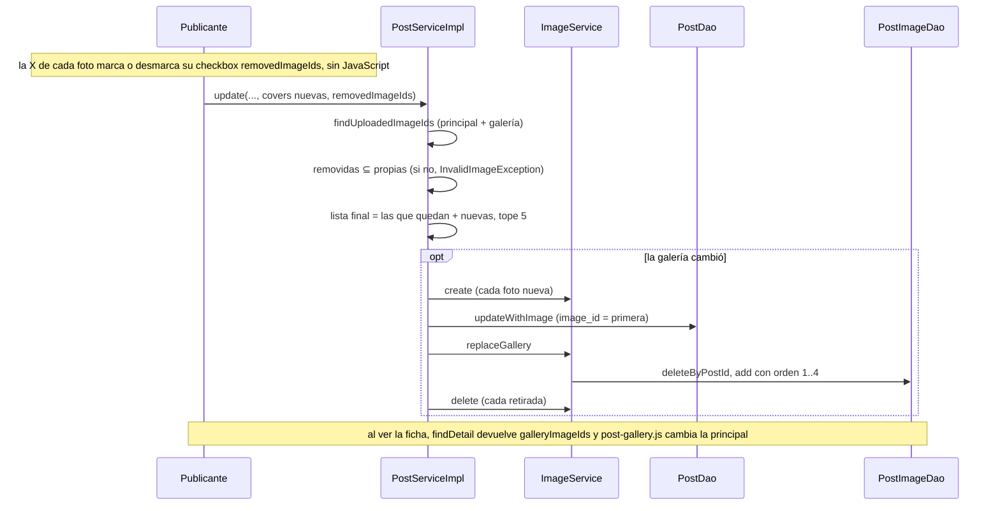

# Gallery flow

> [!summary] En una frase
> Una publicación tiene hasta cinco fotos: la primera es la principal y vive en el post; las otras cuatro, ordenadas, viven en `post_images`.

## Qué resuelve

Varias fotos por ejemplar (PR #46). Cómo se sube y se sirve una imagen está en [[Cover image flow]].

## Herramientas

| Herramienta | Para qué se usa acá |
|---|---|
| `<input type="file" multiple>` + `MultipartFile[]` | Elegir varias fotos en un campo |
| [[ImageFiles]] | Convertir `MultipartFile` en [[ImageUpload]]: los services no conocen el tipo web |
| [[ImageRules]] | Tope de 5 fotos, 5 MiB cada una, firma del formato |
| Tabla `post_images` con `UNIQUE`, `CHECK` y `ON DELETE CASCADE` | Orden, tope y limpieza garantizados por la base |
| `post-gallery.js` | Cambiar la foto grande al tocar una miniatura |

## Modelo de datos

Fuente exacta en `c3e2a4c`: [persistence/src/main/resources/db/migration/V8__post_gallery.sql](</Users/bautistapessagno/Desktop/proyectos_itba/PAW/paw2026b/persistence/src/main/resources/db/migration/V8__post_gallery.sql>), líneas 1–13.

```sql
-- posts.image_id remains the primary photo; album.cover_image_id remains the fallback.
-- Only the additional photos live here, in their displayed order.
CREATE TABLE post_images (
    id SERIAL PRIMARY KEY,
    post_id INTEGER NOT NULL,
    image_id INTEGER NOT NULL,
    display_order INTEGER NOT NULL,
    CONSTRAINT post_images_post_fk FOREIGN KEY (post_id) REFERENCES posts(id) ON DELETE CASCADE,
    CONSTRAINT post_images_image_fk FOREIGN KEY (image_id) REFERENCES images(id),
    CONSTRAINT post_images_post_order_key UNIQUE (post_id, display_order),
    CONSTRAINT post_images_image_id_key UNIQUE (image_id),
    CONSTRAINT post_images_order_check CHECK (display_order BETWEEN 1 AND 4)
);
```

| Posición | Dónde está | Cómo se sabe el orden |
|---|---|---|
| Foto principal | `posts.image_id` | Es la primera elegida |
| Fotos 2 a 5 | `post_images` | `display_order` de 1 a 4 |
| Respaldo | `albums.cover_image_id` | Solo si el post no tiene foto propia (`COALESCE` en el SQL del resumen) |

## Recorrido paso a paso

**Publicar.** El formulario manda `covers[]`. El validador rechaza más de 5 archivos o alguno inválido. El service crea una fila en `images` por foto, pone la primera en el post y pasa el resto a `replaceGallery`, que inserta con orden 1, 2, 3...

**Editar.** La vista muestra las fotos propias (`findUploadedImageIds`: la principal y luego la galería), cada una con una X en la esquina (PR #59). La X es la `label` de un checkbox `removedImageIds` que el CSS vuelve invisible pero deja en el formulario: tocarla marca la foto, que queda atenuada (`:has(...:checked)`), y la X pasa a mostrar un ícono de restaurar que la desmarca. No hay JavaScript: lo que viaja es el checkbox. El formulario envía `removedImageIds` y, opcionalmente, fotos nuevas. El service:

1. Verifica que cada id a retirar sea una foto propia del post.
2. Arma la lista final: las que quedan, en su orden, más las nuevas al final.
3. Verifica el tope de 5 sobre esa lista.
4. Si la galería cambió: actualiza `posts.image_id` con la primera, borra y vuelve a insertar `post_images`, y elimina las imágenes retiradas.

**Ver.** `PostService.findDetail` devuelve `galleryImageIds`: la imagen que muestra la tarjeta (la propia o la portada heredada) seguida de las adicionales. La ficha dibuja miniaturas solo si hay más de una. Cada miniatura es un enlace real a la imagen: sin JavaScript abre la foto; con `post-gallery.js` reemplaza la principal y marca `aria-current`.

**Eliminar el post.** Las filas de `post_images` desaparecen por la cascada y después se borran las imágenes.



## Decisiones y por qué

| Decisión | Alternativa | Motivo | Fuente |
|---|---|---|---|
| La principal sigue en `posts.image_id` | Mover todas a `post_images` | No tocar el resumen ni las tarjetas existentes: "`posts.image_id` remains the primary photo" | Comentario en la migración V8 |
| `display_order` de 1 a 4 con `CHECK` | Sin límite en la base | El tope queda en el dato, además de en [[ImageRules]] | Migración V8 |
| `UNIQUE (image_id)` | Permitir compartir | Una imagen pertenece a una sola galería | Migración V8 |
| Reemplazar la galería entera al editar | Actualizar filas una por una | Con cuatro filas como máximo es más simple y no deja huecos en el orden | Código de [[ImageServiceImpl]] |
| El tope al editar lo chequea el service | Solo el validador | El validador ve las fotos nuevas, no las que se conservan | Comentario en [[PublishController]] |
| `ImageUpload` en `models` | Pasar `MultipartFile` al service | `services` no depende de Spring MVC | Comentario en [[ImageFiles]] |
| Miniaturas como enlaces | Botones con JavaScript | Funciona sin JavaScript | Marcado de `detail.jsp` |
| Quitar con una X que es la `label` de un checkbox oculto | Casilla visible con texto, como hasta el PR #59 | Se ve como un control de quitar y sigue mandando el mismo campo sin JavaScript; marcar es reversible hasta guardar | Commits `1cc8230e`, `b017d3dd`; comentarios en `style.css` |

## Límites conocidos

- No se puede reordenar: para cambiar la principal hay que retirar y volver a subir.
- Atenuar la foto marcada usa el selector `:has()` de CSS; en un navegador que no lo soporte la foto no se atenúa, aunque la X igual cambia de ícono y el campo se envía.
- Las fotos no se redimensionan ni se generan miniaturas: la miniatura descarga la imagen completa.
- El límite del request es 26 MiB; cinco fotos de 5 MiB entran justo.

## Preguntas de defensa

**¿Por qué dos lugares para las fotos?**
La principal ya existía en el post y todas las consultas de listado la usan. La galería agregó solo las adicionales, sin migrar lo anterior.

**¿Qué garantiza que no haya más de cinco?**
[[ImageRules]] en formulario y service, y en la base el `CHECK` de orden entre 1 y 4 más la unicidad por post y orden.

**¿Qué pasa con las fotos al borrar la publicación?**
Las filas de la galería se van en cascada y el service borra después las imágenes.

## Evidencia de código

Fuente exacta en `c3e2a4c`: [services/src/main/java/ar/edu/itba/paw/services/ImageServiceImpl.java](</Users/bautistapessagno/Desktop/proyectos_itba/PAW/paw2026b/services/src/main/java/ar/edu/itba/paw/services/ImageServiceImpl.java>), líneas 67–81.

```java
    @Override
    @Transactional(readOnly = true)
    public List<Long> findGalleryImageIds(final long postId) {
        return postImageDao.findImageIdsByPostId(postId);
    }

    // La posicion 0 es la foto principal del post: las adicionales arrancan en 1.
    @Override
    @Transactional
    public void replaceGallery(final long postId, final List<Long> imageIds) {
        postImageDao.deleteByPostId(postId);
        for (int index = 0; index < imageIds.size(); index++) {
            postImageDao.add(postId, imageIds.get(index), index + 1);
        }
    }
```

Fuente exacta en `c3e2a4c`: [services/src/main/java/ar/edu/itba/paw/services/PostServiceImpl.java](</Users/bautistapessagno/Desktop/proyectos_itba/PAW/paw2026b/services/src/main/java/ar/edu/itba/paw/services/PostServiceImpl.java>), líneas 136–149.

```java
    @Override
    @Transactional(readOnly = true)
    public List<Long> findUploadedImageIds(final long postId) {
        return leadImageThenGallery(postDao.findOwnImageId(postId).orElse(null), postId);
    }

    private List<Long> leadImageThenGallery(final Long leadImageId, final long postId) {
        final List<Long> imageIds = new ArrayList<>();
        if (leadImageId != null) {
            imageIds.add(leadImageId);
        }
        imageIds.addAll(imageService.findGalleryImageIds(postId));
        return List.copyOf(imageIds);
    }
```

Fuente exacta en `c3e2a4c`: [persistence/src/main/java/ar/edu/itba/paw/persistence/PostImageJdbcDao.java](</Users/bautistapessagno/Desktop/proyectos_itba/PAW/paw2026b/persistence/src/main/java/ar/edu/itba/paw/persistence/PostImageJdbcDao.java>), líneas 31–50.

```java
    @Override
    public List<Long> findImageIdsByPostId(final long postId) {
        return List.copyOf(jdbcTemplate.query("SELECT image_id FROM post_images WHERE post_id = ? ORDER BY display_order",
                IMAGE_ID_MAPPER, postId));
    }

    @Override
    public long add(final long postId, final long imageId, final int position) {
        final Map<String, Object> parameters = new HashMap<>();
        parameters.put("post_id", postId);
        parameters.put("image_id", imageId);
        parameters.put("display_order", position);
        return jdbcInsert.executeAndReturnKey(parameters).longValue();
    }

    @Override
    public int deleteByPostId(final long postId) {
        return jdbcTemplate.update("DELETE FROM post_images WHERE post_id = ?", postId);
    }
}
```

Fuente exacta en `c3e2a4c`: [webapp/src/main/webapp/js/post-gallery.js](</Users/bautistapessagno/Desktop/proyectos_itba/PAW/paw2026b/webapp/src/main/webapp/js/post-gallery.js>), líneas 1–21.

```javascript
(function () {
    'use strict';

    document.addEventListener('DOMContentLoaded', function () {
        var mainImage = document.querySelector('[data-gallery-main]');
        var thumbnails = document.querySelectorAll('[data-gallery-thumb]');
        if (!mainImage || thumbnails.length < 2) {
            return;
        }
        thumbnails.forEach(function (thumbnail) {
            thumbnail.addEventListener('click', function (event) {
                event.preventDefault();
                mainImage.src = thumbnail.href;
                thumbnails.forEach(function (item) {
                    item.removeAttribute('aria-current');
                });
                thumbnail.setAttribute('aria-current', 'true');
            });
        });
    });
}());
```

La X de quitar al editar:

Fuente exacta en `c3e2a4c`: [webapp/src/main/webapp/WEB-INF/views/publish/index.jsp](</Users/bautistapessagno/Desktop/proyectos_itba/PAW/paw2026b/webapp/src/main/webapp/WEB-INF/views/publish/index.jsp>), líneas 116–127.

```jsp
                                    <div class="publish-gallery__item">
                                        " alt="" data-existing-image/>
                                        <form:checkbox path="removedImageIds" value="${imageId}" id="remove-image-${imageId}"
                                                       cssClass="publish-gallery__remove-input"/>
                                        <label for="remove-image-<c:out value="${imageId}"/>" class="publish-gallery__remove">
                                            <span class="publish-gallery__remove-icon" aria-hidden="true"
                                                  title="<c:out value="${removeImageLabel}"/>">&times;</span>
                                            <span class="publish-gallery__restore-icon" aria-hidden="true"
                                                  title="<c:out value="${restoreImageLabel}"/>">&#8634;</span>
                                            <span class="visually-hidden"><c:out value="${removeImageLabel}"/></span>
                                        </label>
                                    </div>
```

Fuente exacta en `c3e2a4c`: [webapp/src/main/webapp/css/style.css](</Users/bautistapessagno/Desktop/proyectos_itba/PAW/paw2026b/webapp/src/main/webapp/css/style.css>), líneas 431–473.

```css
/* El checkbox sigue siendo el campo real del form; solo se ve su label, como una X. */
.publish-gallery__remove-input {
    opacity: 0;
    pointer-events: none;
    position: absolute;
}

.publish-gallery__remove {
    align-items: center;
    background: var(--color-surface);
    border: 1px solid var(--color-border);
    border-radius: 50%;
    color: var(--color-text);
    cursor: pointer;
    display: flex;
    height: 1.5rem;
    justify-content: center;
    line-height: 1;
    position: absolute;
    right: -0.4rem;
    top: -0.4rem;
    width: 1.5rem;
}

.publish-gallery__remove:hover,
.publish-gallery__remove-input:focus-visible ~ .publish-gallery__remove {
    background: var(--color-accent);
    color: var(--color-text-on-accent);
}

/* Una foto marcada para borrar queda atenuada y la X pasa a restaurarla. */
.publish-gallery__item:has(.publish-gallery__remove-input:checked) img {
    opacity: 0.35;
}

.publish-gallery__restore-icon,
.publish-gallery__remove-input:checked ~ .publish-gallery__remove .publish-gallery__remove-icon {
    display: none;
}

.publish-gallery__remove-input:checked ~ .publish-gallery__remove .publish-gallery__restore-icon {
    display: inline;
}
```

## Archivos para seguir el flujo

- [webapp/src/main/java/ar/edu/itba/paw/webapp/form/PublishForm.java](</Users/bautistapessagno/Desktop/proyectos_itba/PAW/paw2026b/webapp/src/main/java/ar/edu/itba/paw/webapp/form/PublishForm.java>) · [[PublishForm]]
- [webapp/src/main/java/ar/edu/itba/paw/webapp/form/ImageFiles.java](</Users/bautistapessagno/Desktop/proyectos_itba/PAW/paw2026b/webapp/src/main/java/ar/edu/itba/paw/webapp/form/ImageFiles.java>) · [[ImageFiles]]
- [webapp/src/main/java/ar/edu/itba/paw/webapp/validation/PublishFormValidator.java](</Users/bautistapessagno/Desktop/proyectos_itba/PAW/paw2026b/webapp/src/main/java/ar/edu/itba/paw/webapp/validation/PublishFormValidator.java>) · [[PublishFormValidator]]
- [models/src/main/java/ar/edu/itba/paw/models/ImageRules.java](</Users/bautistapessagno/Desktop/proyectos_itba/PAW/paw2026b/models/src/main/java/ar/edu/itba/paw/models/ImageRules.java>) · [[ImageRules]]
- [models/src/main/java/ar/edu/itba/paw/models/ImageUpload.java](</Users/bautistapessagno/Desktop/proyectos_itba/PAW/paw2026b/models/src/main/java/ar/edu/itba/paw/models/ImageUpload.java>) · [[ImageUpload]]
- [services/src/main/java/ar/edu/itba/paw/services/PostServiceImpl.java](</Users/bautistapessagno/Desktop/proyectos_itba/PAW/paw2026b/services/src/main/java/ar/edu/itba/paw/services/PostServiceImpl.java>) · [[PostServiceImpl]]
- [services/src/main/java/ar/edu/itba/paw/services/ImageServiceImpl.java](</Users/bautistapessagno/Desktop/proyectos_itba/PAW/paw2026b/services/src/main/java/ar/edu/itba/paw/services/ImageServiceImpl.java>) · [[ImageServiceImpl]]
- [persistence-contracts/src/main/java/ar/edu/itba/paw/persistence/PostImageDao.java](</Users/bautistapessagno/Desktop/proyectos_itba/PAW/paw2026b/persistence-contracts/src/main/java/ar/edu/itba/paw/persistence/PostImageDao.java>) · [[PostImageDao]]
- [persistence/src/main/java/ar/edu/itba/paw/persistence/PostImageJdbcDao.java](</Users/bautistapessagno/Desktop/proyectos_itba/PAW/paw2026b/persistence/src/main/java/ar/edu/itba/paw/persistence/PostImageJdbcDao.java>) · [[PostImageJdbcDao]]
- [persistence/src/main/resources/db/migration/V8__post_gallery.sql](</Users/bautistapessagno/Desktop/proyectos_itba/PAW/paw2026b/persistence/src/main/resources/db/migration/V8__post_gallery.sql>)
- [webapp/src/main/webapp/WEB-INF/views/post/detail.jsp](</Users/bautistapessagno/Desktop/proyectos_itba/PAW/paw2026b/webapp/src/main/webapp/WEB-INF/views/post/detail.jsp>)
- [webapp/src/main/webapp/js/post-gallery.js](</Users/bautistapessagno/Desktop/proyectos_itba/PAW/paw2026b/webapp/src/main/webapp/js/post-gallery.js>)
- [webapp/src/main/webapp/WEB-INF/views/publish/index.jsp](</Users/bautistapessagno/Desktop/proyectos_itba/PAW/paw2026b/webapp/src/main/webapp/WEB-INF/views/publish/index.jsp>)

Fuente inspeccionada: `c3e2a4c`, 2026-10-05. Es evidencia estática; no implica ejecución de la aplicación. [[Source inventory]] · [[Roadmap de lectura]]
