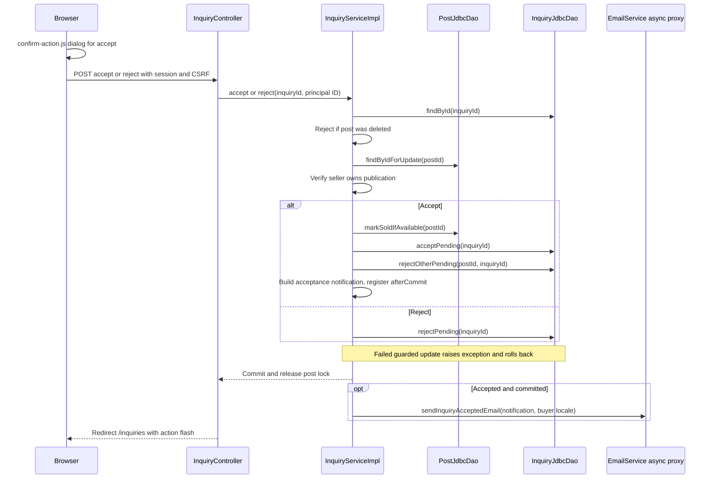

# Inquiry and sale flow

The inbox is split into two authenticated views. GET /inquiries lists received inquiries and GET /inquiries/sent lists sent ones; a sub-navigation tab bar shows both totals. Each view groups inquiries by publication and pages by group, five publications per page. The view offers accept and reject only for received PENDING inquiries whose publication is AVAILABLE. Accepting sells the single exemplar after an in-page confirmation dialog and emails the accepted buyer after commit.

## Flow diagram

The sequence follows the controller, service and DAO calls at `f12af08`. Error handling and transaction limits are explained below; this is a source trace, not a runtime test.



## Inbox reads

[[InquiryController]] asks [[InquiryServiceImpl]] for one [[InquiryPage]] plus the received and sent totals. The service counts distinct groups, turns the page number into an offset through [[Pagination]] and loads the rows of that page. [[InquiryJdbcDao]] resolves the page in two bounded statements: first the group keys ordered by each group's newest inquiry ID, then every inquiry of those keys. The service regroups the rows in insertion order into [[InquiryGroup]] values, so groups stay newest first and a group is never split between pages. A page past the total, or below 1, returns 404; page 1 of an empty inbox renders the empty state.

Each group header shows the cover, title, artist and a state marker, and links to the public detail page unless the publication was deleted. Received rows show buyer, message and actions or a status marker; sent rows show the seller once per group and the inquiry status. The sub-navigation totals count inquiries, while pagination counts publications.

## Sale and rejection

POST /inquiries/{id}/accept verifies ownership in [[InquiryServiceImpl]]. It reads the inquiry, refuses one whose post was deleted, locks its post with FOR UPDATE and compares post.userId with the principal ID. In the same transaction it changes AVAILABLE to SOLD, changes the chosen PENDING inquiry to ACCEPTED and rejects the other PENDING inquiries. If either guarded single-row write fails, an exception rolls the transaction back and the controller returns 409. After commit the buyer receives an acceptance email in their preferred locale, linking to /inquiries/sent.

POST /inquiries/{id}/reject uses the same publication lock and ownership check, then conditionally changes that inquiry from PENDING to REJECTED. It sends no email. Missing inquiry or post returns 404; another owner's request returns 403. The service reject method guards inquiry state but does not separately require an AVAILABLE post; the UI applies that condition.

confirm-action.js intercepts every form with `data-confirm-message` in the capture phase, shows the page's ui:confirm-dialog and resubmits only after confirmation. Without JavaScript the POST proceeds directly and the service guards still apply. Reject has no confirmation dialog.

Submission, acceptance, rejection, editing and deletion serialize on the same post row under service transactions. Sold posts disappear from search and reject new contact requests. When an owner deletes an AVAILABLE post, [[Edit and delete flow]] detaches its inquiries, rejects the pending ones and keeps them visible to buyers under a deleted marker. There is no payment, stock decrement or reopen/cancel operation.

This describes transaction declarations and guarded SQL, not a fresh concurrent PostgreSQL test. See [[Transactions and concurrency]], [[InquiryServiceImplTest]] and [[InquiryJdbcDaoTest]].

## Code snippets

### Accept, close competitors, notify after commit

Both guarded updates must succeed. If accepting the inquiry fails after marking the post SOLD, the rollback restores the post and the registered email never runs. See [[InquiryServiceImpl]] for the complete class.

[services/src/main/java/ar/edu/itba/paw/services/InquiryServiceImpl.java, lines 140–156](<file:///Users/bautistapessagno/Desktop/ITBA/PAW/paw2026b/services/src/main/java/ar/edu/itba/paw/services/InquiryServiceImpl.java>)

```java
    @Override
    @Transactional
    public Inquiry accept(final long inquiryId, final long sellerId) {
        final Inquiry inquiry = getInquiry(inquiryId);
        final PostSummary post = lockPostForSeller(inquiry, sellerId);
        if (!postDao.markSoldIfAvailable(post.getId())) {
            throw new InvalidInquiryStateException();
        }
        if (!inquiryDao.acceptPending(inquiryId)) {
            throw new InvalidInquiryStateException();
        }
        final int rejected = inquiryDao.rejectOtherPending(post.getId(), inquiryId);
        scheduleInquiryAcceptedEmail(inquiry, post);
        LOGGER.info("Accepted inquiry inquiryId={} postId={} sellerId={} rejectedCompeting={}",
                inquiryId, post.getId(), sellerId, rejected);
        return withStatus(inquiry, InquiryStatus.ACCEPTED);
    }
```

### Lock and authorize the owner

Both seller actions use this helper before writing. An inquiry detached from a deleted post has no post to lock. See [[InquiryServiceImpl]] for the complete class.

[services/src/main/java/ar/edu/itba/paw/services/InquiryServiceImpl.java, lines 174–184](<file:///Users/bautistapessagno/Desktop/ITBA/PAW/paw2026b/services/src/main/java/ar/edu/itba/paw/services/InquiryServiceImpl.java>)

```java
    private PostSummary lockPostForSeller(final Inquiry inquiry, final long sellerId) {
        if (inquiry.isPostDeleted()) {
            throw new InvalidInquiryStateException();
        }
        final PostSummary post = postDao.findByIdForUpdate(inquiry.getPostId())
                .orElseThrow(PostNotFoundException::new);
        if (post.getUserId() != sellerId) {
            throw new ForbiddenOperationException();
        }
        return post;
    }
```

### Page of groups in two statements

The first statement pages group keys; the second loads all rows for those keys. Placeholders are generated per key, so no value is concatenated into SQL. See [[InquiryJdbcDao]] for the complete class.

[persistence/src/main/java/ar/edu/itba/paw/persistence/InquiryJdbcDao.java, lines 149–166](<file:///Users/bautistapessagno/Desktop/ITBA/PAW/paw2026b/persistence/src/main/java/ar/edu/itba/paw/persistence/InquiryJdbcDao.java>)

```java
    private List<InquirySummary> findGroupPage(final String where, final long userId,
                                               final int groupLimit, final int groupOffset) {
        final List<String> keys = jdbcTemplate.queryForList(
                "SELECT g.group_key FROM (SELECT " + GROUP_KEY + " AS group_key, "
                        + "MAX(i.id) AS last_id " + GROUP_FROM + where
                        + "GROUP BY " + GROUP_KEY + ") g ORDER BY g.last_id DESC LIMIT ? OFFSET ?",
                String.class, userId, groupLimit, groupOffset);
        if (keys.isEmpty()) {
            return List.of();
        }
        final String placeholders = String.join(", ", Collections.nCopies(keys.size(), "?"));
        final List<Object> parameters = new ArrayList<>();
        parameters.add(userId);
        parameters.addAll(keys);
        return List.copyOf(jdbcTemplate.query(SUMMARY_SELECT + where + "AND " + GROUP_KEY
                        + " IN (" + placeholders + ") ORDER BY i.id DESC",
                SUMMARY_ROW_MAPPER, parameters.toArray()));
    }
```

### Regrouping in the service

The LinkedHashMap preserves the newest-first order produced by SQL. See [[InquiryServiceImpl]] for the complete class.

[services/src/main/java/ar/edu/itba/paw/services/InquiryServiceImpl.java, lines 103–118](<file:///Users/bautistapessagno/Desktop/ITBA/PAW/paw2026b/services/src/main/java/ar/edu/itba/paw/services/InquiryServiceImpl.java>)

```java
    private static List<InquiryGroup> groupByPost(final List<InquirySummary> inquiries) {
        final Map<PostGroupKey, List<InquirySummary>> inquiriesByPost = new LinkedHashMap<>();
        for (final InquirySummary inquiry : inquiries) {
            final PostGroupKey key = new PostGroupKey(inquiry.getPostId(), inquiry.getAlbumId(),
                    inquiry.getSellerId());
            inquiriesByPost.computeIfAbsent(key, ignored -> new ArrayList<>()).add(inquiry);
        }

        final List<InquiryGroup> groups = new ArrayList<>();
        for (final List<InquirySummary> grouped : inquiriesByPost.values()) {
            final InquirySummary first = grouped.get(0);
            groups.add(new InquiryGroup(first.getPostId(), first.getTitle(), first.getArtistName(),
                    first.getSellerUsername(), first.getCoverImageId(), first.getPostStatus(), grouped));
        }
        return List.copyOf(groups);
    }
```

### Database row lock

The separate post-row lock is held by the surrounding service transaction while the joined summary is read. See [[PostJdbcDao]] for the complete class.

[persistence/src/main/java/ar/edu/itba/paw/persistence/PostJdbcDao.java, lines 238–244](<file:///Users/bautistapessagno/Desktop/ITBA/PAW/paw2026b/persistence/src/main/java/ar/edu/itba/paw/persistence/PostJdbcDao.java>)

```java
    @Override
    public Optional<PostSummary> findByIdForUpdate(final long id) {
        if (jdbcTemplate.queryForList("SELECT id FROM posts WHERE id = ? FOR UPDATE", Long.class, id).isEmpty()) {
            return Optional.empty();
        }
        return findById(id);
    }
```

## Evidencia local anterior, 2026-09-17

[[Audit local 2026-09-17]] ejecutó la rama `e5e926d`, anterior a `f12af08`. Sus resultados de ejecución no se repitieron para esta revisión; [[Known gaps and document drift]] indica qué hallazgos del audit quedaron resueltos en el código actual y cuáles siguen abiertos.
