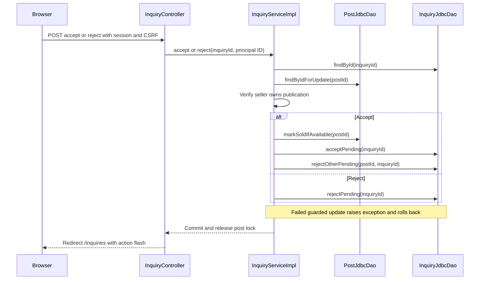

# Inquiry and sale flow

Authenticated GET /inquiries lists the principal's received and sent inquiries, newest first. The joined [[InquirySummary]] includes the buyer/seller display names, album, optional message and inquiry/post states. The view offers accept/reject only for received PENDING inquiries whose publication is AVAILABLE.

## Flow diagram

The sequence follows the controller, service and DAO calls at 40328f0. Error handling and transaction limits are explained below; this is a source trace, not a runtime test.



## Behavior and limits

POST /inquiries/{id}/accept verifies ownership in [[InquiryServiceImpl]]. It reads the inquiry, locks its post with FOR UPDATE and compares post.userId with the principal ID. In the same transaction it changes AVAILABLE to SOLD, changes the chosen PENDING inquiry to ACCEPTED and rejects the other PENDING inquiries. If either guarded single-row write fails, an exception rolls the transaction back and the controller returns 409.

POST /inquiries/{id}/reject uses the same publication lock and ownership check, then conditionally changes that inquiry from PENDING to REJECTED. Missing inquiry/post returns 404; another owner's request returns 403. The service reject method guards inquiry state but does not separately require AVAILABLE post status. The UI applies that extra visibility condition.

Submission, acceptance and rejection serialize on the same post row under service transactions. Sold posts disappear from search and reject new contact requests. Accept/reject redirect to the inbox with a flash message. There is no payment, stock decrement, reopen/cancel operation or acceptance email in these methods.

This describes transaction declarations and guarded SQL, not a fresh concurrent PostgreSQL test. See [[Transactions and concurrency]], [[InquiryServiceImplTest]] and [[InquiryJdbcDaoTest]].

## Code snippets

### Accept and close competitors

Both guarded updates must succeed. If accepting the inquiry fails after marking the post SOLD, the transaction rollback restores the post. See [[InquiryServiceImpl]] for the complete class.

[services/src/main/java/ar/edu/itba/paw/services/InquiryServiceImpl.java, lines 80–93](<file:///Users/bautistapessagno/Desktop/ITBA/PAW/paw2026b/services/src/main/java/ar/edu/itba/paw/services/InquiryServiceImpl.java>)

```java
    @Override
    @Transactional
    public void accept(final long inquiryId, final long sellerId) {
        final long postId = lockPostForSeller(inquiryId, sellerId);
        if (!postDao.markSoldIfAvailable(postId)) {
            throw new InvalidInquiryStateException();
        }
        if (!inquiryDao.acceptPending(inquiryId)) {
            throw new InvalidInquiryStateException();
        }
        final int rejected = inquiryDao.rejectOtherPending(postId, inquiryId);
        LOGGER.info("Accepted inquiry inquiryId={} postId={} sellerId={} rejectedCompeting={}",
                inquiryId, postId, sellerId, rejected);
    }
```

### Lock and authorize the owner

Both seller actions use this helper before writing. Missing records and ownership errors propagate to the controller handlers. See [[InquiryServiceImpl]] for the complete class.

[services/src/main/java/ar/edu/itba/paw/services/InquiryServiceImpl.java, lines 109–117](<file:///Users/bautistapessagno/Desktop/ITBA/PAW/paw2026b/services/src/main/java/ar/edu/itba/paw/services/InquiryServiceImpl.java>)

```java
    private long lockPostForSeller(final long inquiryId, final long sellerId) {
        final Inquiry inquiry = inquiryDao.findById(inquiryId).orElseThrow(InquiryNotFoundException::new);
        final PostSummary post = postDao.findByIdForUpdate(inquiry.getPostId())
                .orElseThrow(PostNotFoundException::new);
        if (post.getUserId() != sellerId) {
            throw new ForbiddenOperationException();
        }
        return post.getId();
    }
```

### Database row lock

The separate post-row lock is held by the surrounding service transaction while the joined summary is read. See [[PostJdbcDao]] for the complete class.

[persistence/src/main/java/ar/edu/itba/paw/persistence/PostJdbcDao.java, lines 181–187](<file:///Users/bautistapessagno/Desktop/ITBA/PAW/paw2026b/persistence/src/main/java/ar/edu/itba/paw/persistence/PostJdbcDao.java>)

```java
    @Override
    public Optional<PostSummary> findByIdForUpdate(final long id) {
        if (jdbcTemplate.queryForList("SELECT id FROM posts WHERE id = ? FOR UPDATE", Long.class, id).isEmpty()) {
            return Optional.empty();
        }
        return findById(id);
    }
```
