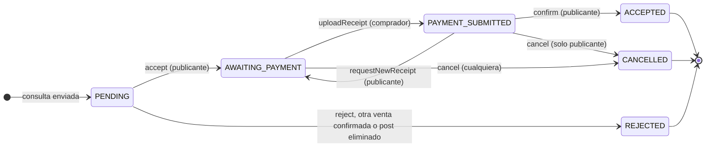
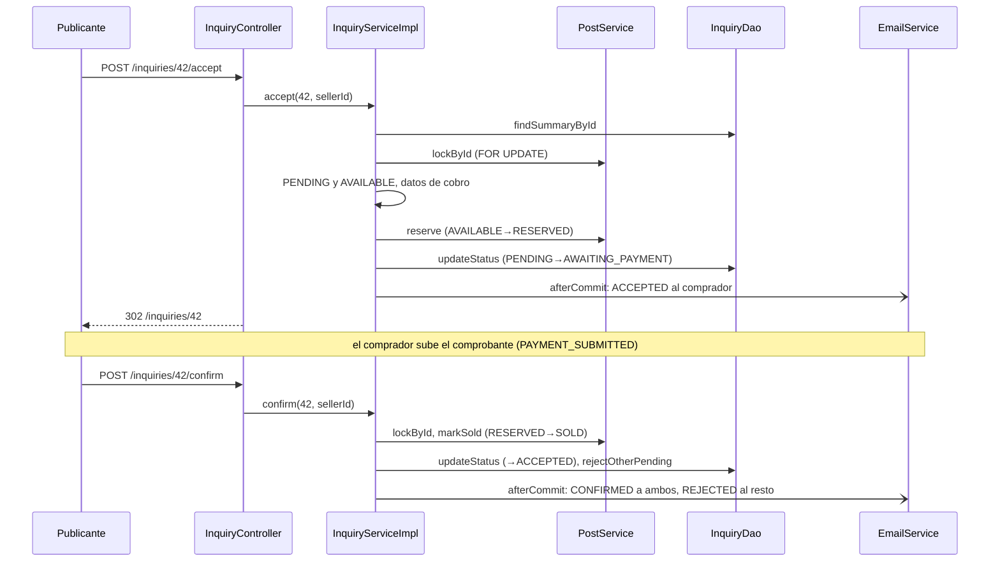

# Inquiry and sale flow

> [!summary] En una frase
> Aceptar una consulta reserva el vinilo; el comprador transfiere por fuera y sube el comprobante; el publicante lo revisa y confirma, y recién ahí el vinilo queda vendido y las demás consultas se rechazan.

## Qué resuelve

La venta de un ejemplar único entre dos Cuentas, sin pasarela de pago. Reemplaza al flujo de septiembre, donde "aceptar" vendía en el acto. Entró con los PR #40, #44 y #42 (perfil con datos de cobro, dirección de envío, comprobante). Cómo nace la consulta está en [[Contact flow]] (de a una) y en [[Cart flow]] (varias juntas); la conversación, en [[Conversation flow]]; las reseñas, en [[Reviews flow]].

## Herramientas

| Herramienta | Para qué se usa acá |
|---|---|
| Spring MVC | Un endpoint POST por transición, con `RedirectAttributes` para el aviso |
| `@PreAuthorize` + [[InquiryAccessHandler]] | Quién puede disparar cada transición |
| `@Transactional` | Cada transición es una transacción |
| `SELECT ... FOR UPDATE` | Bloquear la fila del post: todas las consultas de un ejemplar compiten por ella |
| `UPDATE ... WHERE status = ?` | Guarda de estado: si el estado ya cambió, no afecta filas |
| `CHECK` en la base | Solo estados válidos en `posts.status` e `inquiries.status` |
| Commons FileUpload + `MultipartFilter` | Subida del comprobante |
| [[ReceiptRules]] | Tipo, tamaño y firma del comprobante, compartidas por formulario y service |
| `ResponseEntity<byte[]>` | Descarga del comprobante con headers de seguridad |
| [[TransactionCallbacks]] + `@Async` | Aviso por correo a la otra parte después del commit |

## Máquina de estados


```mermaid
stateDiagram-v2
    direction LR
    [*] --> PENDING: consulta enviada
    PENDING --> AWAITING_PAYMENT: accept (publicante)
    PENDING --> REJECTED: reject, otra venta confirmada o post eliminado
    AWAITING_PAYMENT --> PAYMENT_SUBMITTED: uploadReceipt (comprador)
    PAYMENT_SUBMITTED --> AWAITING_PAYMENT: requestNewReceipt (publicante)
    PAYMENT_SUBMITTED --> ACCEPTED: confirm (publicante)
    AWAITING_PAYMENT --> CANCELLED: cancel (cualquiera)
    PAYMENT_SUBMITTED --> CANCELLED: cancel (solo publicante)
    ACCEPTED --> [*]
    REJECTED --> [*]
    CANCELLED --> [*]
```

`ACCEPTED` significa **venta confirmada**. El nombre se conservó para no migrar las consultas aceptadas con el flujo anterior.

El post acompaña con su propio estado:

| Operación | Consulta | Post |
|---|---|---|
| `accept` | `PENDING` → `AWAITING_PAYMENT` | `AVAILABLE` → `RESERVED` |
| `uploadReceipt` | `AWAITING_PAYMENT` → `PAYMENT_SUBMITTED` | Sigue `RESERVED` |
| `requestNewReceipt` | `PAYMENT_SUBMITTED` → `AWAITING_PAYMENT` | Sigue `RESERVED` |
| `confirm` | `PAYMENT_SUBMITTED` → `ACCEPTED`; las otras `PENDING` → `REJECTED` | `RESERVED` → `SOLD` |
| `cancel` | → `CANCELLED` | `RESERVED` → `AVAILABLE` |
| `reject` | `PENDING` → `REJECTED` | No cambia |

Mientras el post está reservado, las demás consultas pendientes quedan esperando: si la venta se cancela, el publicante puede aceptar otra; si se confirma, se rechazan todas juntas.

## Recorrido paso a paso

### Bandejas: `GET /inquiries` y `GET /inquiries/sent`

Recibidas y enviadas. Las dos agrupan por publicación y paginan **por grupo** (5 por página): varias consultas sobre el mismo ejemplar son una entrada y nunca quedan partidas entre páginas. El DAO lo resuelve en dos sentencias, sin N+1: primero las claves de grupo de la página, después todas las consultas de esas claves. Cada fila trae el último Mensaje por `LEFT JOIN` contra una subconsulta agregada. Ver [[Paginated listings]].

### Aceptar: `POST /inquiries/{id}/accept`

1. `VERIFIED` por URL y `@inquiryAccess.isSeller` por recurso.
2. `InquiryServiceImpl.accept`:
   - Lee el resumen y vuelve a exigir que quien opera sea el publicante.
   - `lockPost`: `SELECT id FROM posts WHERE id = ? FOR UPDATE`. Si el post fue eliminado, 409.
   - Exige consulta `PENDING` y post `AVAILABLE`. El estado se mira **antes** que los datos de cobro: una consulta que ya no se puede aceptar es un conflicto, no un motivo para mandar a cargar el CBU.
   - `userService.lockById(sellerId)` bloquea la fila de la Cuenta y lee de ahí los datos de cobro. Sin ellos, `MissingPaymentInfoException`.
   - `postService.reserve` y `move(PENDING → AWAITING_PAYMENT)`, los dos con guarda de estado.
   - Registra el correo `ACCEPTED` para el comprador.
3. El controller redirige a la página de la venta con un aviso. Si faltaban datos de cobro, redirige a `/profile?missingPayment#account`, que abre esa fila.

### Subir el comprobante: `POST /inquiries/{id}/receipt`

1. Solo el comprador (`isBuyer`). Formulario multipart con [[ReceiptValidator]].
2. `uploadReceipt` valida de nuevo con [[ReceiptRules]], exige comprador, bloquea el post y llama a `saveReceipt`: una sola sentencia que guarda tipo, bytes y fecha **y** pasa a `PAYMENT_SUBMITTED`, con `WHERE status = 'AWAITING_PAYMENT'`. Un segundo envío, o uno después de cancelar, no encuentra la fila.
3. Correo `RECEIPT_UPLOADED` al publicante.
4. Un archivo que excede el límite del multipart no llega al controller: [[MultipartExceptionHandlerFilter]] redirige a la venta con `?receiptTooLarge`.

### Revisar: confirmar o pedir otro

- `GET /inquiries/{id}/receipt` sirve el archivo a las dos partes con `nosniff`, sin caché y, si es imagen, `Content-Security-Policy: sandbox`.
- `POST .../request-receipt` (publicante): vuelve a `AWAITING_PAYMENT` y avisa al comprador. El comprobante anterior queda guardado hasta que suba otro.
- `POST .../confirm` (publicante): `PAYMENT_SUBMITTED → ACCEPTED`, `markSold`, lee las consultas que seguían pendientes, las rechaza en un solo `UPDATE` y manda `CONFIRMED` a las dos partes y `REJECTED` a cada comprador que esperaba.

### Cancelar: `POST /inquiries/{id}/cancel`

Cualquiera de las dos partes mientras espera el pago; solo el publicante una vez subido el comprobante (`isCancellableBy`). Libera el post (`RESERVED → AVAILABLE`) y avisa a la otra parte.

### Rechazar: `POST /inquiries/{id}/reject`

Publicante, solo sobre una `PENDING`. Avisa al comprador con un correo que lleva a su bandeja de enviadas.


```mermaid
sequenceDiagram
    participant V as Publicante
    participant C as InquiryController
    participant S as InquiryServiceImpl
    participant P as PostService
    participant D as InquiryDao
    participant M as EmailService
    V->>C: POST /inquiries/42/accept
    C->>S: accept(42, sellerId)
    S->>D: findSummaryById
    S->>P: lockById (FOR UPDATE)
    S->>S: PENDING y AVAILABLE, datos de cobro
    S->>P: reserve (AVAILABLE→RESERVED)
    S->>D: updateStatus (PENDING→AWAITING_PAYMENT)
    S-)M: afterCommit: ACCEPTED al comprador
    C-->>V: 302 /inquiries/42
    Note over V,M: el comprador sube el comprobante (PAYMENT_SUBMITTED)
    V->>C: POST /inquiries/42/confirm
    C->>S: confirm(42, sellerId)
    S->>P: lockById, markSold (RESERVED→SOLD)
    S->>D: updateStatus (→ACCEPTED), rejectOtherPending
    S-)M: afterCommit: CONFIRMED a ambos, REJECTED al resto
```

## Datos

Migración V5:

Fuente exacta en `8929aea`: [persistence/src/main/resources/db/migration/V5__venta_con_comprobante.sql](</Users/bautistapessagno/Desktop/proyectos_itba/PAW/paw2026b/persistence/src/main/resources/db/migration/V5__venta_con_comprobante.sql>), líneas 1–50.

```sql
-- Venta con comprobante de pago: datos de cobro, libreta de direcciones, reserva del post
-- y comprobante en la consulta. Traduce lo que main agrego a schema.sql antes de pasar a
-- Flyway. Las consultas anteriores quedan con las columnas nuevas en NULL.

-- Datos de cobro: quien compra los ve para transferir. Opcionales hasta que la cuenta
-- quiera aceptar una consulta.
ALTER TABLE users ADD COLUMN cbu VARCHAR(22);
ALTER TABLE users ADD COLUMN alias VARCHAR(20);

-- Una direccion no se edita ni se borra: se archiva, porque una consulta puede seguir
-- apuntandola.
CREATE TABLE addresses (
    id SERIAL PRIMARY KEY,
    user_id INTEGER NOT NULL,
    street VARCHAR(100) NOT NULL,
    street_number VARCHAR(10) NOT NULL,
    apartment VARCHAR(20),
    city VARCHAR(100) NOT NULL,
    province VARCHAR(30) NOT NULL,
    postal_code VARCHAR(10) NOT NULL,
    notes VARCHAR(200),
    archived BOOLEAN DEFAULT FALSE NOT NULL,
    created_at TIMESTAMP DEFAULT NOW() NOT NULL,
    CONSTRAINT addresses_user_fk FOREIGN KEY (user_id) REFERENCES users(id)
);
CREATE INDEX addresses_user_id_idx ON addresses (user_id);

-- Un post reservado espera la transferencia de una consulta.
ALTER TABLE posts DROP CONSTRAINT posts_status_check;
ALTER TABLE posts ADD CONSTRAINT posts_status_check
    CHECK (status IN ('AVAILABLE', 'RESERVED', 'SOLD'));

-- Direccion de envio que eligio el comprador.
ALTER TABLE inquiries ADD COLUMN address_id INTEGER;
ALTER TABLE inquiries ADD CONSTRAINT inquiries_address_fk
    FOREIGN KEY (address_id) REFERENCES addresses(id);

-- Comprobante de la transferencia: uno por consulta, se reemplaza entero al subir otro.
ALTER TABLE inquiries ADD COLUMN receipt_content_type VARCHAR(100);
ALTER TABLE inquiries ADD COLUMN receipt_data BYTEA;
ALTER TABLE inquiries ADD COLUMN receipt_uploaded_at TIMESTAMP;

-- Precio publicado al momento de consultar: es el monto a transferir aunque despues el
-- vendedor edite el post. Las consultas anteriores usan el del post.
ALTER TABLE inquiries ADD COLUMN price INTEGER;

-- Un estado fuera del enum romperia InquiryStatus.valueOf al leer la consulta.
ALTER TABLE inquiries ADD CONSTRAINT inquiries_status_check
    CHECK (status IN ('PENDING', 'AWAITING_PAYMENT', 'PAYMENT_SUBMITTED', 'ACCEPTED',
        'REJECTED', 'CANCELLED'));
```

- El comprobante vive **en la fila de la consulta** (`receipt_content_type`, `receipt_data`, `receipt_uploaded_at`): uno por consulta, se reemplaza entero.
- `inquiries.price` congela el precio publicado al consultar: es el monto a transferir aunque el publicante edite el post después.
- `inquiries.address_id` apunta a la dirección elegida; una dirección nunca se borra, se archiva.

## Qué ve cada parte

[[InquiryDetail]] decide qué acciones muestra la vista, con las mismas reglas que el service aplica antes de escribir.

| Dato o acción | Comprador | Publicante |
|---|---|---|
| Datos de cobro del publicante | Solo con la venta abierta (`AWAITING_PAYMENT` o `PAYMENT_SUBMITTED`) | Los suyos, en el perfil |
| Dirección de envío | La suya | Completa solo con venta en curso o concretada; si no, ciudad y provincia |
| Aceptar / rechazar | No | Con la consulta `PENDING` (aceptar además exige post `AVAILABLE`) |
| Subir comprobante | En `AWAITING_PAYMENT` | No |
| Confirmar / pedir otro | No | En `PAYMENT_SUBMITTED` |
| Cancelar | En `AWAITING_PAYMENT` | En `AWAITING_PAYMENT` o `PAYMENT_SUBMITTED` |
| Calificar | En `ACCEPTED` | En `ACCEPTED` |

## Decisiones y por qué

| Decisión | Alternativa descartada | Motivo | Fuente |
|---|---|---|---|
| Reservar al aceptar y vender al confirmar | Vender al aceptar (flujo anterior) | El pago ocurre fuera de la aplicación; hace falta un estado intermedio | Spec `feature_venta-con-comprobante_20260924.md` |
| Bloquear el **post** en cada transición | Bloquear la consulta | Todas las consultas de un ejemplar compiten por una única fila: el bloqueo las ordena | Comentario en [[InquiryServiceImpl]] |
| Guarda de estado en cada `UPDATE` además del bloqueo | Confiar en lo leído | El resumen se lee antes de bloquear; el `UPDATE` condicional es la guarda final | Comentario en [[InquiryDetail]] |
| Datos de cobro leídos de la fila bloqueada | Usar los del resumen | No cruzarse con un `updatePaymentInfo` que los esté borrando | Comentario en [[InquiryServiceImpl]] |
| Guardar el comprobante y cambiar el estado en una sentencia | Dos sentencias | Evita un comprobante guardado sin transición | Comentario en [[InquiryJdbcDao]] |
| Comprobante en la tabla de consultas | Reusar la tabla `images` | Es un dato privado de la venta, con sus propias reglas de acceso y de tipo | Inferencia a partir del esquema |
| Precio congelado en la consulta | Leer siempre el del post | Es lo que se pactó transferir | Comentario en la migración V5 |
| Dirección parcial hasta aceptar | Mostrar siempre la completa | "Publicar un vinilo no puede servir para juntar domicilios" | Comentario en [[InquiryServiceImpl]] |
| `ACCEPTED` conserva su nombre | Renombrar a `CONFIRMED` | No migrar consultas existentes | Comentario en [[InquiryStatus]] |
| `CHECK` sobre `inquiries.status` | Solo el enum de Java | Un valor fuera del enum rompería `valueOf` al leer | Comentario en la migración V5 |
| El comprador no cancela después de subir el comprobante | Dejarlo cancelar siempre | Ya declaró que pagó; decide el publicante | Comentario en [[InquirySummary]] |
| 409 para una transición inválida | 400 o 403 | El recurso existe y es tuyo, pero ya no está en ese estado | Handler en [[InquiryController]] |

## Concurrencia y casos borde

- **Dos aceptaciones simultáneas de consultas distintas del mismo post**: la segunda espera el bloqueo, ve el post `RESERVED` y recibe 409.
- **Aceptar mientras otro comprador consulta**: la consulta nueva también bloquea el post; entra antes como `PENDING` o después recibe "no disponible".
- **Doble clic en "subir"**: el segundo `saveReceipt` no encuentra `AWAITING_PAYMENT` y da 409.
- **Aceptar y vaciar datos de cobro a la vez**: los dos bloquean la fila de la Cuenta; uno ve el resultado del otro.
- **Post eliminado**: `lockPost` lanza 409. Solo se elimina un post `AVAILABLE`, así que nunca hay una venta abierta sobre un post eliminado.
- **Fallo a mitad de una transición**: la excepción deshace todo; por ejemplo, si `reserve` anduvo y `move` no, el post vuelve a `AVAILABLE`.
- **Orden de bloqueos**: siempre post primero y Cuenta después.

## Límites conocidos

- No hay pasarela: la aplicación no sabe si la transferencia existió. Confirmar es una decisión manual del publicante.
- No hay plazo: una venta puede quedar en `AWAITING_PAYMENT` indefinidamente y el post sigue reservado hasta que alguien cancele.
- El comprobante de tipo imagen no valida firma (el PDF sí).
- La unicidad `(user_id, album_id)` de `posts` incluye los vendidos: quien vendió un álbum no puede volver a publicar otro ejemplar del mismo.
- [[InquiryServiceImplTest]] cubre las reglas con mocks; el bloqueo real contra PostgreSQL no tiene test automático.

## Preguntas de defensa

**¿Qué pasa si dos personas quieren comprar el mismo disco?**
Las dos consultas quedan `PENDING`. El publicante acepta una; el post pasa a `RESERVED` y la otra queda esperando. Si la venta se confirma, la otra se rechaza con aviso; si se cancela, puede aceptarla.

**¿Cómo evitan vender dos veces el mismo ejemplar?**
Bloqueo de fila sobre el post más `UPDATE ... WHERE status = 'AVAILABLE'`. La segunda transacción espera, y cuando sigue ve el estado nuevo.

**¿Por qué `FOR UPDATE` si ya tienen el `UPDATE` condicional?**
El `UPDATE` condicional evita la escritura incorrecta. El bloqueo además ordena las lecturas previas (datos de cobro, otras consultas) dentro de la misma transacción.

**¿Dónde se guarda el comprobante y quién lo ve?**
En columnas de la consulta. Lo ven solo las dos partes; se sirve con `nosniff`, sin caché y con sandbox si es imagen.

**¿Qué estado HTTP devuelve una transición inválida?**
409, con la vista `error/409`.

**¿Qué pasa si el mail no sale?**
La transición quedó guardada. El aviso se pierde y la otra parte lo ve al entrar a su bandeja.

## Evidencia de código

Aceptar:

Fuente exacta en `8929aea`: [services/src/main/java/ar/edu/itba/paw/services/InquiryServiceImpl.java](</Users/bautistapessagno/Desktop/proyectos_itba/PAW/paw2026b/services/src/main/java/ar/edu/itba/paw/services/InquiryServiceImpl.java>), líneas 255–285.

```java
    /*
     * Toda transicion bloquea el post antes de escribir: las consultas de un mismo ejemplar
     * compiten por esa unica fila. Cada escritura lleva su guarda de estado; si no encuentra
     * la fila como esperaba, se corta con InvalidInquiryStateException y el rollback deshace
     * lo anterior.
     */
    @Override
    @Transactional
    public Inquiry accept(final long inquiryId, final long sellerId) {
        final InquirySummary inquiry = getSummary(inquiryId);
        requireSeller(inquiry, sellerId);
        final PostSummary post = lockPost(inquiry);
        // El estado va antes que los datos de cobro: una consulta que ya no se puede aceptar
        // es un conflicto, no un motivo para mandar al Publicante a cargar su CBU.
        if (!inquiry.isPending() || post.getStatus() != PostStatus.AVAILABLE) {
            throw new InvalidInquiryStateException();
        }
        // Los datos de cobro se leen de la fila bloqueada, no del summary: asi no se cruza con
        // un updatePaymentInfo que los este borrando en paralelo.
        final User seller = userService.lockById(sellerId);
        if (!seller.hasPaymentInfo()) {
            throw new MissingPaymentInfoException();
        }
        if (!postService.reserve(post.getId())) {
            throw new InvalidInquiryStateException();
        }
        move(inquiryId, InquiryStatus.PENDING, InquiryStatus.AWAITING_PAYMENT);
        notifyBuyer(inquiry, post, InquiryEvent.ACCEPTED);
        LOGGER.info("Accepted inquiry inquiryId={} postId={} sellerId={}", inquiryId, post.getId(), sellerId);
        return new Inquiry(inquiryId, inquiry.getPostId(), inquiry.getBuyerId(), InquiryStatus.AWAITING_PAYMENT);
    }
```

Comprobante, pedir otro, confirmar y cancelar:

Fuente exacta en `8929aea`: [services/src/main/java/ar/edu/itba/paw/services/InquiryServiceImpl.java](</Users/bautistapessagno/Desktop/proyectos_itba/PAW/paw2026b/services/src/main/java/ar/edu/itba/paw/services/InquiryServiceImpl.java>), líneas 299–369.

```java
    @Override
    @Transactional
    public void uploadReceipt(final long inquiryId, final long buyerId, final String contentType,
                              final byte[] data) {
        final String normalizedType = ReceiptRules.normalizeContentType(contentType);
        if (!ReceiptRules.isValid(normalizedType, data)) {
            LOGGER.warn("Rejected receipt inquiryId={} contentType={} bytes={}", inquiryId, contentType,
                    data == null ? 0 : data.length);
            throw new InvalidReceiptException();
        }
        final InquirySummary inquiry = getSummary(inquiryId);
        requireBuyer(inquiry, buyerId);
        final PostSummary post = lockPost(inquiry);
        if (!inquiryDao.saveReceipt(inquiryId, normalizedType, data)) {
            throw new InvalidInquiryStateException();
        }
        notifySeller(inquiry, post, InquiryEvent.RECEIPT_UPLOADED);
        LOGGER.info("Uploaded receipt inquiryId={} bytes={}", inquiryId, data.length);
    }

    @Override
    @Transactional
    public void requestNewReceipt(final long inquiryId, final long sellerId) {
        final InquirySummary inquiry = getSummary(inquiryId);
        requireSeller(inquiry, sellerId);
        final PostSummary post = lockPost(inquiry);
        move(inquiryId, InquiryStatus.PAYMENT_SUBMITTED, InquiryStatus.AWAITING_PAYMENT);
        notifyBuyer(inquiry, post, InquiryEvent.RECEIPT_REQUESTED);
        LOGGER.info("Requested new receipt inquiryId={}", inquiryId);
    }

    // Recien aca se vende el ejemplar y se cierran las consultas que esperaban detras.
    @Override
    @Transactional
    public void confirm(final long inquiryId, final long sellerId) {
        final InquirySummary inquiry = getSummary(inquiryId);
        requireSeller(inquiry, sellerId);
        final PostSummary post = lockPost(inquiry);
        move(inquiryId, InquiryStatus.PAYMENT_SUBMITTED, InquiryStatus.ACCEPTED);
        if (!postService.markSold(post.getId())) {
            throw new InvalidInquiryStateException();
        }
        final List<InquirySummary> waiting = inquiryDao.findPendingByPostId(post.getId());
        final int rejected = inquiryDao.rejectOtherPending(post.getId(), inquiryId);
        notifyBuyer(inquiry, post, InquiryEvent.CONFIRMED);
        notifySeller(inquiry, post, InquiryEvent.CONFIRMED);
        waiting.forEach(other -> notifyBuyer(other, post, InquiryEvent.REJECTED));
        LOGGER.info("Confirmed sale inquiryId={} postId={} rejectedCompeting={}", inquiryId, post.getId(), rejected);
    }

    @Override
    @Transactional
    public void cancel(final long inquiryId, final long userId) {
        final InquirySummary inquiry = getSummary(inquiryId);
        requireParty(inquiry, userId);
        final PostSummary post = lockPost(inquiry);
        final boolean bySeller = inquiry.getSellerId() == userId;
        if (!inquiry.isCancellableBy(bySeller)) {
            throw new InvalidInquiryStateException();
        }
        move(inquiryId, inquiry.getStatus(), InquiryStatus.CANCELLED);
        if (!postService.release(post.getId())) {
            throw new InvalidInquiryStateException();
        }
        if (bySeller) {
            notifyBuyer(inquiry, post, InquiryEvent.CANCELLED);
        } else {
            notifySeller(inquiry, post, InquiryEvent.CANCELLED);
        }
        LOGGER.info("Cancelled sale inquiryId={} postId={} bySeller={}", inquiryId, post.getId(), bySeller);
    }
```

Auxiliares de pertenencia, bloqueo y transición:

Fuente exacta en `8929aea`: [services/src/main/java/ar/edu/itba/paw/services/InquiryServiceImpl.java](</Users/bautistapessagno/Desktop/proyectos_itba/PAW/paw2026b/services/src/main/java/ar/edu/itba/paw/services/InquiryServiceImpl.java>), líneas 466–514.

```java
    private static void requireBuyer(final InquirySummary inquiry, final long userId) {
        if (inquiry.getBuyerId() != userId) {
            throw new ForbiddenOperationException();
        }
    }

    private static void requireSeller(final InquirySummary inquiry, final long userId) {
        if (inquiry.getSellerId() != userId) {
            throw new ForbiddenOperationException();
        }
    }

    private static void requireParty(final InquirySummary inquiry, final long userId) {
        if (inquiry.getBuyerId() != userId && inquiry.getSellerId() != userId) {
            throw new ForbiddenOperationException();
        }
    }

    private InquirySummary getSummary(final long inquiryId) {
        return inquiryDao.findSummaryById(inquiryId).orElseThrow(InquiryNotFoundException::new);
    }

    private PostSummary lockPost(final InquirySummary inquiry) {
        if (inquiry.isPostDeleted()) {
            throw new InvalidInquiryStateException();
        }
        return postService.lockById(inquiry.getPostId());
    }

    private void move(final long inquiryId, final InquiryStatus from, final InquiryStatus to) {
        if (!inquiryDao.updateStatus(inquiryId, from, to)) {
            throw new InvalidInquiryStateException();
        }
    }

    // El idioma de cada destinatario se resuelve aca, antes del envio @Async.
    private void notifyBuyer(final InquirySummary inquiry, final PostSummary post, final InquiryEvent event) {
        schedule(new InquiryUpdateNotification(event, inquiry.getId(), inquiry.getBuyerEmail(), post.getTitle(),
                post.getArtistName(), post.getReleaseYear()), SupportedLocales.localeOf(inquiry.getBuyerLocale()));
    }

    private void notifySeller(final InquirySummary inquiry, final PostSummary post, final InquiryEvent event) {
        schedule(new InquiryUpdateNotification(event, inquiry.getId(), post.getPublisherEmail(), post.getTitle(),
                post.getArtistName(), post.getReleaseYear()), SupportedLocales.localeOf(post.getPublisherLocale()));
    }

    private void schedule(final InquiryUpdateNotification notification, final Locale locale) {
        TransactionCallbacks.afterCommit(() -> emailService.sendInquiryUpdateEmail(notification, locale));
    }
```

Transiciones del post, con propagación `MANDATORY`:

Fuente exacta en `8929aea`: [services/src/main/java/ar/edu/itba/paw/services/PostServiceImpl.java](</Users/bautistapessagno/Desktop/proyectos_itba/PAW/paw2026b/services/src/main/java/ar/edu/itba/paw/services/PostServiceImpl.java>), líneas 79–110.

```java
    // Bloquea la fila del post dentro de la transaccion del llamador: las consultas del mismo
    // ejemplar compiten por ella y se ordenan entre si. MANDATORY porque sin una transaccion
    // de afuera el lock se soltaria apenas vuelve el metodo; lo mismo para las transiciones.
    @Override
    @Transactional(propagation = Propagation.MANDATORY)
    public PostSummary lockById(final long postId) {
        return postDao.findByIdForUpdate(postId).orElseThrow(PostNotFoundException::new);
    }

    @Override
    @Transactional(propagation = Propagation.MANDATORY)
    public List<PostSummary> lockByIds(final Collection<Long> postIds) {
        return postDao.findByIdsForUpdate(postIds);
    }

    @Override
    @Transactional(propagation = Propagation.MANDATORY)
    public boolean reserve(final long postId) {
        return postDao.updateStatus(postId, PostStatus.AVAILABLE, PostStatus.RESERVED);
    }

    @Override
    @Transactional(propagation = Propagation.MANDATORY)
    public boolean release(final long postId) {
        return postDao.updateStatus(postId, PostStatus.RESERVED, PostStatus.AVAILABLE);
    }

    @Override
    @Transactional(propagation = Propagation.MANDATORY)
    public boolean markSold(final long postId) {
        return postDao.updateStatus(postId, PostStatus.RESERVED, PostStatus.SOLD);
    }
```

Guardas de estado en SQL:

Fuente exacta en `8929aea`: [persistence/src/main/java/ar/edu/itba/paw/persistence/InquiryJdbcDao.java](</Users/bautistapessagno/Desktop/proyectos_itba/PAW/paw2026b/persistence/src/main/java/ar/edu/itba/paw/persistence/InquiryJdbcDao.java>), líneas 293–307.

```java
    @Override
    public boolean updateStatus(final long id, final InquiryStatus from, final InquiryStatus to) {
        return jdbcTemplate.update("UPDATE inquiries SET status = ? WHERE id = ? AND status = ?",
                to.name(), id, from.name()) == 1;
    }

    // Guardar el comprobante y pasar a revision es una sola sentencia con su guarda: un
    // segundo envio, o uno despues de cancelar, no encuentra la fila en AWAITING_PAYMENT.
    @Override
    public boolean saveReceipt(final long id, final String contentType, final byte[] data) {
        return jdbcTemplate.update("UPDATE inquiries SET receipt_content_type = ?, receipt_data = ?, "
                        + "receipt_uploaded_at = CURRENT_TIMESTAMP, status = ? WHERE id = ? AND status = ?",
                contentType, data, InquiryStatus.PAYMENT_SUBMITTED.name(), id,
                InquiryStatus.AWAITING_PAYMENT.name()) == 1;
    }
```

Fuente exacta en `8929aea`: [persistence/src/main/java/ar/edu/itba/paw/persistence/PostJdbcDao.java](</Users/bautistapessagno/Desktop/proyectos_itba/PAW/paw2026b/persistence/src/main/java/ar/edu/itba/paw/persistence/PostJdbcDao.java>), líneas 270–276.

```java
    @Override
    public Optional<PostSummary> findByIdForUpdate(final long id) {
        if (jdbcTemplate.queryForList("SELECT id FROM posts WHERE id = ? FOR UPDATE", Long.class, id).isEmpty()) {
            return Optional.empty();
        }
        return findById(id);
    }
```

Bandeja paginada por grupo en dos sentencias:

Fuente exacta en `8929aea`: [persistence/src/main/java/ar/edu/itba/paw/persistence/InquiryJdbcDao.java](</Users/bautistapessagno/Desktop/proyectos_itba/PAW/paw2026b/persistence/src/main/java/ar/edu/itba/paw/persistence/InquiryJdbcDao.java>), líneas 265–291.

```java
    /*
     * Dos sentencias acotadas, sin N+1: primero la pagina de claves de grupo ordenada por
     * la consulta mas nueva de cada grupo, despues todas las consultas de esas claves. La
     * lista de claves se bindea con un placeholder por clave.
     *
     * El id es serial y se asigna al insertar: "mas nueva" es "id mas alto". Las dos
     * sentencias ordenan por id, asi el orden de los grupos coincide con el de sus filas
     * incluso cuando dos consultas comparten created_at.
     */
    private List<InquirySummary> findGroupPage(final String where, final long userId,
                                               final int groupLimit, final int groupOffset) {
        final List<String> keys = jdbcTemplate.queryForList(
                "SELECT g.group_key FROM (SELECT " + GROUP_KEY + " AS group_key, "
                        + "MAX(i.id) AS last_id " + GROUP_FROM + where
                        + "GROUP BY " + GROUP_KEY + ") g ORDER BY g.last_id DESC LIMIT ? OFFSET ?",
                String.class, userId, groupLimit, groupOffset);
        if (keys.isEmpty()) {
            return List.of();
        }
        final String placeholders = String.join(", ", Collections.nCopies(keys.size(), "?"));
        final List<Object> parameters = new ArrayList<>();
        parameters.add(userId);
        parameters.addAll(keys);
        return List.copyOf(jdbcTemplate.query(SUMMARY_SELECT + where + "AND " + GROUP_KEY
                        + " IN (" + placeholders + ") ORDER BY i.id DESC",
                SUMMARY_ROW_MAPPER, parameters.toArray()));
    }
```

Reglas de la vista:

Fuente exacta en `8929aea`: [models/src/main/java/ar/edu/itba/paw/models/InquiryDetail.java](</Users/bautistapessagno/Desktop/proyectos_itba/PAW/paw2026b/models/src/main/java/ar/edu/itba/paw/models/InquiryDetail.java>), líneas 51–81.

```java
    // Mismo chequeo que InquiryService.sendMessage.
    public boolean isCanWrite() { return inquiry.isConversationOpen() && !inquiry.isPostDeleted(); }

    // Aceptar y rechazar deciden sobre el Comprador, no sobre un Mensaje.
    public boolean isCanAccept() { return sellerView && inquiry.isPending() && inquiry.isPostAvailable(); }

    public boolean isCanReject() { return sellerView && inquiry.isPending(); }

    private boolean isOpen() { return inquiry.isAwaitingPayment() || inquiry.isPaymentSubmitted(); }

    // El comprador ve a donde transferir mientras la venta esta abierta.
    public boolean isPaymentInfoVisible() { return !sellerView && isOpen(); }

    public boolean isPaymentInfoMissing() {
        return isPaymentInfoVisible() && !inquiry.hasSellerPaymentInfo();
    }

    public boolean isCanUploadReceipt() { return !sellerView && inquiry.isAwaitingPayment(); }

    // Esperando pago con un comprobante ya cargado: el Publicante pidio otro.
    public boolean isReceiptRequested() { return inquiry.isAwaitingPayment() && inquiry.isHasReceipt(); }

    public boolean isCanReviewReceipt() { return sellerView && inquiry.isPaymentSubmitted(); }

    // Misma regla que InquiryService.cancel.
    public boolean isCanCancel() { return inquiry.isCancellableBy(sellerView); }

    public boolean isAddressVisible() { return sellerView; }

    // Solo una venta confirmada se califica. Mismo chequeo que InquiryService.saveReview.
    public boolean isCanReview() { return inquiry.getStatus() == InquiryStatus.ACCEPTED; }
```

Endpoints y handlers de 409:

Fuente exacta en `8929aea`: [webapp/src/main/java/ar/edu/itba/paw/webapp/controller/InquiryController.java](</Users/bautistapessagno/Desktop/proyectos_itba/PAW/paw2026b/webapp/src/main/java/ar/edu/itba/paw/webapp/controller/InquiryController.java>), líneas 92–110.

```java
    @PreAuthorize("@inquiryAccess.isSeller(authentication, #inquiryId)")
    @RequestMapping(value = "/{inquiryId:[0-9]+}/accept", method = RequestMethod.POST)
    public ModelAndView accept(@PathVariable("inquiryId") final long inquiryId,
                               @AuthenticationPrincipal final AuthenticatedUser currentUser,
                               final RedirectAttributes redirectAttributes) {
        inquiryService.accept(inquiryId, currentUser.getId());
        redirectAttributes.addFlashAttribute("saleNotice", "inquiry.sale.accepted");
        return new ModelAndView("redirect:/inquiries/" + inquiryId);
    }

    @PreAuthorize("@inquiryAccess.isSeller(authentication, #inquiryId)")
    @RequestMapping(value = "/{inquiryId:[0-9]+}/reject", method = RequestMethod.POST)
    public ModelAndView reject(@PathVariable("inquiryId") final long inquiryId,
                               @AuthenticationPrincipal final AuthenticatedUser currentUser,
                               final RedirectAttributes redirectAttributes) {
        inquiryService.reject(inquiryId, currentUser.getId());
        redirectAttributes.addFlashAttribute("inquiryRejected", true);
        return new ModelAndView("redirect:/inquiries");
    }
```

Fuente exacta en `8929aea`: [webapp/src/main/java/ar/edu/itba/paw/webapp/controller/InquiryController.java](</Users/bautistapessagno/Desktop/proyectos_itba/PAW/paw2026b/webapp/src/main/java/ar/edu/itba/paw/webapp/controller/InquiryController.java>), líneas 268–279.

```java
    // Sin datos de cobro no se puede aceptar: el perfil abre la fila para cargarlos.
    @ExceptionHandler(MissingPaymentInfoException.class)
    public ModelAndView missingPaymentInfo() {
        return new ModelAndView("redirect:/profile?missingPayment#account");
    }

    @ExceptionHandler(InvalidInquiryStateException.class)
    @ResponseStatus(HttpStatus.CONFLICT)
    public ModelAndView invalidState() {
        return new ModelAndView("error/409");
    }
}
```

## Archivos para seguir el flujo

- [webapp/src/main/java/ar/edu/itba/paw/webapp/controller/InquiryController.java](</Users/bautistapessagno/Desktop/proyectos_itba/PAW/paw2026b/webapp/src/main/java/ar/edu/itba/paw/webapp/controller/InquiryController.java>) · [[InquiryController]]
- [services/src/main/java/ar/edu/itba/paw/services/InquiryServiceImpl.java](</Users/bautistapessagno/Desktop/proyectos_itba/PAW/paw2026b/services/src/main/java/ar/edu/itba/paw/services/InquiryServiceImpl.java>) · [[InquiryServiceImpl]]
- [services-contracts/src/main/java/ar/edu/itba/paw/services/InquiryService.java](</Users/bautistapessagno/Desktop/proyectos_itba/PAW/paw2026b/services-contracts/src/main/java/ar/edu/itba/paw/services/InquiryService.java>) · [[InquiryService]]
- [services/src/main/java/ar/edu/itba/paw/services/PostServiceImpl.java](</Users/bautistapessagno/Desktop/proyectos_itba/PAW/paw2026b/services/src/main/java/ar/edu/itba/paw/services/PostServiceImpl.java>) · [[PostServiceImpl]]
- [persistence/src/main/java/ar/edu/itba/paw/persistence/InquiryJdbcDao.java](</Users/bautistapessagno/Desktop/proyectos_itba/PAW/paw2026b/persistence/src/main/java/ar/edu/itba/paw/persistence/InquiryJdbcDao.java>) · [[InquiryJdbcDao]]
- [persistence/src/main/java/ar/edu/itba/paw/persistence/PostJdbcDao.java](</Users/bautistapessagno/Desktop/proyectos_itba/PAW/paw2026b/persistence/src/main/java/ar/edu/itba/paw/persistence/PostJdbcDao.java>) · [[PostJdbcDao]]
- [models/src/main/java/ar/edu/itba/paw/models/InquirySummary.java](</Users/bautistapessagno/Desktop/proyectos_itba/PAW/paw2026b/models/src/main/java/ar/edu/itba/paw/models/InquirySummary.java>) · [[InquirySummary]]
- [models/src/main/java/ar/edu/itba/paw/models/InquiryDetail.java](</Users/bautistapessagno/Desktop/proyectos_itba/PAW/paw2026b/models/src/main/java/ar/edu/itba/paw/models/InquiryDetail.java>) · [[InquiryDetail]]
- [models/src/main/java/ar/edu/itba/paw/models/InquiryStatus.java](</Users/bautistapessagno/Desktop/proyectos_itba/PAW/paw2026b/models/src/main/java/ar/edu/itba/paw/models/InquiryStatus.java>) · [[InquiryStatus]]
- [models/src/main/java/ar/edu/itba/paw/models/PostStatus.java](</Users/bautistapessagno/Desktop/proyectos_itba/PAW/paw2026b/models/src/main/java/ar/edu/itba/paw/models/PostStatus.java>) · [[PostStatus]]
- [models/src/main/java/ar/edu/itba/paw/models/ReceiptRules.java](</Users/bautistapessagno/Desktop/proyectos_itba/PAW/paw2026b/models/src/main/java/ar/edu/itba/paw/models/ReceiptRules.java>) · [[ReceiptRules]]
- [webapp/src/main/java/ar/edu/itba/paw/webapp/security/InquiryAccessHandler.java](</Users/bautistapessagno/Desktop/proyectos_itba/PAW/paw2026b/webapp/src/main/java/ar/edu/itba/paw/webapp/security/InquiryAccessHandler.java>) · [[InquiryAccessHandler]]
- [webapp/src/main/java/ar/edu/itba/paw/webapp/validation/ReceiptValidator.java](</Users/bautistapessagno/Desktop/proyectos_itba/PAW/paw2026b/webapp/src/main/java/ar/edu/itba/paw/webapp/validation/ReceiptValidator.java>) · [[ReceiptValidator]]
- [persistence/src/main/resources/db/migration/V5__venta_con_comprobante.sql](</Users/bautistapessagno/Desktop/proyectos_itba/PAW/paw2026b/persistence/src/main/resources/db/migration/V5__venta_con_comprobante.sql>)
- [webapp/src/main/webapp/WEB-INF/views/inquiry/detail.jsp](</Users/bautistapessagno/Desktop/proyectos_itba/PAW/paw2026b/webapp/src/main/webapp/WEB-INF/views/inquiry/detail.jsp>)
- [webapp/src/main/webapp/WEB-INF/views/inquiry/received.jsp](</Users/bautistapessagno/Desktop/proyectos_itba/PAW/paw2026b/webapp/src/main/webapp/WEB-INF/views/inquiry/received.jsp>)
- [webapp/src/main/webapp/WEB-INF/views/inquiry/sent.jsp](</Users/bautistapessagno/Desktop/proyectos_itba/PAW/paw2026b/webapp/src/main/webapp/WEB-INF/views/inquiry/sent.jsp>)

Fuente inspeccionada: `8929aea`, 2026-10-04. Es evidencia estática; no implica ejecución de la aplicación. [[Source inventory]] · [[Roadmap de lectura]]
