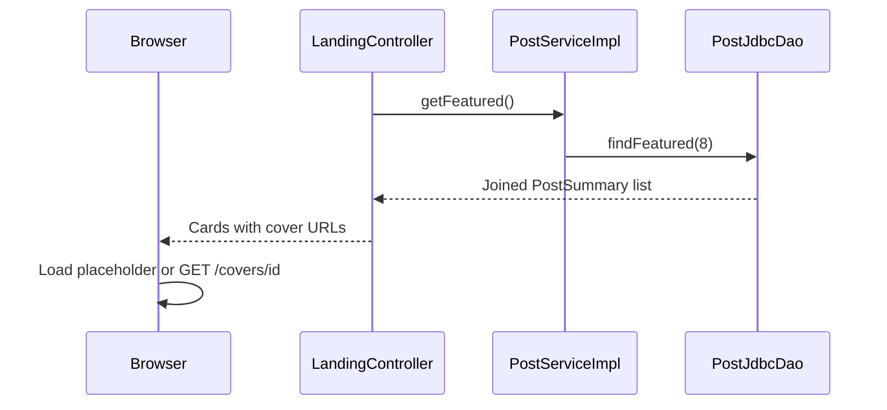

# Landing flow

GET / lists the eight newest Post IDs, not every catalog album. [[LandingController]] calls [[PostService]].getFeatured; [[PostServiceImpl]] supplies limit 8; [[PostJdbcDao]] performs a four-table INNER JOIN of posts, users, albums and artists ordered by p.id descending.

The JSP uses [[PostSummary]] objects for editorial ui:vinyl-card tags and nested contact buttons. An empty posts list shows localized empty text. The page links to /publish and shows a contactSent flash if a contact submission redirected here.



PostSummary carries nullable coverImageId rather than a path or binary data. [[UI components]] selects the local placeholder for null; otherwise the browser requests /covers/{id}. The landing query does not issue one image query per card, although the browser makes separate image requests. See [[Cover image flow]].

The ID order is not an explicit creation timestamp. Unpublished albums are absent, and orphan associations disappear from the INNER JOIN. The old AlbumDao.findFeatured and AlbumService.getFeatured paths have been removed.

## Controller source

[webapp/src/main/java/ar/edu/itba/paw/webapp/controller/LandingController.java, lines 1–26](<file:///Users/bautistapessagno/Desktop/ITBA/PAW/paw2026b/webapp/src/main/java/ar/edu/itba/paw/webapp/controller/LandingController.java>)

```java
package ar.edu.itba.paw.webapp.controller;

import ar.edu.itba.paw.services.PostService;
import org.springframework.beans.factory.annotation.Autowired;
import org.springframework.stereotype.Controller;
import org.springframework.web.bind.annotation.RequestMapping;
import org.springframework.web.bind.annotation.RequestMethod;
import org.springframework.web.servlet.ModelAndView;

@Controller
public class LandingController {

    private final PostService postService;

    @Autowired
    public LandingController(final PostService postService) {
        this.postService = postService;
    }

    @RequestMapping(value = "/", method = RequestMethod.GET)
    public ModelAndView landing() {
        final ModelAndView mav = new ModelAndView("landing/index");
        mav.addObject("posts", postService.getFeatured());
        return mav;
    }
}
```

[[Views and assets]] · [[Database schema]] · [[Contact flow]]
