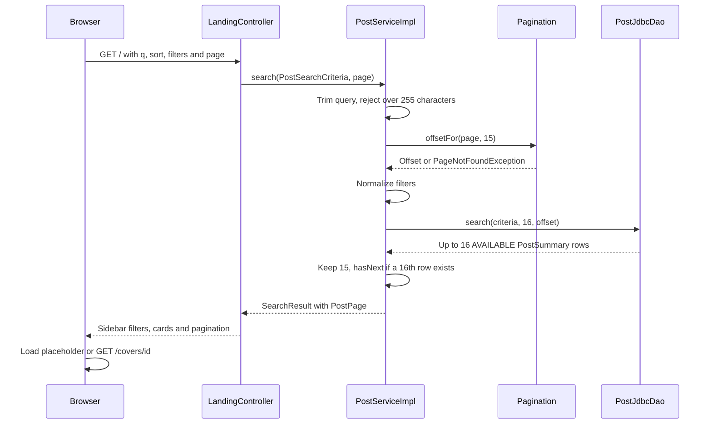

# Landing flow

Public GET / uses one paged search contract for an empty catalog query and every combination of filters. [[LandingController]] binds the URL and the page number, [[PostServiceImpl]] normalizes the criteria, and [[PostJdbcDao]] returns one page of AVAILABLE publications. The artist list is no longer loaded, and no per-card lookup is performed.

## Flow diagram

The sequence follows the controller, service and DAO calls at `f12af08`. Error handling and transaction limits are explained below; this is a source trace, not a runtime test.



## Behavior and limits

| Parameter | Behavior |
|---|---|
| q | Trimmed; blank means no text filter; over 255 characters returns 400 |
| sort | Ten [[PostSort]] values; missing or invalid becomes NEWEST |
| genre, condition | Fixed enum values; case-insensitive binding, invalid becomes absent |
| artistId | Positive ID; malformed or nonpositive ignored; no visible control remains |
| year | Release year 1000–9999; invalid ignored |
| minPrice, maxPrice | Inclusive bounds 1–99,999,999; invalid bounds ignored; an inverted valid range drops both |
| page | Defaults to 1; below 1, or empty beyond page 1, returns 404 |

All applied filters combine with AND. Text search is a case-insensitive substring match over title or artist through LOWER(...) LIKE, with percent, underscore and backslash escaped. It is not accent-insensitive: the search_phrase columns serve only the header suggestions, so typing a title without its accent can miss a match that the suggestion list would show. Enum sort choices map to fixed SQL fragments; newest uses created_at DESC then id DESC, and other sorts break ties by newest.

Pagination shows 15 publications per page. The service asks for one extra row instead of counting, so a catalog page knows whether a next page exists but not the total. [[PostPage]] marks this with totalKnown=false, and ui:pagination draws only previous/next arrows here. The heading `landing.results.count` counts the posts on the current page, so it can read at most 15 even when more pages exist. See [[Paginated listings]] for the shared rules.

The page now has a compact site header with a global search field and autocomplete ([[Search suggestions flow]]), a filter sidebar with a genre select, a condition segmented control, year and price range, and a sort select that submits on change through catalog.js. Filters are collapsed below 900px. Clear removes sidebar filters but keeps the query and a nondefault sort. Every card links to the public [[Post detail flow]] instead of the protected contact page. Empty states distinguish no publications, no filter matches and no text matches; the last uses the editorial not-found layout.

The controller still exposes parsed numeric filters before service normalization, so an out-of-range value can remain visible although SQL ignores it. [[Known gaps and document drift]] records this and the per-page counter.

[[Views and assets]] · [[PostSearchCriteria]] · [[SearchResult]] · [[PostJdbcDaoTest]]

## Code snippets

### Paged search entry point

The service rejects oversized queries, computes the offset and asks the DAO for one row more than the page size. See [[PostServiceImpl]] for the complete class.

[services/src/main/java/ar/edu/itba/paw/services/PostServiceImpl.java, lines 81–92](<file:///Users/bautistapessagno/Desktop/ITBA/PAW/paw2026b/services/src/main/java/ar/edu/itba/paw/services/PostServiceImpl.java>)

```java
    @Override
    @Transactional(readOnly = true)
    public SearchResult search(final PostSearchCriteria criteria, final int pageNumber) {
        final String query = blankToNull(criteria.getQuery());
        if (query != null && query.length() > MAX_QUERY_LENGTH) {
            throw new InvalidSearchQueryException();
        }
        final int offset = Pagination.offsetFor(pageNumber, CATALOG_PAGE_SIZE);
        final List<PostSummary> rows = postDao.search(
                normalize(criteria, query), CATALOG_PAGE_SIZE + 1, offset);
        return new SearchResult(query, toPage(rows, pageNumber, CATALOG_PAGE_SIZE));
    }
```

### Look-ahead page

A 16th row only proves that another page exists. An empty page beyond the first is treated as not found. See [[PostServiceImpl]] for the complete class.

[services/src/main/java/ar/edu/itba/paw/services/PostServiceImpl.java, lines 116–123](<file:///Users/bautistapessagno/Desktop/ITBA/PAW/paw2026b/services/src/main/java/ar/edu/itba/paw/services/PostServiceImpl.java>)

```java
    private static PostPage toPage(final List<PostSummary> rows, final int pageNumber, final int pageSize) {
        if (pageNumber > 1 && rows.isEmpty()) {
            throw new PageNotFoundException();
        }
        final boolean hasNext = rows.size() > pageSize;
        final List<PostSummary> posts = hasNext ? rows.subList(0, pageSize) : rows;
        return new PostPage(posts, pageNumber, pageNumber > 1, hasNext);
    }
```

### Filter normalization

Invalid bounds disappear from the criteria sent to SQL. If both valid price bounds form an inverted range, both are dropped. See [[PostServiceImpl]] for the complete class.

[services/src/main/java/ar/edu/itba/paw/services/PostServiceImpl.java, lines 128–141](<file:///Users/bautistapessagno/Desktop/ITBA/PAW/paw2026b/services/src/main/java/ar/edu/itba/paw/services/PostServiceImpl.java>)

```java
    private static PostSearchCriteria normalize(final PostSearchCriteria criteria, final String query) {
        final Long artistId = criteria.getArtistId() != null && criteria.getArtistId() > 0
                ? criteria.getArtistId() : null;
        final Integer minPrice = insideRange(criteria.getMinPrice(), MIN_PRICE, MAX_PRICE);
        final Integer maxPrice = insideRange(criteria.getMaxPrice(), MIN_PRICE, MAX_PRICE);
        // Un rango dado vuelta no deja pasar nada: se ignoran los dos extremos.
        final boolean invertedRange = minPrice != null && maxPrice != null && minPrice > maxPrice;
        return new PostSearchCriteria(query,
                criteria.getSort() == null ? PostSort.NEWEST : criteria.getSort(),
                criteria.getGenre(), criteria.getCondition(), artistId,
                insideRange(criteria.getReleaseYear(), MIN_YEAR, MAX_YEAR),
                invertedRange ? null : minPrice,
                invertedRange ? null : maxPrice);
    }
```

## Evidencia local anterior, 2026-09-17

[[Audit local 2026-09-17]] ejecutó la rama `e5e926d`, anterior a `f12af08`. Sus resultados de ejecución no se repitieron para esta revisión; [[Known gaps and document drift]] indica qué hallazgos del audit quedaron resueltos en el código actual y cuáles siguen abiertos.
