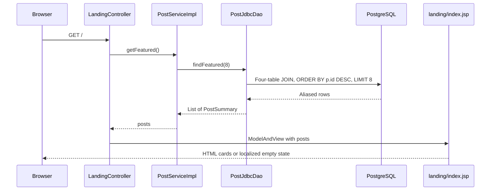

# Landing flow

GET `/` displays publications, not every album in the catalog.



1. [[LandingController]] injects [[PostService]], calls getFeatured, and places the result under `posts`.
2. [[PostServiceImpl]] supplies the fixed limit of eight and a read-only transaction.
3. [[PostJdbcDao]] joins posts → users, posts → albums, albums → artists. The RowMapper constructs one [[PostSummary]] per joined row. No per-card database calls occur.
4. [[Views and assets|The landing JSP]] checks `empty posts`; otherwise c:forEach passes each summary to ui:vinyl-card, with a nested ui:button linking to contact. The shared tags escape text/attributes and generate context-aware URLs. See [[UI components]].
5. The contact link uses the Post ID. A flash `contactSent` value from [[Contact flow]] displays a one-time confirmation above the cards.

Newest means greatest generated post ID here. There is no creation timestamp. The catalog's separate [[AlbumJdbcDao]].findFeatured sorts year descending and title ascending, but this controller does not call it. An album without a Post is absent; a Post whose joined user/album/artist is missing is also absent.

## Controller excerpt

[webapp/src/main/java/ar/edu/itba/paw/webapp/controller/LandingController.java, lines 19–25](<file:///Users/bautistapessagno/Desktop/ITBA/PAW/paw2026b/webapp/src/main/java/ar/edu/itba/paw/webapp/controller/LandingController.java>)

```java

    @RequestMapping(value = "/", method = RequestMethod.GET)
    public ModelAndView landing() {
        final ModelAndView mav = new ModelAndView("landing/index");
        mav.addObject("posts", postService.getFeatured());
        return mav;
    }
```

[[Architecture]] · [[PostSummary]] · [[Database schema]]

## UI integration at the current commit

The committed landing JSP uses an editorial ui:vinyl-card for each PostSummary and a ghost/sm contact button. Its cover alt text now uses vinylCard.cover.alt. The query and eight-post limit are unchanged. See [[Views and assets]] and [[Localization]].
