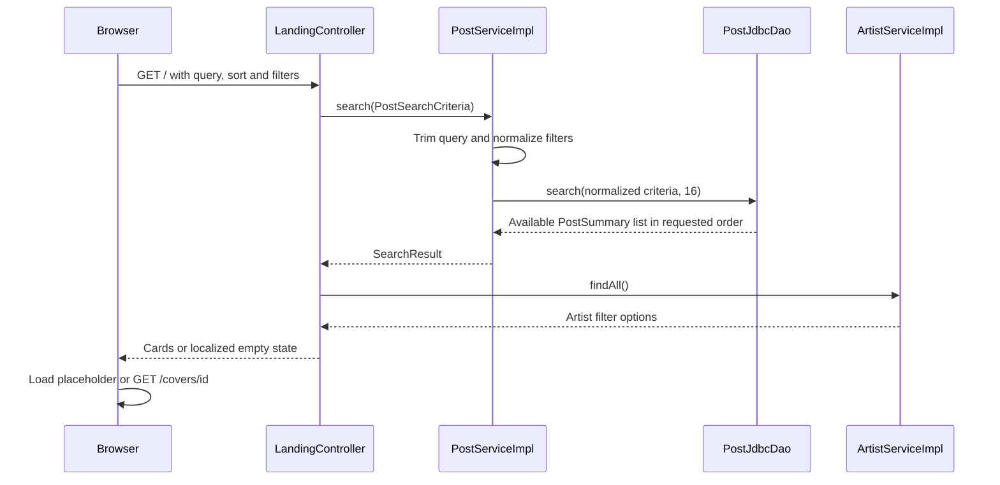

# Landing flow

Public GET / uses one search contract for an empty catalog query and all combinations of filters. [[LandingController]] binds the URL, [[PostServiceImpl]] normalizes it, and [[PostJdbcDao]] returns at most 16 AVAILABLE publications. The controller separately loads the artist options once. No per-card lookup is performed.

## Flow diagram

The sequence follows the controller, service and DAO calls at 40328f0. Error handling and transaction limits are explained below; this is a source trace, not a runtime test.



## Behavior and limits

| Parameter | Behavior |
|---|---|
| q | Trimmed; blank means no text filter; over 255 characters returns 400 |
| sort | Ten [[PostSort]] values; missing/invalid becomes NEWEST |
| genre, condition | Fixed enum values; case-insensitive binding, invalid becomes absent |
| artistId | Positive ID; malformed/nonpositive ignored |
| year | Release year 1000–9999; invalid ignored |
| minPrice, maxPrice | Inclusive bounds 1–99,999,999; invalid bounds ignored; inverted valid range drops both |

All applied filters combine with AND. Text searches case-insensitive title or artist substrings and treats percent, underscore and backslash literally through escaped LIKE parameters. Enum sort choices map to fixed SQL fragments. Price sorts put legacy null prices last. Newest uses created_at DESC then id DESC; oldest uses both ascending. Other sorts break ties by newest.

The JSP submits a GET form, preserving selected values in the URL. Clear removes query/filters and retains a nondefault sort. It distinguishes no publications, no text matches and no filter matches. Cards link to protected contact pages. There is no total count or pagination.

The controller exposes parsed numeric filters to the view before service normalization. Consequently an out-of-range value can remain visible even though it is ignored by SQL. [[Known gaps and document drift]] records this source distinction.

[[Views and assets]] · [[PostSearchCriteria]] · [[SearchResult]] · [[PostJdbcDaoTest]]

## Code snippets

### Search entry point

The service rejects oversized queries and passes normalized criteria to the DAO. RESULT_LIMIT is 16 in this revision. See [[PostServiceImpl]] for the complete class.

[services/src/main/java/ar/edu/itba/paw/services/PostServiceImpl.java, lines 53–61](<file:///Users/bautistapessagno/Desktop/ITBA/PAW/paw2026b/services/src/main/java/ar/edu/itba/paw/services/PostServiceImpl.java>)

```java
    @Override
    @Transactional(readOnly = true)
    public SearchResult search(final PostSearchCriteria criteria) {
        final String query = blankToNull(criteria.getQuery());
        if (query != null && query.length() > MAX_QUERY_LENGTH) {
            throw new InvalidSearchQueryException();
        }
        return new SearchResult(query, postDao.search(normalize(criteria, query), RESULT_LIMIT));
    }
```

### Filter normalization

Invalid bounds disappear from the criteria sent to SQL. If both valid price bounds form an inverted range, both are dropped. See [[PostServiceImpl]] for the complete class.

[services/src/main/java/ar/edu/itba/paw/services/PostServiceImpl.java, lines 66–79](<file:///Users/bautistapessagno/Desktop/ITBA/PAW/paw2026b/services/src/main/java/ar/edu/itba/paw/services/PostServiceImpl.java>)

```java
    private static PostSearchCriteria normalize(final PostSearchCriteria criteria, final String query) {
        final Long artistId = criteria.getArtistId() != null && criteria.getArtistId() > 0
                ? criteria.getArtistId() : null;
        final Integer minPrice = insideRange(criteria.getMinPrice(), MIN_PRICE, MAX_PRICE);
        final Integer maxPrice = insideRange(criteria.getMaxPrice(), MIN_PRICE, MAX_PRICE);
        // Un rango dado vuelta no deja pasar nada: se ignoran los dos extremos.
        final boolean invertedRange = minPrice != null && maxPrice != null && minPrice > maxPrice;
        return new PostSearchCriteria(query,
                criteria.getSort() == null ? PostSort.NEWEST : criteria.getSort(),
                criteria.getGenre(), criteria.getCondition(), artistId,
                insideRange(criteria.getReleaseYear(), MIN_YEAR, MAX_YEAR),
                invertedRange ? null : minPrice,
                invertedRange ? null : maxPrice);
    }
```
