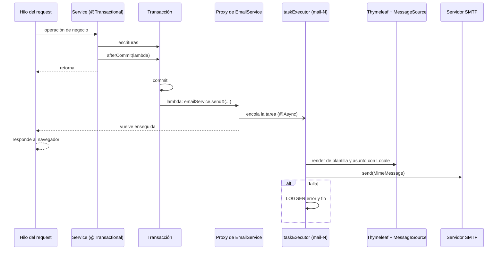

# Mail delivery

> [!summary] En una frase
> Un service guarda sus datos, registra "cuando haya commit, mandá este correo" y sigue; el envío corre después del commit, en otro hilo, con el idioma ya resuelto, y si falla solo se loguea.

En la defensa del sprint 2 se preguntó cómo funciona el flujo del mail. Esta nota lo recorre de punta a punta: qué pieza hace cada cosa, en qué hilo y por qué.

## Herramientas

| Herramienta | Qué es | Para qué se usa acá | Dónde se configura |
|---|---|---|---|
| JavaMail (`com.sun.mail:javax.mail` 1.6.2) | La API de Java para hablar SMTP | Transporte del mensaje | Dependencia del POM |
| `JavaMailSender` / `JavaMailSenderImpl` (Spring) | Envoltorio de Spring sobre JavaMail | `createMimeMessage()` y `send()` | Bean `mailSender` en [[WebConfig]] |
| `MimeMessageHelper` | Ayudante para armar el mensaje MIME | Remitente, destinatario, asunto, cuerpo HTML en UTF-8 | `createMessage` en [[EmailServiceImpl]] |
| Thymeleaf 3 (`thymeleaf-spring5`) | Motor de plantillas | Renderizar el HTML de cada correo a un `String` | Bean `mailTemplateEngine` en [[WebConfig]] |
| `MessageSource` | Bundles de i18n | Asuntos y textos en el idioma del destinatario | Bean `messageSource` en [[WebConfig]] |
| `@Async` + `@EnableAsync` | Ejecución en otro hilo mediante un proxy de Spring | Que el request no espere al SMTP | Métodos de [[EmailServiceImpl]]; `@EnableAsync` en [[WebConfig]] |
| `ThreadPoolTaskExecutor` | Pool de hilos | Limitar y reusar los hilos que mandan correo | Bean `taskExecutor` en [[WebConfig]] |
| `TransactionSynchronizationManager` | Ganchos del ciclo de la transacción | Disparar el envío recién después del commit | [[TransactionCallbacks]] |
| SMTP con STARTTLS | Protocolo de entrega | Servidor externo (el ejemplo usa Gmail, puerto 587) | `mail.properties` (no versionado) |

El correo **no** usa JSP. Las vistas web son JSP y pasan por el `DispatcherServlet`; un correo se arma fuera de un request, así que necesita un motor que renderice a texto sin servlet. Por eso hay Thymeleaf solo para los correos.

## Recorrido paso a paso

Ejemplo: el correo de verificación del registro. Los demás siguen el mismo camino.

1. **Hilo del request, dentro de la transacción.** `UserServiceImpl.register` guarda la Cuenta y el token. Al final llama a `TransactionCallbacks.afterCommit(...)` con un lambda que contiene el log de éxito y la llamada a `emailService.sendVerificationEmail(user, token, locale)`. Todavía no se manda nada.
2. `afterCommit` pregunta si hay una sincronización de transacción activa. Si la hay, registra un `TransactionSynchronization` cuyo `afterCommit()` ejecuta el lambda. Si no la hay (por ejemplo en un test que construye el service a mano), lo ejecuta en el momento.
3. **Commit.** El método del service termina, el proxy de `@Transactional` hace commit y Spring invoca las sincronizaciones registradas. Si hubo excepción y rollback, el lambda nunca corre: no sale correo por datos que no se guardaron.
4. **Todavía en el hilo del request**, el lambda llama a `emailService.sendVerificationEmail`. `emailService` es el proxy de Spring, y como el método es `@Async` el proxy no lo ejecuta: lo encola en el `taskExecutor` y vuelve enseguida. El controller sigue y responde.
5. **Hilo `mail-N` del pool.** Ahora sí corre el cuerpo del método:
   - Crea un `Context` de Thymeleaf con el `Locale` recibido y las variables (acá, `verificationUrl = baseUrl + "/verify?token=" + token`).
   - `templateEngine.process("email-verification", context)` devuelve el HTML. Las expresiones `#{...}` de la plantilla se resuelven contra los mismos bundles de la web.
   - `messageSource.getMessage("email.verification.subject", null, locale)` da el asunto.
   - `createMessage` arma el `MimeMessage`: `from` de `app.mail.from`, destinatario, asunto y cuerpo marcado como HTML.
   - `mailSender.send(message)` abre la conexión SMTP y entrega.
6. **Si algo falla** (plantilla, bundle, conexión, timeout), el `catch (MessagingException | RuntimeException)` loguea el error con el `userId` y termina. La excepción no vuelve a ningún lado: el request ya respondió hace rato.



## Los siete correos

| Correo | Lo dispara | Destinatario | Idioma | Plantilla | Enlace |
|---|---|---|---|---|---|
| Verificación | `register`, `resendVerification` | La Cuenta | Del request | `email-verification` | `/verify?token=` |
| Bienvenida | `verifyEmail` exitoso | La Cuenta | Del request que verifica | `welcome` | Inicio |
| Consulta nueva | `InquiryServiceImpl.create` (contacto) y `submitAll` (carrito) | Publicante | `preferred_locale` del publicante | `post-interest` | `/inquiries/{id}`, uno por vinilo |
| Cambio de una consulta | `accept`, `reject`, `uploadReceipt`, `requestNewReceipt`, `confirm`, `cancel` | Ver tabla siguiente | `preferred_locale` del destinatario | `inquiry-update` | `/inquiries/{id}`; rechazo: `/inquiries/sent` |
| Mensaje nuevo | `sendMessage` | La otra parte | `preferred_locale` del destinatario | `inquiry-message` | `/inquiries/{id}#conversation` |
| Contraseña cambiada | `changePassword`, `resetPassword` | La Cuenta | Del request | `password-changed` | Ninguno |
| Recuperación | `requestPasswordReset` | La Cuenta | Del request | `password-reset` | `/reset-password?token=` |

Eventos de `inquiry-update` ([[InquiryEvent]]) y a quién le llega cada uno:

| Operación | Evento | Destinatario |
|---|---|---|
| `accept` | `ACCEPTED` | Comprador |
| `reject` | `REJECTED` | Comprador |
| `uploadReceipt` | `RECEIPT_UPLOADED` | Publicante |
| `requestNewReceipt` | `RECEIPT_REQUESTED` | Comprador |
| `confirm` | `CONFIRMED` | Comprador y publicante; además `REJECTED` a cada comprador que seguía pendiente |
| `cancel` | `CANCELLED` | La parte que no canceló |

Un solo template sirve para los seis eventos: el evento elige las keys `email.inquiryUpdate.<EVENTO>.subject`, `.heading` y `.body`. Los datos de cobro y la dirección **no viajan por correo**: se ven en la página de la venta, a la que lleva el enlace.

El primer texto de una Consulta no dispara el correo de "mensaje nuevo": ya viaja dentro del de "consulta nueva".

Desde el PR #47 el aviso de consulta nueva lleva una **lista** de vinilos ([[PostInterestNotification]] con `InterestedPost`). El contacto manda uno; el carrito manda **un correo por publicante** con todos los vinilos que le consultaron, cada uno con el enlace a su Consulta. Con un vinilo el asunto lo nombra (`email.postInterest.subject`); con varios dice cuántos son (`email.postInterest.subject.many`). El carrito nunca lleva mensaje.

## De dónde sale el idioma

Hay dos orígenes y los dos se resuelven **antes** de entrar al hilo asíncrono:

- **Correos a quien está haciendo el request** (verificación, bienvenida, recuperación, clave cambiada): el `Locale` del request, que sale del `AcceptHeaderLocaleResolver` (cabecera `Accept-Language`, español por defecto).
- **Correos a otra persona** (consulta nueva, cambios de la consulta, mensajes): `users.preferred_locale` del destinatario, guardado al registrarse. `SupportedLocales.localeOf` lo convierte y lo limita a `es`, `en` o `fr`.

El motivo está escrito en la interfaz: dentro del hilo `mail-N` no hay request, y `LocaleContextHolder` no trae nada útil. Por eso el `Locale` es un parámetro de cada método.

## Configuración

Pool de hilos:

Fuente exacta en `c3e2a4c`: [webapp/src/main/java/ar/edu/itba/paw/webapp/config/WebConfig.java](</Users/bautistapessagno/Desktop/proyectos_itba/PAW/paw2026b/webapp/src/main/java/ar/edu/itba/paw/webapp/config/WebConfig.java>), líneas 59–80.

```java
  /*
   * Pool para los metodos @Async de EmailService. Sin este bean, @EnableAsync cae al
   * SimpleAsyncTaskExecutor por defecto, que crea un hilo nuevo por cada envio y no lo
   * reusa nunca: bajo carga eso agota los hilos de la maquina.
   *
   * El nombre del bean tiene que ser taskExecutor, que es el que busca Spring por defecto.
   */
  @Bean
  public TaskExecutor taskExecutor() {
    final ThreadPoolTaskExecutor executor = new ThreadPoolTaskExecutor();
    executor.setCorePoolSize(2);
    executor.setMaxPoolSize(5);
    executor.setQueueCapacity(50);
    executor.setThreadNamePrefix("mail-");
    // Un SMTP lento nunca debe trasladarse al hilo del request. Si el pool se satura,
    // el rechazo queda visible en logs y se descarta solamente ese aviso no critico.
    executor.setRejectedExecutionHandler((task, poolExecutor) ->
        LOGGER.warn("Mail task rejected: taskExecutor saturated, dropping email task"));
    executor.setWaitForTasksToCompleteOnShutdown(true);
    executor.setAwaitTerminationSeconds(30);
    return executor;
  }
```

- 2 hilos fijos, hasta 5, con una cola de 50 tareas.
- Si el pool y la cola están llenos, el handler de rechazo **descarta ese correo** y deja un `WARN`. No usa `CallerRunsPolicy`, que haría que el hilo del request mandara el correo.
- Al apagar la aplicación espera hasta 30 segundos a que terminen los envíos encolados.
- El bean se llama `taskExecutor` porque es el nombre que busca `@EnableAsync` por defecto. Sin él, Spring usaría `SimpleAsyncTaskExecutor`, que crea un hilo por envío.

Remitente SMTP y motor de plantillas:

Fuente exacta en `c3e2a4c`: [webapp/src/main/java/ar/edu/itba/paw/webapp/config/WebConfig.java](</Users/bautistapessagno/Desktop/proyectos_itba/PAW/paw2026b/webapp/src/main/java/ar/edu/itba/paw/webapp/config/WebConfig.java>), líneas 145–184.

```java
  @Bean
  public JavaMailSender mailSender(final Environment environment) {
    final JavaMailSenderImpl mailSender = new JavaMailSenderImpl();
    mailSender.setHost(environment.getRequiredProperty("mail.host"));
    mailSender.setPort(environment.getRequiredProperty("mail.port", Integer.class));
    mailSender.setUsername(environment.getRequiredProperty("mail.username"));
    mailSender.setPassword(environment.getRequiredProperty("mail.password"));

    final Properties properties = mailSender.getJavaMailProperties();
    properties.put("mail.transport.protocol", SMTP_PROTOCOL);
    properties.put("mail.smtp.auth", environment.getRequiredProperty("mail.smtp.auth"));
    properties.put("mail.smtp.starttls.enable", environment.getRequiredProperty("mail.smtp.starttls.enable"));
    properties.put("mail.smtp.connectiontimeout", environment.getRequiredProperty("mail.smtp.connection-timeout-ms"));
    properties.put("mail.smtp.timeout", environment.getRequiredProperty("mail.smtp.read-timeout-ms"));
    properties.put("mail.smtp.writetimeout", environment.getRequiredProperty("mail.smtp.write-timeout-ms"));
    return mailSender;
  }

  @Bean
  public SpringTemplateEngine mailTemplateEngine(final MessageSource messageSource) {
    final ClassLoaderTemplateResolver templateResolver = new ClassLoaderTemplateResolver();
    templateResolver.setPrefix("mail/");
    templateResolver.setSuffix(".html");
    templateResolver.setTemplateMode(TemplateMode.HTML);
    templateResolver.setCharacterEncoding(StandardCharsets.UTF_8.name());

    final SpringTemplateEngine templateEngine = new SpringTemplateEngine();
    templateEngine.setTemplateResolver(templateResolver);
    templateEngine.setTemplateEngineMessageSource(messageSource);
    return templateEngine;
  }

  @Bean
  public MessageSource messageSource() {
    final ReloadableResourceBundleMessageSource messageSource = new ReloadableResourceBundleMessageSource();
    messageSource.setBasename("classpath:i18n/messages");
    messageSource.setDefaultEncoding(StandardCharsets.UTF_8.name());
    messageSource.setFallbackToSystemLocale(false);
    return messageSource;
  }
```

Propiedades esperadas (ejemplo versionado; el archivo real no se commitea):

Fuente exacta en `c3e2a4c`: [webapp/src/main/resources/mail.properties.example](</Users/bautistapessagno/Desktop/proyectos_itba/PAW/paw2026b/webapp/src/main/resources/mail.properties.example>), líneas 1–16.

```properties
mail.host=smtp.gmail.com
mail.port=587
mail.username=your_smtp_username
mail.password=your_smtp_password
mail.smtp.auth=true
mail.smtp.starttls.enable=true
mail.smtp.connection-timeout-ms=5000
mail.smtp.read-timeout-ms=10000
mail.smtp.write-timeout-ms=10000
app.mail.from=your_smtp_username

# URL publica de la aplicacion, usada para los links de los mails.
# Tiene que ser absoluta: el envio corre en un hilo @Async, donde no hay request
# del que deducirla. En el server de la catedra la app cuelga de un context path.
# Produccion: http://pawserver.it.itba.edu.ar/paw-2026b-14
app.base-url=http://localhost:8080
```

Los tres timeouts (conexión, lectura, escritura) evitan que un SMTP colgado retenga un hilo del pool para siempre. `environment.getRequiredProperty` hace que la aplicación no arranque si falta una key.

`app.base-url` es obligatoria y absoluta: los enlaces se arman en un hilo sin request, así que no hay de dónde deducir host ni context path. En el servidor de la cátedra incluye `/paw-2026b-14`.

## Decisiones y por qué

| Decisión | Alternativa descartada | Motivo | Fuente |
|---|---|---|---|
| Envío después del commit | Enviar dentro de la transacción | Un rollback posterior dejaría un correo por algo que no existe | [[TransactionCallbacks]]; cierra un hueco registrado en el Vault de septiembre |
| Envío asíncrono | Envío síncrono con respuesta 503 si falla (lo pedían el spec de contacto y un issue viejo) | Entre timeouts una entrega lenta puede tardar unos 15 segundos; el request no debe esperar | Comentario en [[EmailServiceImpl]] |
| `try/catch` que loguea y corta | Propagar la excepción | Corre en otro hilo: no hay controller que la reciba. Un SMTP caído no puede romper el flujo que lo dispara | Regla de `CLAUDE.md`; comentario en [[EmailServiceImpl]] |
| Pool acotado que descarta al saturarse | Hilo por envío, o `CallerRunsPolicy` | Un hilo por envío agota la máquina bajo carga; `CallerRunsPolicy` traslada la lentitud al request | Comentario en [[WebConfig]] |
| `Locale` como parámetro | `LocaleContextHolder` dentro del método | En el hilo asíncrono no hay request | Comentario en [[EmailService]] |
| Idioma del destinatario guardado en la Cuenta | Idioma de quien dispara | Quien recibe el aviso no es quien hace el request | Comentario en [[InquiryServiceImpl]] |
| Thymeleaf para el correo | JSP | El correo se renderiza fuera del servlet | Inferencia a partir del diseño |
| Un template para todos los cambios de la consulta | Un template por evento | El evento solo cambia asunto, título y texto | Comentario en [[EmailServiceImpl]] |
| Un correo por publicante al enviar el carrito | Un correo por vinilo | Quien recibe diez consultas del mismo comprador lee un solo aviso | Comentario en [[PostInterestNotification]] y en [[InquiryServiceImpl]] |
| Ni CBU ni dirección en el correo | Incluirlos | Datos sensibles: se ven solo con sesión, en la página de la venta | Comentario en [[EmailServiceImpl]] |
| Objetos `*Notification` como carga del correo | Pasar los modelos de dominio | El hilo asíncrono recibe solo lo que necesita, ya leído dentro de la transacción | Estructura de `services-contracts` |
| Logs con ids, sin correo ni cuerpo del mensaje | Loguear el destinatario | Regla del proyecto; el texto de un Mensaje no se registra | Comentario en [[EmailServiceImpl]] |

## Seguridad del contenido

- Thymeleaf escapa todo `th:text`. Un nombre o un mensaje con `<script>` llega como texto. Lo cubre el test `testSendMessageEmailWhenBodyHasMarkupReturnsEscapedBodyWithLineBreaks`.
- El texto libre se muestra con `white-space: pre-line` para conservar los saltos sin insertar HTML.
- `createMessage` acepta un `replyTo`, pero hoy todos los llamadores pasan `null`. El ADR 0003 quitó el `Reply-To` a propósito: ninguna parte conoce el correo de la otra y se responde dentro de la aplicación ([[Conversation flow]]).

## Límites conocidos

- **Sin reintentos ni cola durable.** Si el SMTP falla, o el pool descarta la tarea, ese correo se pierde. Los datos sí quedaron guardados. No hay tabla outbox.
- **El aviso en pantalla no confirma la entrega.** "Te enviamos un enlace" significa que la operación terminó, no que el correo llegó.
- **Apagado.** Pasados 30 segundos, los envíos encolados se pierden.
- **Eliminar una publicación** rechaza sus consultas pendientes sin avisar por correo a esos compradores.
- **Auto-invocación.** `@Async` funciona porque la llamada entra por el proxy inyectado. Una llamada interna (`this.sendX()`) dentro de `EmailServiceImpl` sería síncrona; hoy no hay ninguna.
- **Verificado solo con tests de unidad.** [[EmailServiceImplTest]] usa las plantillas reales y un remitente falso, y construye el service a mano, así que no ejercita `@Async` ni la transacción real. Este Vault no envió correos.

## Preguntas de defensa

**¿En qué hilo se manda el correo?**
En uno del pool `mail-`. El hilo del request solo encola la tarea, después del commit.

**¿Qué pasa si el servidor de correo está caído?**
La operación de negocio ya terminó bien. El envío falla en el hilo del pool, queda un `ERROR` en el log y no se reintenta.

**¿Por qué no mandan el correo dentro de la transacción?**
Porque si después hay rollback, salió un correo por algo que no se guardó. Y porque mantener la transacción abierta mientras se habla con un SMTP retiene una conexión a la base.

**¿Cómo sabe el correo en qué idioma escribirse?**
Recibe el `Locale` como parámetro. Para la propia persona es el del request; para otra, el `preferred_locale` guardado en su Cuenta.

**¿Por qué Thymeleaf si las vistas son JSP?**
Porque un JSP necesita el contenedor de servlets y un request. El correo se arma en un hilo aparte y tiene que salir como `String`.

**¿Qué pasa si se registran mil personas a la vez?**
Hasta 5 hilos mandan y 50 tareas esperan. Lo que exceda se descarta con un `WARN`. Esas personas pueden pedir el reenvío.

**¿De dónde sale la URL del enlace?**
De `app.base-url`, configurada con el context path. No se puede deducir del request porque no hay request.

**¿Cómo funciona `@Async`?**
`@EnableAsync` hace que Spring envuelva el bean en un proxy. Al llamar un método `@Async` a través del proxy, este lo entrega al `taskExecutor` en vez de ejecutarlo.

## Evidencia de código

El gancho de commit:

Fuente exacta en `c3e2a4c`: [services/src/main/java/ar/edu/itba/paw/services/TransactionCallbacks.java](</Users/bautistapessagno/Desktop/proyectos_itba/PAW/paw2026b/services/src/main/java/ar/edu/itba/paw/services/TransactionCallbacks.java>), líneas 1–24.

```java
package ar.edu.itba.paw.services;

import org.springframework.transaction.support.TransactionSynchronization;
import org.springframework.transaction.support.TransactionSynchronizationManager;

final class TransactionCallbacks {

    private TransactionCallbacks() {
        throw new AssertionError("No instances");
    }

    static void afterCommit(final Runnable action) {
        if (!TransactionSynchronizationManager.isSynchronizationActive()) {
            action.run();
            return;
        }
        TransactionSynchronizationManager.registerSynchronization(new TransactionSynchronization() {
            @Override
            public void afterCommit() {
                action.run();
            }
        });
    }
}
```

Contrato, con el motivo del `Locale` explícito:

Fuente exacta en `c3e2a4c`: [services-contracts/src/main/java/ar/edu/itba/paw/services/EmailService.java](</Users/bautistapessagno/Desktop/proyectos_itba/PAW/paw2026b/services-contracts/src/main/java/ar/edu/itba/paw/services/EmailService.java>), líneas 7–26.

```java
public interface EmailService {

    void sendWelcomeEmail(User user, Locale locale);

    void sendVerificationEmail(User user, String token, Locale locale);

    /*
     * El locale se recibe como parametro y no se toma de LocaleContextHolder porque el
     * envio corre en otro hilo: hay que resolverlo en el hilo del request y pasarlo.
     */
    void sendPostInterestEmail(PostInterestNotification notification, Locale locale);

    void sendInquiryUpdateEmail(InquiryUpdateNotification notification, Locale locale);

    void sendMessageEmail(MessageNotification notification, Locale locale);

    void sendPasswordChangedEmail(User user, Locale locale);

    void sendPasswordResetEmail(User user, String token, Locale locale);
}
```

Constructor (URL base) y un envío simple:

Fuente exacta en `c3e2a4c`: [services/src/main/java/ar/edu/itba/paw/services/EmailServiceImpl.java](</Users/bautistapessagno/Desktop/proyectos_itba/PAW/paw2026b/services/src/main/java/ar/edu/itba/paw/services/EmailServiceImpl.java>), líneas 43–89.

```java
    @Autowired
    public EmailServiceImpl(final JavaMailSender mailSender, final SpringTemplateEngine templateEngine,
                            final MessageSource messageSource,
                            @Value("${app.mail.from}") final String from,
                            @Value("${app.base-url}") final String baseUrl) {
        this.mailSender = mailSender;
        this.templateEngine = templateEngine;
        this.messageSource = messageSource;
        this.from = from;
        // Sin la barra final, asi concatenar un path que empieza con "/" no la duplica.
        this.baseUrl = baseUrl.endsWith("/") ? baseUrl.substring(0, baseUrl.length() - 1) : baseUrl;
    }

    @Async
    @Override
    public void sendWelcomeEmail(final User user, final Locale locale) {
        try {
            final Context context = new Context(locale);
            context.setVariable("username", user.getUsername());
            context.setVariable("homeUrl", baseUrl + "/");
            final String body = templateEngine.process(WELCOME_TEMPLATE, context);
            final String subject = messageSource.getMessage("email.welcome.subject", null, locale);
            final MimeMessage message = createMessage(user.getEmail(), null, subject, body);

            mailSender.send(message);
            LOGGER.info("Welcome email sent userId={}", user.getId());
        } catch (final MessagingException | RuntimeException exception) {
            LOGGER.error("Welcome email delivery failed userId={}", user.getId(), exception);
        }
    }

    @Async
    @Override
    public void sendVerificationEmail(final User user, final String token, final Locale locale) {
        try {
            final Context context = new Context(locale);
            context.setVariable("verificationUrl", baseUrl + "/verify?token=" + token);
            final String body = templateEngine.process(VERIFICATION_TEMPLATE, context);
            final String subject = messageSource.getMessage("email.verification.subject", null, locale);
            final MimeMessage message = createMessage(user.getEmail(), null, subject, body);

            mailSender.send(message);
            LOGGER.info("Verification email sent userId={}", user.getId());
        } catch (final MessagingException | RuntimeException exception) {
            LOGGER.error("Verification email delivery failed userId={}", user.getId(), exception);
        }
    }
```

Un template para todos los eventos de la consulta:

Fuente exacta en `c3e2a4c`: [services/src/main/java/ar/edu/itba/paw/services/EmailServiceImpl.java](</Users/bautistapessagno/Desktop/proyectos_itba/PAW/paw2026b/services/src/main/java/ar/edu/itba/paw/services/EmailServiceImpl.java>), líneas 126–156.

```java
    /*
     * Un solo template para todos los cambios de una consulta: el evento elige el asunto,
     * el titulo y el texto. Los datos de cobro y la direccion no viajan por correo: se ven
     * en la pagina de la venta, que es a donde lleva el enlace.
     */
    @Async
    @Override
    public void sendInquiryUpdateEmail(final InquiryUpdateNotification notification, final Locale locale) {
        try {
            final String prefix = INQUIRY_UPDATE_PREFIX + notification.getEvent().name();
            final Object[] titleArgument = {notification.getAlbumTitle()};
            final Context context = new Context(locale);
            context.setVariable("heading", messageSource.getMessage(prefix + ".heading", null, locale));
            context.setVariable("body", messageSource.getMessage(prefix + ".body", titleArgument, locale));
            context.setVariable("albumTitle", notification.getAlbumTitle());
            context.setVariable("artistName", notification.getArtistName());
            context.setVariable("releaseYear", notification.getReleaseYear());
            // Un rechazo ya no tiene nada que hacer en la venta: lleva a la bandeja del comprador.
            final String path = notification.getEvent() == InquiryEvent.REJECTED
                    ? "/inquiries/sent" : "/inquiries/" + notification.getInquiryId();
            context.setVariable("actionUrl", baseUrl + path);
            final String body = templateEngine.process(INQUIRY_UPDATE_TEMPLATE, context);
            final String subject = messageSource.getMessage(prefix + ".subject", titleArgument, locale);
            mailSender.send(createMessage(notification.getRecipientEmail(), null, subject, body));
            LOGGER.info("Inquiry update email sent inquiryId={} event={}", notification.getInquiryId(),
                    notification.getEvent());
        } catch (final MessagingException | RuntimeException exception) {
            LOGGER.error("Inquiry update email delivery failed inquiryId={} event={}", notification.getInquiryId(),
                    notification.getEvent(), exception);
        }
    }
```

Armado del mensaje MIME:

Fuente exacta en `c3e2a4c`: [services/src/main/java/ar/edu/itba/paw/services/EmailServiceImpl.java](</Users/bautistapessagno/Desktop/proyectos_itba/PAW/paw2026b/services/src/main/java/ar/edu/itba/paw/services/EmailServiceImpl.java>), líneas 214–234.

```java
    private String inquiryUrl(final long inquiryId) {
        return inquiriesUrl() + inquiryId;
    }

    private String inquiriesUrl() {
        return baseUrl + "/inquiries/";
    }

    private MimeMessage createMessage(final String recipient, final String replyTo, final String subject,
                                      final String body) throws MessagingException {
        final MimeMessage message = mailSender.createMimeMessage();
        final MimeMessageHelper helper = new MimeMessageHelper(message, StandardCharsets.UTF_8.name());
        helper.setFrom(from);
        helper.setTo(recipient);
        if (replyTo != null) {
            helper.setReplyTo(replyTo);
        }
        helper.setSubject(subject);
        helper.setText(body, true);
        return message;
    }
```

Cómo lo registra un service (consulta nueva, con el idioma del publicante):

Fuente exacta en `c3e2a4c`: [services/src/main/java/ar/edu/itba/paw/services/InquiryServiceImpl.java](</Users/bautistapessagno/Desktop/proyectos_itba/PAW/paw2026b/services/src/main/java/ar/edu/itba/paw/services/InquiryServiceImpl.java>), líneas 112–135.

```java
    // El texto opcional es el primer Mensaje. No dispara el mail de Mensaje nuevo: ya viaja en
    // el de Consulta nueva.
    private Inquiry create(final PostSummary post, final long buyerId, final String message, final long addressId) {
        final String normalizedMessage = MessageRules.normalize(message);
        if (normalizedMessage != null && !MessageRules.isValid(normalizedMessage)) {
            throw new InvalidMessageException();
        }
        final User buyer = userService.findById(buyerId).orElseThrow(UserNotFoundException::new);
        final Inquiry inquiry = inquiryDao.create(post.getId(), buyerId, addressId, post.getPrice());
        if (normalizedMessage != null) {
            messageDao.create(inquiry.getId(), buyerId, normalizedMessage);
        }

        final PostInterestNotification notification = new PostInterestNotification(post.getPublisherEmail(),
                buyer.getUsername(), normalizedMessage, List.of(interestedPost(post, inquiry)));
        // El idioma sale de la preferencia del publicante y se resuelve aca, antes del envio
        // @Async: del otro lado ya no hay request del que sacarlo.
        final Locale publisherLocale = SupportedLocales.localeOf(post.getPublisherLocale());
        TransactionCallbacks.afterCommit(() -> {
            LOGGER.info("Created inquiry inquiryId={} postId={} buyerId={}", inquiry.getId(), post.getId(), buyerId);
            emailService.sendPostInterestEmail(notification, publisherLocale);
        });
        return inquiry;
    }
```

El mismo aviso desde el carrito, agrupado por publicante:

Fuente exacta en `c3e2a4c`: [services/src/main/java/ar/edu/itba/paw/services/InquiryServiceImpl.java](</Users/bautistapessagno/Desktop/proyectos_itba/PAW/paw2026b/services/src/main/java/ar/edu/itba/paw/services/InquiryServiceImpl.java>), líneas 137–166.

```java
    // Los posts llegan bloqueados y validados por CartService; MANDATORY porque sin su
    // transaccion los bloqueos ya se habrian soltado.
    @Override
    @Transactional(propagation = Propagation.MANDATORY)
    public List<PostInterestNotification> submitAll(final long buyerId, final long addressId,
                                                    final List<PostSummary> posts) {
        final User buyer = userService.findById(buyerId).orElseThrow(UserNotFoundException::new);
        final Map<Long, Integer> priceByPostId = new LinkedHashMap<>();
        posts.forEach(post -> priceByPostId.put(post.getId(), post.getPrice()));
        final Map<Long, Inquiry> inquiryByPostId = inquiryDao.createAll(buyerId, addressId, priceByPostId);
        // Un correo por Publicante con todos sus vinilos: el orden de llegada se conserva.
        final Map<Long, List<PostInterestNotification.InterestedPost>> postsBySeller = new LinkedHashMap<>();
        final Map<Long, PostSummary> firstPostBySeller = new LinkedHashMap<>();
        for (final PostSummary post : posts) {
            postsBySeller.computeIfAbsent(post.getUserId(), ignored -> new ArrayList<>())
                    .add(interestedPost(post, inquiryByPostId.get(post.getId())));
            firstPostBySeller.putIfAbsent(post.getUserId(), post);
        }
        final List<PostInterestNotification> notifications = new ArrayList<>();
        firstPostBySeller.forEach((sellerId, post) -> {
            final PostInterestNotification notification = new PostInterestNotification(post.getPublisherEmail(),
                    buyer.getUsername(), null, postsBySeller.get(sellerId));
            notifications.add(notification);
            final Locale publisherLocale = SupportedLocales.localeOf(post.getPublisherLocale());
            TransactionCallbacks.afterCommit(() -> emailService.sendPostInterestEmail(notification, publisherLocale));
        });
        LOGGER.info("Created inquiries from cart buyerId={} count={} sellers={}", buyerId, posts.size(),
                notifications.size());
        return List.copyOf(notifications);
    }
```

Un vinilo o varios en el mismo correo:

Fuente exacta en `c3e2a4c`: [services/src/main/java/ar/edu/itba/paw/services/EmailServiceImpl.java](</Users/bautistapessagno/Desktop/proyectos_itba/PAW/paw2026b/services/src/main/java/ar/edu/itba/paw/services/EmailServiceImpl.java>), líneas 91–124.

```java
    /*
     * @Async para no bloquear el request: entre los timeouts de conexion y de lectura, una
     * entrega SMTP lenta puede tardar hasta 15 segundos. Como corre en otro hilo, la
     * excepcion no puede volver al controller, asi que se loguea y se corta aca.
     */
    @Async
    @Override
    public void sendPostInterestEmail(final PostInterestNotification notification, final Locale locale) {
        final List<Long> inquiryIds = notification.getPosts().stream()
                .map(PostInterestNotification.InterestedPost::getInquiryId)
                .toList();
        try {
            final List<PostInterestNotification.InterestedPost> posts = notification.getPosts();
            final Context context = new Context(locale);
            context.setVariable("contactName", notification.getContactName());
            context.setVariable("message", notification.getMessage());
            context.setVariable("posts", posts);
            // Cada vinilo enlaza a su Consulta: el template le suma el id.
            context.setVariable("inquiriesUrl", inquiriesUrl());
            final String body = templateEngine.process(POST_INTEREST_TEMPLATE, context);
            // Con un vinilo el asunto lo nombra; con varios, dice cuantos son.
            final String subject = posts.size() == 1
                    ? messageSource.getMessage("email.postInterest.subject",
                            new Object[] {posts.get(0).getAlbumTitle()}, locale)
                    : messageSource.getMessage("email.postInterest.subject.many",
                            new Object[] {posts.size()}, locale);
            final MimeMessage message = createMessage(notification.getPublisherEmail(), null, subject, body);

            mailSender.send(message);
            LOGGER.info("Post interest email sent inquiryIds={}", inquiryIds);
        } catch (final MessagingException | RuntimeException exception) {
            LOGGER.error("Post interest email delivery failed inquiryIds={}", inquiryIds, exception);
        }
    }
```

Normalización de idiomas:

Fuente exacta en `c3e2a4c`: [services/src/main/java/ar/edu/itba/paw/services/SupportedLocales.java](</Users/bautistapessagno/Desktop/proyectos_itba/PAW/paw2026b/services/src/main/java/ar/edu/itba/paw/services/SupportedLocales.java>), líneas 11–35.

```java
final class SupportedLocales {

    private static final String DEFAULT_LANGUAGE = "es";

    private static final List<String> SUPPORTED_LANGUAGES = List.of(DEFAULT_LANGUAGE, "en", "fr");

    private SupportedLocales() {
        // Clase de utilidad.
    }

    // Idioma persistible: lo que guarda users.preferred_locale.
    static String languageOf(final Locale locale) {
        if (locale == null) {
            return DEFAULT_LANGUAGE;
        }
        final String language = locale.getLanguage();
        return SUPPORTED_LANGUAGES.contains(language) ? language : DEFAULT_LANGUAGE;
    }

    // Locale con el que se resuelven los bundles, a partir de lo guardado en la base.
    static Locale localeOf(final String languageTag) {
        final Locale locale = languageTag == null ? null : Locale.forLanguageTag(languageTag);
        return Locale.forLanguageTag(languageOf(locale));
    }
}
```

## Plantillas

### email-verification

Fuente exacta en `c3e2a4c`: [services/src/main/resources/mail/email-verification.html](</Users/bautistapessagno/Desktop/proyectos_itba/PAW/paw2026b/services/src/main/resources/mail/email-verification.html>), líneas 1–21.

```html
<!DOCTYPE html>
<html xmlns:th="http://www.thymeleaf.org" th:lang="${#locale.language}" lang="es">
<head>
    <meta charset="UTF-8"/>
    <title th:text="#{email.verification.subject}">Confirmá tu correo</title>
</head>
<body style="margin: 0; padding: 24px; background-color: #f4f4f4; font-family: Arial, Helvetica, sans-serif; color: #222222;">
<table role="presentation" cellpadding="0" cellspacing="0" width="100%" style="max-width: 480px; margin: 0 auto; background-color: #ffffff; border-radius: 8px;">
    <tr>
        <td style="padding: 32px;">
            <h1 style="margin: 0 0 16px; font-size: 20px;" th:text="#{email.verification.subject}">Confirmá tu correo</h1>
            <p style="margin: 0 0 28px; font-size: 15px; line-height: 1.5;"
               th:text="#{email.verification.body}">Confirmá tu correo para poder publicar vinilos y consultar a otros publicantes.</p>
            <a th:href="${verificationUrl}" href="#"
               style="display: inline-block; padding: 12px 24px; background-color: #1f2933; color: #ffffff; text-decoration: none; border-radius: 6px; font-size: 15px;"
               th:text="#{email.verification.cta}">Confirmar correo</a>
        </td>
    </tr>
</table>
</body>
</html>
```

### inquiry-update

Fuente exacta en `c3e2a4c`: [services/src/main/resources/mail/inquiry-update.html](</Users/bautistapessagno/Desktop/proyectos_itba/PAW/paw2026b/services/src/main/resources/mail/inquiry-update.html>), líneas 1–27.

```html
<!DOCTYPE html>
<html xmlns:th="http://www.thymeleaf.org" th:lang="${#locale.language}" lang="es">
<head>
    <meta charset="UTF-8"/>
    <title th:text="${heading}">Tu consulta fue aceptada</title>
</head>
<body style="margin: 0; padding: 24px; background-color: #f4f4f4; font-family: Arial, Helvetica, sans-serif; color: #222222;">
<table role="presentation" cellpadding="0" cellspacing="0" width="100%" style="max-width: 560px; margin: 0 auto; background-color: #ffffff; border-radius: 8px;">
    <tr>
        <td style="padding: 32px;">
            <h1 style="margin: 0 0 16px; font-size: 20px;" th:text="${heading}">Tu consulta fue aceptada</h1>
            <p style="margin: 0 0 20px; font-size: 15px; line-height: 1.5;"
               th:text="${body}">Tu consulta fue aceptada.</p>
            <p style="margin: 0 0 28px; font-size: 15px;">
                <strong th:text="#{email.inquiryUpdate.album}">Álbum:</strong>
                <span th:text="${albumTitle}">Álbum</span><br/>
                <span th:text="${artistName}">Artista</span>
                (<span th:text="${releaseYear}">2026</span>)
            </p>
            <a th:href="${actionUrl}" href="#"
               style="display: inline-block; padding: 12px 24px; background-color: #1f2933; color: #ffffff; text-decoration: none; border-radius: 6px; font-size: 15px;"
               th:text="#{email.inquiryUpdate.cta}">Ver la consulta</a>
        </td>
    </tr>
</table>
</body>
</html>
```

### inquiry-message

Fuente exacta en `c3e2a4c`: [services/src/main/resources/mail/inquiry-message.html](</Users/bautistapessagno/Desktop/proyectos_itba/PAW/paw2026b/services/src/main/resources/mail/inquiry-message.html>), líneas 1–30.

```html
<!DOCTYPE html>
<html xmlns:th="http://www.thymeleaf.org" th:lang="${#locale.language}" lang="es">
<head>
    <meta charset="UTF-8"/>
    <title th:text="#{email.message.heading}">Tenés un mensaje nuevo</title>
</head>
<body style="margin: 0; padding: 24px; background-color: #f4f4f4; font-family: Arial, Helvetica, sans-serif; color: #222222;">
<table role="presentation" cellpadding="0" cellspacing="0" width="100%" style="max-width: 560px; margin: 0 auto; background-color: #ffffff; border-radius: 8px;">
    <tr>
        <td style="padding: 32px;">
            <h1 style="margin: 0 0 16px; font-size: 20px;" th:text="#{email.message.heading}">Tenés un mensaje nuevo</h1>
            <p style="margin: 0 0 8px; font-size: 15px; line-height: 1.5;"
               th:text="#{email.message.intro(${senderUsername})}">Alguien te escribió:</p>
            <p style="margin: 0 0 20px; font-size: 15px; line-height: 1.5;">
                <span style="white-space: pre-line;" th:text="${body}">Mensaje</span>
            </p>
            <p style="margin: 0 0 28px; font-size: 15px;">
                <strong th:text="#{email.inquiryUpdate.album}">Publicación:</strong>
                <span th:text="${albumTitle}">Álbum</span><br/>
                <span th:text="${artistName}">Artista</span>
                (<span th:text="${releaseYear}">2026</span>)
            </p>
            <a th:href="${actionUrl}" href="#"
               style="display: inline-block; padding: 12px 24px; background-color: #1f2933; color: #ffffff; text-decoration: none; border-radius: 6px; font-size: 15px;"
               th:text="#{email.message.cta}">Responder en quieroVinilos</a>
        </td>
    </tr>
</table>
</body>
</html>
```

### post-interest

Fuente exacta en `c3e2a4c`: [services/src/main/resources/mail/post-interest.html](</Users/bautistapessagno/Desktop/proyectos_itba/PAW/paw2026b/services/src/main/resources/mail/post-interest.html>), líneas 1–50.

```html
<!DOCTYPE html>
<html xmlns:th="http://www.thymeleaf.org" th:lang="${#locale.language}" lang="es">
<head>
    <meta charset="UTF-8"/>
    <title th:text="#{email.postInterest.heading}">Interés en tu publicación</title>
</head>
<body style="margin: 0; padding: 24px; background-color: #f4f4f4; font-family: Arial, Helvetica, sans-serif; color: #222222;">
<table role="presentation" cellpadding="0" cellspacing="0" width="100%" style="max-width: 560px; margin: 0 auto; background-color: #ffffff; border-radius: 8px;">
    <tr>
        <td style="padding: 32px;" th:with="single=${#lists.size(posts) == 1}">
            <h1 style="margin: 0 0 16px; font-size: 20px;" th:text="#{email.postInterest.heading}">Interés en tu publicación</h1>
            <p th:if="${single}" style="margin: 0 0 20px; font-size: 15px; line-height: 1.5;"
               th:text="#{email.postInterest.intro(${contactName})}">Alguien está interesado en tu publicación.</p>
            <p th:unless="${single}" style="margin: 0 0 20px; font-size: 15px; line-height: 1.5;"
               th:text="#{email.postInterest.intro.many(${contactName}, ${#lists.size(posts)})}">Alguien está interesado en varios de tus vinilos.</p>
            <p style="margin: 0 0 8px; font-size: 15px;">
                <strong th:text="#{email.postInterest.contact}">Contacto:</strong>
                <span th:text="${contactName}">Nombre</span>
            </p>
            <!--/* Un vinilo: el boton de siempre. Varios: cada uno con el enlace a su Consulta. */-->
            <th:block th:if="${single}">
                <p style="margin: 0 0 28px; font-size: 15px;">
                    <strong th:text="#{email.postInterest.album}">Álbum:</strong>
                    <span th:text="${posts[0].albumTitle}">Álbum</span><br/>
                    <span th:text="${posts[0].artistName}">Artista</span>
                    (<span th:text="${posts[0].releaseYear}">2026</span>)
                </p>
            </th:block>
            <ul th:unless="${single}" style="margin: 0 0 28px; padding: 0 0 0 20px; font-size: 15px; line-height: 1.6;">
                <li th:each="post : ${posts}">
                    <strong th:text="${post.albumTitle}">Álbum</strong>,
                    <span th:text="${post.artistName}">Artista</span>
                    (<span th:text="${post.releaseYear}">2026</span>)
                    &middot;
                    <a th:href="${inquiriesUrl + post.inquiryId}" href="#" style="color: #1f2933;"
                       th:text="#{email.postInterest.cta}">Responder en quieroVinilos</a>
                </li>
            </ul>
            <p th:if="${message != null}" style="margin: 0 0 28px; font-size: 15px; line-height: 1.5;">
                <strong th:text="#{email.postInterest.message}">Mensaje:</strong><br/>
                <span style="white-space: pre-line;" th:text="${message}">Mensaje del interesado</span>
            </p>
            <a th:if="${single}" th:href="${inquiriesUrl + posts[0].inquiryId}" href="#"
               style="display: inline-block; padding: 12px 24px; background-color: #1f2933; color: #ffffff; text-decoration: none; border-radius: 6px; font-size: 15px;"
               th:text="#{email.postInterest.cta}">Ver quieroVinilos</a>
        </td>
    </tr>
</table>
</body>
</html>
```

### password-reset

Fuente exacta en `c3e2a4c`: [services/src/main/resources/mail/password-reset.html](</Users/bautistapessagno/Desktop/proyectos_itba/PAW/paw2026b/services/src/main/resources/mail/password-reset.html>), líneas 1–23.

```html
<!DOCTYPE html>
<html xmlns:th="http://www.thymeleaf.org" th:lang="${#locale.language}" lang="es">
<head>
    <meta charset="UTF-8"/>
    <title th:text="#{email.passwordReset.subject}">Recuperá tu contraseña</title>
</head>
<body style="margin: 0; padding: 24px; background-color: #f4f4f4; font-family: Arial, Helvetica, sans-serif; color: #222222;">
<table role="presentation" cellpadding="0" cellspacing="0" width="100%" style="max-width: 480px; margin: 0 auto; background-color: #ffffff; border-radius: 8px;">
    <tr>
        <td style="padding: 32px;">
            <h1 style="margin: 0 0 16px; font-size: 20px;" th:text="#{email.passwordReset.subject}">Recuperá tu contraseña</h1>
            <p style="margin: 0 0 28px; font-size: 15px; line-height: 1.5;"
               th:text="#{email.passwordReset.body}">Entrá al enlace para elegir una contraseña nueva. Vence en una hora.</p>
            <a th:href="${resetUrl}" href="#"
               style="display: inline-block; padding: 12px 24px; background-color: #1f2933; color: #ffffff; text-decoration: none; border-radius: 6px; font-size: 15px;"
               th:text="#{email.passwordReset.cta}">Elegir contraseña nueva</a>
            <p style="margin: 28px 0 0; font-size: 15px; line-height: 1.5;"
               th:text="#{email.passwordReset.notice}">Si no lo pediste, ignorá este correo: tu contraseña no cambia.</p>
        </td>
    </tr>
</table>
</body>
</html>
```

### password-changed

Fuente exacta en `c3e2a4c`: [services/src/main/resources/mail/password-changed.html](</Users/bautistapessagno/Desktop/proyectos_itba/PAW/paw2026b/services/src/main/resources/mail/password-changed.html>), líneas 1–20.

```html
<!DOCTYPE html>
<html xmlns:th="http://www.thymeleaf.org" th:lang="${#locale.language}" lang="es">
<head>
    <meta charset="UTF-8"/>
    <title th:text="#{email.passwordChanged.subject}">quieroVinilos</title>
</head>
<body style="margin: 0; padding: 24px; background-color: #f4f4f4; font-family: Arial, Helvetica, sans-serif; color: #222222;">
<table role="presentation" cellpadding="0" cellspacing="0" width="100%" style="max-width: 480px; margin: 0 auto; background-color: #ffffff; border-radius: 8px;">
    <tr>
        <td style="padding: 32px;">
            <h1 style="margin: 0 0 16px; font-size: 20px;" th:text="#{email.passwordChanged.subject}">Tu contraseña fue cambiada</h1>
            <p style="margin: 0 0 16px; font-size: 15px; line-height: 1.5;"
               th:text="#{email.passwordChanged.body(${username})}">Tu contraseña fue cambiada.</p>
            <p style="margin: 0; font-size: 15px; line-height: 1.5;"
               th:text="#{email.passwordChanged.notice}">Si no fuiste vos, respondé a este correo.</p>
        </td>
    </tr>
</table>
</body>
</html>
```

### welcome

Fuente exacta en `c3e2a4c`: [services/src/main/resources/mail/welcome.html](</Users/bautistapessagno/Desktop/proyectos_itba/PAW/paw2026b/services/src/main/resources/mail/welcome.html>), líneas 1–21.

```html
<!DOCTYPE html>
<html xmlns:th="http://www.thymeleaf.org" th:lang="${#locale.language}" lang="es">
<head>
    <meta charset="UTF-8"/>
    <title th:text="#{email.welcome.subject}">quieroVinilos</title>
</head>
<body style="margin: 0; padding: 24px; background-color: #f4f4f4; font-family: Arial, Helvetica, sans-serif; color: #222222;">
<table role="presentation" cellpadding="0" cellspacing="0" width="100%" style="max-width: 480px; margin: 0 auto; background-color: #ffffff; border-radius: 8px;">
    <tr>
        <td style="padding: 32px;">
            <h1 style="margin: 0 0 16px; font-size: 20px;" th:text="#{email.welcome.subject}">Bienvenido a quieroVinilos</h1>
            <p style="margin: 0 0 28px; font-size: 15px; line-height: 1.5;"
               th:text="#{email.welcome.body(${username})}">Gracias por registrarte.</p>
            <a th:href="${homeUrl}" href="#"
               style="display: inline-block; padding: 12px 24px; background-color: #1f2933; color: #ffffff; text-decoration: none; border-radius: 6px; font-size: 15px;"
               th:text="#{email.welcome.cta}">Ver quieroVinilos</a>
        </td>
    </tr>
</table>
</body>
</html>
```

## Archivos para seguir el flujo

- [services/src/main/java/ar/edu/itba/paw/services/EmailServiceImpl.java](</Users/bautistapessagno/Desktop/proyectos_itba/PAW/paw2026b/services/src/main/java/ar/edu/itba/paw/services/EmailServiceImpl.java>) · [[EmailServiceImpl]]
- [services-contracts/src/main/java/ar/edu/itba/paw/services/EmailService.java](</Users/bautistapessagno/Desktop/proyectos_itba/PAW/paw2026b/services-contracts/src/main/java/ar/edu/itba/paw/services/EmailService.java>) · [[EmailService]]
- [services/src/main/java/ar/edu/itba/paw/services/TransactionCallbacks.java](</Users/bautistapessagno/Desktop/proyectos_itba/PAW/paw2026b/services/src/main/java/ar/edu/itba/paw/services/TransactionCallbacks.java>) · [[TransactionCallbacks]]
- [services/src/main/java/ar/edu/itba/paw/services/SupportedLocales.java](</Users/bautistapessagno/Desktop/proyectos_itba/PAW/paw2026b/services/src/main/java/ar/edu/itba/paw/services/SupportedLocales.java>) · [[SupportedLocales]]
- [webapp/src/main/java/ar/edu/itba/paw/webapp/config/WebConfig.java](</Users/bautistapessagno/Desktop/proyectos_itba/PAW/paw2026b/webapp/src/main/java/ar/edu/itba/paw/webapp/config/WebConfig.java>) · [[WebConfig]]
- [services-contracts/src/main/java/ar/edu/itba/paw/services/PostInterestNotification.java](</Users/bautistapessagno/Desktop/proyectos_itba/PAW/paw2026b/services-contracts/src/main/java/ar/edu/itba/paw/services/PostInterestNotification.java>) · [[PostInterestNotification]]
- [services-contracts/src/main/java/ar/edu/itba/paw/services/InquiryUpdateNotification.java](</Users/bautistapessagno/Desktop/proyectos_itba/PAW/paw2026b/services-contracts/src/main/java/ar/edu/itba/paw/services/InquiryUpdateNotification.java>) · [[InquiryUpdateNotification]]
- [services-contracts/src/main/java/ar/edu/itba/paw/services/MessageNotification.java](</Users/bautistapessagno/Desktop/proyectos_itba/PAW/paw2026b/services-contracts/src/main/java/ar/edu/itba/paw/services/MessageNotification.java>) · [[MessageNotification]]
- [services-contracts/src/main/java/ar/edu/itba/paw/services/InquiryEvent.java](</Users/bautistapessagno/Desktop/proyectos_itba/PAW/paw2026b/services-contracts/src/main/java/ar/edu/itba/paw/services/InquiryEvent.java>) · [[InquiryEvent]]
- [webapp/src/main/resources/mail.properties.example](</Users/bautistapessagno/Desktop/proyectos_itba/PAW/paw2026b/webapp/src/main/resources/mail.properties.example>)
- [services/src/main/resources/mail/welcome.html](</Users/bautistapessagno/Desktop/proyectos_itba/PAW/paw2026b/services/src/main/resources/mail/welcome.html>)
- [services/src/main/resources/mail/email-verification.html](</Users/bautistapessagno/Desktop/proyectos_itba/PAW/paw2026b/services/src/main/resources/mail/email-verification.html>)
- [services/src/main/resources/mail/post-interest.html](</Users/bautistapessagno/Desktop/proyectos_itba/PAW/paw2026b/services/src/main/resources/mail/post-interest.html>)
- [services/src/main/resources/mail/inquiry-update.html](</Users/bautistapessagno/Desktop/proyectos_itba/PAW/paw2026b/services/src/main/resources/mail/inquiry-update.html>)
- [services/src/main/resources/mail/inquiry-message.html](</Users/bautistapessagno/Desktop/proyectos_itba/PAW/paw2026b/services/src/main/resources/mail/inquiry-message.html>)
- [services/src/main/resources/mail/password-changed.html](</Users/bautistapessagno/Desktop/proyectos_itba/PAW/paw2026b/services/src/main/resources/mail/password-changed.html>)
- [services/src/main/resources/mail/password-reset.html](</Users/bautistapessagno/Desktop/proyectos_itba/PAW/paw2026b/services/src/main/resources/mail/password-reset.html>)
- [services/src/test/java/ar/edu/itba/paw/services/EmailServiceImplTest.java](</Users/bautistapessagno/Desktop/proyectos_itba/PAW/paw2026b/services/src/test/java/ar/edu/itba/paw/services/EmailServiceImplTest.java>) · [[EmailServiceImplTest]]

Fuente inspeccionada: `c3e2a4c`, 2026-10-05. Es evidencia estática; no implica ejecución de la aplicación. [[Source inventory]] · [[Roadmap de lectura]]
