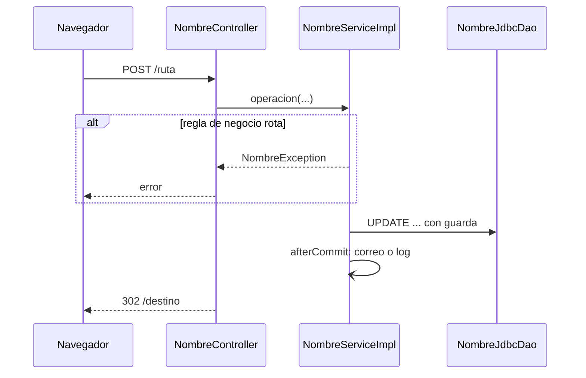

# Note template

Esqueleto de una nota de flujo o mecanismo. Copiala, cambiá `type` a `guide` y completá cada sección. El estándar está explicado en [[Vault guide]].

> [!summary] En una frase
> Qué hace y cómo, en una oración.

## Qué resuelve

El problema y quién lo usa.

## Herramientas

| Herramienta | Para qué |
|---|---|
| | |

## Recorrido paso a paso

1. Request, controller, service, DAO, vista, efectos secundarios.

Al final de la sección, siempre, el diagrama del flujo (obligatorio en toda nota de flujo):

## Datos

Tablas y columnas que toca. Ver [[Database schema]].

## Decisiones y por qué

| Decisión | Alternativa o motivo | Fuente |
|---|---|---|
| | | Comentario, commit, ADR, issue, o "inferencia" |

## Concurrencia y casos borde

Dos pedidos a la vez, reintentos, pestañas viejas, datos faltantes.

## Límites conocidos

Qué no hace. Lo que sea un posible defecto va también a [[Known gaps and document drift]].

## Preguntas de defensa

**¿Pregunta?**
Respuesta corta.

## Evidencia de código

Extractos exactos con ruta, líneas y commit.
