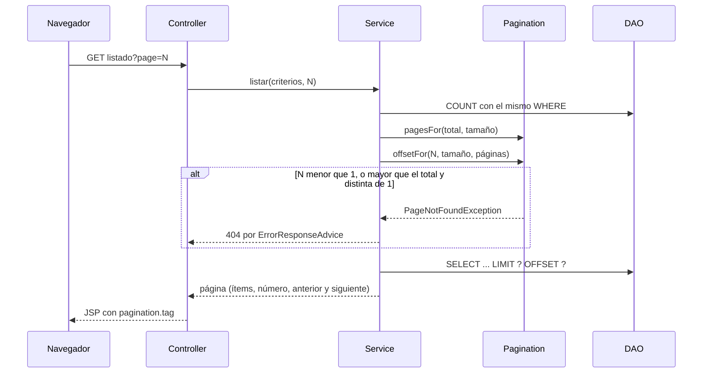

# Paginated listings

> [!summary] En una frase
> Todos los listados largos se paginan en la base con `LIMIT` y `OFFSET` después de un `COUNT`; el cálculo vive en una sola clase del módulo services y una página fuera de rango es un 404.

## Herramientas

| Herramienta | Para qué |
|---|---|
| `LIMIT ? OFFSET ?` | Traer solo las filas de la página |
| `SELECT COUNT(*)` con las mismas condiciones | Saber cuántas páginas hay |
| [[Pagination]] | Aritmética compartida: páginas necesarias y offset |
| [[PostPage]], [[InquiryPage]], [[SearchResult]] | Modelos que llevan los ítems junto con página actual y total |
| `pagination.tag` | Enlaces de página que conservan filtros y ancla |
| `filter-chips.tag` | Filtro por estado de bandejas y "Mis publicaciones"; cambiar de filtro vuelve a la página 1 ([[Status filters flow]]) |

## Qué se pagina y de a cuánto

| Listado | Tamaño | Dónde está la constante |
|---|---|---|
| Catálogo | 15 publicaciones | `PostServiceImpl.CATALOG_PAGE_SIZE` |
| Publicaciones del perfil privado y público | 15 | `PostServiceImpl.PROFILE_PAGE_SIZE` |
| Bandejas de consultas | 5 **publicaciones**, cada una con todas sus consultas | `InquiryServiceImpl.INBOX_PAGE_SIZE` |
| Reseñas del perfil público, por rol | 10 | `ReviewServiceImpl.PAGE_SIZE` |
| Sugerencias | 5 | `SUGGESTION_LIMIT` |
| Mensajes de una conversación | Todos | |
| Carrito | Todos, con tope de 20 al agregar | `CartService.MAX_ITEMS` |

## Recorrido

1. El controller recibe `page` como `int` (por defecto 1) y lo pasa al service. No valida el rango: desde el PR #48 esa regla vive en el service.
2. El service hace el `COUNT`, calcula el total de páginas con `Pagination.pagesFor` y el offset con `Pagination.offsetFor`.
3. `offsetFor` lanza [[PageNotFoundException]] si la página es menor que 1, o mayor que el total cuando no es la primera. **La página 1 siempre existe**, aunque esté vacía.
4. El DAO ejecuta el `SELECT` con `LIMIT` y `OFFSET` ligados como parámetros.
5. El service devuelve un modelo de página; la JSP dibuja los ítems y `pagination.tag` arma los enlaces.
6. [[ErrorResponseAdvice]] convierte `PageNotFoundException` en un 404.



### Dos listados en la misma página

El perfil público pagina publicaciones y reseñas a la vez. Cada lista usa su propio parámetro: `page` para publicaciones y `reviewPage` para reseñas. `pagination.tag` y `pagination-link.tag` aceptan `pageParam` (por defecto `page`) y `extraParams`, así cada paginador conserva el estado del otro y el rol elegido. Ver [[Public profile flow]].

### La bandeja agrupa antes de paginar

Las bandejas no paginan consultas sino **grupos**: una publicación con todas sus consultas. [[InquiryJdbcDao]] cuenta con `COUNT(DISTINCT ...)` sobre la clave de grupo, trae las claves de la página con `GROUP BY ... ORDER BY ... LIMIT ? OFFSET ?` y después las consultas de esos grupos en otra sentencia con `IN (...)`. Así un grupo nunca queda partido entre dos páginas y no hay una consulta por grupo. Con un filtro de estado (PR #60), las tres sentencias agregan `AND i.status IN (...)`: se cuentan y se paginan solo los grupos que tienen alguna consulta que coincide ([[Status filters flow]]).

## Decisiones y por qué

| Decisión | Motivo | Fuente |
|---|---|---|
| Paginar en la base | No traer a memoria filas que no se muestran | Requisito de la cátedra sobre consultas no triviales (`TODO.md`); inferencia |
| Una sola clase para la aritmética | Una única regla de "página fuera de rango" | Comentario en [[Pagination]] |
| La página 1 siempre es válida | Un listado vacío no es un error | Comentario en [[Pagination]] |
| Validar el rango en el service | La lógica de negocio no va en controllers | PR #48, commit `f918e28b` |
| Offset calculado en `long` | Un número de página enorme no desborda el `int` | Código de `offsetFor` |
| Agrupar la bandeja por publicación | El vendedor piensa en "las consultas de este vinilo" | `docs/specs/feature_perfil-consultas-ui_20260921.md` |
| Conservar filtros y orden en los enlaces | Cambiar de página no pierde la búsqueda | Commits `1312e5b7`, `3f3ea4e9` |
| Un parámetro de página por lista | Dos listas en una vista no pueden compartir `page` | Atributo `pageParam` de `pagination-link.tag`; commit `5d439ef4` |
| El filtro de estado viaja en `extraParams` del paginador | Pasar de página no pierde el filtro | `received.jsp`, `sent.jsp` y `profile/index.jsp`; PR #60 y #61 |

## Límites conocidos

- `OFFSET` recorre las filas salteadas: en páginas muy profundas es más lento que paginar por clave. Con el volumen del TP no se nota.
- Entre el `COUNT` y el `SELECT` puede entrar o salir una fila; la página puede mostrar un ítem de más o de menos respecto del total. Son lecturas, no afecta datos.
- Esto no es el patrón "1+1" de JPA: sigue siendo JDBC.

## Preguntas de defensa

**¿Cómo paginan?**
Con `COUNT` para el total y `LIMIT`/`OFFSET` para la página, los dos con las mismas condiciones. La aritmética está en una clase compartida.

**¿Qué pasa si pido la página 9999?**
El service lanza `PageNotFoundException` y la respuesta es un 404.

**¿Cómo paginan la bandeja si agrupa por publicación?**
Paginan los grupos: cuentan grupos distintos, traen las claves de la página y después las consultas de esos grupos en una sola sentencia.

**¿Dónde se valida el número de página?**
En el service. El controller solo lo recibe y lo pasa.

## Evidencia de código

### Aritmética

Fuente exacta en `c3e2a4c`: [services/src/main/java/ar/edu/itba/paw/services/Pagination.java](</Users/bautistapessagno/Desktop/proyectos_itba/PAW/paw2026b/services/src/main/java/ar/edu/itba/paw/services/Pagination.java>), líneas 1–35.

```java
package ar.edu.itba.paw.services;

// Aritmetica de paginado compartida por los services que listan de a paginas. Una sola
// regla para "pagina fuera de rango": la pagina 1 siempre existe, aunque este vacia; con el
// total conocido, cualquier otra tiene que caer dentro de el.
final class Pagination {

    private Pagination() {
    }

    // Paginas necesarias para un total; 0 cuando no hay filas.
    static int pagesFor(final int total, final int pageSize) {
        return (total + pageSize - 1) / pageSize;
    }

    // Offset de una pagina cuando el total es conocido.
    static int offsetFor(final int pageNumber, final int pageSize, final int totalPages) {
        if (pageNumber > 1 && pageNumber > totalPages) {
            throw new PageNotFoundException();
        }
        return offsetFor(pageNumber, pageSize);
    }

    // Offset de una pagina sin mirar el total: solo descarta numeros que no dan un offset valido.
    static int offsetFor(final int pageNumber, final int pageSize) {
        if (pageNumber < 1) {
            throw new PageNotFoundException();
        }
        final long offset = ((long) pageNumber - 1L) * pageSize;
        if (offset > Integer.MAX_VALUE) {
            throw new PageNotFoundException();
        }
        return (int) offset;
    }
}
```

### Página de grupos en la bandeja

Fuente exacta en `c3e2a4c`: [persistence/src/main/java/ar/edu/itba/paw/persistence/InquiryJdbcDao.java](</Users/bautistapessagno/Desktop/proyectos_itba/PAW/paw2026b/persistence/src/main/java/ar/edu/itba/paw/persistence/InquiryJdbcDao.java>), líneas 308–338.

```java
    /*
     * Dos sentencias acotadas, sin N+1: primero la pagina de claves de grupo ordenada por
     * la consulta mas nueva de cada grupo, despues todas las consultas de esas claves. La
     * lista de claves se bindea con un placeholder por clave. Las dos sentencias filtran por
     * estado: asi un grupo sin consultas que coincidan no ocupa lugar en la pagina.
     *
     * El id es serial y se asigna al insertar: "mas nueva" es "id mas alto". Las dos
     * sentencias ordenan por id, asi el orden de los grupos coincide con el de sus filas
     * incluso cuando dos consultas comparten created_at.
     */
    private List<InquirySummary> findGroupPage(final String where, final long userId,
                                               final Collection<InquiryStatus> statuses,
                                               final int groupLimit, final int groupOffset) {
        final String filteredWhere = where + statusFilter(statuses);
        final List<Object> keyParameters = parameters(userId, statuses);
        keyParameters.add(groupLimit);
        keyParameters.add(groupOffset);
        final List<String> keys = jdbcTemplate.queryForList(
                "SELECT g.group_key FROM (SELECT " + GROUP_KEY + " AS group_key, "
                        + "MAX(i.id) AS last_id " + GROUP_FROM + filteredWhere
                        + "GROUP BY " + GROUP_KEY + ") g ORDER BY g.last_id DESC LIMIT ? OFFSET ?",
                String.class, keyParameters.toArray());
        if (keys.isEmpty()) {
            return List.of();
        }
        final List<Object> rowParameters = parameters(userId, statuses);
        rowParameters.addAll(keys);
        return List.copyOf(jdbcTemplate.query(SUMMARY_SELECT + filteredWhere + "AND " + GROUP_KEY
                        + " IN (" + placeholders(keys.size()) + ") ORDER BY i.id DESC",
                SUMMARY_ROW_MAPPER, rowParameters.toArray()));
    }
```

## Archivos para seguir el flujo

- [services/src/main/java/ar/edu/itba/paw/services/Pagination.java](</Users/bautistapessagno/Desktop/proyectos_itba/PAW/paw2026b/services/src/main/java/ar/edu/itba/paw/services/Pagination.java>) · [[Pagination]]
- [models/src/main/java/ar/edu/itba/paw/models/PostPage.java](</Users/bautistapessagno/Desktop/proyectos_itba/PAW/paw2026b/models/src/main/java/ar/edu/itba/paw/models/PostPage.java>) · [[PostPage]]
- [models/src/main/java/ar/edu/itba/paw/models/InquiryPage.java](</Users/bautistapessagno/Desktop/proyectos_itba/PAW/paw2026b/models/src/main/java/ar/edu/itba/paw/models/InquiryPage.java>) · [[InquiryPage]]
- [models/src/main/java/ar/edu/itba/paw/models/SearchResult.java](</Users/bautistapessagno/Desktop/proyectos_itba/PAW/paw2026b/models/src/main/java/ar/edu/itba/paw/models/SearchResult.java>) · [[SearchResult]]
- [services/src/main/java/ar/edu/itba/paw/services/PostServiceImpl.java](</Users/bautistapessagno/Desktop/proyectos_itba/PAW/paw2026b/services/src/main/java/ar/edu/itba/paw/services/PostServiceImpl.java>) · [[PostServiceImpl]]
- [services/src/main/java/ar/edu/itba/paw/services/InquiryServiceImpl.java](</Users/bautistapessagno/Desktop/proyectos_itba/PAW/paw2026b/services/src/main/java/ar/edu/itba/paw/services/InquiryServiceImpl.java>) · [[InquiryServiceImpl]]
- [persistence/src/main/java/ar/edu/itba/paw/persistence/PostJdbcDao.java](</Users/bautistapessagno/Desktop/proyectos_itba/PAW/paw2026b/persistence/src/main/java/ar/edu/itba/paw/persistence/PostJdbcDao.java>) · [[PostJdbcDao]]
- [persistence/src/main/java/ar/edu/itba/paw/persistence/InquiryJdbcDao.java](</Users/bautistapessagno/Desktop/proyectos_itba/PAW/paw2026b/persistence/src/main/java/ar/edu/itba/paw/persistence/InquiryJdbcDao.java>) · [[InquiryJdbcDao]]
- [webapp/src/main/webapp/WEB-INF/tags/pagination.tag](</Users/bautistapessagno/Desktop/proyectos_itba/PAW/paw2026b/webapp/src/main/webapp/WEB-INF/tags/pagination.tag>)
- [models/src/main/java/ar/edu/itba/paw/models/ReviewPage.java](</Users/bautistapessagno/Desktop/proyectos_itba/PAW/paw2026b/models/src/main/java/ar/edu/itba/paw/models/ReviewPage.java>) · [[ReviewPage]]
- [services/src/main/java/ar/edu/itba/paw/services/ReviewServiceImpl.java](</Users/bautistapessagno/Desktop/proyectos_itba/PAW/paw2026b/services/src/main/java/ar/edu/itba/paw/services/ReviewServiceImpl.java>) · [[ReviewServiceImpl]]
- [webapp/src/main/webapp/WEB-INF/tags/pagination-link.tag](</Users/bautistapessagno/Desktop/proyectos_itba/PAW/paw2026b/webapp/src/main/webapp/WEB-INF/tags/pagination-link.tag>)
- [webapp/src/main/webapp/WEB-INF/tags/filter-chips.tag](</Users/bautistapessagno/Desktop/proyectos_itba/PAW/paw2026b/webapp/src/main/webapp/WEB-INF/tags/filter-chips.tag>)

Fuente inspeccionada: `c3e2a4c`, 2026-10-05. Es evidencia estática; no implica ejecución de la aplicación. [[Source inventory]] · [[Roadmap de lectura]]
