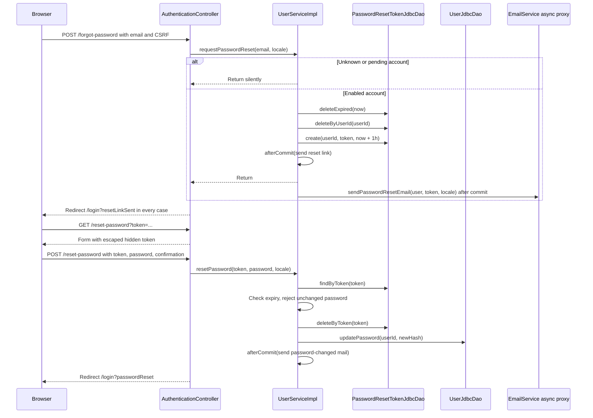

# Password recovery flow

An account that cannot log in can request a recovery link from the login page. /forgot-password takes an email and always answers the same way; /reset-password takes the emailed token and a new password. The link lasts one hour, is single-use and only one link per account is alive at a time. Pending accounts never receive a recovery link: their path is still the verification email.

## Flow diagram

The sequence follows the controller, service and DAO calls at `f12af08`. Error handling and transaction limits are explained below; this is a source trace, not a runtime test.



## Requesting a link

[[AuthenticationController]] trims the email, validates [[ForgotPasswordForm]] and calls [[UserServiceImpl]].requestPasswordReset. The controller redirects to /login?resetLinkSent whether or not the address belongs to an account, so the form cannot be used to discover registered emails. The service logs an unknown or pending request without the address.

For an enabled account the service first purges every expired link in the table, then deletes this account's live link and inserts a new 32-byte URL-safe token expiring in one hour. The unique user_id constraint on password_reset_tokens enforces one live link per account: two simultaneous requests each delete zero rows, and the second insert fails with DuplicateKeyException, which the service treats as an already-sent link. The reset email is registered to run after commit and links to app.base-url + /reset-password?token=.

Recovery tokens live in their own table instead of email_verification_tokens so that requesting a recovery link never invalidates a pending verification link. [[PasswordResetToken]] carries the expiry; [[PasswordResetTokenJdbcDao]] returns expired rows and leaves the decision to the service.

## Choosing the new password

GET /reset-password copies the token into [[ResetPasswordForm]]; the JSP writes it as a hidden field through c:out because form:hidden would not escape it. POST validates the token presence, [[ValidPassword]] and [[MatchingPasswords]].

resetPassword returns empty for a missing, unknown or expired token, which the controller shows as the global error `auth.resetPassword.invalid` with a link to request a new one. If the new password equals the current one, UnchangedPasswordException becomes a field error before the token is consumed, so the same link can be retried. Otherwise the service claims the token with deleteByToken; only the request that deletes exactly one row may continue, which stops two concurrent submissions of the same link from both changing the password. updatePassword has no WHERE on the old hash, because the emailed token is the authorization. A password-changed email follows after commit, and the user is sent to /login?passwordReset.

The reset does not log out existing sessions anywhere; TODO.md lists this with the profile password change as known debt.

[[Authentication flow]] · [[Profile flow]] · [[Mail delivery]] · [[Database schema]]

## Code snippets

### Silent request with one live link

Every early return produces the same redirect in the controller. See [[UserServiceImpl]] for the complete class.

[services/src/main/java/ar/edu/itba/paw/services/UserServiceImpl.java, lines 166–198](<file:///Users/bautistapessagno/Desktop/ITBA/PAW/paw2026b/services/src/main/java/ar/edu/itba/paw/services/UserServiceImpl.java>)

```java
    @Override
    @Transactional
    public void requestPasswordReset(final String email, final Locale locale) {
        final Optional<User> found = userDao.findByEmail(normalize(email));
        if (found.isEmpty() || !found.get().isEnabled()) {
            LOGGER.info("Ignored password reset request for an unknown or pending account");
            return;
        }
        final User user = found.get();
        final LocalDateTime now = LocalDateTime.now();

        // Un enlace vencido no vuelve a servir y nadie mas lo saca de la tabla: el pedido
        // aprovecha para limpiar los que quedaron atras, sean de quien sean.
        resetTokenDao.deleteExpired(now);

        // Un solo enlace vivo por cuenta: pedir otro deja sin efecto al anterior. La
        // invariante la sostiene la unicidad de user_id, porque dos pedidos simultaneos
        // borran cero filas cada uno y llegarian los dos al insert.
        resetTokenDao.deleteByUserId(user.getId());
        final String token = generateToken();
        try {
            resetTokenDao.create(user.getId(), token, now.plus(RESET_TOKEN_TTL));
        } catch (final DuplicateKeyException e) {
            // Otro pedido simultaneo para la misma cuenta ya dejo vivo su enlace: con ese
            // correo alcanza, asi que este termina sin enviar nada.
            LOGGER.info("Skipped a concurrent password reset request userId={}", user.getId());
            return;
        }
        TransactionCallbacks.afterCommit(() -> {
            LOGGER.info("Sent password reset link userId={}", user.getId());
            emailService.sendPasswordResetEmail(user, token, locale);
        });
    }
```

### Claim the token, then change the password

The unchanged check precedes the claim so a user can retry the same link. See [[UserServiceImpl]] for the complete class.

[services/src/main/java/ar/edu/itba/paw/services/UserServiceImpl.java, lines 200–231](<file:///Users/bautistapessagno/Desktop/ITBA/PAW/paw2026b/services/src/main/java/ar/edu/itba/paw/services/UserServiceImpl.java>)

```java
    @Override
    @Transactional
    public Optional<User> resetPassword(final String token, final String newPassword, final Locale locale) {
        if (token == null) {
            return Optional.empty();
        }
        final Optional<PasswordResetToken> stored = resetTokenDao.findByToken(token);
        if (stored.isEmpty() || stored.get().getExpiresAt().isBefore(LocalDateTime.now())) {
            return Optional.empty();
        }
        final long userId = stored.get().getUserId();

        // Mismo criterio que changePassword. Se rechaza antes de reclamar el enlace para que
        // quien elija la clave que ya tenia pueda reintentar con el mismo correo.
        final User current = userDao.findById(userId).orElseThrow(UserNotFoundException::new);
        if (passwordHasher.matches(newPassword, current.getPasswordHash())) {
            throw new UnchangedPasswordException();
        }

        // Reclamar el enlace dentro de la transaccion antes de tocar la clave impide que dos
        // requests concurrentes que leyeron el mismo token lo usen para pisarse entre si.
        if (resetTokenDao.deleteByToken(token) != 1) {
            return Optional.empty();
        }
        final User updated = userDao.updatePassword(userId, passwordHasher.hash(newPassword))
                .orElseThrow(UserNotFoundException::new);
        TransactionCallbacks.afterCommit(() -> {
            LOGGER.info("Reset password userId={}", userId);
            emailService.sendPasswordChangedEmail(updated, locale);
        });
        return Optional.of(updated);
    }
```

### Uniform response in the controller

The redirect does not depend on whether an account exists. See [[AuthenticationController]] for the complete class.

[webapp/src/main/java/ar/edu/itba/paw/webapp/controller/AuthenticationController.java, lines 106–114](<file:///Users/bautistapessagno/Desktop/ITBA/PAW/paw2026b/webapp/src/main/java/ar/edu/itba/paw/webapp/controller/AuthenticationController.java>)

```java
    @RequestMapping(value = "/forgot-password", method = RequestMethod.POST)
    public ModelAndView forgotPassword(@Valid @ModelAttribute("forgotPasswordForm") final ForgotPasswordForm form,
                                       final BindingResult bindingResult, final Locale locale) {
        if (bindingResult.hasErrors()) {
            return forgotPasswordForm(form);
        }
        userService.requestPasswordReset(form.getEmail(), locale);
        return new ModelAndView("redirect:/login?resetLinkSent");
    }
```

### Table and uniqueness

The unique index is repeated outside CREATE TABLE so older databases also receive it. See [[Database schema]] for the full schema.

[persistence/src/main/resources/schema.sql, lines 82–97](<file:///Users/bautistapessagno/Desktop/ITBA/PAW/paw2026b/persistence/src/main/resources/schema.sql>)

```sql
CREATE TABLE IF NOT EXISTS password_reset_tokens (
    id SERIAL PRIMARY KEY,
    user_id INTEGER NOT NULL,
    token VARCHAR(64) NOT NULL,
    expires_at TIMESTAMP NOT NULL,
    CONSTRAINT password_reset_tokens_token_key UNIQUE (token),
    CONSTRAINT password_reset_tokens_user_id_key UNIQUE (user_id),
    CONSTRAINT password_reset_tokens_user_fk FOREIGN KEY (user_id) REFERENCES users(id)
);

-- La unicidad de user_id es la que sostiene el "un solo enlace vivo por cuenta": dos
-- pedidos simultaneos para el mismo correo borran cero filas cada uno, no se bloquean
-- entre si y sin la restriccion los dos INSERT entrarian. Se repite fuera del CREATE
-- TABLE porque las bases que ya tienen la tabla no reciben la restriccion de arriba.
CREATE UNIQUE INDEX IF NOT EXISTS password_reset_tokens_user_id_key
    ON password_reset_tokens (user_id);
```
