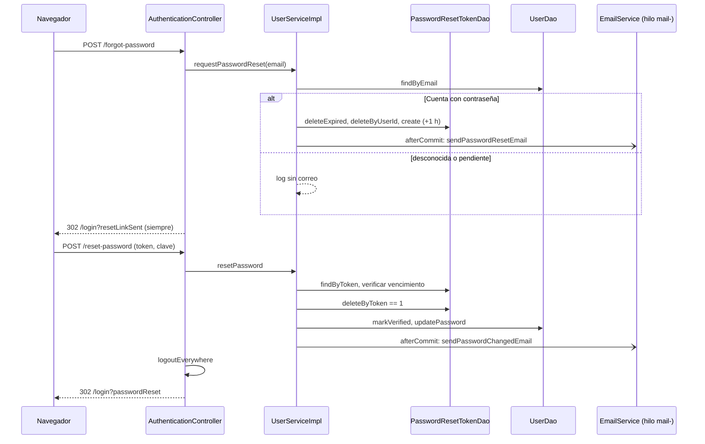

# Password recovery flow

> [!summary] En una frase
> Quien no puede entrar pide un enlace por correo, de un solo uso y válido una hora; al usarlo elige una clave nueva, la Cuenta queda verificada y se cierran todas sus sesiones.

## Qué resuelve

La Recuperación de contraseña del glosario: una Cuenta que no puede iniciar sesión elige una clave nueva a partir de un enlace. Es distinta del Cambio de contraseña, que se hace con sesión iniciada y conociendo la clave actual (ver [[Profile flow]]). La mecánica del token está en [[Tokens and email links]].

## Herramientas

| Herramienta | Para qué se usa acá |
|---|---|
| Spring MVC + Bean Validation | Los dos formularios: [[ForgotPasswordForm]] y [[ResetPasswordForm]] |
| [[ValidPassword]] y [[MatchingPasswords]] | Las mismas reglas de clave que el registro y el cambio |
| `SecureRandom` + Base64 URL | El token del enlace |
| `PasswordHasher` (BCrypt 12) | Comparar con la clave actual y hashear la nueva |
| Spring JDBC | `password_reset_tokens`, `users`, `email_verification_tokens` |
| `UNIQUE (user_id)` | Un solo enlace vivo por Cuenta, aun con pedidos simultáneos |
| `@Transactional` + [[TransactionCallbacks]] | Clave, verificación y consumo del enlace en una sola transacción; correo después del commit |
| `SessionRegistry` | Cerrar las sesiones abiertas de la Cuenta |
| JavaMail + Thymeleaf + `@Async` | Correo con el enlace y aviso de clave cambiada |

## Recorrido paso a paso

### 1. Pedir el enlace: `POST /forgot-password`

1. El formulario tiene un solo campo. `@InitBinder` recorta el correo y `@Valid` exige que no esté vacío, tenga formato de correo y hasta 100 caracteres.
2. `UserService.requestPasswordReset(email, locale)`:
   - Normaliza y busca la Cuenta.
   - Si no existe, o es una pendiente sin contraseña, loguea `Ignored password reset request...` **sin el correo** y termina.
   - `deleteExpired(now)`: aprovecha el pedido para borrar los enlaces vencidos de cualquier Cuenta.
   - `deleteByUserId`: deja sin efecto el enlace anterior de esta Cuenta.
   - Genera el token y lo inserta con `expires_at = ahora + 1 hora`.
   - Si el insert viola `UNIQUE (user_id)`, otro pedido simultáneo ganó: termina sin mandar nada.
   - Registra el correo para después del commit.
3. El controller redirige **siempre** a `/login?resetLinkSent`, exista o no la Cuenta. El login muestra un aviso genérico.

Una Cuenta sin verificar que ya tiene contraseña sí recibe el enlace. Es el camino para recuperar un correo que otro registró antes.

### 2. Abrir el enlace: `GET /reset-password?token=...`

El controller copia el token del query string al formulario y muestra `auth/reset-password`. No valida nada todavía. La vista emite el token como campo oculto pasándolo por `c:out`.

### 3. Elegir la clave: `POST /reset-password`

1. `@Valid` sobre [[ResetPasswordForm]]: token no vacío, clave con [[ValidPassword]], confirmación igual.
2. `UserService.resetPassword(token, newPassword, locale)`:
   - Busca el token. Si no está o venció, devuelve vacío.
   - Lee la Cuenta. Si la clave nueva es igual a la actual (`PasswordHasher.matches`), lanza `UnchangedPasswordException` **antes** de consumir el enlace.
   - `deleteByToken` tiene que afectar una fila. Si no, otro request lo usó: devuelve vacío.
   - `markVerified` y borra los enlaces de verificación pendientes.
   - `updatePassword` con el hash nuevo. No compara el hash anterior: quien recupera justamente no lo conoce.
   - Registra el correo de "tu contraseña cambió" para después del commit.
3. Controller:
   - Con resultado, `AuthenticationSessions.logoutEverywhere` expira las demás sesiones de la Cuenta y cierra la de este navegador si era de ella. Redirige a `/login?passwordReset`.
   - Con `UnchangedPasswordException`, error en el campo de clave y el enlace sigue vivo.
   - Sin resultado, error global `auth.resetPassword.invalid` y enlace para pedir otro.


```mermaid
sequenceDiagram
    participant B as Navegador
    participant C as AuthenticationController
    participant U as UserServiceImpl
    participant T as PasswordResetTokenDao
    participant D as UserDao
    participant M as EmailService (hilo mail-)
    B->>C: POST /forgot-password
    C->>U: requestPasswordReset(email)
    U->>D: findByEmail
    alt Cuenta con contraseña
        U->>T: deleteExpired, deleteByUserId, create (+1 h)
        U-)M: afterCommit: sendPasswordResetEmail
    else desconocida o pendiente
        U-->>U: log sin correo
    end
    C-->>B: 302 /login?resetLinkSent (siempre)
    B->>C: POST /reset-password (token, clave)
    C->>U: resetPassword
    U->>T: findByToken, verificar vencimiento
    U->>T: deleteByToken == 1
    U->>D: markVerified, updatePassword
    U-)M: afterCommit: sendPasswordChangedEmail
    C->>C: logoutEverywhere
    C-->>B: 302 /login?passwordReset
```

## Datos

| Tabla | Operación |
|---|---|
| `password_reset_tokens` | `DELETE` de vencidos, `DELETE` por Cuenta, `INSERT`, `SELECT` por token, `DELETE` por token |
| `users` | `UPDATE verified`, `UPDATE password_hash` |
| `email_verification_tokens` | `DELETE` por Cuenta |

## Decisiones y por qué

| Decisión | Motivo | Fuente |
|---|---|---|
| Misma respuesta exista o no la Cuenta | Que el formulario no sirva para averiguar qué correos están registrados | Comentario en [[AuthenticationController]] |
| El log del pedido ignorado no incluye el correo | Regla del proyecto: se loguea con `userId`, nunca con el correo | Issue del sprint 2 |
| Enlace válido una hora | Acotar la ventana si el correo queda expuesto | Comentario en [[UserServiceImpl]] |
| Un solo enlace por Cuenta | Pedir otro deja sin efecto al anterior | Comentario en [[UserServiceImpl]] |
| "Misma clave" se rechaza antes de consumir | Poder reintentar con el mismo enlace | Comentario en [[UserServiceImpl]] |
| Recuperar verifica la Cuenta | El enlace llegó al correo | Comentario en [[UserServiceImpl]]; glosario de `CONTEXT.md` |
| Cerrar todas las sesiones al terminar | Una sesión abierta por quien registró el correo antes que su dueño no tiene que seguir adentro | Comentario en [[AuthenticationSessions]] |
| No iniciar sesión al terminar | El flujo termina en el login con la clave nueva | Código de [[AuthenticationController]] |
| Las pendientes sin clave no reciben enlace | No hay clave que recuperar: su camino es registrarse de nuevo | Comentario en [[UserServiceImpl]] |

## Concurrencia y casos borde

- Dos pedidos a la vez: uno pierde contra `UNIQUE (user_id)` y no manda correo.
- Dos envíos del formulario con el mismo token: el segundo no encuentra la fila y ve "enlace inválido".
- Enlace vencido: mismo mensaje que uno inexistente, con el enlace para pedir otro.
- Token ausente en la URL: `@NotBlank` sobre el campo oculto lo informa como error del formulario.
- SMTP caído: el pedido no falla; el enlace quedó guardado pero la persona no lo recibe y tiene que pedir otro.
- El aviso de "tu contraseña cambió" usa el idioma del request, no el guardado en la Cuenta.

## Límites conocidos

- No hay tope de pedidos por Cuenta ni por IP: cada pedido manda un correo.
- El tiempo de respuesta no es idéntico en las dos ramas (una escribe en la base y la otra no). La respuesta visible sí lo es.
- El token viaja en la URL y se guarda en claro. Ver [[Tokens and email links]].
- Sin tests de la capa web. El service está cubierto por [[UserServiceImplTest]] y el DAO por [[PasswordResetTokenJdbcDaoTest]]; este Vault no los ejecutó.

## Preguntas de defensa

**¿Qué diferencia hay entre cambiar y recuperar la contraseña?**
Cambiar exige sesión y la clave actual, y actualiza con `WHERE password_hash = <el que leí>`. Recuperar no exige nada de eso: lo que autoriza es el token que llegó al correo.

**¿Por qué `updatePassword` no compara el hash anterior?**
Porque quien recupera no lo conoce. La carrera se resuelve antes, al reclamar el token con un `DELETE` que tiene que afectar una fila.

**¿Qué pasa si el correo no existe?**
Nada visible. Misma redirección y mismo aviso. Solo queda una línea de log sin datos personales.

**¿Por qué recuperar la contraseña verifica la Cuenta?**
Porque demuestra lo mismo que el enlace de verificación: que la persona lee esa casilla.

**¿Y las sesiones que ya estaban abiertas?**
Se expiran con `SessionRegistry.getAllSessions(...).expireNow()`. En su siguiente request van a `/login?sessionExpired`.

## Evidencia de código

Controller:

Fuente exacta en `8929aea`: [webapp/src/main/java/ar/edu/itba/paw/webapp/controller/AuthenticationController.java](</Users/bautistapessagno/Desktop/proyectos_itba/PAW/paw2026b/webapp/src/main/java/ar/edu/itba/paw/webapp/controller/AuthenticationController.java>), líneas 125–171.

```java
    @RequestMapping(value = "/forgot-password", method = RequestMethod.GET)
    public ModelAndView forgotPasswordForm(@ModelAttribute("forgotPasswordForm") final ForgotPasswordForm form) {
        return new ModelAndView("auth/forgot-password");
    }

    /*
     * Redirige igual exista o no la cuenta: si respondiera distinto, el formulario serviria
     * para averiguar que correos estan registrados. Quien decide a quien escribirle es el service.
     */
    @RequestMapping(value = "/forgot-password", method = RequestMethod.POST)
    public ModelAndView forgotPassword(@Valid @ModelAttribute("forgotPasswordForm") final ForgotPasswordForm form,
                                       final BindingResult bindingResult, final Locale locale) {
        if (bindingResult.hasErrors()) {
            return forgotPasswordForm(form);
        }
        userService.requestPasswordReset(form.getEmail(), locale);
        return new ModelAndView("redirect:/login?resetLinkSent");
    }

    @RequestMapping(value = "/reset-password", method = RequestMethod.GET)
    public ModelAndView resetPasswordForm(@RequestParam(name = "token", required = false) final String token,
                                          @ModelAttribute("resetPasswordForm") final ResetPasswordForm form) {
        form.setToken(token);
        return new ModelAndView("auth/reset-password");
    }

    @RequestMapping(value = "/reset-password", method = RequestMethod.POST)
    public ModelAndView resetPassword(@Valid @ModelAttribute("resetPasswordForm") final ResetPasswordForm form,
                                      final BindingResult bindingResult, final Locale locale,
                                      final HttpServletRequest request, final HttpServletResponse response) {
        if (bindingResult.hasErrors()) {
            return new ModelAndView("auth/reset-password");
        }
        try {
            final Optional<User> reset = userService.resetPassword(form.getToken(), form.getPassword(), locale);
            if (reset.isPresent()) {
                AuthenticationSessions.logoutEverywhere(reset.get(), request, response, sessionRegistry);
                return new ModelAndView("redirect:/login?passwordReset");
            }
        } catch (final UnchangedPasswordException e) {
            // El enlace sigue vivo: el error va en el campo para que reintente con otra clave.
            bindingResult.rejectValue("password", "auth.resetPassword.unchanged");
            return new ModelAndView("auth/reset-password");
        }
        bindingResult.reject("auth.resetPassword.invalid");
        return new ModelAndView("auth/reset-password");
    }
```

Pedido del enlace:

Fuente exacta en `8929aea`: [services/src/main/java/ar/edu/itba/paw/services/UserServiceImpl.java](</Users/bautistapessagno/Desktop/proyectos_itba/PAW/paw2026b/services/src/main/java/ar/edu/itba/paw/services/UserServiceImpl.java>), líneas 253–292.

```java
    /*
     * No distingue un correo desconocido de uno registrado: en los dos casos termina sin
     * avisar nada, asi la pantalla puede dar siempre la misma respuesta y no delatar que
     * cuentas existen. Una cuenta pendiente del flujo anterior tampoco recibe enlace, porque
     * no tiene clave que recuperar: su camino es volver a registrarse. Una cuenta sin
     * verificar que ya tiene clave si lo recibe.
     */
    @Override
    @Transactional
    public void requestPasswordReset(final String email, final Locale locale) {
        final Optional<User> found = userDao.findByEmail(EmailRules.normalize(email));
        if (found.isEmpty() || found.get().getPasswordHash() == null) {
            LOGGER.info("Ignored password reset request for an unknown or pending account");
            return;
        }
        final User user = found.get();
        final LocalDateTime now = LocalDateTime.now();

        // Un enlace vencido no vuelve a servir y nadie mas lo saca de la tabla: el pedido
        // aprovecha para limpiar los que quedaron atras, sean de quien sean.
        resetTokenDao.deleteExpired(now);

        // Un solo enlace vivo por cuenta: pedir otro deja sin efecto al anterior. La
        // invariante la sostiene la unicidad de user_id, porque dos pedidos simultaneos
        // borran cero filas cada uno y llegarian los dos al insert.
        resetTokenDao.deleteByUserId(user.getId());
        final String token = generateToken();
        try {
            resetTokenDao.create(user.getId(), token, now.plus(RESET_TOKEN_TTL));
        } catch (final DuplicateKeyException e) {
            // Otro pedido simultaneo para la misma cuenta ya dejo vivo su enlace: con ese
            // correo alcanza, asi que este termina sin enviar nada.
            LOGGER.info("Skipped a concurrent password reset request userId={}", user.getId());
            return;
        }
        TransactionCallbacks.afterCommit(() -> {
            LOGGER.info("Sent password reset link userId={}", user.getId());
            emailService.sendPasswordResetEmail(user, token, locale);
        });
    }
```

Uso del enlace:

Fuente exacta en `8929aea`: [services/src/main/java/ar/edu/itba/paw/services/UserServiceImpl.java](</Users/bautistapessagno/Desktop/proyectos_itba/PAW/paw2026b/services/src/main/java/ar/edu/itba/paw/services/UserServiceImpl.java>), líneas 294–328.

```java
    @Override
    @Transactional
    public Optional<User> resetPassword(final String token, final String newPassword, final Locale locale) {
        if (token == null) {
            return Optional.empty();
        }
        final Optional<PasswordResetToken> stored = resetTokenDao.findByToken(token);
        if (stored.isEmpty() || stored.get().getExpiresAt().isBefore(LocalDateTime.now())) {
            return Optional.empty();
        }
        final long userId = stored.get().getUserId();

        // Mismo criterio que changePassword. Se rechaza antes de reclamar el enlace para que
        // quien elija la clave que ya tenia pueda reintentar con el mismo correo.
        final User current = userDao.findById(userId).orElseThrow(UserNotFoundException::new);
        if (passwordHasher.matches(newPassword, current.getPasswordHash())) {
            throw new UnchangedPasswordException();
        }

        // Reclamar el enlace dentro de la transaccion antes de tocar la clave impide que dos
        // requests concurrentes que leyeron el mismo token lo usen para pisarse entre si.
        if (resetTokenDao.deleteByToken(token) != 1) {
            return Optional.empty();
        }
        // El enlace llego al correo, asi que demuestra lo mismo que el de verificacion.
        userDao.markVerified(userId);
        verificationTokenDao.deleteByUserId(userId);
        final User updated = userDao.updatePassword(userId, passwordHasher.hash(newPassword))
                .orElseThrow(UserNotFoundException::new);
        TransactionCallbacks.afterCommit(() -> {
            LOGGER.info("Reset password userId={}", userId);
            emailService.sendPasswordChangedEmail(updated, locale);
        });
        return Optional.of(updated);
    }
```

Cierre de sesiones:

Fuente exacta en `8929aea`: [webapp/src/main/java/ar/edu/itba/paw/webapp/security/AuthenticationSessions.java](</Users/bautistapessagno/Desktop/proyectos_itba/PAW/paw2026b/webapp/src/main/java/ar/edu/itba/paw/webapp/security/AuthenticationSessions.java>), líneas 50–65.

```java
    /*
     * Despues de cambiar o restablecer la clave: expira las otras sesiones de la cuenta y, si
     * este navegador tenia una, la cierra. Sin esto, una sesion iniciada por quien registro el
     * correo antes que su dueno seguiria adentro despues de que el dueno recupere la cuenta.
     */
    public static void logoutEverywhere(final User user, final HttpServletRequest request,
                                        final HttpServletResponse response, final SessionRegistry sessionRegistry) {
        final HttpSession currentSession = request.getSession(false);
        final String currentSessionId = currentSession == null ? null : currentSession.getId();
        sessionRegistry.getAllSessions(new AuthenticatedUser(user), false).stream()
                .filter(session -> !session.getSessionId().equals(currentSessionId))
                .forEach(SessionInformation::expireNow);
        if (currentUser().filter(current -> current.getId() == user.getId()).isPresent()) {
            LOGOUT_HANDLER.logout(request, response, SecurityContextHolder.getContext().getAuthentication());
        }
    }
```

Las dos formas de actualizar la clave en el DAO:

Fuente exacta en `8929aea`: [persistence/src/main/java/ar/edu/itba/paw/persistence/UserJdbcDao.java](</Users/bautistapessagno/Desktop/proyectos_itba/PAW/paw2026b/persistence/src/main/java/ar/edu/itba/paw/persistence/UserJdbcDao.java>), líneas 139–160.

```java
    @Override
    public Optional<User> updatePasswordIfMatches(final long id, final String expectedPasswordHash,
                                                  final String newPasswordHash) {
        // El WHERE sobre el hash vigente evita que un formulario desactualizado pise una clave elegida despues.
        if (jdbcTemplate.update("UPDATE users SET password_hash = ? WHERE id = ? AND password_hash = ?",
                newPasswordHash, id, expectedPasswordHash) != 1) {
            return Optional.empty();
        }
        return findById(id);
    }

    /*
     * Sin WHERE sobre el hash vigente: quien recupera la clave justamente no lo conoce.
     * Lo que autoriza el cambio es el token que llego al correo, y eso lo valida el service.
     */
    @Override
    public Optional<User> updatePassword(final long id, final String newPasswordHash) {
        if (jdbcTemplate.update("UPDATE users SET password_hash = ? WHERE id = ?", newPasswordHash, id) != 1) {
            return Optional.empty();
        }
        return findById(id);
    }
```

Token oculto del formulario:

Fuente exacta en `8929aea`: [webapp/src/main/webapp/WEB-INF/views/auth/reset-password.jsp](</Users/bautistapessagno/Desktop/proyectos_itba/PAW/paw2026b/webapp/src/main/webapp/WEB-INF/views/auth/reset-password.jsp>), líneas 24–34.

```jsp
        <%-- Los errores de cada campo los muestra ui:text-input debajo del campo. Aca van
             solo los que no tienen un campo visible: el enlace vencido y el token faltante. --%>
        <form:errors cssClass="input-field__error" element="p"/>
        <form:errors path="token" cssClass="input-field__error" element="p"/>
        <%-- El token viene del query string. form:hidden lo escribiria sin escapar
             (defaultHtmlEscape no esta activado), asi que se emite como el resto de
             los campos: el valor pasa por c:out. --%>
        <spring:bind path="token">
            <input type="hidden" name="<c:out value="${status.expression}"/>"
                   value="<c:out value="${status.value}"/>"/>
        </spring:bind>
```

## Archivos para seguir el flujo

- [webapp/src/main/java/ar/edu/itba/paw/webapp/controller/AuthenticationController.java](</Users/bautistapessagno/Desktop/proyectos_itba/PAW/paw2026b/webapp/src/main/java/ar/edu/itba/paw/webapp/controller/AuthenticationController.java>) · [[AuthenticationController]]
- [services/src/main/java/ar/edu/itba/paw/services/UserServiceImpl.java](</Users/bautistapessagno/Desktop/proyectos_itba/PAW/paw2026b/services/src/main/java/ar/edu/itba/paw/services/UserServiceImpl.java>) · [[UserServiceImpl]]
- [webapp/src/main/java/ar/edu/itba/paw/webapp/form/ForgotPasswordForm.java](</Users/bautistapessagno/Desktop/proyectos_itba/PAW/paw2026b/webapp/src/main/java/ar/edu/itba/paw/webapp/form/ForgotPasswordForm.java>) · [[ForgotPasswordForm]]
- [webapp/src/main/java/ar/edu/itba/paw/webapp/form/ResetPasswordForm.java](</Users/bautistapessagno/Desktop/proyectos_itba/PAW/paw2026b/webapp/src/main/java/ar/edu/itba/paw/webapp/form/ResetPasswordForm.java>) · [[ResetPasswordForm]]
- [webapp/src/main/java/ar/edu/itba/paw/webapp/validation/ValidPassword.java](</Users/bautistapessagno/Desktop/proyectos_itba/PAW/paw2026b/webapp/src/main/java/ar/edu/itba/paw/webapp/validation/ValidPassword.java>) · [[ValidPassword]]
- [webapp/src/main/java/ar/edu/itba/paw/webapp/security/AuthenticationSessions.java](</Users/bautistapessagno/Desktop/proyectos_itba/PAW/paw2026b/webapp/src/main/java/ar/edu/itba/paw/webapp/security/AuthenticationSessions.java>) · [[AuthenticationSessions]]
- [persistence/src/main/java/ar/edu/itba/paw/persistence/PasswordResetTokenJdbcDao.java](</Users/bautistapessagno/Desktop/proyectos_itba/PAW/paw2026b/persistence/src/main/java/ar/edu/itba/paw/persistence/PasswordResetTokenJdbcDao.java>) · [[PasswordResetTokenJdbcDao]]
- [persistence/src/main/java/ar/edu/itba/paw/persistence/UserJdbcDao.java](</Users/bautistapessagno/Desktop/proyectos_itba/PAW/paw2026b/persistence/src/main/java/ar/edu/itba/paw/persistence/UserJdbcDao.java>) · [[UserJdbcDao]]
- [webapp/src/main/webapp/WEB-INF/views/auth/forgot-password.jsp](</Users/bautistapessagno/Desktop/proyectos_itba/PAW/paw2026b/webapp/src/main/webapp/WEB-INF/views/auth/forgot-password.jsp>)
- [webapp/src/main/webapp/WEB-INF/views/auth/reset-password.jsp](</Users/bautistapessagno/Desktop/proyectos_itba/PAW/paw2026b/webapp/src/main/webapp/WEB-INF/views/auth/reset-password.jsp>)
- [services/src/main/resources/mail/password-reset.html](</Users/bautistapessagno/Desktop/proyectos_itba/PAW/paw2026b/services/src/main/resources/mail/password-reset.html>)
- [services/src/main/resources/mail/password-changed.html](</Users/bautistapessagno/Desktop/proyectos_itba/PAW/paw2026b/services/src/main/resources/mail/password-changed.html>)

Fuente inspeccionada: `8929aea`, 2026-10-04. Es evidencia estática; no implica ejecución de la aplicación. [[Source inventory]] · [[Roadmap de lectura]]
